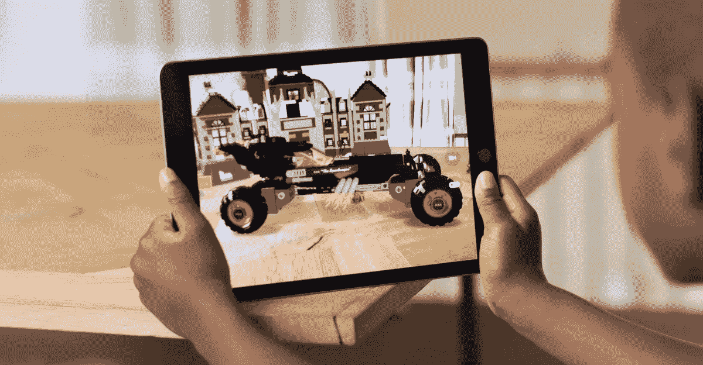

# 加入我们的 ARKitchen:围绕苹果的新 ARKit 设计产品概念

> 原文：<https://medium.com/hackernoon/join-us-for-arkitchen-cooking-up-product-concepts-around-apples-new-arkit-1ccc30e8b0e>

Apple ARKit

[我不能再兴奋了](/@jacob/the-great-camera-awakening-dont-miss-the-incredible-opportunities-emerging-in-computer-vision-2a4acad46701)现在相机和围绕它的开发者平台发生了巨大的进步，[脸书](https://hackernoon.com/tagged/facebook)相机效果，[谷歌](https://hackernoon.com/tagged/google)镜头和苹果 ARKit。

我的朋友[beta works Ventures](https://chatbotsmagazine.com/@peterrojas)的 Peter Rojas 、[Candela Paramount](https://www.linkedin.com/pulse/ar-kit-pioneers-apple-devs-don-stein)[的 Don Stein](https://angel.co/virtual-reality-investments) 和 [Shasta Ventures](http://shastaventures.com) 的我一直在探讨有趣的产品概念和公司想法，这些概念和想法将从这个移动 AR 生态系统中产生。因此，受 Twitter 上的 [@madewithARKit](https://twitter.com/madewithARKit) 的启发，我们认为举办一个开放办公时间的概念来会见处于领先地位的企业家并在早期提供产品和筹款反馈可能会很有趣。

因此，[我们想邀请你](https://docs.google.com/forms/d/e/1FAIpQLSc0VNHccE0EhVh24_p9IKlWJKaB-qFONP_yWb1Au8pqv5fhgA/viewform)参加 7 月 27 日下午的“办公时间”会议，地点在旧金山的[沙斯塔风险投资](http://shastaventures.com)办公室。【更新:我们将于 8 月 24 日推出第二个 AR 厨房，请[在此申请](https://docs.google.com/forms/d/e/1FAIpQLSeuKWC_9LP1E3H-tuUphzUeTIh_vKLDaABfxgtd3TK3cEEoDQ/viewform)！]

这是对今天正在玩 ARKit 的创作者、建设者、开发者和企业家的“号召”，他们有兴趣分享他们的概念，获得关于他们产品和筹款策略的一些反馈，并普遍谈论 AR 和#camerafirst 世界的未来。

我们的时间有限，所以如果你有兴趣[请在这里申请](https://docs.google.com/forms/d/e/1FAIpQLSeuKWC_9LP1E3H-tuUphzUeTIh_vKLDaABfxgtd3TK3cEEoDQ/viewform)【更新:[这个链接已经为我们 8 月 24 日的第二个 AR 厨房更新了](https://docs.google.com/forms/d/e/1FAIpQLSeuKWC_9LP1E3H-tuUphzUeTIh_vKLDaABfxgtd3TK3cEEoDQ/viewform)，希望到时能见到你！]分享更多关于你正在做的事情。我们期待您的回复！

*——我正在积极投资 3D 世界，包括计算机视觉、虚拟现实/增强现实、人工智能/机器学习和#camerafirst 应用于* [*、沙斯塔风险投资*](http://shastaventures.com) *。如果你在这个领域有所建树，请联系我们。并考虑加入我们——或发言！—在我们即将到来的* [*VR 周二见面会上*](http://vrtuesday.com) *。还我在推特上*[*@雅各布*](http://twitter.com/jacob)。