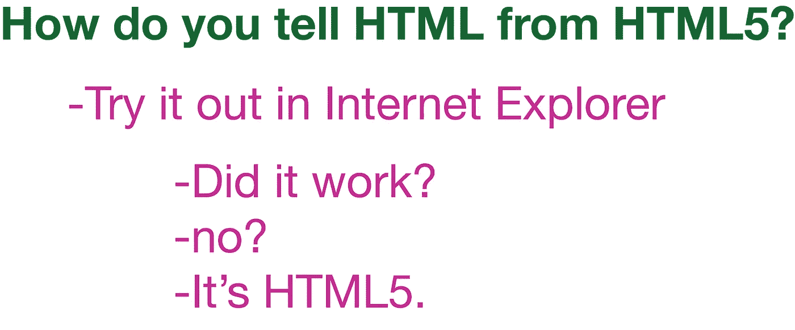
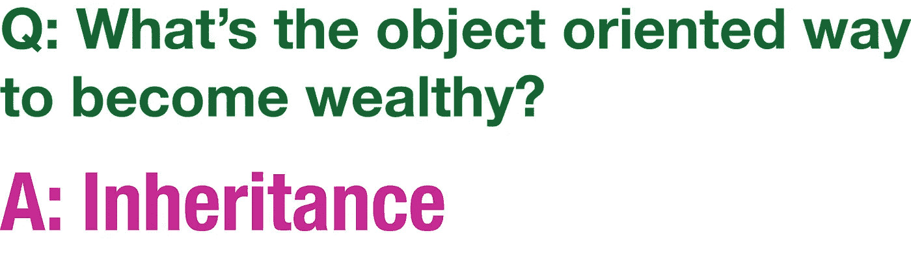
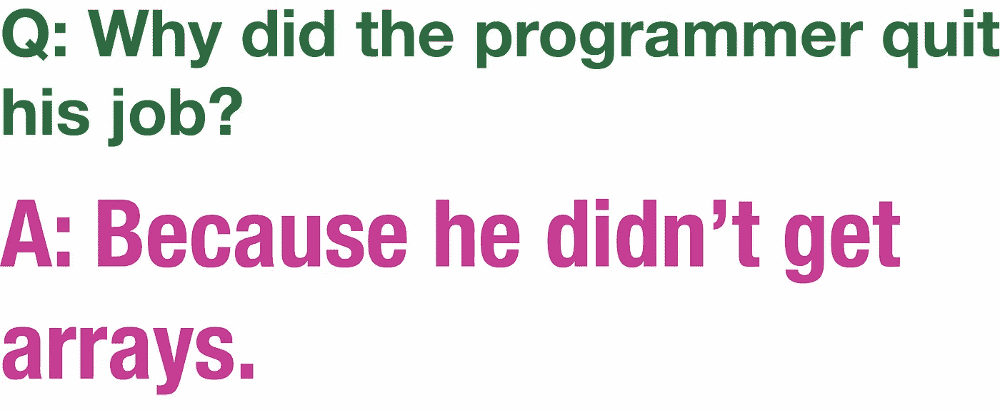
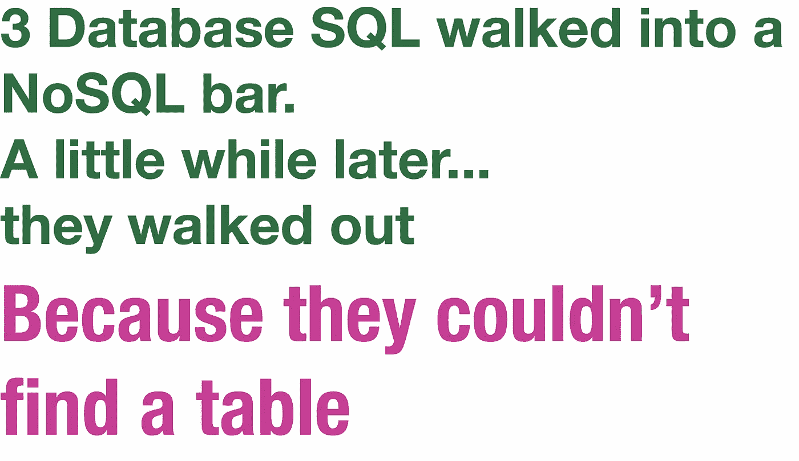
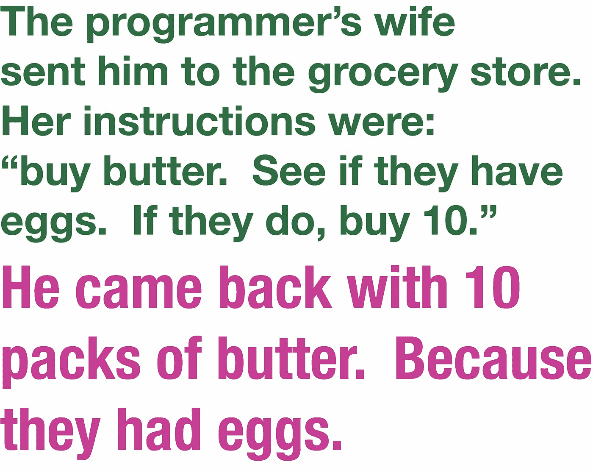
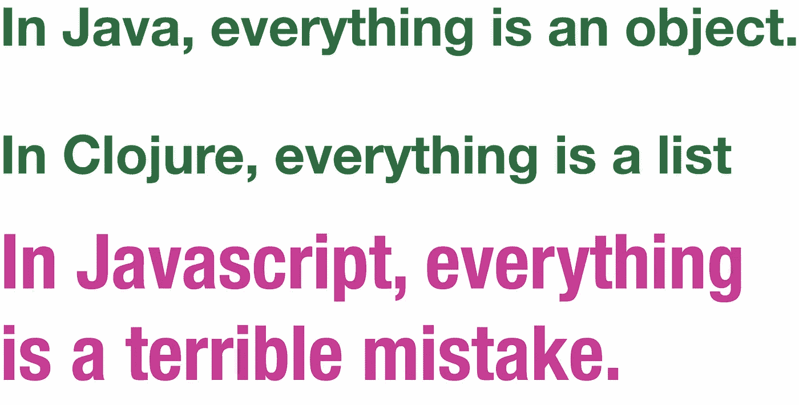
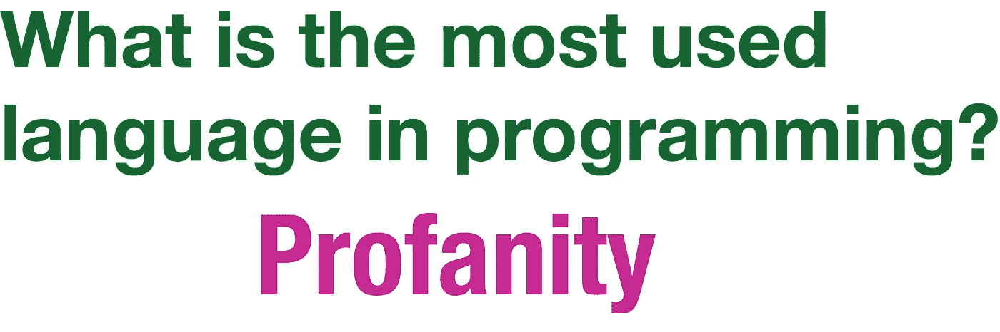
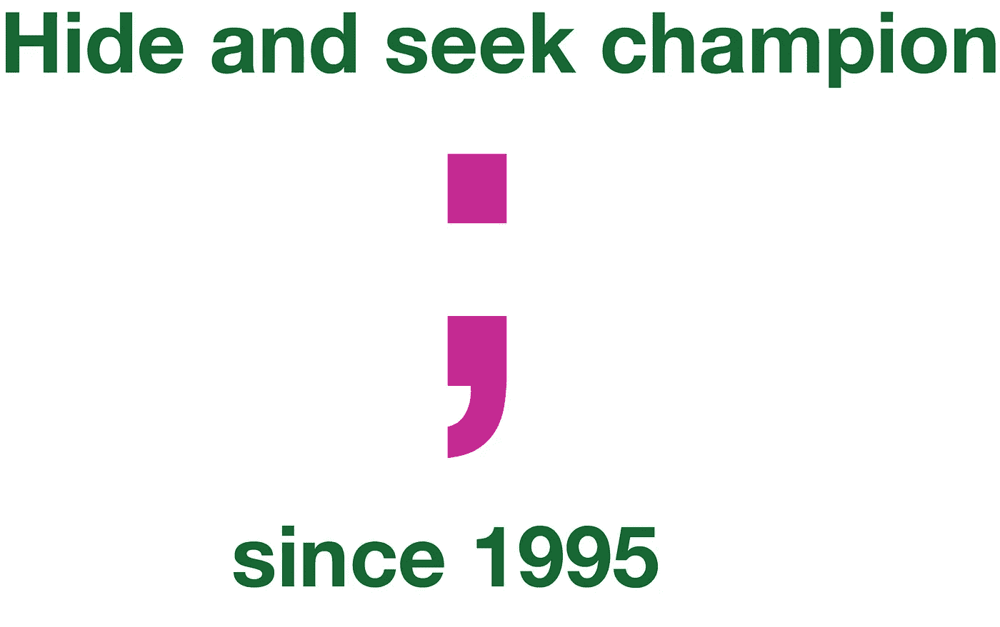

# 程序员会理解的笑话

> 原文：<https://medium.com/hackernoon/jokes-programmers-will-understand-23d484d8bef8>

我通常会尝试在 Javascript、Node 和 React 上定期发布博客。虽然我喜欢发表“如何做”和“教程驱动”的帖子，但我已经养成了半定期的习惯，在周五晚上发表主题更轻松的帖子。今晚，我贴出一些我最喜欢的笑话，希望大多数程序员都能理解，并觉得有点幽默！尽情享受吧！

 [## 伊桑·贾雷尔|职业简介| LinkedIn

### 查看 Ethan Jarrell 在 LinkedIn 上的职业简介。LinkedIn 是世界上最大的商业网络，帮助…

www.linkedin.com](https://www.linkedin.com/in/ethan-jarrell-1226669/)