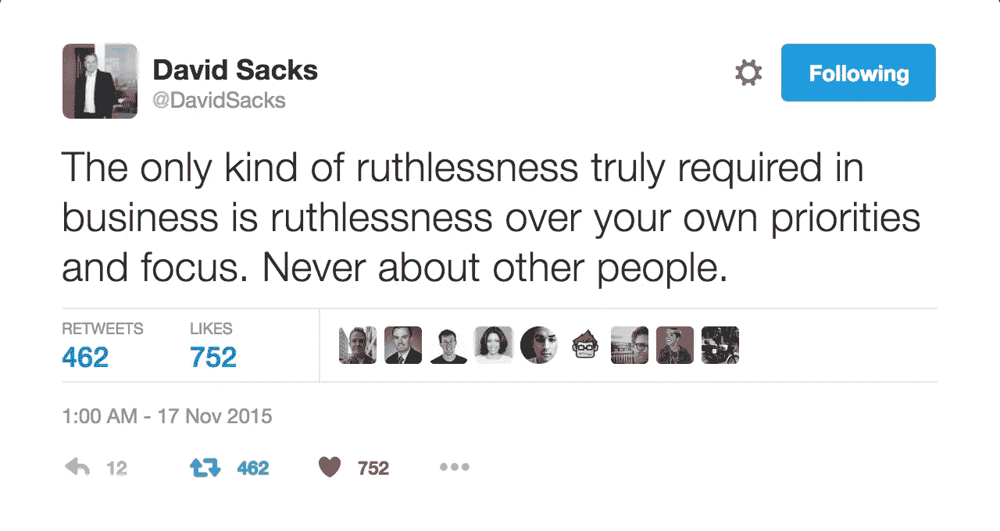

# 乔恩，我们不会认为是真正的“成功之钥”的东西是低调的真正的“成功之钥”。原因如下。

> 原文：<https://medium.com/hackernoon/jon-the-things-we-think-arent-keys-to-success-are-low-key-major-keys-to-success-1fb90df77f8f>

> “成功的关键”可以定义为“生活窍门”(编辑:去他妈的这个术语)、启发式技术、经验法则、解决问题的方法、故障排除方法、测试范例等等。，而且几乎总是不为大多数人类物种所知。这就是为什么一代又一代的演讲者、顾问和作家都在个人发展和自我完善流派中进行商业宣传，远在 DJ Khaled(撇开喜剧价值不谈)去年兜售他的“大调”之前。#BlessUp

1.  专注是成功的关键。我们的心理、遗传和生理倾向是处于一种分心、疏忽和过度刺激的状态。这就是为什么我们从噪音中解析信号。这就是为什么几千年来哲学家、先知和平民都在思考如何聚焦。**这也许是任何有意义的成功的关键。** [斯坦福 GSB 大学教授杰弗里·普费弗根据约翰·科特的工业研究](http://time.com/99707/keys-to-success-6-traits-the-most-successful-people-have-in-common/)，毫不夸张地将专注列为他成功的六大关键之一。
2.  “变得刻薄”(无论你如何定义这个短语……我会提出你自己的定义:“[变得刻薄只是意味着对它严格而坚定](/the-mission/my-best-productivity-advice-is-not-going-to-inspire-you-240ec1baecc)”)是成功的关键。文化适应(“社会契约”)通过主流的条件作用，我们从出生起就被强迫进食，这教会了我们其他的方式。“友善一点”、“体贴一点”、“温柔一点”。见鬼，黄金法则本身就是这么说的:“以你希望被对待的方式对待别人”。我怀疑任何一个通情达理的人(取消受虐狂作为通情达理的人的资格)想要得到“刻薄”的对待。这就是为什么《变得刻薄》背后的反直觉天才(见[蒂姆·格罗弗的《无情的》](https://www.amazon.com/Relentless-Unstoppable-Tim-S-Grover/dp/1476714207))为作者的客户迈克尔·乔丹工作，一个臭名昭著的混蛋，在球场内外尤其如此。问问史蒂夫·科尔。这是许多(不是所有*)企业经营者和首席执行官竞争成功的另一个关键。我们只需要看看几乎一致认为美国当选总统唐纳德·特朗普备受诽谤的欺凌、煽动和拉拢政治对手是他赢得总统大选的原因。(*对比:Zenefits 首席执行官大卫·萨克斯(David Sacks)在下面的推文中提出了另一种哲学，我也签署了这种哲学。**对时间无情，对人有恩**。)
3.  “把事情做完”是成功的关键。自助、激励心理学、销售和营销有一个完整的分支致力于此:[大卫·艾伦的“把事情做好”](https://www.amazon.com/Getting-Things-Done-Stress-Free-Productivity/dp/0143126563)。GTD 是廉价言论和实际结果之间的区别，是拖延者和生产者之间的区别，是业余爱好者和专业人士之间的区别，也可以说是成功和失败之间的区别。每个人都在说空话，很少有人去做。这就是为什么 Lee Hower、Alex Turnbull 等人在硅谷内外正确地批评了绝大多数“创始人”——一个如此模糊、如此不小心被挪用和滥用以至于没有任何意义也意味着一切的术语——他们更恰当地被称为“wantrepreneurs”，以及他们对“[玩创业](https://www.groovehq.com/blog/startups-playing-startup)”的趋势、文化和生活方式的不幸沉迷。这就是为什么德里克·西弗斯告诉蒂姆·费里斯，“如果我们需要更多的信息，那么每个人都会成为拥有完美腹肌的亿万富翁”。这是因为大多数人——包括前面提到的每一个外行装腔作势的人——没有意识到这一点，而是无力地、费力地试图参加每一个 Lynda 课程/MOOC 和编码训练营，参加每一个会议，在每一个联谊会上交际，在每一个社交频道上关注每一个人，并把他们醒着的大部分时间——因此是他们的工作日/月/年，因此是他们的早期职业生涯——花在消费模式而不是创造模式上。我会把 GTD(做重要的事)放在第一位，但如果没有重点(知道什么是重要的)，这对生产力和成功来说是没有价值的，也是致命的。

这些键也不互相排斥。它们的相互依赖是催化“成功”化学反应的必要和充分条件。

虽然我尊重你关于最近过度将任何和所有有益的战略和战术贴上“成功的钥匙”标签的论点，但我完全不同意任何坚持没有成功钥匙的论点。

你的名字在一篇批评文章的最后顺便提到了其中的三个，否定了它们的存在和价值，这被认为是故意的聪明，无意的搞笑，熟练的元讽刺，和/或草稿打印错误。除此之外，我很欣赏你的观点，我希望这个回答能充分阐述我的理由。感谢原创故事和欢迎讨论。干杯！

new selfie, same SF Ali

# 行动呼吁

> 1.推荐这个故事。它帮助其他人看到这个故事，让我知道我的作品值得写作、阅读和推荐，让我感到被认可和模糊，因为老实说，谁的冰冷、死亡的心没有被令人眼花缭乱的通知多巴胺立即解冻和复活？喜欢，分享，转发，起泡沫，冲洗，重复。此外，医生说如果我感觉不到模糊，我就会死，因为每当我的 Klout 得分低于 70 时，就会触发一种罕见的社交货币缺乏。现在是 67。不好看。你想让我死吗？！没想到会这样。
> 
> 2.分享这个故事:脸书，推特，LinkedIn，电子邮件等。
> 
> 3.跟我连线:[媒体](/@sfali789)、[脸书](https://www.facebook.com/sfali789)、[推特](http://twitter.com/sfali789)、 [LinkedIn](https://www.linkedin.com/in/sfali789) 、 [Instagram](http://instagram.com/sfali789) 、 [Snapchat](https://www.snapchat.com/add/sfali789) 、[产品搜索](https://www.producthunt.com/@sfali789)、 [AngelList](https://angel.co/sfali789) 、 [Quora](https://www.quora.com/profile/SF-Ali) 和 [Quibb](http://quibb.com/farooqzafar) 。(我觉得就这些吧！也通过电子邮件给我写信！想打电话或发短信都行。(917) 982–3849.我总是乐于结交新朋友，倾听、支持并尽我所能提供帮助。这就是为什么我是灵媒的常驻啦啦队长。:)
> 
> 4.[看我写的](/@sfali789)。加入我的邮件列表。通过考虑对我智力劳动的补偿来支持未来的工作。

> [黑客中午](http://bit.ly/Hackernoon)是黑客如何开始他们的下午。我们是 [@AMI](http://bit.ly/atAMIatAMI) 家庭的一员。我们现在[接受投稿](http://bit.ly/hackernoonsubmission)，并乐意[讨论广告&赞助](mailto:partners@amipublications.com)机会。
> 
> 如果你喜欢这个故事，我们推荐你阅读我们的[最新科技故事](http://bit.ly/hackernoonlatestt)和[趋势科技故事](https://hackernoon.com/trending)。直到下一次，不要把世界的现实想当然！

