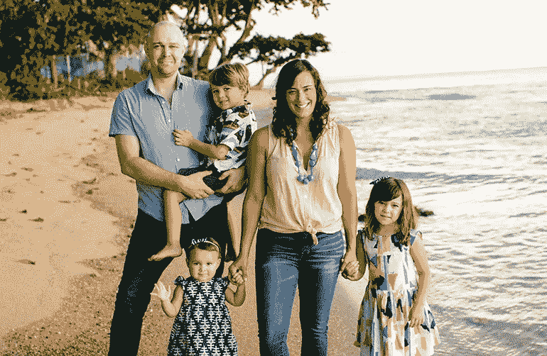

# 乔纳森·科特霍夫:校友成功故事

> 原文：<https://medium.com/hackernoon/jonathan-kotthoff-alumni-success-story-d438bbcf4250>

*创新技术开发商*

**(02 年计算机交互学士)**

从纽约到波多黎各，Kotthoff 正在改变人们与技术互动的方式。他是一名用户体验设计师，与计算机一起工作，让人类生活和导航技术变得更加简单。

在 MBU 大学期间，Kotthoff 积极参与学生商业组织 sife，并得到了该组织发起人、副教授兼商业主席 Brenda Bradford 的支持。

科特霍夫说:“MBU 让我真正做好了准备，让我超越了自己的舒适区，并接受了有时候我们必须打造自己的道路。”。

自那以后，他通过创办自己的初创公司 Radar_APPS，Inc .继续创造新的机会。在这里，Kotthoff 和他的团队继续开发能够自动显示附近产品折扣和信息的技术，并帮助购物者避免选择麸质等成分。他还支持过其他创业公司，包括 Fanfueled.com、Knovation 和 Adeptly。Kotthoff 还与包括大英百科全书、西尔斯、好事达和孟山都在内的企业品牌合作。

一个闪耀的故事。

【www.mobap.edu】最初发表于**。**

******

> *[黑客中午](http://bit.ly/Hackernoon)是黑客如何开始他们的下午。我们是 AMI 家庭的一员。我们现在[接受投稿](http://bit.ly/hackernoonsubmission)并乐意[讨论广告&赞助](mailto:partners@amipublications.com)机会。*
> 
> *如果你喜欢这个故事，我们推荐你阅读我们的[最新科技故事](http://bit.ly/hackernoonlatestt)和[趋势科技故事](https://hackernoon.com/trending)。直到下一次，不要把世界的现实想当然！*

**