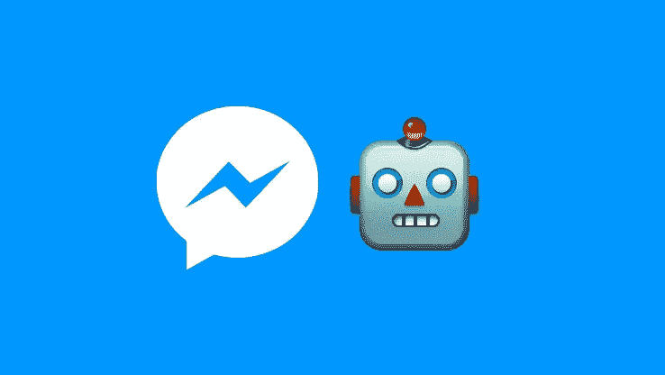
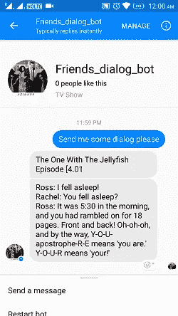

# 脸书机器人创作之旅

> 原文：<https://medium.com/hackernoon/journey-of-the-facebook-bot-creation-2eb4ff456435>



最初的目标:每天自动给我的妻子发送 F.R.I.E.N.D.S .对话信息。

《老友记》是我妻子最喜欢的节目。自从我们的儿子出生后，她就没时间看了。我最初的计划是每天在 WhatsApp 上给她发送自动消息。WhatsApp 的问题是，他们没有为消息传递提供任何官方 API。这肯定会是它衰落的原因之一。电报、电报、信差等。正在提供 API 支持来创建 BOT。

所以我决定继续使用 messenger。这种方法的唯一问题是，我必须在 Whatsapp 上手动给她发消息。但当我看到她看完留言后脸上的笑容，这是值得的。

我开始用 PHP 搜索 bot 框架。GitHub 上有很多框架。对于每个框架，初始设置都需要客户端 ID 和客户端密码。所以我需要注册成为应用程序开发人员，并配置这些值。此外，我必须为每个对话设置对话回复。

```
$botman->hears('Send me some dialog please', function (BotMan $bot) {
   $bot->reply('Checking!!!');
});
```

一切都计划好了，准备好了。然后我突然想起来 freehostia 不支持自由计划上的 curl 操作。我用 freehostia 来托管我的网站。


我开始寻找替代方案，并发现了惊人的机器人平台。

[Chatfuel](https://chatfuel.com/) 负责与 bot 配置相关的一切。不需要编码。

我只需要将 JSON 响应作为消息提供给他们的回调。此外，它们还提供广播功能，机器人将在指定时间间隔发送计划消息。我在早上设置了每日提醒。

机器人的问题现在解决了。现在我只能为对话工作。

手动添加对话框将非常耗时。同样，从字幕中提取也不像通过编程找到好的对话那样困难。于是开始在网上搜索现成的对话。

我的搜索把我带到了[维基百科链接](https://en.wikiquote.org/wiki/Friends_(TV_series))。

由于我的主机提供商不支持 curl，我无法在运行时解析来自 Wikiquote 的 chatfuel 回调。我在本地解析了所有页面并存储在表上。我在 freehostia 上导入了那个表，并编写了回调脚本来从表中随机选择一个对话框。**完成**



*如果您喜欢，请点击💚所以其他人会在媒体上看到这个。*

[](http://bit.ly/HackernoonFB)[](https://goo.gl/k7XYbx)[](https://goo.gl/4ofytp)

> [黑客中午](http://bit.ly/Hackernoon)是黑客如何开始他们的下午。我们是 [@AMI](http://bit.ly/atAMIatAMI) 家庭的一员。我们现在[接受投稿](http://bit.ly/hackernoonsubmission)，并乐意[讨论广告&赞助](mailto:partners@amipublications.com)机会。
> 
> 如果你喜欢这个故事，我们推荐你阅读我们的[最新科技故事](http://bit.ly/hackernoonlatestt)和[趋势科技故事](https://hackernoon.com/trending)。直到下一次，不要把世界的现实想当然！

