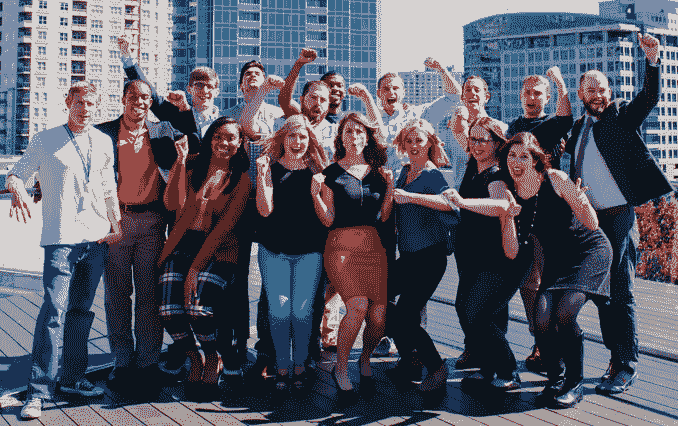
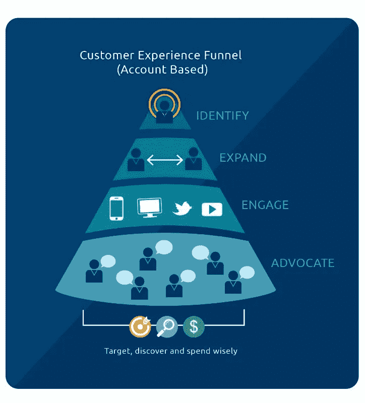
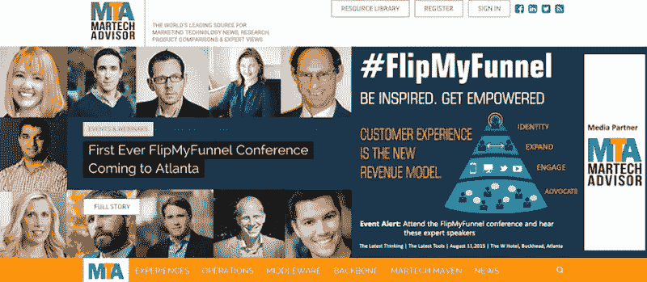
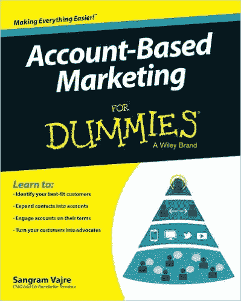
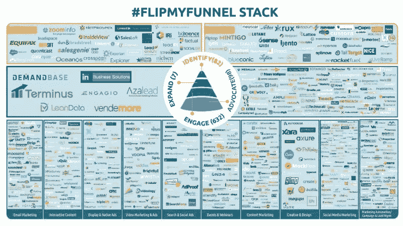
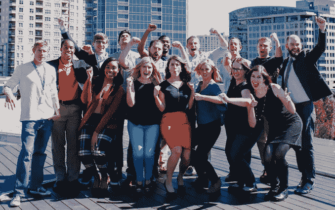
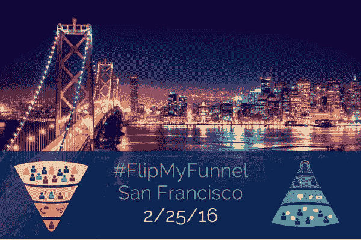

# 9 个月内赚到 100 万美元——一个#HustleMuscle 的创业故事

> 原文：<https://medium.com/hackernoon/journey-to-1-million-arr-in-9-months-a-startup-story-of-hustlemuscle-d49e6bc22936>

《终点》上周票房达到 100 万美元。我们的 ARR 在 9 个月内从 0 美元增加到 100 万美元！这篇文章献给所有的“终结者”(我们是这样称呼自己的)和我们所有的集体努力。我也分享我一路走来的亲身经历，来反思 2015 年发生的所有美好。给你！

你们有些人可能知道，我从 2012 年到 2014 年在 [Pardot](http://www.pardot.com/) 负责营销。我一直认为我不可能在一个更好的时间加入 Pardot。那是一艘火箭飞船！我们的年增长率达到了 100%。我在收购 ExactTarget 和 Salesforce 的过程中也在那里。

收购过程教会了我如何大规模地做事和思考。我记得 [Kevin Bobowoski](https://twitter.com/bobowski) ，他是我在 ExactTarget 的老板，现在是 Act-On 的需求挖掘副总裁，他告诉我一些事情，这些事情真正改变了我对营销的看法。

他说当我加入时，Pardot 的市场营销是 1 倍，然后随着 ExactTarget 的收购，我们把它提高到 10 倍，呈指数增长。当 Salesforce 被收购时，他说:

> “还记得我们的 10X 对话吗？现在放大 100 倍。”那让我大吃一惊！

Pardot 的营销团队过去是，现在仍然是一个很棒的团队，他们保持冷静，带领公司走向正确的方向。一直以来，领导这支球队感觉棒极了。我们是亚特兰大最热门的创业公司之一。

> 但是我总觉得我在帕多是装的

这是因为我不是 Pardot 的联合创始人，甚至不是为数不多的 10 到 50 名员工中的一员，他们一路奋斗，勇敢地走过了一个充满跌宕起伏的[创业公司](https://hackernoon.com/tagged/startup)的惊人旅程。那些早期的团队成员才是应该拥抱荣耀的人，而不是我。随着岁月的流逝，我无法摆脱这种负罪感；然而，我始终坚持我的目标，那就是建立并领导一个不可思议的营销团队。

# 所以当我有机会白手起家创建一家公司时，我必须抓住它。这是终点故事开始的地方。

> 终点:基于客户的营销之旅开始了

2014 年末，我遇到了埃里克·斯佩特(Eric Spett)，他是 [Terminus](http://terminus.com/) 的首席执行官，还有他那令人惊叹的联合创始人兼首席技术官埃里克·瓦斯(Eric Vass)。这些人是两位了不起的联合创始人。他们都不是专业的营销人员，但有趣的是，他们正在开发非常酷的营销技术。Terminus 成立仅 8 个月，其功能更像是一个代理机构，帮助 B2B 营销团队进行有针对性的自动化广告。我们没有产品。我们的视野再模糊不过了。这家只有两名员工(即联合创始人)的公司的未来完全不确定。这就是为什么我觉得这是作为联合创始人和 pivot 加入的绝佳机会。Spett 的宗旨是努力、卓越运营和雇佣绝对最优秀的人才。Vass 喜欢制造人们喜爱的伟大产品，并创造持久的关系。作为一个超级傻乎乎的营销人员，我有一种在家的感觉，有着远大的愿景，对未来坚定不移的乐观，以及挑战 B2B 销售和营销现状的大胆目标。

我知道这听起来很疯狂，但这正是我的感受。我立刻意识到我可以在公司的各个方面有所作为。从设定愿景开始，[建立了一个全新的类别](http://terminus.com/blog/g2crowd-wins-the-race-on-creating-the-first-account-based-marketing-category/)，叫做[基于客户的营销(ABM)](http://terminus.com/blog/g2crowd-wins-the-race-on-creating-the-first-account-based-marketing-category/) ，这是我多年来一直深信不疑的，销售我们从头打造的产品，成为比我更大的东西的一部分。这是如此令人耳目一新，今天仍然如此。

> 这是我 2015 年在终点站的旅程时间表

**1 月至 3 月:**我担任 Terminus 的顾问，开发了第一个基于自助账户的营销产品。我记得我说过基于账户的营销是 B2B 营销的未来，两位联合创始人看着我，好像我是个疯子。他们的名言是:“什么是基于客户的营销？”因此，这里有一篇博客文章，给那些仍然不知道[到底是什么(ABM)的人。](http://terminus.com/blog/what-is-account-based-marketing/)

**3 月至 5 月:**3 月，我作为联合创始人和 CMO 正式加入了 [Terminus](http://terminus.com/) ，并立即开始宣传基于账户营销的好处。我们立即达成了几笔交易，我宣布我们的产品符合市场需求。斯佩特和瓦斯已经做了大量的技术工作，我所做的就是进来给这只非常漂亮的猪涂上口红(据我回忆)。产品准备好的那天，我说我们有适合市场的产品。当然，所有人都嘲笑我。根据预言家的说法，你需要有近 50 个以上的付费客户，并有一个可重复的商业模式，才能称之为产品-市场匹配，但我不在乎任何人说什么。我直觉告诉我，我们正在做一件大事。

> 我知道基于客户的营销适合“产品类别”。每个人都在谈论它，但不是从产品的角度。所以我们建造了它。

[**下面是对 Avere Systems 的 Gretchen 的视频采访**](http://terminus.com/blog/terminator-customer-of-the-month-why-avere-systems-wanted-account-based-marketing-case-study/) **，**我们在 Terminus 的第一个客户，讨论他们为什么需要 ABM 平台。她不知道她是我们的第一个顾客，当我告诉她时，你可以感受到她的反应。太神奇了！看看这里。

# 这就把我带到了故事的下一章。

> [**掀起革命的 LinkedIn 博文— #FlipMyFunnel**](https://www.linkedin.com/pulse/creating-first-ever-martech-customer-experience-stack-sangram-vajre)

在某个疯狂的日子里，我们把漏斗翻转到了它的头上。这一切都是关于营销技术(#MarTech)如何让 B2B 营销专业人员比以往任何时候都更容易确定他们最适合的客户或账户，颠覆了传统的基于销售线索的销售漏斗。这引发了第一次# FlipMyFunnel 革命，带领我们在亚特兰大、芝加哥和波士顿举办了三场活动。我们在 FlipMyFunnel 推出了一个完全独立的网站，本着围绕挑战 B2B 销售和营销社区建立一个类别和社区的精神，保持它独立于 Terminus。这是一个翻转漏斗的图形。

**6 月至 9 月:**我们继续通过制造大量舆论来销售我们的新产品，并就基于客户的营销主题撰写了大量文章。我们会和任何愿意听我说话的人谈论 ABM，无论是白天还是晚上。以下是一些令人惊叹的出版物上我最喜欢的几篇文章的链接:

*   openview Labs—[AdTech 扩展基于账户营销的 5 种方式](https://www.salesforce.com/blog/2015/03/top-5-reasons-account-based-nurturing-critical-b2b-marketing-gp.html)
*   Salesforce — [基于客户的重要性的 5 个黑仔理由](https://www.salesforce.com/blog/2015/03/top-5-reasons-account-based-nurturing-critical-b2b-marketing-gp.html)
*   什么是基于客户的营销？
*   亨氏营销— [创造首个 ABM 类别的竞赛](http://www.heinzmarketing.com/2015/05/the-race-to-create-the-first-account-based-marketing-category-who-will-win/)
*   营销利润— [让你的第一个 ABM 营销活动运转起来的 5 个简单方法](http://www.marketingprofs.com/articles/2015/28426/five-simple-ways-to-get-your-first-account-based-marketing-campaign-up-and-running)
*   LinkedIn Pulse — [你是一夜情营销者吗？](https://www.linkedin.com/pulse/you-one-night-stand-marketer-sangram-vajre?trk=mp-author-card)

我们的客户和现代营销人员如此频繁地谈论#FlipMyFunnel，以至于我们决定将它真正变成一场运动。

> **首届# FlipMyFunnel 大会**

我们在亚特兰大的主场举办了第一届#FlipMyFunnel。当我们在八月份举办活动时，我们有大约 40 名客户。我们能够将最优秀和最聪明的思想领袖聚集在一起一天，挑战 B2B 销售和营销人员的现状，并翻转一些漏斗。主讲人包括[梅根·豪雅](https://twitter.com/megheuer)、[约瑟夫·贾菲](https://twitter.com/jaffejuice)、[吉尔·罗利](https://twitter.com/jill_rowley)、[凯尔·波特](https://twitter.com/kyleporter)、[梅根·艾森伯格](https://twitter.com/meisenberg)、[艾伦·甘内特](https://twitter.com/Allen)和[杰弗里·罗尔斯](https://twitter.com/jkrohrs)。令我们惊喜的是，来自美国各地的 300 多名 B2B 销售和营销专业人士参加了我们的活动。那一天，我们甚至比金·卡戴珊的排名还高。#FlipMyFunnel 运动真正开始将焦点转向基于账户的营销。

# 伴随着所有的喧嚣，我们即将创造 B2B 营销行业的另一个第一。

> [**第一本关于账户营销的书**](https://www.linkedin.com/pulse/b2b-marketers-announcing-first-ever-account-based-marketing-vajre)

9 月:我和威利出版社签约，写“[基于账户的傻瓜营销](http://www.amazon.com/Account-Based-Marketing-Dummies-Sangram-Vajre/dp/1119224853/ref=sr_1_1?ie=UTF8&qid=1451192148&sr=8-1&keywords=account-based+marketing)”。该书[已经可以预购](http://www.amazon.com/Account-Based-Marketing-Dummies-Sangram-Vajre/dp/1119224853/ref=sr_1_1?s=books&ie=UTF8&qid=1451227641&sr=1-1&keywords=account-based+marketing)，将于 2016 年 4 月 18 日上市！这是给我在 2015 年失去的父亲的，我知道他会为我写了一本书和 Terminus 团队的 hustling 感到骄傲。他是我的家乡最优秀的经济学教授之一，这本书是献给他的。

在第三季度末，Terminus 团队已经将我们的 ARR 增长到 60 多万美元，拥有大约 60 个客户。考虑到我们年初的起点，我们的增长是惊人的。我们乐观地进入了第四季度，并准备更加努力地发挥我们的#HustleMuscle。

**10 月:**我们与海德公园风险投资伙伴(HPVP)、Knoll Ventures、Arthur Ventures 和 Atlanta Ventures 一起筹集了 180 万美元的[种子资金](http://www.prweb.com/releases/2015/10/prweb13025623.htm)。我们的投资者意识到我们提前参加了 ABM 派对。在我们发布后不久，我们在 [G2 Crowd 的合作伙伴认可了有史以来第一个基于账户营销的产品类别。](https://www.g2crowd.com/categories/account-based-marketing/products)我们的种子基金允许我们雇佣我们需要的员工，而且我们可以带着#FlipMyFunnel 上路！我们开始计划更多城市的路演！

其他几个第一次发生在第四季度。Terminus 在 Twitter 上举办了有史以来第一次# abm chat。我们发布了有史以来第一个 ABM 框架[超越了典型的 B2B 购买决策，提供了全面的客户体验和 FlipMyFunnel 堆栈，允许您基于#flipmyfunnel 理念创建自己的#MarTech 堆栈。你可以下载它](http://terminus.com/blog/the-first-ever-account-based-marketing-framework-extending-from-the-b2b-buyers-journey-to-the-customer-experience/)[flipmyfunnel.com](https://flipmyfunnel.com/)

**12 月:**我们在波士顿和芝加哥举办了#FlipMyFunnel 活动。[以下是我们旋风式旅行的概要。](http://terminus.com/blog/road-trippin-with-flipmyfunnel-b2b-marketing-roadshow/)伙计，太神奇了！一路上，我们遇到了许多伟大的人，他们只是想挑战 B2B 销售和营销的传统智慧。

> [Jay Baer](https://twitter.com/jaybaer) (不认识他的人)给他的追随者发了一封电子邮件，标题是**“B2B 的绝对必需品”**，写道“我们在 Openview 和 Terminus 的朋友们已经创造了一个精彩的免费电子书，名为“[《定向 B2B 广告完全指南》](http://offers.openviewpartners.com/targeted-advertising-guide)”。你可以在这里下载。

# 现在，就在年底和第四季度结束之前，我又有了一个第一。这是最后一次，但可能是我 2015 年最伟大的“第一次”。

> 仅在 9 个月内，Terminus 的产品从零增长到 100 万美元！

这不是一个人的成就。这是团队的努力。一个团队，一个每天都在一起工作的团队。我们称自己为终结者，因为我们真的无所畏惧。

我们正在建立一个名为“基于客户的营销”的新类别，并处于领先地位。当我回顾所有这些“第一次”时，我认为有几件事促成了我们迄今为止的成功。

*   **我们的使命:**挑战 B2B 销售和营销的现状
*   **我们的愿景:**打造最佳客户营销平台
*   **我们的口头禅:** #FlipMyFunnel
*   **我们团队口号:**搞定 sh*t！

# 祝贺我们出色的团队成为亚特兰大发展最快、[最具创新性的公司之一。](http://www.tagonline.org/news-press/tag-names-top-40-innovative-technology-companies-in-georgia-2/)

感谢所有给我们机会的顾客，尽管我们才刚刚起步。2015 年是#HustleMuscle 年。2016 年将会是又一个巨大成长、痛苦、快乐的一年……以及更多的第一次。大家小心，终结者来了！

# 哦！最后一件事。如果我不放一个行动号召(CTA)，我就不是一个真正的营销人员，对吗？

**原来如此。我们的下一次大型#FlipMyFunnel 会议将于 2016 年 2 月 25 日在旧金山举行。**

使用代码 **FlipMyFunnel50** 获得 50%的促销代码，与 350 多位 B2B 销售和营销专业人士一起度过充满学习和案例研究的一天，从菜鸟成长为基于客户的营销和基于客户的销售专家。

*   所有路演详情都在这里: [#FlipMyFunnel 发布会](http://flipmyfunnel.com/roadshow/)
*   促销代码: **FlipMyFunnel50**

*   *最初发布于 LinkedIn Pulse*

> [黑客中午](http://bit.ly/Hackernoon)是黑客如何开始他们的下午。我们是这个家庭的一员。我们现在[接受投稿](http://bit.ly/hackernoonsubmission)并乐意[讨论广告&赞助](mailto:partners@amipublications.com)机会。
> 
> 如果你喜欢这个故事，我们推荐你阅读我们的[最新科技故事](http://bit.ly/hackernoonlatestt)和[趋势科技故事](https://hackernoon.com/trending)。直到下一次，不要把世界的现实想当然！

