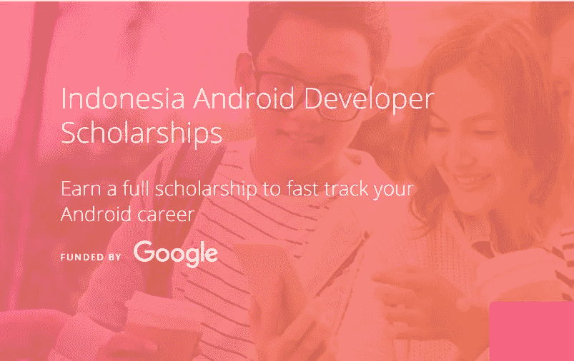
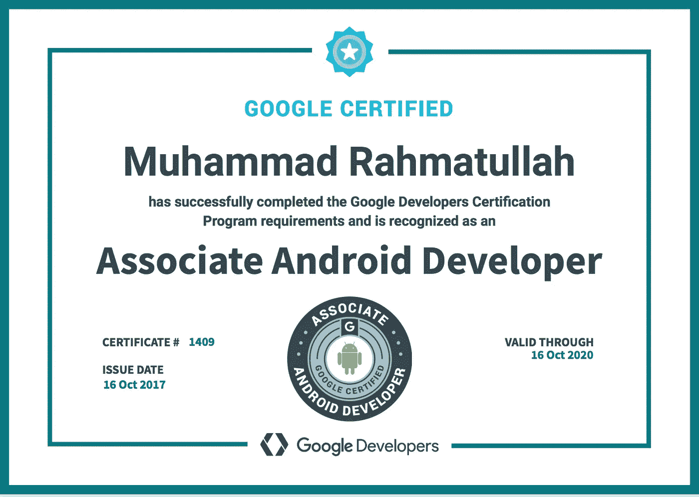

# 成为谷歌认证助理 Android 开发人员的旅程

> 原文：<https://medium.com/hackernoon/journey-to-be-google-certified-associate-android-developer-aeff54094eb3>

那是在 2017 年 5 月底，我看到了这个关于 [google](https://hackernoon.com/tagged/google) 向印度尼西亚的 500 名 android 开发者提供奖学金的公告，google 将支付在 udacity 的助理 Android 开发者快速通道课程费用以及参加助理 [Android](https://hackernoon.com/tagged/android) 开发者认证考试的费用。所以我没有进一步考虑就报名了。

image from udacity.com

事实上，自从两年前我参加了很多免费的课程后，我对 Udacity 已经非常熟悉了，而且 udacity 也是我开始学习 android 开发的第一个地方。我真正喜欢 udacity 的是学习过程的感觉。在这里，我可以感受到我是在一个真实的课堂上，由讲师面对面授课。

几周后，我收到了谷歌的一封电子邮件，我已经通过了奖学金的选拔，现在准备开始在 Udacity 学习。这门课程需要大约 3 个月的时间来完成，我们需要完成三个项目，但这不是参加考试的要求，当我们获得奖学金时，我们可以立即参加考试。但我决定完成所有的项目，以便更好地准备和更新。

Udacity 还为我们提供了本课程的时间表，以确保我们跟上进度。还有一个 slack 频道可以从 udacity 获取任何更新，甚至可以安排网络研讨会来讨论一些特定的主题。Udacity 的支持对我们很有帮助。

我将把我在课程中和考试过程中完成的三个项目进行分类。

1.  **热门电影 1**

这是我们在课程的第一阶段应该做的第一个项目。我们需要创建一个从互联网上检索数据的应用程序，在这种情况下，从[theMovieDB.org](http://themoviedb.org)并显示在一个 android 应用程序内。在主屏幕中，我们必须以网格视图的形式显示电影的海报，当我们单击海报时，它会将您带到详细屏幕，并提供一些关于电影的信息，如标题、时长、概要等。

该项目本身涵盖了 android 开发中的一些基本组件，如回收器视图、网络访问以及如何设计应用程序本身。当我们完成项目，然后我们需要提交给审查我们的工作。我们将在 24 小时内得到审查，如果有我们没有做的要求，我们必须再次提交项目。

**2。热门电影 2**

在受欢迎的电影第二部分中，我们只需要给应用程序添加更多的功能。我们需要添加数据持久性功能来显示我们点击的电影的预告片，并以列表的形式显示评论。

我在这个项目上花了相当多的时间，因为数据持久性的事情。我沉迷于现有的库，我们可以很容易地使用它们来节省我们编码过程中的大量时间，所以我很少使用 android 提供的原生库，所以我需要阅读一些文档，查找教程，在 Udacity 中有一个功能，在那里你可以问你的导师你是否遇到了什么问题。经过两次提交我的项目符合标准，我很好地进行到下一个阶段。耶 yyyy！

**3。烘焙 App**

认证考试前的最后一个项目，在这一阶段，我们需要创建一个应用程序，可以显示视频形式的烤蛋糕的步骤，数据本身由 Udacity 提供，如视频，描述和蛋糕的图像。对我来说，这个项目涵盖了我们在第一阶段和第二阶段所做的所有主题以及一些额外的主题。当我们成功创建应用程序的所有功能时，我们需要用 espresso 进行 UI 测试，并添加主屏幕小部件。

**4。谷歌认证考试**

在进行考试之前，Udacity 为我们提供了一些额外的资源，这些资源可能会在考试中进行测试，我发现这些资源非常有用，还有一个很棒的[资源库](https://github.com/Amejia481/Associate-Android-Developer-Certification)，它包含了考试认证中所有涵盖的主题。

考试有两个阶段，第一阶段是编码，第二阶段是离职面谈。编码会议，你会得到一个半完成的项目，你需要完成，调试和测试。所有的要求都很清楚，所以你不需要担心。如果你在第一阶段成功了，那么你将会参加离职面试。在离职面谈中，你会被问到关于你的项目和一些 android 开发的基础知识。

查看官方页面了解更多信息[这里](https://developers.google.com/training/certification/associate-android-developer/)

由于我是这样一个夜猫子，所以我在当地时间晚上 10 点参加了考试，并要求在第二天提交同样准确的时间。因为我已经为考试做好了充分的准备，所以我不会遇到这么大的问题，是的，关键是在时间和题目上做好充分的准备。我的离职面谈也很顺利，只花了不到 5 分钟。

我已经等了 10 天了，今天我收到了我的徽章和证书 xD，并且正式成为了谷歌认证的 Android 助理开发者

My Certificate

感谢你阅读这篇文章，最后但同样重要的是。我要感谢 Chaitra Ramanathan 和 Iip Permana(Udacity 支持)、Harshit Dwivedi(我的导师)、Kartik Arora(也是我的导师 xD，这有它自己的故事)以及所有参与这次奇妙旅程的人。