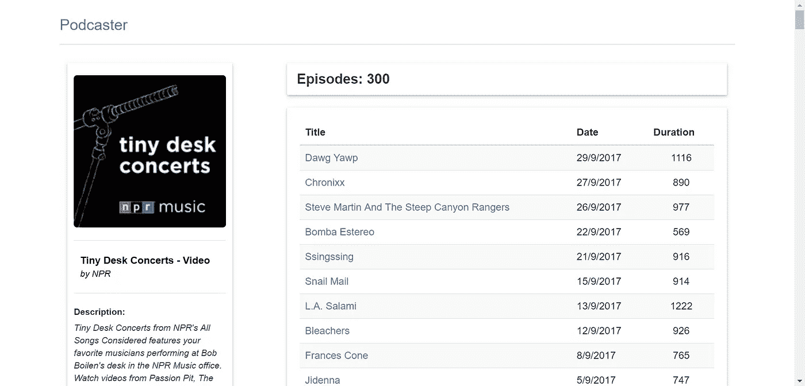
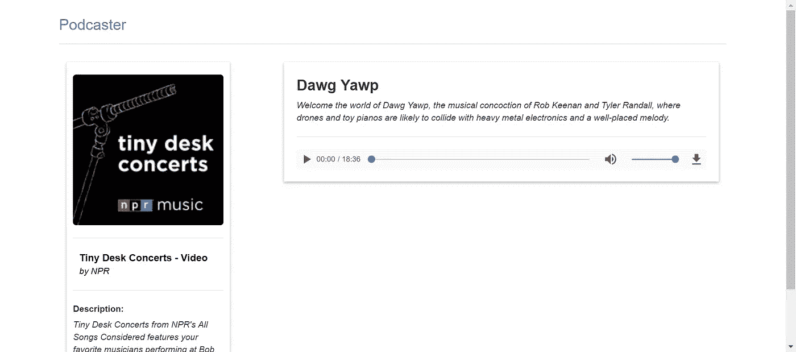

# 让我们今天试试未来

> 原文：<https://medium.com/hackernoon/js-lets-try-the-future-today-ae74f3fbe656>

这是一个简单的练习，我试图在没有任何第三方依赖或构建工具的情况下构建一个基本的网站(SPA ),但假设我们处于一个所有浏览器都实现了大多数现代 Javascript APIs 的世界。

这是我们将要建立的:([演示在这里](http://podcaster-vanilla-components.surge.sh/)


Podcaster home page

一个简单的网站来寻找音乐播客，列出他们的插曲，并听取他们。



Podcast detail page



Episode detail page

主要思想是采用基于组件的方法，因此，记住这一点，这是我将用于代码的结构:

```
<*root*>
 + index.html
 + src
   - styles
   - js
     * **api** (here is the code to access podcasts services)
     * **components** (here are the views and partials for the UI)
     * **config** (here is the routing configuration)
     * **plugins** (support code)
```

**你可以在这里** 得到最终代码 [***。***](https://github.com/PaquitoSoft/podcaster-vanilla-components)

我将使用的第一个好东西是现代浏览器(Chrome 和 Safari)中的 [Javascript 模块加载支持](https://www.chromestatus.com/features/5365692190687232)。

因此，HTML 文件将如下所示:

这里重要的部分是*脚本*标签的**类型**属性。
使用“**模块**”值，您告诉浏览器使用 [ES2015 javascript 模块](http://2ality.com/2014/09/es6-modules-final.html)语法及其*导入/导出*API。

在标记中，我们只设置了一个根入口点，我们将从主文件中*挂载*我们的应用程序。

## 应用程序主文件

该主文件插入应用程序布局(一个带有微调器的头，我们将使用它来加载状态),并将主要内容呈现委托给应用程序路由器:

我们只需用布局创建一个新的 *html* 元素，并用路由配置设置客户端路由器，它应该在其中呈现主要内容的根元素(基于 URL)和一个侦听器，这样我们就可以对加载事件做出反应(当数据没有被缓存时跨页面转换)。

## 路由器

所以，客户端路由。许多人会自动寻找第三方库，因为这似乎是一个复杂的领域，但事实是，如果您只需要处理简单的导航，从头构建一个路由器并不困难。它只是将你的 URL 与一个组件同步。关于渲染组件所需的数据，你可以设置组件来加载它，或者你可以让路由器加载它并把它传递给组件。我更喜欢第二种方式，因为我不希望新页面在获得数据之前就开始呈现，我也不想为每个页面处理一个*加载*状态(如果您为此创建助手组件，我认为最好使用*路由器*)。

以下是应用程序路由器:

这是一个简单的问题，但它足以开始。我在其他一些项目中使用了这种方法，使用了稍微复杂一点的路由器，我通常会创建另一个文件用于 *popstate* 的正确处理，并导出一些 *navTo* 和 *redirectTo* 助手函数。

这就是我们所做的:

*   监听文档中链接的点击事件
*   监听 URL 中的外部变化(例如:浏览器中的*后退*和*前进*按钮)
*   当页面加载时触发第一次更改 URL 处理

当我们需要加载新页面时:

*   根据我们要导航到的 URL，找到正确的路由器配置
*   一旦我们有了那个，我们就从 URL 中提取数据加载器可能需要的参数
*   调用加载程序来获取所需的数据
*   更新路由器内部状态:新视图组件和新数据
*   通过用新数据实例化一个新组件，用新状态重新呈现路由器主元素，并调用其**呈现**函数，该函数返回一个 *HTMLElement* 。
*   恢复滚动位置

还有执行回调来显示应用程序加载指示器。

## 主页

好了，接下来我们需要了解的是*页面*(主页、播客详情和剧集详情)。
我们刚刚看到*页面*可能有一个接受初始数据的**构造器**和一个**渲染**函数，该函数必须返回一个包含预期内容的 *HTMLElement* 。

由于所有的*页面*都有一些共同的行为，并且我们需要它们的几个实例，我们将为它们创建一个基类，每个页面都将继承这个基类。

我们的页面将会有一个来自 [**的主干**](http://backbonejs.org/) 和另一个来自 [**的反应**](https://reactjs.org/) 。
让我们开始看看*首页*视图。

在页面的*构造器*中，我们接收来自*路由器*的数据，并调用 parent 来存储实例状态。我们将使用该状态来重新呈现视图。

我们还有一个 *getter* ，它返回页面必须处理的 DOM 事件的映射。语法灵感来自 [**骨干**](http://backbonejs.org/) **。**
每个条目的键都有几个部分:第一部分是我们想要监听的 DOM 事件的名称，第二部分是用于"*我们想要将监听器附加到的元素"的*选择器*；*第二部分是我们希望与事件关联的函数。
实际上，事件监听器并不绑定到选择器所表示的元素，它们都绑定到视图实例的根元素，并且在*基页*中有委托管理。

呈现过程中使用的函数是 **html** 函数，它必须返回一个表示 html 的字符串，以可视化页面及其提供的状态。
在*路由器*中，我们看到我们正在为页面生成内容，调用一个返回 HTMLElement 的*渲染*函数。该功能是在 *BasePage* 类中实现的(我们马上就要实现了)。

最后需要注意的是静态的 **dataLoader** 函数，路由器使用它来知道如何加载(异步)这个视图需要的数据。

## 基本页面类

到目前为止一切顺利。让我们看看每个应用程序页面的基类:

在构造函数中，我们存储从 page 类接收的数据，为这个视图创建根 HTMLElement，并注册子类可能定义的可能的 DOM 事件处理程序。

然后，我们只有一个更新实例状态的函数(重新呈现页面实例)和一个呈现函数，用于设置根实例 HTMLElement 中子类产生的 HTML 字符串。

## 分音

如果你回到*主页*渲染代码，你会注意到每个播客信息都是使用*播客摘要*部分渲染的。

这种组件比较简单，因为它不需要处理导航，也不需要动态状态。
这些就像 [**React**](https://reactjs.org/) 中的 无状态功能组件。它们只是接收要呈现的数据并返回相应的 HTML 字符串。

## 代码的其余部分

其他页面的代码与你刚刚在*主页*类中看到的非常相似。
还有其他一些相关的文件:

*   /src/api/ **podcaster.js** 这个文件保存了对 iTunes 播客服务的 AJAX 调用以及获取播客 RSS 详细信息文件的请求。
*   /src/plugins/**local-cache . js**这个文件是本地存储 API 的代理，允许存储带有生存时间元信息的值。
*   /src/plugins/ **ajax.js** 这个文件是 fetch API 的一个瘦包装器，以简化它的使用。

你可以在这里浏览/下载这个宠物项目的[完成代码，以了解他们的详细信息。](https://github.com/PaquitoSoft/podcaster-vanilla-components)

## 结论

正如你所看到的，使用最新的浏览器，你可以很容易地实现一个没有第三方依赖的**基本**解决方案。

我确信，一两年后，当所有的浏览器都实现了这种 API 时，将会有新的优秀的 API 出现，只在一两个浏览器中可用，所以我们仍然会等待所有的浏览器都实现它们，就像我们现在一样。但是，你知道吗？这让我们的生活充满乐趣。

如果您已经读到这里，我想感谢您给我一些时间，我希望您能在这篇文章中找到一些有用的东西。

**额外奖励**:我已经写了一篇后续文章来展示将*代码分割*添加到这个基本应用程序中是多么容易。
来看看吧！ [**JS:今天就来试试未来(额外奖励)**](/@paquitosoftware/js-lets-try-the-future-today-extra-bonus-43e9e1a8480a)