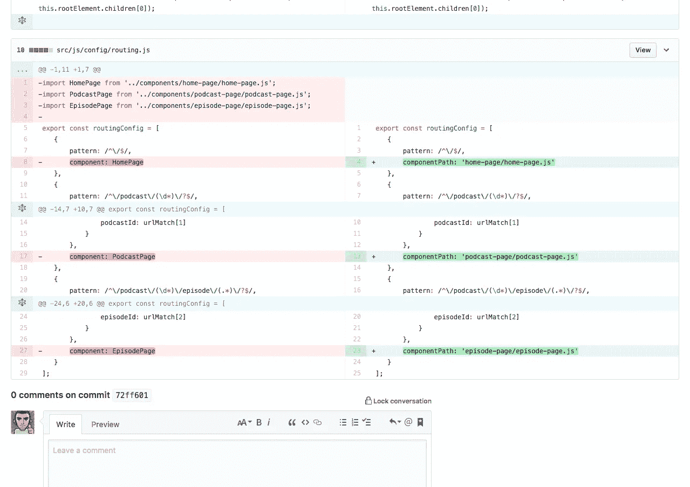
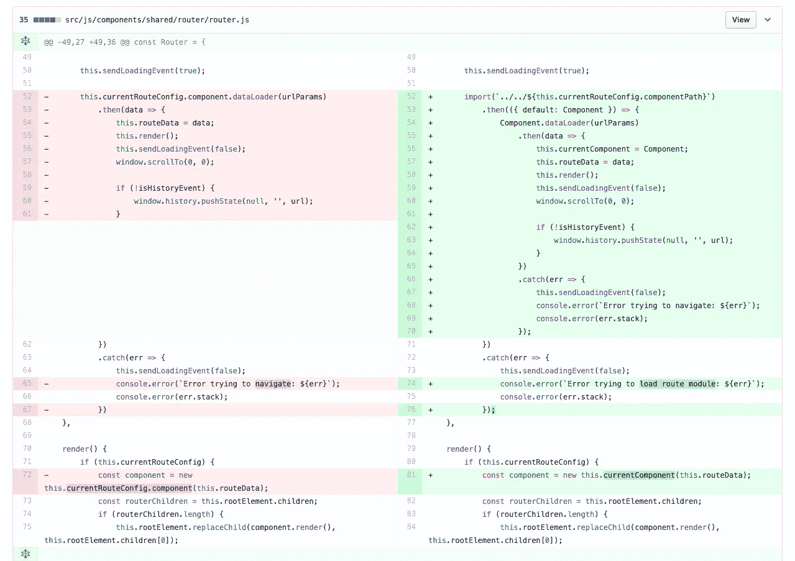

# 让我们今天试试未来(额外奖励)

> 原文：<https://medium.com/hackernoon/js-lets-try-the-future-today-extra-bonus-43e9e1a8480a>

在之前的一篇文章 中，我展示了一种实现基本而简单的应用程序的方法，没有第三方依赖或构建工具，只使用所有新的好东西和最新的浏览器已经实现的东西。

有一个额外的功能，我们可以毫不费力地添加到应用程序中，但目前它只在 Safari 中工作，因为它是唯一一个实现了 [**动态导入**](https://github.com/tc39/proposal-dynamic-import) API 的浏览器。

有了这个 API，我们可以推迟部分应用程序代码的加载，这样浏览器就不会提前下载了。

我现在想要实现的是应用程序在页面加载时只下载核心代码和当前视图代码的能力，因此，如果我们加载 *home* 视图(带有播客列表的视图)，浏览器不会提取播客详细视图或剧集详细视图的代码。

因此，我们只需在应用程序中更改两个文件就可以实现这个新特性。

(*记得哟这里可以看到应用*****的完整代码。*** *资源库中有一个分支叫做****async-routing****用这个特性实现了*。*

*策略是在路由器导航功能中添加一个新步骤，以便在呈现新页面之前，获取需要呈现的页面级组件。*

*我首先需要更改路由配置文件，这样它就不会直接导入页面级组件。相反，我只是设置了组件的相对路径(在本例中，相对于**组件**文件夹):*

**

*Changes to routing configuration file*

*我必须更改的另一件事是路由器组件，以便它在尝试导航之前获取相应的文件。
这里是这个文件的*差异*:*

**

*Changes to router component file*

*所以，重要的一行是带有**导入**调用的那一行。这将告诉浏览器获取我们在路由配置中配置的文件(它只会做一次)。
导入函数返回一个[承诺](http://devdocs.io/javascript/global_objects/promise)，当浏览器加载了所需的模块文件(及其所有依赖项)时，该承诺被解析。*

*而且，就是这样。
再多几行代码，我们就已经在应用程序中实现了**代码分割**。*

*请记住，目前只有 Safari 支持动态导入(Chrome 将在其下一个版本 v63 中支持)。更多状态信息:[https://www.chromestatus.com/features/5684934484164608](https://www.chromestatus.com/features/5684934484164608)*