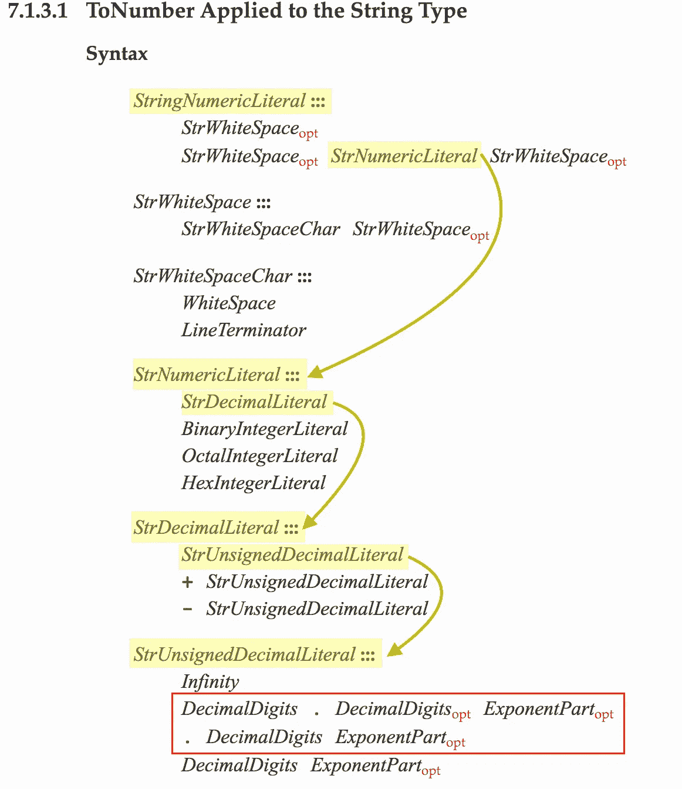

# JS WTF🦄带编号

> 原文：<https://medium.com/hackernoon/js-wtf-with-number-5cd73514befb>

## 是时候乘坐一些编号为的 JavaScript WTF 了。

# ‘0.0’

当将`String`转换为`Number`时，JS 能够**将数值之前或之后的** `**period**` **解释为十进制数**的周期。这就是为什么 get `0`作为前两个表达式的结果。

`'0.'`和`'.0'`都代表小数`0.0`。

这里是[规格](https://www.ecma-international.org/ecma-262/6.0/index.html#sec-tonumber-applied-to-the-string-type):

> 我知道。我知道。细节太多！

但是，“我 *f 语法* ***无法将字符串解释为 StringNumericLiteral****的展开，那么*[*to number*](https://www.ecma-international.org/ecma-262/6.0/index.html#sec-tonumber)*的结果就是****NaN****。*，它解释了`Number('.')`的结果。

即表达式`'.'`与上面红框中高亮显示的**字符串文字**不匹配。

# {}对[]

当`Number`应用于**对象**时，JavaScript 试图将其转换为**原始值**。

根据[规范](https://www.ecma-international.org/ecma-262/6.0/index.html#sec-toprimitive)，它首先执行`.valueOf()`。

因为`{}`和`[]`的`.valueOf()`也返回一个对象，所以 JS 尝试`.toString()`。

> **这个 WTF 的原因在于** `.toString()`的结果。

操作`({}).toString()`实际运行`Object.prototype.toString()` ，根据定义[为`"[object Object]"`。然而，正如我们之前看到的，当字符串不能被解释为数值*时，将字符串转换为数字会返回`NaN`。*这解释出了第一个结果`Number({}) // NaN`。](https://www.ecma-international.org/ecma-262/6.0/index.html#sec-object.prototype.tostring)

至于`[].toString()`，它执行`Array.prototype.toString()`并输出`""`。[顾名思义](https://www.ecma-international.org/ecma-262/6.0/index.html#sec-tonumber-applied-to-the-string-type)，`Number("")`就是`0`。

因此`Number([])`就是`0`。

*好！让我们休息一下，看看这只小猫👀*

# 未定义 vs 空

根据[到](http://www.ecma-international.org/ecma-262/6.0/index.html#sec-toboolean)的意思，`null`和`undefined`都表示缺少某物，意为`false`。

然而，我们可以把`undefined`看作更一般的“缺席”这是因为当没有其他值被赋值时，它被用来表示变量值。

> **未定义**，**已经声明了一个变量，但是没有给它赋值。**

另一方面，`null`是一个**分配值**。它可以作为“无值”的表示赋给变量。

> null，变量已声明，但其值为空。

而且，他们有不同的`typeof`。

因此我来到**相信**这就是为什么在执行`Number(undefined)`时`undefined`被转换为`NaN`，意味着**没有赋值**。

以及`null`到值`0`，意味着**是值**的*假值*表示。

# 最小值

很容易理解`[Number.MAX_VALUE](https://developer.mozilla.org/en-US/docs/Web/JavaScript/Reference/Global_Objects/Number/MAX_VALUE)`比`0`大，但是意识到`[Number.MIN_VALUE](https://developer.mozilla.org/en-US/docs/Web/JavaScript/Reference/Global_Objects/Number/MIN_VALUE)`不比`0`小就很奇怪了。

那是因为`Number.MIN_VALUE` 实际上并不是最小可能值**、**而是**最小可能正值**，这是一个**非常非常小的值** ( `5e-324`具体来说)，然而大于`0`。

> 为了表示可能的最小值，我们可以安全地使用`[Number.MIN_SAFE_INTEGER](https://developer.mozilla.org/en-US/docs/Web/JavaScript/Reference/Global_Objects/Number/MIN_SAFE_INTEGER)`，即`-(2^53–1)`

# toFixed()

在数值上有一个`period`就是说它有一个**小数部分。**然而，这使得**静态方法**的使用不一致。

对于表达式`42.toFixed(2)`，因为数值`42.`是一个有效的数字，JS 继续解释完整的表达式。然而，它发现`toFixed(2)`，它的**没有有意义的值**(与表示静态方法执行的表达式`.toFixed(2)`相反)。)并抛出语法错误。

甚至`42.`和`toFixed(2)`之间的间隔也不能解决问题。

然而，`42`和`.toFixed(2)`之间的间隔解决了问题。甚至是双周期`42..toFixed(2)`😮

> 42.toFixed(2)！== 42..toFixed(2)

尽管如此，这就是 JS 对代码的解释。

# < your WTF >

如果你发现任何应该在这里的 WTF，请告诉我👐

> 数字到此为止。

# 由于🍻

*   [MDN 文档](https://developer.mozilla.org/en-US/docs/Web)
*   [凯尔·辛普森](https://twitter.com/getify)为他的[视频](https://www.youtube.com/watch?v=2pL28CcEijU)和[书](https://www.safaribooksonline.com/library/view/you-dont-know/9781491905159/)
*   世界上所有的小猫
*   [黑客正午](https://twitter.com/hackernoon)为出版❤️

*一定要看看我在 JS WTF 上的其他文章*

 [## JS WTF🦄使用数组

### 让我们利用一些带有 JavaScript 数组的 WTF。

hackernoon.com](https://hackernoon.com/oh-my-goodnejs-arrays-f9e9e4f03c97)