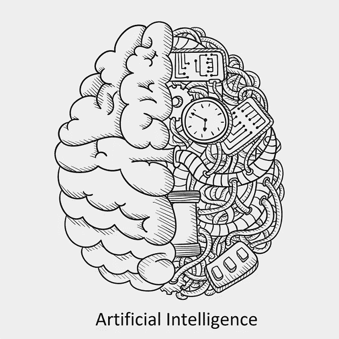
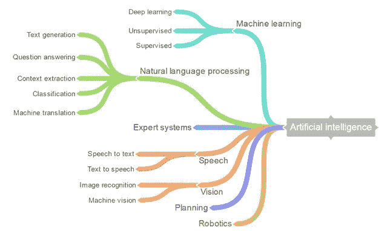
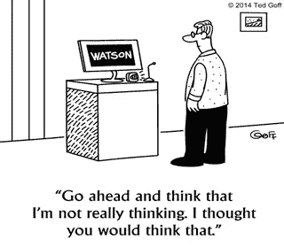
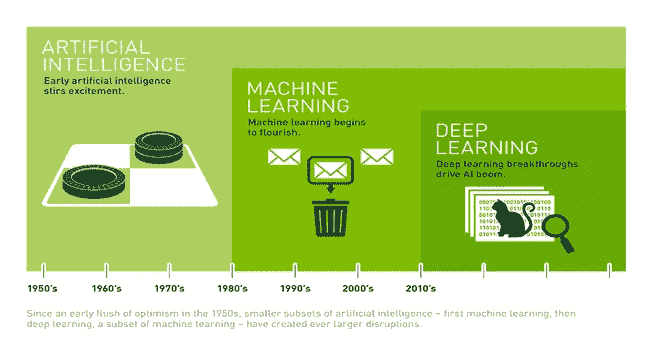

# 向人工智能跳跃。

> 原文：<https://medium.com/hackernoon/jump-start-to-artificial-intelligence-f6eb30d624ec>

Image courtesy: [www.**freepik**.**com**](http://www.freepik.com)

我们写这个博客是为了激励所有开发人员走向人工智能，而阅读这个博客只是消除了人工智能(人工智能)是艰难的，困难的等等等等的复杂性。所以现在，我们将探索人工智能的全新世界。

那么，什么是人工智能呢？嗯。这是个棘手的问题。我们不会让事情变得复杂，所以人工智能是一台在没有任何人类参与的情况下解决你现实生活中的问题的机器，或者具体地说，我们可以说一个软件就像一个需要一些训练的小孩子，然后它就能够解决你现实生活中的问题。

如果你想要艾伦·图灵的具体定义，人工智能(AI)通常被定义为让计算机做人类做的需要智能的事情的科学。现在，人工智能是一棵大树，有许多分支来研究和专门研究它。我不会深入探讨这些话题。下面是人工智能树的图像。抱歉，如果我们错过了一些主题，但这些是基本的分支，尽管还有更多，你可以在这里查看。

为什么我们应该学习或接近人工智能？是的，这是我们脑海中首先闪现的问题。我们认为，damm 人的生活是如此美好，为什么我们要深入这个复杂的话题，让我们自己纠结在人工智能的线程中，但是，这一点也不复杂，在今天的日期有现成的人工智能软件，使你的人工智能开发变得容易。

所以，你可能已经看过/读过漫威和 DC 漫画的钢铁侠和蝙蝠侠，他们都使用人工智能(分别是贾维斯和哈达克)，或者 IOS 用户可能使用著名的个人助理 SIRI 和即将推出的 Windows Cortana。你不觉得他们很棒很酷吗？人工智能不仅仅是一段代码，当它执行时，它是你努力工作的结果。现在许多 it 和汽车行业都对自动化感兴趣，例如特斯拉和法拉第未来公司和游戏行业正在通过在他们的系统中实现/包括人工智能来控制年轻人的思想。如果你有一些基本的编程技能，你可以开发自己的 Jarvis、SIRI 或 Cortona(不像那些那样完美，但是的，可行，并且可以根据你的需要定制人工智能代码),我们认为现在听起来有些有趣。

如前所述，我们不打算深入探讨。我将介绍自动化市场或 IT 行业当前流行的热门话题。以下是我们的兴趣爱好

深度学习。

优化—加速/并行化随机梯度下降、坐标下降和其他基于梯度的算法。

单词嵌入。

*注意:在这篇博客中，我们将关注深度学习，其他话题将在下一篇博客中讨论。*

**让我们开始我们的短途旅行吧。**

**深度学习:**

深度学习是人工智能最甜蜜的味道。此外，它很古老，是从机器学习演变而来的，或者我们可以说它是机器学习的另一个分支。深度学习只不过是一种比浅层机器学习算法更智能的算法，但更难训练这些神经网络。深度学习的例子有谷歌的无人驾驶汽车，人脸识别，SIRI，Cortana 个人助理所有这些都是使用深度学习算法开发的，新推出的亚马逊 Go 商店也包括深度学习。

那么，它是如何工作的呢？

左边的图像暗示了神经元在人脑中的存在方式，右边的图像显示了它是如何使用人工智能算法开发的。因此，深度学习也包括神经网络，但结构更复杂。我们可以观察到，有两个神经元细胞通过轴突连接，轴突为我们肌肉的任何运动传递电信号。与此类似，我们创造了相互连接的神经元结构，并模仿人脑。

由于深度学习，实现机器学习的许多实际应用成为可能。深度学习分解任务的方式让各种机器辅助看起来可能，甚至有可能。无人驾驶汽车，更好的预防性医疗保健，甚至更好的电影推荐，都在今天或即将到来。人工智能是现在和未来。在深度学习的帮助下，人工智能甚至可能达到我们长期以来想象的科幻小说状态。你有(C-3PO)，我要了。你可以保留你的终结者(更多信息你可以在 [Nvidia](http://www.nvidia.com/object/drive-px.html) 上阅读)。

**乡亲们都到齐了**

因此，上述主题是人工智能领域的趋势，深度学习被许多汽车行业和领先的电子商务网站采用，例如 Faradays Future 和亚马逊。你可以尝试一些深度学习的概念，通过小段代码实现人工智能，或者也有一些可用的软件，如 Neuroph，Matlab 神经网络，使用它们你可以测试你的人工智能逻辑和神经网络。我们将在下一篇博客中继续剩余的话题，直到快乐编码。

你可以在 [twitter](https://twitter.com/invincible_cool) 和 [LinkedIn](https://in.linkedin.com/in/ajinkya-kulkarni-777064a6) 上关注我。

> [黑客中午](http://bit.ly/Hackernoon)是黑客如何开始他们的下午。我们是 [@AMI](http://bit.ly/atAMIatAMI) 家庭的一员。我们现在[接受投稿](http://bit.ly/hackernoonsubmission)，并乐意[讨论广告&赞助](mailto:partners@amipublications.com)机会。
> 
> 如果你喜欢这个故事，我们推荐你阅读我们的[最新科技故事](http://bit.ly/hackernoonlatestt)和[趋势科技故事](https://hackernoon.com/trending)。直到下一次，不要把世界的现实想当然！

