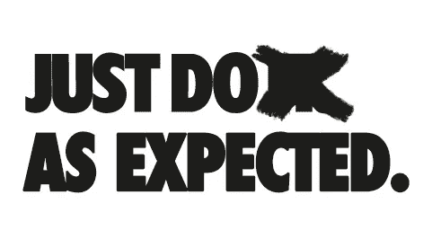
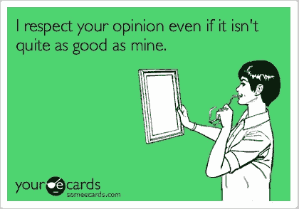
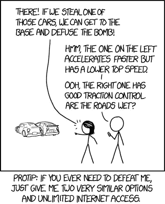
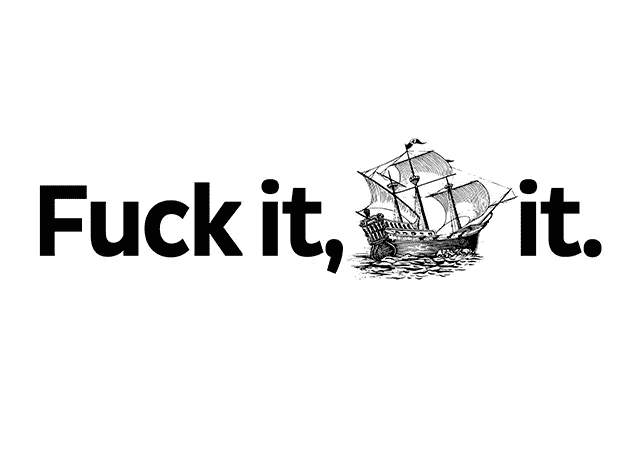

# 就像预期的那样做

> 原文：<https://medium.com/hackernoon/just-do-as-expected-544385144f14>

[Iceland’s ring road](https://500px.com/photo/215328751/the-road-ahead-by-joan-gamell)

那是五年前我工作的第一周，当时我问“我应该为我构建的特性写一个测试吗？”——“按照预期的那样做”他们说。

当时我一点也不知道“按预期做”会成为评估和提高团队绩效的工具，写出更好的代码，甚至成为一个更好的人。

有人告诉我这一切都是从一个支持请求开始的。亚洲的一个跨国团队夜以继日地工作，努力集成一个缺乏文档记录的第三方服务。无数个小时被投入到这个问题上，但是他们不能完成一个成功的交易。支持票终于有了回应。只有一句话的回应:“请按照预期去做。”

办公室里的一个本地开发人员立即说“哦！”并解决了问题。团队很困惑——丹尼尔是如何将“按预期去做”转化为可行的解决方案的？事实证明，这让他后退一步，审查是否有任何看似可选的参数实际上是必需的，只是没有记录下来。不一会儿，他想通了，问题解决了。

在接下来的几个月和几年里，*像预期的那样做*在我们的脑海中从一个重复出现的笑话演变成一个概念，代表了我们作为一个团队所代表的原则和行为。

# 一个简单的问题

我们很快发现，我们可以使用*按预期做*作为工具，通过[相互推动](https://en.wikipedia.org/wiki/Nudge_theory)来满足我们同行的期望，从而发展和磨练我们的文化。

问题是:我们如何知道*期望*是什么？在我加入的时候，我们的团队已经有了很强的文化，所以答案很简单。在年轻的团队中，你可能想要公开讨论你想要为你的文化播下什么种子。

我们开始问自己一个非常简单的问题:“*我的团队希望我做什么？*

*   *我的团队希望我改进这个过时的文档吗？*
*   *当我不同意某件事时，我的团队是否希望我直言不讳？*
*   当我的队友忘记锁电脑时，我的团队希望我恶作剧吗？

接下来是我对我们从队友那里得到的期望的描述。

## 每个人都有责任

正如的 Jez Humble 所说:

> 在高绩效的组织中，没有什么是“别人的问题”

对我们来说，这意味着要有一种无私和互相帮助的心态:每个人都要帮忙修理坏掉的东西，不管是谁弄坏的——这是每个人的问题。

这也意味着我们作为一个团队拥有我们的大便，并期望其他人也拥有他们的大便。当其他团队未能交付我们需要的东西时，我们会自己构建解决方案，而不是被封锁，接受冗长的电子邮件线程来玩指责游戏。

## 持续改进

起初我们没有意识到，我们发现自己处于一个正反馈循环中，每个人都试图改进。当我们不断尝试超越团队对自己的期望时，进步就发生了。

[无论是个人层面还是团队层面，总有改进的空间](https://en.wikipedia.org/wiki/Kaizen)；我们努力追求完美，但知道这是一个无止境的追求。

我们就 [*为什么*会是现在这个样子](https://www.ted.com/talks/simon_sinek_how_great_leaders_inspire_action)以及如何改进进行了建设性的公开讨论。毕竟，如果没有人站出来说话，很少有事情会改变——而改善只能来自于改变。

## 尊重他人和他们的意见

随着团队成员[感到安全](https://www.ted.com/talks/simon_sinek_why_good_leaders_make_you_feel_safe)公开表达他们的不同意见和观点，公开的反馈和讨论变得很自然。我们知道没什么好害怕的:只要我们尊重他人，我们就会被倾听，也会得到尊重。

我们希望每个人都能接受反馈和不同的意见，而不是针对个人:我们有[强烈的意见，也有](http://bobsutton.typepad.com/my_weblog/2006/07/strong_opinions.html)不强烈的意见。

我们当时并不知道，但事实证明，根据亚当·格兰特的[原著](https://www.amazon.com/Originals-How-Non-Conformists-Move-World/dp/0525429565)，当意见多样化时，团队会做出更好的决策:

> 认识到不同的意见是有用的，即使它们是错误的，并且尽力去奖励它们。提拔和赞美那些公开反对你和批评你的人。”
> 
> *-亚当·格兰特，* [*为什么你不应该因为文化契合度*](https://www.forbes.com/sites/danschawbel/2016/02/02/adam-grant-why-you-shouldnt-hire-for-cultural-fit/2/#55796a65bcb5)

## 偏向行动

有时候，我们陷入了[分析瘫痪](https://blog.todoist.com/2015/07/08/analysis-paralysis-and-your-productivity/)，或者当我们试图决定某事时，我们试图取悦每个人。我们了解到，在这种情况下，信息比观点或假设更有价值。因为行动是获得实际信息的唯一途径，所以我们必须采取行动才能前进。

这意味着当我们不能就一个决定达成一致或者我们不确定该走哪条路时，我们采用了**试错**的方法。一旦我们测试了每个提案的概念证明(POC ),我们希望每个人都相信这些数据，并同意哪个提案能产生最好的结果。

纳西姆·n·塔勒布称这种有益的试错法概念为*反脆弱修补*:

> *“因为你不必总是对的。你所需要的是智慧，不要做愚蠢的事情来伤害自己(一些疏忽的行为),并在有利的结果出现时识别它们。(关键是你的评估不需要事前，只需要事后。)"*
> 
> *——纳西姆·尼古拉斯·塔勒布。"抗脆弱:从混乱中获得的东西."*

构建 POC 还迫使我们从小规模开始，这让我们摆脱了困境，并开始行动。

错误显然是*试错法不可或缺的一部分。*这种方法对我们很有效，因为我们不怕犯错误——每个人都将错误视为学习和改进的一种方式。换句话说，我们在心理上感到安全:

> *“团队成员持有的共同信念，即团队对于人际风险承担是安全的。'*
> 
> 艾米·埃德蒙森

# 代码符合预期

*果然不出所料*同样适用于软件开发。作为一名开发人员，我们用它(现在仍然如此)来提醒自己遵循某些好的实践。

## 最小化 WTFs/分钟

我们尽最大努力最小化每分钟的 WTFs 指标。也就是说，当有人(包括你未来的自己)阅读/审查你的代码时，每分钟会脱口而出多少个 wtf:

这也被称为[最小惊喜原则](http://www.draconianoverlord.com/pages/first-principles.html#principle-of-least-surprise):

> “你应该减少未来维护者(也就是未来的你)将会面临的惊喜。”
> 
> *——斯蒂芬·哈伯曼*

或者说[最小惊讶原则](http://wiki.c2.com/?PrincipleOfLeastAstonishment)。

那么，"*我的团队希望我最小化每分钟的 WTFs 吗？*“希望答案很明显。

## 代码质量

为了提高我们的代码质量，并定义我们想要坚持的标准，我们阅读了 Robert C. Martin 的 [Clean Code，并在随后与整个团队的一系列会议中一起实践了它的概念，在这些会议中，我们通过在](https://www.amazon.com/Clean-Code-Handbook-Software-Craftsmanship/dp/0132350882) [*mob 编程*](https://en.wikipedia.org/wiki/Mob_programming) 中进行类似设置来学习。

在 Martin 谈到的概念中，我最喜欢的一个是[童子军规则](http://programmer.97things.oreilly.com/wiki/index.php/The_Boy_Scout_Rule)——持续改进应用于编码:

> *“检查模块时要比检查时干净。”不管最初的作者是谁，如果我们总是做出一些努力，不管是多么小的努力，来改进这个模块，会怎么样呢？*
> 
> *——罗伯特·马丁*

我们保持质量的最重要的工具是代码审查。无论开发人员的资历如何，我们在代码审查中都是诚实和直接的，这引发了关于*为什么以这种方式完成*事情的必要讨论，并引导我们找到更干净和更好的方式来编写相同的功能，甚至在代码到达 Master 之前。

## 装运它！

我们还将**试错概念应用于软件交付**。我们知道，我们越快将软件交付给客户，我们就能越快了解什么可行，什么不可行。

我们有一个很好的持续集成&交付管道和监控，所以我们可以偏向于发布，相信如果出现问题，我们可以快速安全地回滚发布。

在更高的层面上，我们也试图[早发布并且经常](https://en.wikipedia.org/wiki/Release_early,_release_often)，在之前发布我们认为完美的产品或功能*(当然这不适用于[安全关键软件](https://en.wikipedia.org/wiki/Safety-critical_system#Software_engineering_for_safety-critical_systems)比如航空电子设备)。雷德·霍夫曼表示同意:*

> “我相信，如果你没有为你的第一个产品发布感到尴尬，那么你发布它已经太晚了。不完美就是完美。”
> 
> *——雷德·霍夫曼，* [*不完美就是完美*](https://www.entrepreneur.com/topic/masters-of-scale)

## 传递性

这是我瞎编的，但根据经验，我会说，如果你在构建某个东西时*按照预期*去做，那么结果很可能会正常工作，并按照预期变成*。将此属性应用于代码:*

> *如果你在写代码的时候按照预期去做，你的代码很可能*会按照预期*表现/工作*

即[中的*构建质量*中的](https://continuousdelivery.com/principles/#build-quality-in)。或者，再一次，让 wtf 变得罕见，你的团队成员会永远感激你。

# 一生中

冒着听起来像一个哲学大师的风险，你可以更进一步，把“按预期做”应用到工作之外的生活中。我认为这是通向康德绝对命令的捷径(不要和黄金法则混淆)

> 只要按照那条格言行事，你就能同时希望它成为一条普遍规律。
> 
> *——伊曼纽尔·康德，为道德的形而上学奠基*

或者

> 做你希望别人做的事。

我会把它留在这里。现在，*如期完成*对你和你的团队意味着什么？

*感谢* [*洛林*](https://www.linkedin.com/in/lorin-kobashigawa-7112b41/) *作为我的导师，我事实上的编辑，感谢他帮助我写这篇文章。*

 我 感谢您的阅读，希望您觉得有用。如果你喜欢，请**考虑订阅** [ **灰色事件** ](https://graymatters.substack.com/) **🧠** ，这是我与[马里奥·查莫罗](https://medium.com/u/6291e977af46?source=post_page-----544385144f14--------------------------------)共同撰写的每周时事通讯，我们在这里讨论生产力、科技、新常态以及介于两者之间的一切。