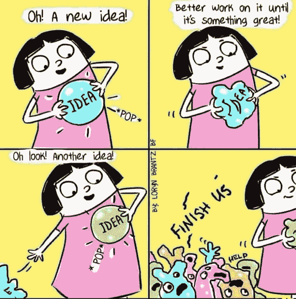

# 完成它

> 原文：<https://medium.com/hackernoon/just-finish-it-c0951613808e>

一家公司的高管今天早上发给我这个，我是 T2 的投资者。这感觉像你在公司的生活吗？

我是埃里克·里斯和精益创业公司的超级粉丝。他和史蒂夫·布兰克的思考和写作改变了我们对待创业的方式。然而，明亮发光物体综合症在 StartupLand 中仍然存在，当它与 MVP 和快速失败合并时，通常会导致痛苦。

完成一件产品并发货极具挑战性。对于硬件来说就不同了，因为有一个产品的物理实例，你必须把它放进盒子里，然后送出去。有了软件，你可以运出一堆垃圾，并每天(或持续)更新它来改进它。但是当产品包含一些硬件时，一旦它出了门，你就不得不接受它。

但是，对于硬件和软件来说，缺乏对完成的关注是有害的。当你阅读[杰夫·贝索斯的年度信](https://www.sec.gov/Archives/edgar/data/1018724/000119312517120198/d373368dex991.htm)并内化“顾客痴迷”时，你会意识到，如果你从顾客的角度看世界，你生意中的一切都取决于把你的产品送到他们手中，然后让他们完全满意。

在我的第一家公司，我们每周为多个客户发布软件(我们是一家定制软件公司。)在某些方面，这个过程与每周一次的冲刺有着相同的特征，只不过那是在 20 世纪 90 年代初，我们经常不得不通过联邦快递(Fedex)向客户运送软盘。我知道确切的时间，我必须走出办公室的门，走到南站(在波士顿)，坐出租车去洛根机场的联邦快递站，让联邦快递停止服务。每当我这样做的时候，当我回到出租车里，坐下来，回家过夜时，我总是有一种欣快感。在过去的 25 年里，我们已经从这种动态中走了很长一段路，但是航运的美妙感觉并没有改变。

这可能听起来简单而陈腐，但请仔细想想。如果你是一位 CEO 或创始人，你是在创造一种出货的幻觉，而是在创造一种明亮发光物体综合症的循环吗？

就这样，这篇文章被寄出…

*最初发表于* [*费尔德思想*](http://www.feld.com/archives/2017/04/just-finish-it.html) *。*

> [黑客中午](http://bit.ly/Hackernoon)是黑客如何开始他们的下午。我们是 [@AMI](http://bit.ly/atAMIatAMI) 家庭的一员。我们现在[接受投稿](http://bit.ly/hackernoonsubmission)，并乐意[讨论广告&赞助](mailto:partners@amipublications.com)机会。
> 
> 如果你喜欢这个故事，我们推荐你阅读我们的[最新科技故事](http://bit.ly/hackernoonlatestt)和[趋势科技故事](https://hackernoon.com/trending)。直到下一次，不要把世界的现实想当然！

