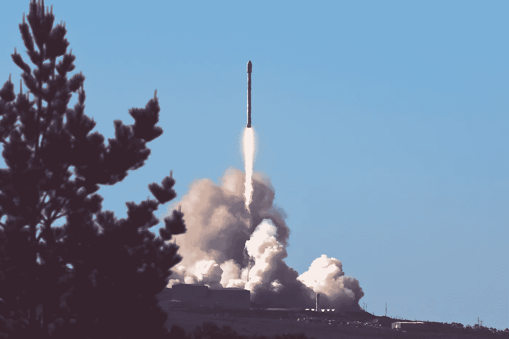

# 开始吧

> 原文：<https://medium.com/hackernoon/just-start-5db3b8057b2f>

## 从一整年的每日博客中得到的教训

今天是第 365 天。整整一年的每日博客。结果，我的**数量惊人。一个朋友问我是否学到了任何有价值的东西来分享。我从来都不热衷于列这样的清单，因为它们往往会以饱和状态告终——但我想我会尽力提供一些可操作的、透明的想法。如果我有更多的时间，我会把它写得更短，但是一切都在这里:**

**

1.  ***刚开始。**无论做什么:搭建 app。去跑步吧。写博文。录制播客。点击发布。你不需要什么精心的计划——你只需要开始。*
2.  *在这一点上，要意识到没有人会来替你做你的工作。*
3.  *没有什么是规定性的。没有秘方可以保证你成功。不要相信那些试图告诉你不是这样的人，他们可能只是想卖给你一些东西。*
4.  *耐心点。“好事需要时间。”一夜成功的故事是虚构的。*
5.  *生活中唯一不变的是变化。做好适应的准备，因为大多数人不会。*
6.  *找出你自己的原因。你可以通过多种方式做到这一点:与人交谈、尝试、失败。做这件事没有最好的方法。重要的是，你正在有意识、有目的地努力去更好地了解自己，变得更有自知之明。*
7.  *其他人会试着建议你应该如何度过你的时间。他们可能是好意，但通常最好的办法是自己去试着弄清楚。大多数建议都充满了事后诸葛亮的偏见。*
8.  *不管你做什么，总有人会有意见。树敌*不*值得。专注于提升自己，提升你在乎的人和事。好东西会随之而来。*
9.  *大多数人不在乎你的借口。“迟到”是大多数人不在乎的事情之一。对事情要准时，这显示出你的关心。*
10.  *有效接受批评。把你作为一个人和你的工作分开，尽你所能产生最好的结果。*
11.  *目标[很高](/@jordangonen/aim-high-2682c4de7e5a#.xzs2oie34)。你会惊讶于独自开车能带你走多远。*
12.  *笑一点。其实很多。这让一切都变得更好。*
13.  *年龄只是一个数字。天真是一件好事。我的第一篇博文真是太傻了。活到老，学到老。*
14.  *这可能会很尴尬，但通常最好是直接提出你想要的。一般来说，最坏的情况是他们只是说不。*
15.  *开始时—快速移动。当事情进展缓慢时，很容易失去动力。*
16.  *空谈不值钱。想法也是。强调**动作**。*
17.  *很有可能，没有人会认可你的[努力](/startup-grind/i-wrote-daily-for-8-months-here-is-what-ive-learned-1895decc4082#.1vn92cmgs)。这种情况可能会持续很长一段时间。很艰难。保持专注。*
18.  *每隔一段时间就会有人给你一个不理智的机会。他们会回复你的邮件，回复你的邮件，接听你的电话——珍惜这一刻，尽你所能不让他们失望。*
19.  *说不真的很难。随着年龄的增长，这只会变得更加困难。你可能应该对 99%的机会说不——这是一个奇怪的概念。*
20.  *[家族第一](/@jordangonen/take-a-moment-and-say-thank-you-to-your-family-6c901e0e7e38#.ck5yjv8bi)。*
21.  *和你喜欢的人一起工作——独自工作会变得超级孤独。另外，和朋友一起赢更有趣。乐趣永远是第一位的。*
22.  *当你可以的时候，[免费帮助人&公司](/@jordangonen/adding-value-for-free-69cf4eec3132#.8kyrzxv18)。玩长线游戏。*
23.  *你几乎可以忽略“先决条件”我发现它们只是需要跨越的障碍，仅此而已。打破所有的规则。*
24.  *呆[好奇](https://blog.moonshots.club/moonshots-deae66181800#.f6sxfylpb)。环游世界。问一些尖锐的问题。人生苦短，不能走无聊的路。*
25.  *总是会戳破泡泡。真的很容易被现在和身边的事情所困扰。创业文化充满了泡沫。小心点。到最后，事物的物质价值会逐渐消失。专注于对你来说最重要的事情。*
26.  *当生活开始快速前进时，停下来。深呼吸。一切都会好的。相信你的直觉，而不是头条新闻。*
27.  *同理心是最重要的技能。*
28.  *决定性时刻:当你没有得到你真正想要的东西。努力，反弹，下次搞定他们。这显示了性格。*
29.  *和不喜欢你的人在一起。最好的学习方法之一是花时间和与你不同的人在一起。在当今世界，这是必须的。*
30.  *几乎所有东西都会死亡，尤其是创业公司。这是一个悲哀而残酷的事实。明智地管理你的期望。*
31.  *冷门观点:旧金山被高估了。没有独角兽在街上游荡。*
32.  *每个人都在边走边编故事。是的，即使是成年人。你不必等待许可就去尝试。*
33.  *生活中的大多数事情都不容易。他们不应该这样。真正的成功需要大量的时间、努力和运气。*
34.  *外部验证是短暂的，没有成就感的。尤其是媒体、投资者和奖项。专注于对你重要的事情。尽最大努力滤除噪音。如果我需要外部的东西来激励我，我就不会每天都写东西了——那些东西太短暂了。*
35.  *轻轻地打字，让你的结果说话。*
36.  ***刚刚开始。***

**

> *“种树的最佳时间是 20 年前。第二好的时机就是现在。”*

## ***又到了一年。谢谢你留下来，对我意义重大。***

******

> *[黑客中午](http://bit.ly/Hackernoon)是黑客如何开始他们的下午。我们是 [@AMI](http://bit.ly/atAMIatAMI) 家庭的一员。我们现在[接受投稿](http://bit.ly/hackernoonsubmission)并乐意[讨论广告&赞助](mailto:partners@amipublications.com)机会。*
> 
> *如果你喜欢这个故事，我们推荐你阅读我们的[最新科技故事](http://bit.ly/hackernoonlatestt)和[趋势科技故事](https://hackernoon.com/trending)。直到下一次，不要把世界的现实想当然！*

**