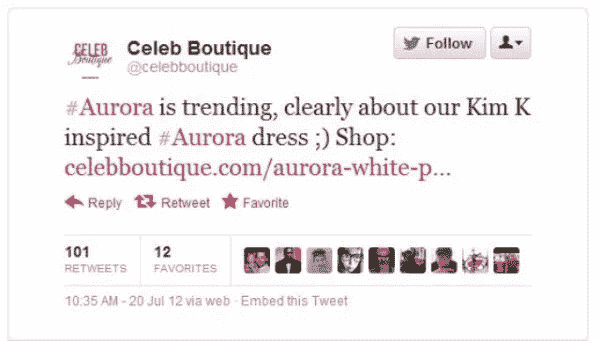
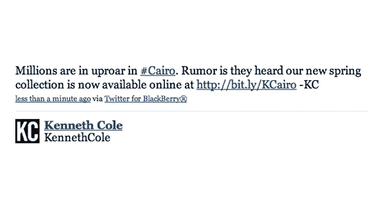
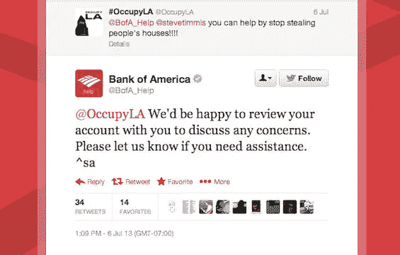
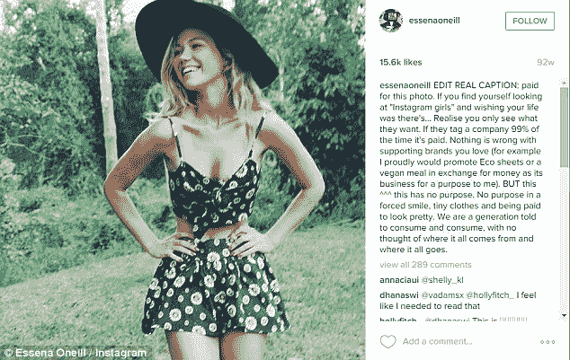
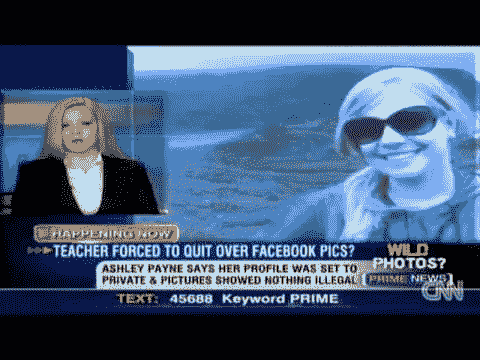
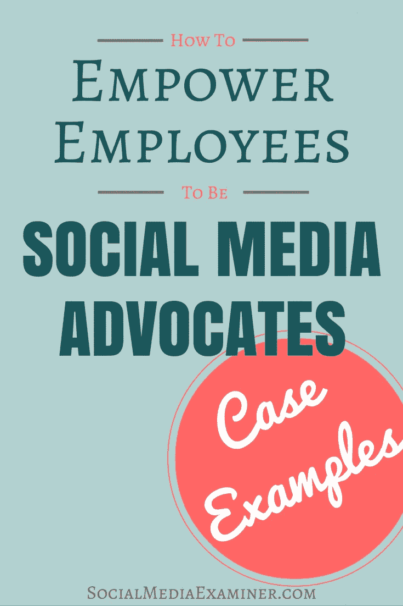

# 保持这个地方的怪异。

> 原文：<https://medium.com/hackernoon/keep-this-place-weird-5cae47d8afc6>

Tweeted after the tragic Aurora shooting…Yikes. (Courtesy of Twitter)

我记得 MySpace 和 Hi5……我甚至记得尼奥宠物、Gia，当然还有我的第一个模拟人生。我不知道我的第一个博客可能在哪里…我记得在虫洞里浪费了几个小时。我永远不会忘记离开教室直奔 AIM……哦，我坐在布朗大学的夏令营里，开始我的第一份脸书简介时的那种冲动，真是太棒了。几个月后，我在新奥尔良老家的大多数朋友才把 MySpace 迁移到脸书。我第一次体验到“了解”任何与科技相关的事情，我学会了如何利用这种新的方式。

有一种假设认为像我这样的“千禧一代”已经策划了数字生活。还有一个假设，我们是“数字原住民”。这些假设不能共存，这是矛盾的。

你不会“管理”对你来说自然的东西。我们过去是，现在仍然是，只是分享我们的存在。主要是它的亮点..但是这种分享是很自然的。与我们父母的“保全面子，继续生活”的行为截然不同。这种表达真实性和颂扬个性的努力使得数字原生代与过去截然不同。如果不是“策展”，这里会发生什么？

除了一些喜欢匿名的数字自我的巨魔，让他们可以像虚拟傻瓜一样行事……除了一些 Instagram 模特和 YouTube 明星(我认为在货币化之前，YouTube 是世界各地孩子的高度真实的个人渠道，对大多数人来说，这种名声完全是无意的)……抛开这些情况，它是什么——真的吗？

同样的人，同样的疯狂的孩子，有了新的工具:互联网。

我没有“策划”我的 AIM 对话，或者我的 Tumblr 博客上的模因。我没有仔细跟踪我的 Myspace 或脸书或 Twitter 的更新(我的意思是，你有没有看过我发的东西？).当然，今天有些人会。许多企业和一些姗姗来迟的人每时每刻都在通过 HootSuite 和 FaceTune 运行，但暗示“策展”是社交媒体通常的方式[和应该的方式](https://hackernoon.com/tagged/social-media)是你能对所谓的数字土著犯下的最大错误——原因如下:

1.  互联网是一场让我们所有人都变得高尚的畸形秀。

如果我想看漂亮、瘦、白、神秘而富有的人做出他们看不到的笑脸，我不需要一个新的应用程序——我可以很容易地转向《老友记》重播。所以不用了，你留着吧。但是如果我想——不，*需要*——看到像我一样的女性，经历像我一样的人类状况的起伏，与我产生共鸣……这就是互联网找到它的心脏的地方。

当我疯狂迷恋哈利波特，或者为我的艺术尝试寻求认可时，互联网将我与像我一样的人们的重叠世界联系起来。不太合群的人。它不是一个帮助我们满足规则的工具，这些规则是关于我们应该如何调整自己来同化——去他妈的。它打破了“融入”的概念。因为，对大多数人来说，在网上做真实的自己比什么都有趣。你可以是《我的世界》的传奇运动员，也可以是脚踏实地、勤奋好学、暗恋 YouTube 美女大师的女孩。互联网是你可以出去的地方，或者至少，在你能找到一个更宽容的地方之前，从处于你这种情况的真实的人那里找到如何处理的建议。迷因让我们以幽默的方式分享痛苦的人类经历，而不必用我们自己的语言来表达。互联网是对世界各地的人们进行某种程度的情感理解的最快方式，同时也让我们安全地敞开心扉。在线是人们可以呼吸的地方。

2.我们看穿了你的公司诡计。

让我们接受这个令人作呕的想法:数字角色应该被“策划”。这就引出了一个问题:为谁策划？钦佩和名声，也许…但钦佩真的只是一个开始，不是吗？你从“过度分享”你的生活而获得的成千上万追随者的关注，是企业无人机开始试图量化那种生活的品牌价值的信号。考虑到我们都需要在资本主义下生存，我不反对人们根据自己的条件把成名的新途径变成货币。此外，让这个虚拟世界成为你视觉审美的家园并没有错。但请记住:将可定制的产品与真实的个人表达混为一谈是一个由来已久的广告噱头，每个季度都急于完善其技巧。

我们现在为这些公司做了很多工作。他们可以在互联网上浏览基本上在出售的生活，而不是创造一个产品，然后想象一个围绕它的真实生活。这些公司利用资本将真实的生活操纵成活生生的广告，通常利用缺乏名人谈判能力、对美国联邦贸易委员会准则了解不多或没有稳定工作的年轻人。个人现在是一个品牌，站在他们从开放和亲密中吸引的观众和薪水之间，薪水取决于在不失去太多“参与”的情况下撤销一些内容。如果观众受够了赞助广告的泛滥，打开了他们不再相关的图标？公司没有问题。现实生活中最大的现金价值已经被提取，是时候进入下一个了。

即使在不上镜的人群中，在互联网上保持“专业”的压力依然存在。我们这一代人来这里从来不是为了把自己变成最不具攻击性的球场，但我们在这里，被鼓励去“策划”。我说的是什么时候“策划”不再意味着收集你最喜欢的东西和珍惜的时刻，而开始意味着…准备好了。打扮好，准备好，(表面上是拉皮条的)，准备好融入一个特定的企业意识形态，你还没见过它，也没从中赚到什么。我们的网上生活，我们的出口，应该是无菌的，以防未来的招聘经理，招生官，甚至有一天是银行，去四处打探。请记住，这是*你的* Twitter、*你的*脸书个人资料、*你的* Instagram、*你的* Tumblr、*你的* Pintrest、*你的* Reddit、*你的*(匿名)4chan……这些东西组成了你的数字家庭，以及你的个性。关心你如何持家，或者在下班后你有什么爱好，这与企业无关。同样适用于分享猫咪视频、宗教活动、醉酒夜店自拍。

我们被要求玩的游戏是一个特别可笑的游戏。我们都有愚蠢的时刻和内疚的快乐，但耻辱是分发给那些分享这些真实时刻的人，以及那些可能以负面意图看待它们的人，而不是分发给每个实际参与这些时刻的人。让我想起了一点犯罪的不公正和完全的冷漠，你可能会被看到吸食大麻。

当我们在网上把自己塑造成对公司友好的时候，我们放弃了一些宝贵的自由，并开创了危险的先例。

互联网的诞生已经比我们想象的更加民主化。它为数十亿人提供了获取信息的途径、平台和自我表达的渠道。这就是使这个地方变得美丽、凉爽和令人兴奋的原因:人们。不是品牌。我们是这个辉煌的基础设施的生命力，正因为如此，我们无产阶级可以把它作为影响和改变的工具，也可以作为娱乐和慰藉的场所。在整个人类历史中，还有什么如此有价值的东西被大众如此广泛地获取？我们被不断的广告淹没，我们每年都用更多的个人时间来换取模糊的工作时间。我们绝对有权拥有一个没有市场营销、品牌和广告的空间。

如果“权力”为所欲为，互联网注定会成为一个巨大的、众所周知的广告。你可以说已经是了。除了数据收集、市场研究和发布对我们业余行为的反馈之外，它没有任何用处。这当然不是说他们会监督自己，说“好吧，我们不需要试图抓住这个趋势，分析这些数据…这不是我们的空间，也不是我们的地方。”你知道他们不会——他们贪得无厌。如果允许的话，广告将会吞噬这种新的自由。我们不能让这种情况发生。这个新领域被怪人和极客征服了。

当企业将注意力转向模仿真实的在线互动作为营销策略时，它们在很大程度上失败了。这是好消息。它将数字世界这个巨大空间的大部分作为珍贵的避难所，而这个世界绝大多数是由拥有和投资阶层及其忠诚的附属机构营销和销售阶层经营的。

*(上图:“通过做免费劳动来赋权自己，来赋权雇主！”)*

你看，公司嫉妒了。这很可悲，但他们确实如此。他们花费了数百万美元的超级碗广告，但这些广告永远无法与一只弹钢琴的猫的病毒般的名气相提并论。他们认为人们太愚蠢，注意力不够集中，不懂得欣赏他们赐予我们的“礼物”:为了卖给我们垃圾而存在的媒体。但是他们不明白那只猫和那架钢琴之间发生了什么，那真的很酷。最好的酷——不装腔作势的酷。他们试图让 Twitter 变得有趣，却没有意识到大多数最好的 Twitter 喜剧演员都相当自嘲。他们不想自我贬低，对他们来说，贬低自己的品牌毫无意义。他们试图计算酷，这是一条以最没有灵魂的方式杀死酷的必经之路。

在互联网上起作用的正是使它成为今天这个样子的东西:人。我们是真实的，可联系的，有表现力的，不完美的。我们很混乱。网络是我们脆弱、荒谬、探索、争论和分享自我的地方，这是我们在工作中或许多当地社会无法做到的。致力于成为“网络人物”是一种艺术，正如 NOCCA 的一位才华横溢的导师曾经告诉我的那样，“艺术就是让你的心在舞台上破碎。”这些品牌，这些广告团队被点击率所束缚，使用了太多的标签，他们想要舞台和观众，但绝对不想伤了自己的心。没有混乱和不完美。他们不想有弱点。这就是为什么他们的广告无法与真人创造的东西相抗衡。

如果我们过度管理自己，在我们最自由的空间里，我们也会遭受同样的滑稽存在。带走任何太有争议的，宗教的或政治的东西。带走任何太悲伤的东西。去除复杂性。删除任何可能无法通过人力资源审查的生活碎片，你就拥有了一个没有弱点的存在的幻觉。这不是你是谁，但这正是一些查看你的数据，对你创造或花费资本的价值进行最直接分析的人希望你成为的人。当你被分类时，人工智能工具变得更加精确。我们让自己在空闲时间满足于“专业”。

我不知道在接下来的几代人里，政治、文化和人类经历会发生什么样的根本变化，但我非常清楚它们会在互联网上被孵化。所以我们要保持这个地方的怪异。欢迎并渴望见到下一批怪胎、极客、激进分子以及任何需要的人。我们不能完全摆脱垄断和私有化，但我们可以对限制我们访问的企图保持敌对态度，比如捍卫网络中立。支持报纸和勇敢的调查记者，减少他们对本土广告的依赖。我们可以记住，除了谷歌、亚马逊和脸书之外，互联网上还有其他东西，分散我们最宝贵的资源:注意力，远离它们。和所有的事情一样，我们必须为新的和大胆的人留有空间，同时支持小的和认真的人。这个地方并不完美，但它是我们的，它仍然可以改变。