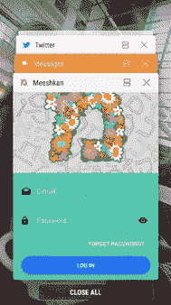

# 使用 Redux 中间件保持用户界面整洁

> 原文：<https://medium.com/hackernoon/keep-your-ui-clean-with-redux-middleware-752383016c50>

Bob 叔叔开创性的 [Clean Architecture](https://8thlight.com/blog/uncle-bob/2012/08/13/the-clean-architecture.html) 帖子激励了许多软件设计师，随着 JavaScript 允许业务逻辑代码被重用，它变得越来越重要。从来没有借口将业务逻辑分散到整个代码库中，但是现在我们甚至可以在需要的任何地方使用`npm publish core-logic`和`npm install --save core-logic`来减少*和*。

本文以 Bob 叔叔定义的**用例**为出发点:

> 这一层中的软件包含*应用特定的*业务规则。它封装并实现了系统的所有用例。这些用例编排了实体之间的数据流，并指导这些实体使用它们的*企业级*业务规则来实现用例的目标。

用例通常被描述为:

*   贴一张[我可爱的猫](http://www.findcatnames.com/wp-content/uploads/2014/09/453768-cats-cute.jpg)的图片；或者
*   获取 J.R. Bookwalter 制作的电影列表

然而，软件是混乱的，抽象是有漏洞的，如果你和我一样，你经常会发现自己在幻想失控的利维坦用例，或者你已经将逻辑编码到 UI 中并且不会很快删除的琐碎用例。

下面我想为大叔呈现的是一些唾手可得的水果——用中间件来浮动你的 Redux 应用。Redux 是一个简单的 JavaScript 状态容器，它已经成为一种模式，在 Kotlin 和 Swift T21 的库中重现。我强烈建议你使用它——将它引入你的应用程序是微不足道的，在用 redux 状态工作 10 分钟后，你会爱上它，再也不会回头。

# 激励示例—登录屏幕

作为一个激励性的例子，我将使用实际应用这种模式的 [Meeshkan](https://play.google.com/store/apps/details?id=com.meeshkan.android) 登录屏幕。顺便说一句，整个应用程序都应用了这种模式，所以如果你想知道某些事情是如何完成的，请随意下载，四处看看，并联系我们。



让我们从这个登录屏幕的简化版本开始:

```
// login.js
import React from 'react';
import { reduxForm, Field } from 'redux-form';
import { connect } from 'react-redux';
import { Button, MyTextComponent } from 'ui-lib';
import { Text, Alert } from 'react-native';
import Actions from 'react-native-router-flux';
import analytics from 'analytics-lib';
import { login } from 'kludgy-implementation';const onSuccess = () => {
  analytics.report('successfully logged in');
  Actions.main(); // this is our navigation action
}const onFailure = () => {
  analytics.report('log in error');
  Alert.alert("Sorry...", "Something went wrong");
}const submitter = ({email, password}) =>
  login(email, password, onSuccess, onFailure);const LogIn = ({handleSubmit}) => (
  <View>
    <Field component={MyTextComponent} name="email" />
    <Field component={MyTextComponent} name="password" />
    <Button onPress={handleSubmit(submitter)}>
      <Text>Log In</Text>
    </Button>
  </View>);export default connect()(reduxForm({form: 'LogIn'})(LogIn));
```

这种实现有几个问题:

*   我们的`login`函数必须冒泡到 UI 来接受成功和失败的回调。如果我们想改变登录过程中的步骤数量，或者添加除成功和失败之外的更多选项，该怎么办？重构厄运…
*   我们的分析函数也是如此，更糟糕的是，我们现在必须测试每个组件是否正确调用它。真是一团糟！
*   我们必须记住成功和失败的顺序，以及它为什么/如何重要，在整个 UI 中散布逻辑，而没有任何规范告诉我们为什么会这样。
*   当我们想改变导航、分析或提醒库的时候，我们就要对每个 UI 组件进行为期一周的重构。你好微妙的代码破损。

# 中间件拯救世界！

让我们用中间件重写上面的例子。首先，我将直接展示我们改进后的新组件:

```
// login.js
import React from 'react';
import { reduxForm, Field } from 'redux-form';
import { connect } from 'react-redux';
import { Button, MyTextComponent } from 'ui-lib';
import { Text} from 'react-native';
import { loginAction } from 'better-implementation';
import Ize, { navSuccessIze, alertIze, alertFailureIze } from 'ize';const login = Ize(
  loginAction,
  navSuccessIze('main'),
  analyticsIze(),
  alertFailureIze("Sorry...", Something went wrong")
);const LogIn = ({handleSubmit, login}) => (
  <View>
    <Field component={MyTextComponent} name="email" />
    <Field component={MyTextComponent} name="password" />
    <Button onPress={handleSubmit(login)}>
      <Text>Log In</Text>
    </Button>
  </View>);export default connect(null, {
  login
})(reduxForm({form: 'LogIn'})(LogIn));
```

一些值得庆祝的理由:

*   导航或分析等对库的显式调用不复存在！
*   在`onSuccess`和`onFailure`回调中散布逻辑已经一去不复返了，我们无法在不触发各种副作用的情况下进行单元测试！
*   这要短得多。
*   这更容易阅读！
*   这更容易测试！

好的，但是我们如何通过中间件实现呢？

## 1.通过 Ize 模式使用动作创建者

我们使用`[redux-ize](https://www.npmjs.com/package/redux-ize)`来实现 Action Creator Creator 模式。基本上，所有这些`Ize`的东西都采取了行动，为中间件添加了一堆有用的元数据。

## 2.使用像 redux saga 这样的库来处理异步调用

查看`[redux-saga](https://redux-saga.js.org/)`以了解如何处理我们的异步登录呼叫和调度成功或失败事件。举个例子:

```
import { call, put } from 'redux-saga';
import { loginSuccessAction, loginFailureAction } from 'actions';
import Ize, { navIze, alertIze } from 'ize';function* logInSideEffect({
  payload: {email, password},
  meta: {navSuccess, alertFailure}
}) {
  try {
    call(login, email, password);
    put(Ize(loginSuccessAction, navIze(navSuccess)));
  } catch(e) {
    put(Ize(loginFailureAction, alertIze(alertFailure)));
  }
}
```

注意我们如何再次使用`ize`模式将`navSuccess`和`alertFailure`信息移动到正常的`nav`和`alert`轨道。这将确保当成功或失败动作被分派时，它被中间件拾取。

## 3.创建一些中间件来处理分析、导航和警报

像星期天早上一样简单…

```
// analytics.js
import analytics from 'my-awesome-analytics-provider';export default store => next => action => {
  action.meta && action.meta.analytics && analytics(action.type);    
  next(action);
}// nav.js
import Actions from 'react-native-router-flux';export default store => next => action => {
  action.meta && action.meta.nav && Actions[action.meta.nav]();  
  next(action);
}// alert.js
import Alert from 'react-native';export default store => next => action => {
  action.meta &&
    action.meta.alert &&
    Alert.alert(...action.meta.alert); 
  next(action);
}
```

我们有更多的理由庆祝！

*   想改变你的分析提供商？没问题—两行代码。
*   想要测试您的中间件吗？没问题—在一个地方使用一个`sinon`短截线。
*   想根据应用程序的状态关闭某些导航或提醒吗？你现在可以进入商店了！
*   想测试所有这些东西的顺序吗？没问题——只需编写一个测试来验证您的 redux store 配置。

# 总而言之——Redux 不仅仅是一个状态容器

Redux 将自己标榜为“JavaScript 应用的可预测状态容器”这是真的，但是有一点你会注意到，我没有提到一个将这些动作传播到一个状态的 reducer。当然，这些动作*可以*绑定到一个状态，实际上通常都是这样，但是我想保持简单，这样你就可以看到中间件有多强大。

很容易开始使用 Redux 中间件(或任何中间件，如组合 Rx 对象转换)来处理导航、分析和警报等事情。你的应用更可预测，更少的编码工作，更容易测试，更容易阅读，最重要的是，非常干净。谁不想这样呢？谢谢鲍勃叔叔！

