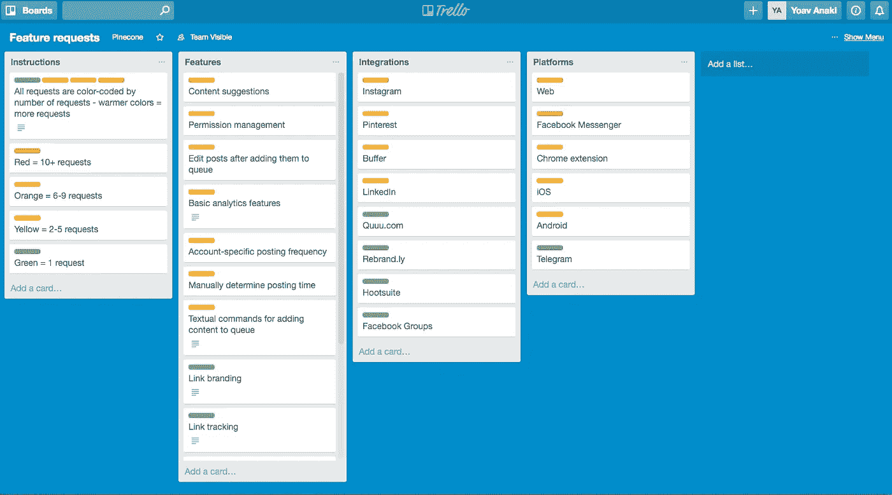
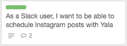

# 作为非开发人员跟踪软件开发

> 原文：<https://medium.com/hackernoon/keeping-track-of-software-development-as-a-non-developer-b6a066fbfd7d>

网络作为一个整体，特别是 [Hacker Noon](http://hackernoon.com) 为开发者提供了大量的最佳实践文章。作为观众，工程师是一群受过教育、热情的人，为他们创作内容是一个很好的方法。

然而，在[工程](https://hackernoon.com/tagged/engineering)世界的边缘，有许多非技术人员经常与工程师一起工作。如果你想随时了解你的工程师们在做什么，在一家涉及代码的公司里做产品人员、设计师或经理可能是一个挑战。

在过去的几年里，我有幸在我们的社交媒体调度初创公司 [Yala](http://yalabot.com) 和一些优秀的工程师一起工作。我想分享我们的框架(用工程师的话来说，这是一个低调的敏捷开发框架),用于保持在开发任务的顶部，并确保不太面向技术的团队成员(理解为:我)知道幕后发生了什么。

## 鸟瞰图

每当我们有了一个新功能的想法或得到一个新的功能请求，我们做的第一件事就是将它添加到我们的“功能请求”Trello 板上。Trello 是一个神奇的网络应用程序，让我们通过将数字“卡片”组织成堆栈来操作它们。它看起来是这样的:

“功能请求”板按紧急程度进行颜色编码，并按功能类型进行组织，因此很容易一眼就能确定我们的下一个功能可能是什么。

我们的主要 Trello 板被称为“Yala dev ”,它是获准加入 Yala 的*故事*的家园。

你会问，什么是故事？很棒的问题！这些都是人们使用亚拉的小故事。这是一个故事的例子—

将开发任务视为故事是很棒的，因为这是产品人员与工程师交流想法的绝佳方式——每个人都理解一个故事。如果你想了解更多关于这种方法的信息，请查看这篇文章。

回到“亚拉开发”董事会。该板包括五个堆栈:

1.  根据计划的💭
2.  接下来🚀
3.  在发展中📝
4.  准备部署✅
5.  已装运/已完成🚢

我们将卡片添加到“计划”💭“首先，它们根据需要在堆栈中前进。这些卡片是按优先级排列的。每张卡片都有清单形式的子任务，Trello 让我们在这些卡片上互相评论和标记。

这个系统是有用的，因为它让我们组织和关注特性请求，以及在开发过程中跟踪故事。

## 变脏

如果你真的想近距离接触你的代码库，最好的方法就是听听 Github 的心跳。

Github 是一个 git repository web 主机，这意味着它存储了您的整个代码库以及版本控制和协作功能。十有八九，你的工程团队已经在使用 Github 了。

这是它如何工作的一个简单易懂的版本。

每当一个工程师开始工作于一个特性或修复时，他们将创建一个*分支*，它基本上是一个包含他们的新变化的代码库的独立版本。

一个分支由许多*提交*组成，这些提交是工程师添加到该分支的代码或文件的小集合。

跟踪提交可以让你对开发人员在做什么有所了解。每个提交都有一个注释，这是一行解释提交内容的文本。然而，提交通常太技术性而不容易理解，并且太具体而不能提供对代码的良好概述。相反，尝试阅读*拉请求-* 请求其他工程师评审&分支上的评论，并将其合并到更大的代码库中。

如果你打开了 Github 通知，每一个拉取请求的评论都会进入你的邮箱。许多注释完全是技术性的，但是通读它们可以让您很好地了解拉取请求包括什么。

Github 还包括一个奇妙的 Slack 集成，它将这些通知拉入您选择的 Slack 通道。对我们来说，所有的 Github 通知都进入了我们的#dev 频道。每当我们中的一个人在 Github 评论中被@-提到时，Slack 就会发出通知通知那个人。这使得工程师邀请设计师或产品人员参与代码评审变得很容易。

A notification from Github for Slack, including some recent commits and their comments

## 沟通

如果你不能*问*你的工程师发生了什么，世界上所有的工具和设置都不会有任何帮助。作为一家远程公司，我们使用聊天进行交流，能够流利使用英语和代码的工程师是无价的。我的直觉是，良好的沟通也预示着良好的代码。

沟通显然是双向的。如果你不能清楚地表达你的想法和想法，如果它们能转化成好的代码，那你就很幸运了。交流想法的一个好方法是任务模型系统— [在这里阅读](https://blog.yalabot.com/the-essential-idea-companion-how-to-make-a-task-model-2a5367546e13)。

清晰的沟通，加上正确的工具集，让您轻松掌控软件开发工作。

Yala 是一个机器人，它让管理你的社交媒体账户变得轻而易举。她使用机器智能来确定发布帖子的最佳时间，以便您总是在满座之前进行表演。我们花了很多心思和爱来塑造她，我想这是显而易见的。Yala 绝对免费使用。点击 [*这里*](https://yalabot.com) *将她添加到 Slack，或者* [*这里*](https://madmimi.com/signups/255460/join) *注册我们的 Facebook Messenger beta。*

推荐这篇文章，让我的一年更可爱。

> [黑客中午](http://bit.ly/Hackernoon)是黑客如何开始他们的下午。我们是 AMI 家庭的一员。我们现在[接受投稿](http://bit.ly/hackernoonsubmission)并乐意[讨论广告&赞助](mailto:partners@amipublications.com)机会。
> 
> 如果你喜欢这个故事，我们推荐你阅读我们的[最新科技故事](http://bit.ly/hackernoonlatestt)和[趋势科技故事](https://hackernoon.com/trending)。直到下一次，不要把世界的现实想当然！

