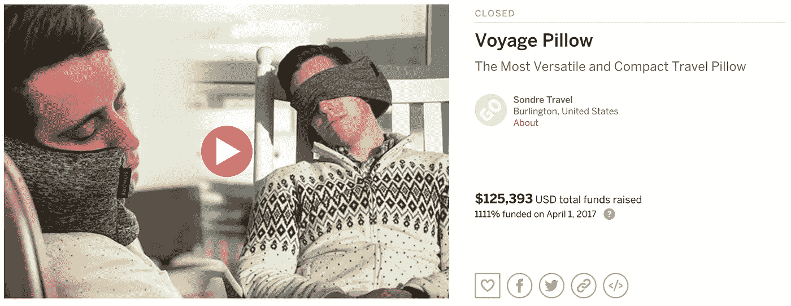
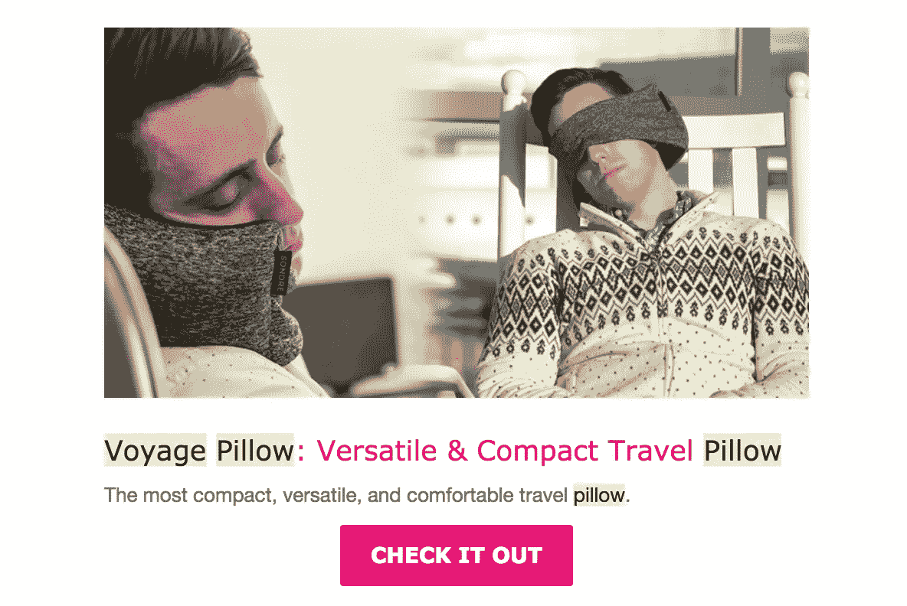
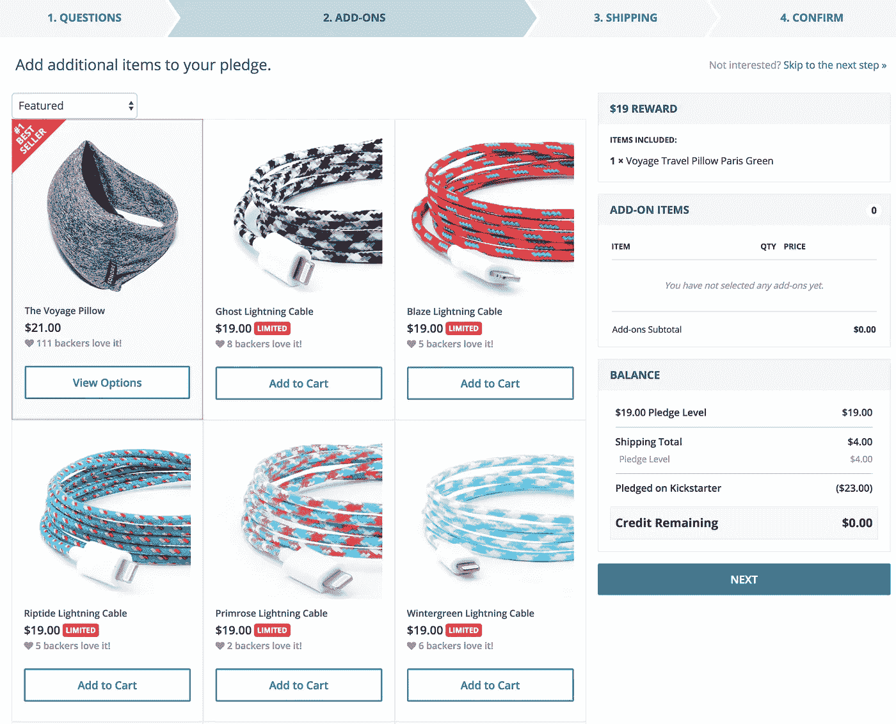
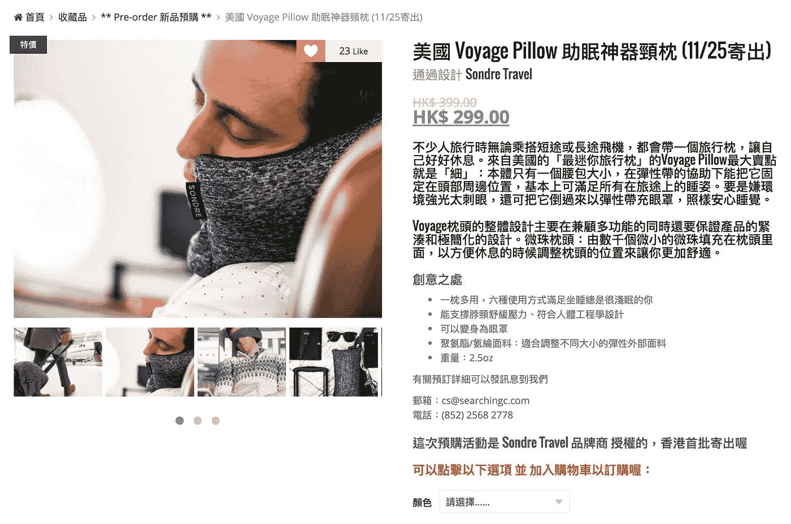
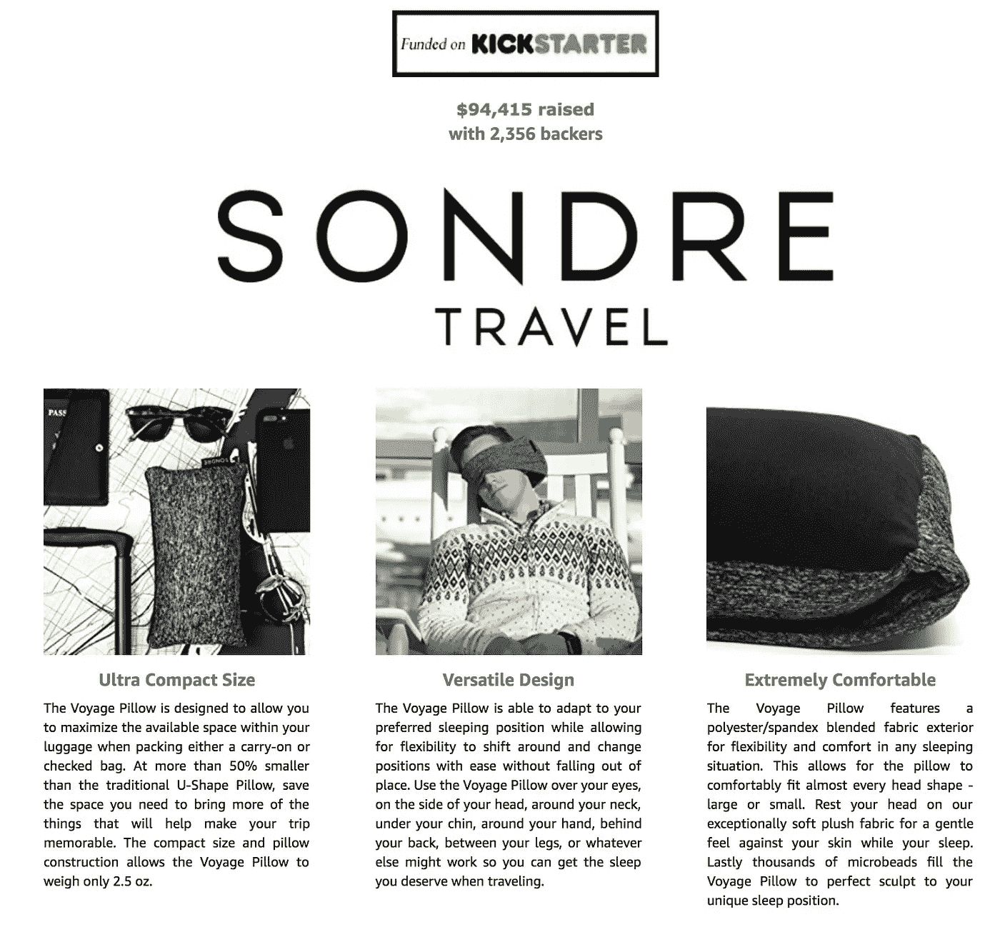
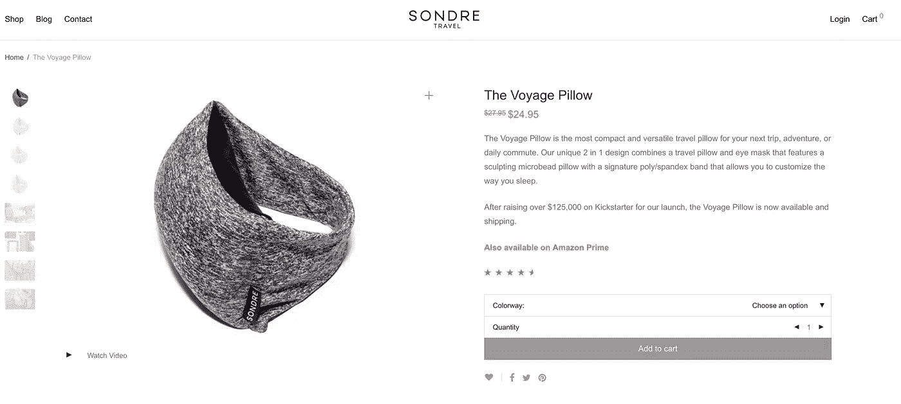
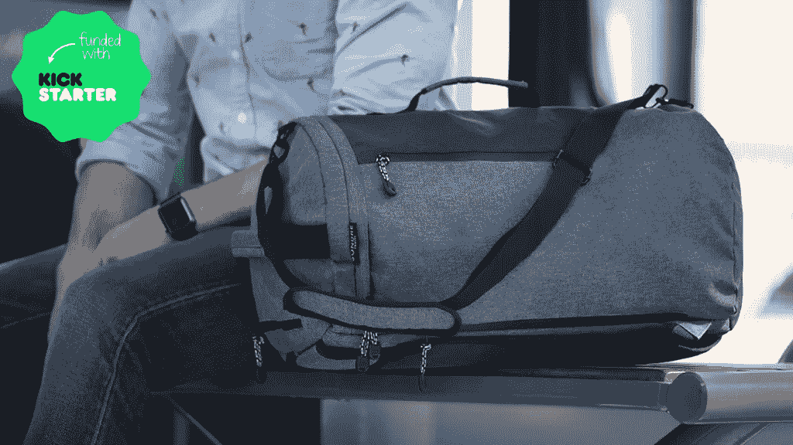

# 在活动结束后保持众筹势头的关键策略

> 原文：<https://medium.com/hackernoon/key-strategies-to-keep-your-crowdfunding-momentum-going-post-campaign-f31b8f75dc81>

今年早些时候，我为我的产品发起了第一次众筹活动，名为 [the Voyage Pillow](https://sondretravel.com/product/voyage-pillow/) 。我最初是在 [Kickstarter](https://hackernoon.com/tagged/kickstarter) 上发起的，后来搬到了 Indiegogo InDemand，从 Voyage 枕头的早期支持者那里筹集了 125，393 美元的预购款。[我们的第二次旅行包宣传活动刚刚启动！](http://kck.st/2m59C0A)

在我看来，这是一个巨大的成功，我欣喜若狂地将这个项目带到了我没有预料到的高度。然而，我不希望这个新产品和公司是一次性交易，并利用成功的运动来保持势头。这些是有助于竞选后流程的几个关键因素。

# Indiegogo InDemand

Kickstarter 活动于 3 月 31 日结束，但我知道仍然会有剩余流量进入活动页面。我需要有一个快速简单的方法来捕捉那些错过活动的人的潜在销售。

在 Kickstarter 上的活动结束前大约一周，Indiegogo in demandmarket place 团队主动联系了他们，与他们合作非常愉快。他们从 Kickstarter 页面上获取了所有内容，并在 Indiegogo 上为我重新创建了这些内容。在 Kickstarter 活动结束后的几分钟内，InDemand 活动就上线了，并通过重定向流量来增加销售额。

Indiegogo InDemand e-mail Blast for the Voyage Pillow

我不仅从 Kickstarter 活动中夺回了访问者，还让 Voyage Pillow 接触到了新的消费者群体，他们可能只是在 Indiegogo 上浏览他们的 InDemand 活动。他们的营销团队与我一起设定了目标，希望我能登上他们的每周时事通讯，从而吸引更多的眼球。

最终，我通过这个项目又筹集了 30，000 美元，并为这个品牌增加了 667 名新的支持者。

# 贝克基特

在最初的 Kickstarter 活动结束后，我有 2356 名早期支持者期待他们的新旅行枕头何时会出现在他们手中。我最不想看到的是 2356 名愤怒的顾客，如果事情不像承诺的那样发展，他们可以联合起来。

Backerkit 是管理每一个支持者的绝对救世主；他们的奖励等级，捕捉他们的地址，打印运输标签，以及这之间的一切。您能够创建的支持者调查允许您让每个支持者选择他们的奖励选项，填写他们的地址，以及最重要的购买附件！你已经赢得了早期支持者的信任，所以他们可能更倾向于再次购买，而 BackerKit 允许这种情况无缝地、有机地发生。

BackerKit Survey Add-On Page

我能够追加销售额外的活动奖励以及我的另一个品牌 [Eastern Collective](http://easterncollective.com/shop/) 的产品，作为他们订单的赠品。

我简直无法想象在没有 BackerKit 的情况下管理竞选的后勤工作。

**提示:**在你计划发送 BackerKit 调查前的 1-2 周内做好它——它有许多信息要填写和管理，因此对你的客户来说是无缝的。但是不要担心，BackerKit 团队会对每个调查进行彻底的检查，以帮助您改进它们！

# 国际市场

虽然我们的早期支持者有相当一部分来自美国，但该项目在亚洲地区非常受欢迎。有许多国际众筹类型的网站向世界不同地区介绍新产品。

我与亚洲的两个网站合作，分别是 [CitieSocial](https://www.citiesocial.com/) 和 [SeachingC](http://searchingc.com/) 。你会在这些网站上找到很多众筹和时尚的产品- [以及一些你可能期待的随机物品](http://searchingc.com/collections/%E5%AE%B3%E7%BE%9E%E6%B9%AF%E5%8C%99-%E9%BB%83/)。他们能够获取你的内容并为他们的市场进行翻译。这可以帮助你的产品在国际市场上以他们的自然语言和声音呈现时产生更多的共鸣。

The Voyage Pillow on SeachingC

此外，他们会将单个订单发送给客户，因此您不必管理多个国际单个订单。仅此一点就可以帮助节省大笔金钱和宝贵的时间。

# 亚马逊发射台

众所周知，亚马逊的强大力量。曾经有一段时间，你可以试图与之抗争，但亚马逊是在线消费者的天下。[亚马逊 Launchpad](https://www.amazon.com/Amazon-Launchpad/b?node=12034488011&nocache=1510238833146) 是亚马逊策划的市场，拥有成功的众筹、风投支持和当前流行的产品。

该计划为您提供了许多亚马逊上的普通卖家可能无法获得的额外好处。首先，您可以联系 Lauchpad 团队来回答问题，帮助您进行设置。在那里，你可以在 LaunchPad marketplace 上被列为一个很酷的新产品，更容易被发现。此外，您可以提前访问产品页面上的 A+增强内容。这是文件夹下的附加内容，有助于讲述您的产品故事，以及您众筹成功的信息。

Amazon LauchPad A+ Enhanced Content

你还可以参加网上研讨会，了解如何改进你的刊登物品，为假日销售做准备，等等。与其他平台类似，亚马逊是基于许多属性的算法反馈，所以你越知道如何影响你的排名，你的销售就会越好。

**警告:**准备好亚马逊上的假货，抢在他们前面！中国卖家会从你的众筹页面上抓取你的内容，出售你产品的山寨版。留意他们，并尽快和经常报告他们。如果你没有一个完整的产品名称和发明的注册、批准和上市的商标和专利，亚马逊有时很难去除假货。但是要坚持不懈，举报侵权行为！

# 直接网站

最后一个关键策略应该是最明显的，建立你的[直接网站接受订单](https://sondretravel.com/product/voyage-pillow/)。你应该在你的 Kickstarter 活动中使用令人惊叹的内容——在你的网站上制作一个同样引人注目的产品页面来推动额外的销售。

当你有公关机会或通过社交媒体帖子时，这应该是人们到达的目的地。直接销售给消费者将总是导致最高的利润率，因为你不会依赖于中间商采取削减。

A Snippet of the Voyage Pillow product page

此外，当消费者登陆您的页面时，您可以使用重定向像素通过互联网再次联系他们。在漏斗的不同点测试不同的信息，以进行转换。

# 遇见旅行包

我又带着我的最新产品——[旅行包](http://kck.st/2m59C0A)回来了！我想设计一个最小但功能多样的旅行包，适合你的日常通勤，周末探险，完美的随身携带，以及任何介于两者之间的东西。在过去的 5 个月里，我每天都在使用不同版本的旅行包，我非常喜欢最终的产品。

Introducing the Voyage Bag

[今天就在 Kickstarter 上查看旅行包吧！](http://kck.st/2m59C0A)