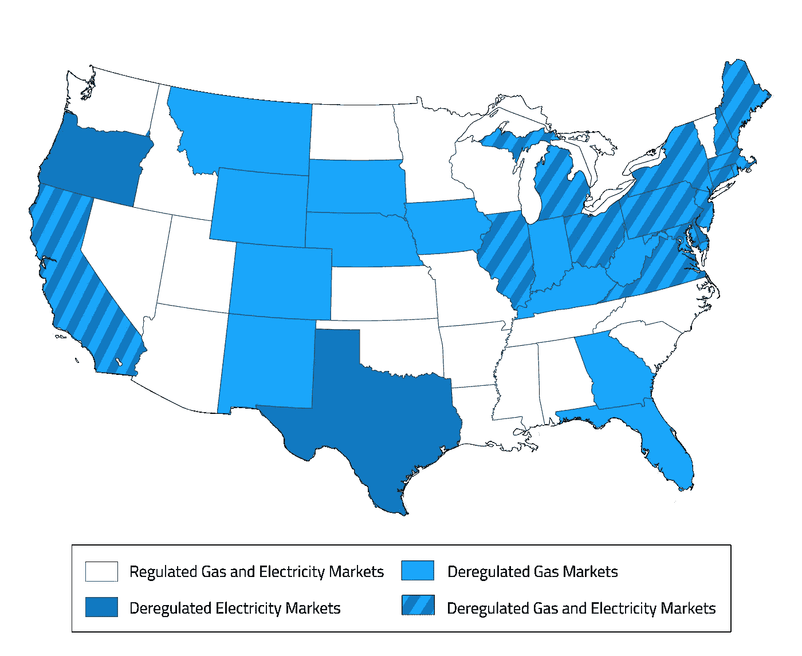

# 昨晚纽约以太坊聚会的要点

> 原文：<https://medium.com/hackernoon/key-takeaways-from-last-nights-nyc-ethereum-meetup-824613fc6f20>

Image by [Drew Graham](https://unsplash.com/@dizzyd718) via Unsplash

昨晚，我有幸参加了纽约以太坊聚会，并聆听了大部分演讲者的发言。

我遇到了一些很棒的人。我做了一些笔记，并决定这是一个好机会[记录来自这个充满活力和不断发展的社区的一些想法。](https://hackernoon.com/tagged/document)

*对于那些对实际演讲感兴趣的人，我推荐你看看这里的视频:*

我的想法来自我的笔记，我对[区块链](https://hackernoon.com/tagged/blockchain)的沉思，以及我对[网格+](https://gridplus.io/#) 的思考。

# 产品和团队

昨晚的演讲是团队的几个成员在[网格+](https://gridplus.io/) 做的。Grid+是一个非常酷的倡议，它将零售能源消耗过程去中心化和去垄断化。

谈话由马克·达戈斯蒂诺主持，伊戈尔·利利奇偶尔会发表评论。我在纽约 Nodejs 聚会上认出了 [Matt Walters](https://medium.com/u/79e3e76c6223?source=post_page-----824613fc6f20--------------------------------) 。知道这一点，我们肯定是在一个好公司。

Grid+的目标是以批发价出售零售能源，可能会有 x%的加价。相比之下，零售消费者目前从现有的、根深蒂固的公用事业零售商那里忍受 100%以上的加价。

他们的主要产品将是一种物理的**能量剂。**基本上，是一种物理设备，允许客户设置他们的支付和能源偏好。它将是智能的，并最终与家中的其他设备进行交互。在早期阶段，它只是确保能源法案得到支付。

第一步是降低消费者的费用，给定一个区块链强制执行和管理的计费机制。第二步包括创新，例如:通过允许消费者储存能量并将其回馈给电网进行补偿，从而将消费者转化为专业消费者。第三步包括通过集成和人工智能使零售能源流程更加智能的选项(稍后将详细介绍)。

# 市场

这个故事是根深蒂固、过度官僚、效率低下的市场参与者收取高昂租金，同时扮演低价值中间人角色的经典案例。能源公司目前扮演着这一角色。在全国范围内，它们的范围很广，但即使在最放松管制的市场，它们也是低效和过时的。

Grid+选择了德克萨斯州作为他们的发布市场。德州在解除电力市场管制方面处于独特的地位。此外，该州的西半部是太阳能金矿。

Via electricchoice.com

鉴于纽约队，纽约似乎是一个显而易见的选择。然而，很难对付根深蒂固的玩家(ConEd much？)这种状态下。德州在太阳能方面有着独特的机会，同时也是能源供应商竞争激烈的领域。

我对这个行业有一些经验，因为几年前我和维德·L3C 一起工作过。Grid+团队最初在更有利于创新和竞争的市场推出是明智的。

此外，他们对[分时定价](http://www.energy-exchange.net/time-of-use-pricing/)的支持长期以来被认为是能源领域的一项有益创新。这不仅能更好地帮助供应和可再生能源的激励。它迫使消费者努力应对高峰用电的更高成本，并做出相应的调整。

# 一些关键要点

1.  **在区块链上做最少的计算、交易和管理。我发现这是一件相当敏锐的事情。你在区块链上做的每一项计算都要耗费汽油。他们计划在继续连锁之前延长时间。最好的类比是一个 ***栏的标签*** *，你在一长串交易的末尾清除它。(参见第 6 点)。***
2.  **能源消费者预先付费，就像一个定金，负责任的消费者不再补贴不付费的消费者。** *显然，如今，不付费补贴是该行业的一个大问题。*
3.  **应不惜一切代价保护私钥和加密货币。物理设备将主动管理数字和物理(盗窃)安全威胁。**
4.  Grid+最终将能够发行自己的硬币(工作名称:BOLT ),该硬币由零售能源市场的实际价值支持。 *具体来说，这解决了长期以来对加密货币缺乏“正常”商品或货币市场支持的怀疑。*
5.  **该产品将为那些希望储存可再生能源并将其出售给其他消费者的人提供巨大的激励。**
6.  **该团队未来计划利用像**[**Raiden**](http://raiden.network/)**这样的离线状态网络的力量来降低交易成本和提高效率。**
7.  **德克萨斯州拥有良好的现有营销基础设施，要求公司公布千瓦/小时价格以吸引新客户。Grid+在利用这一点上处于非常有利的位置，因为他们希望大幅度降低每小时的价格。**
8.  **最终，代理设备将能够与其他设备配对，并允许消费者“选择加入”智能能源使用。** *使用的示例是让代理查看您手机上的日历并确定您何时休假。然后，它会利用这段时间与其他智能家居设备(比如 Nest)进行交互，并最大限度地减少能源消耗。*

# 结论

我真诚地享受我的夜晚。我觉得我目睹了几个才华横溢的人非常清楚他们技术的潜力。他们同时意识到高度监管的公用事业市场带来的风险。他们不是盲人，他们用知识武装自己来完成工作。

虽然我是一个担心似乎围绕着区块链所有事情的歇斯底里的人，但我受到那些愿意以激进的专注和奉献精神解决一个由来已久的问题的团队的鼓励。我想起了 2000 年科技繁荣时期为数不多的著名幸存者。我讨厌参与预测游戏，但我认为 Grid+有 51%以上的机会在最近的这波浪潮中产生影响。祝他们好运，感谢您的反馈。