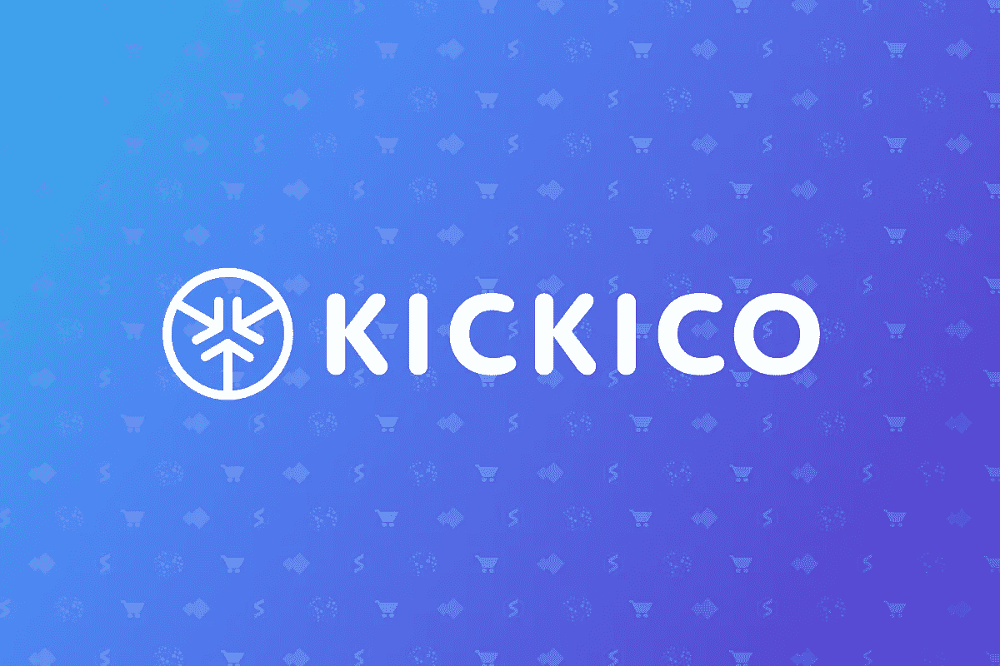
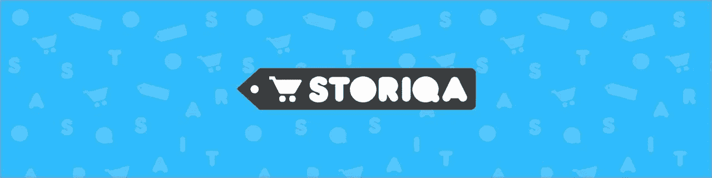
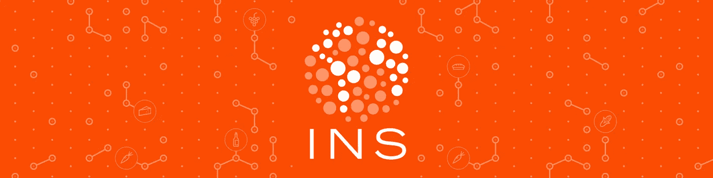
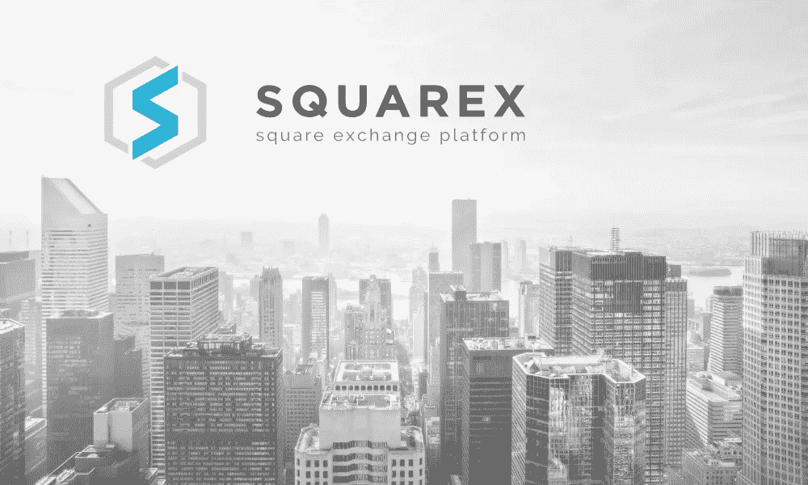

# KICKICO 在船上欢迎 3 大运动:INS，STORIQA，SquarEx

> 原文：<https://medium.com/hackernoon/kickico-welcomes-on-board-3-big-campaigns-ins-storiqa-squarex-4871e1eae8a0>

在为期两周的 ICO 活动中，我们筹集了超过 84，000 ETH 的资金，现已跻身俄罗斯 ICO 前三名，现在我们向前迈进了七步——10 月份已经有三场大型 ICO 活动准备在 CryptoSpace 举行。战役将会在登陆和 KICKICO 上同时发起，在最后一种情况下，我们的支持者有特权。在 KICKICO 平台上购买其中一个项目的代币，支持者将获得 2 种加密货币——活动代币和从总付款中计算的 8%的踢代币。

我们的团队迈出了筹款平台所没有的重要一步——我们的团队亲自会见了团队和项目的创建者，我们仔细检查了项目本身，现在我们可以问心无愧地宣称——团队和作者是真实的和“热情的”(诚实、开放和透明)—所有这些都描述了 KICKICO 的原则和有利于社区的东西。他们中的大多数人在他们的项目领域有多年的线下经验，现在他们正在努力成为他们行业的区块链先锋。

**斯托里卡**

KICKONOMY 的参与者，第一个“炙手可热”的明星是斯托里卡。它是由流行的 BoomStarter 平台的联合创始人为您带来的一个新项目。在区块链，他们远不是陌生人，他们知道这个市场如何运作，毫无疑问，他们与他们的新手一起执行所有的计划。STORIQA 旨在创建各种形式的电子商务商店，客户可以使用加密货币，包括他们自己的 STQ 令牌，来支付所有商品和服务。STORIQA 的目标是提供一个点对点网络，让消费者能够与全球各地的生产商建立联系。这意味着用 STQ 代币，你可以从世界任何地方买到数百万件真正的商品。而且，既然是点对点，就好像你站在卖家本人面前一样，没有中间商，没有额外费用！STORIQA 将电子商务带到了一个全新的水平。除了作为 KICKONOMY 的一部分，他们将接受踢代币，提供特别优惠，给踢持有者打折。2017 年 10 月 12 日有一场*24 小时的预 ICO，所以准备好你的以太坊吧！然后，常规 ICO 将从 10 月 25 日开始，运行到 10 月 31 日完成。*

*在 KICKICO 平台上的活动页面上阅读更多信息:*[https://www.kickico.com/ru/campaigns/31811/storiqa](https://www.kickico.com/ru/campaigns/31811/storiqa)

电报(英文):https://t.me/storiqa_en

https://www.facebook.com/storiqa

**INS**

啊哦！杂货零售商的恶业！扰乱杂货业的明星 INS 正在崛起。由在食品杂货行业拥有 50 多年集体经验的团队建立，INS 正在创建一个分散的生态系统，使消费者能够绕过零售商直接从制造商那里购买食品杂货，从而节省高达 30%的日常购物费用。

INS 鼓励制造商直接向消费者推广和销售他们的产品，并要求他们提供宝贵的反馈，同时利用分散的区块链驱动的消费者与制造商的互动，以更低的价格提供更加个性化和值得信赖的杂货店购物体验。

INS 得到了大力支持，并与世界上一些最大的杂货制造商签署了协议。INS 团队制定了一份路线图，涵盖了从开发强大且可扩展的软件以促进订单履行流程到销售和营销活动的方方面面，以吸引广大消费者和各种规模的制造商(从当地农民到大型跨国食品制造商)加入 INS 生态系统。

INS 令牌将构成平台内的交换手段，与法定货币和传统加密货币同等重要，并使其用户有权享受独家折扣、促销和奖金！为 10 月 16 日即将到来的 INS pre-ICO 做好准备，而 ICO 则在 11 月 20 日准备就绪。

*在 KICKICO 平台上的活动页面上阅读更多信息:*【https://www.kickico.com/ru/campaigns/35130/ins-ecosystem 

电报(英文):【https://t.me/ins_ecosystem 

https://www.facebook.com/ins.ecosystem:[脸书](https://www.facebook.com/ins.ecosystem)

**SquarEx**

KICKONOMY 的又一个参与者——“热门”star SquarEx。SquarEx 是第一个基于区块链技术的面向房地产开发商和投资者的全周期生态系统。它使用智能合同，涵盖建设过程的每个阶段——从开发商的文件到租赁、抵押和竣工。SquarEx 技术解决方案允许使用加密货币让每个人都成为财产所有者。此外，没有设定最低投资额、官僚作风或欺诈风险，投资者能够以法定货币获得利润。SQUAREX 的目标是在代币销售期间收集 20 万个 ETH。代币销售日期已经公布:preICO 从 11 月 18 日开始，12 月 1 日结束。ICO 计划于 12 月 10 日开始，将持续到 1 月 10 日。

*在 KICKICO 平台的活动页面上阅读更多信息:*

[https://www . kickico . com/ru/campaigns/34982/squarex-transformation-of-crypto-currency-to-real-square-meters](https://www.kickico.com/ru/campaigns/34982/squarex-transformation-of-cryptocurrency-into-real-square-meters)

电报(英语):【https://telegram.me/Squarex 

https://www.facebook.com/squarex.io/[脸书](https://www.facebook.com/squarex.io/)

KICKICO 团队非常自豪地将这些明亮耀眼的明星带到其密码板上，并敦促社区确保每个活动都是“热门的”(诚实、开放和透明)。加入密码空间委员会，在最近的将来挑选你的幸运星。

*在 KICKICO 新闻频道*追踪这些活动的新闻:[https://t.me/kickico_news](https://t.me/kickico_news)

加入我们的社区，在我们的电报聊天中自由提问:[https://t.me/kickico](https://t.me/kickico)

在推特上关注我们:[https://twitter.com/KICKICOplatform](https://twitter.com/KICKICOplatform)

阅读我们关于 https://www.facebook.com/kickicoplatform 脸书的新闻