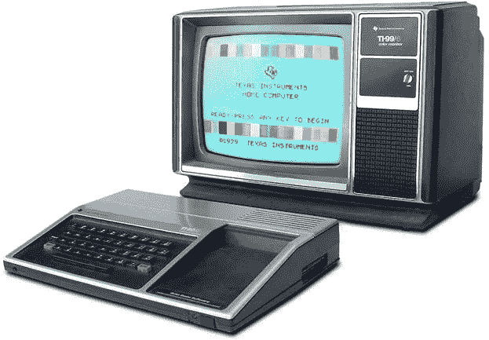
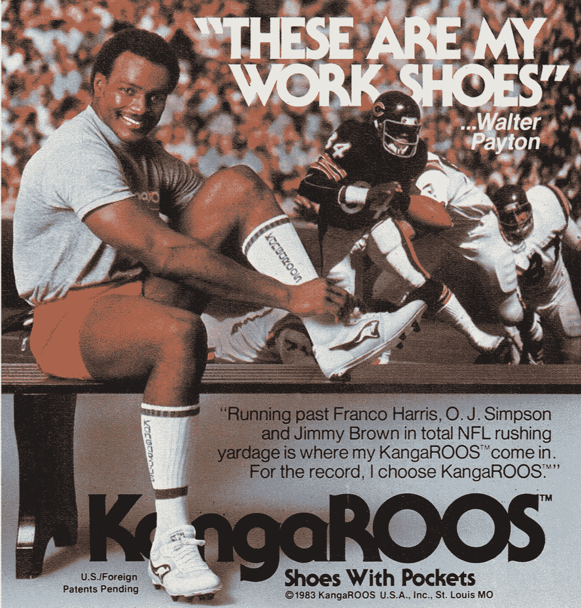
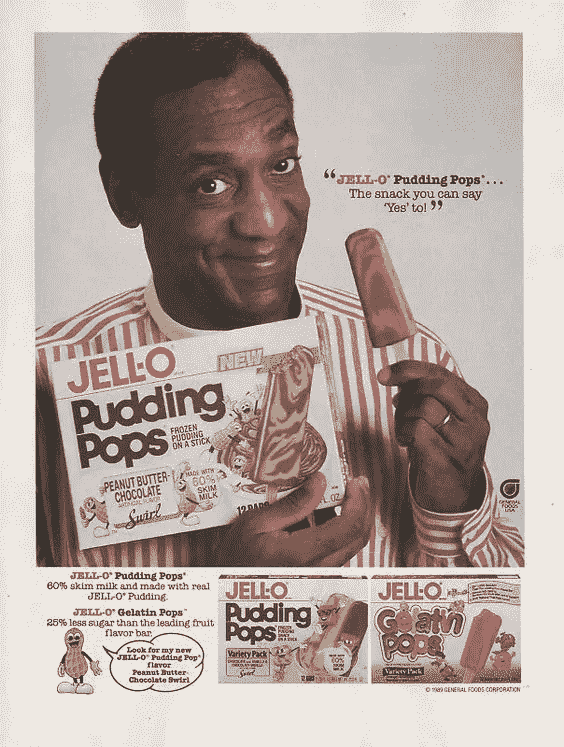
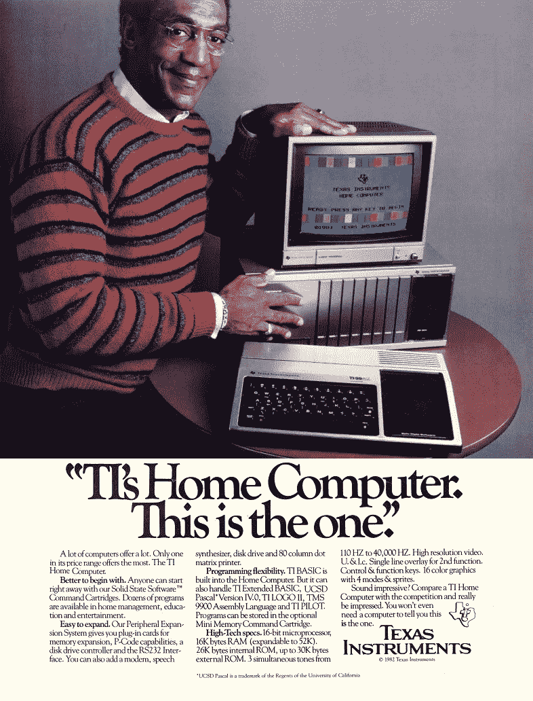

# 踢我自己…

> 原文：<https://medium.com/hackernoon/kickin-myself-7b1b6d5da014>

Texas Instruments, TI-99 [circa. ‘81-’82]

我记得就像是昨天一样。我大概 7、8 岁的时候，有了我的第一台个人电脑。

德州仪器的 TI-99。我爸爸让他的一个朋友过来布置的。谁会想到一台德州仪器公司的个人电脑会被我和我哥哥使用。就在我们的卧室里有一个电子网关，它可以从根本上改变我们的轨迹。

我当时不明白的是，现在明白了:a)我父亲的朋友是 80 年代早期至中期计算机领域的一名非裔美国人，b)我是一名年轻的非裔美国男孩，拥有一台个人电脑。

Walter Payton KangaROOS advertisement

我不知道更好，但我踢我自己想想。我记得玩过不同的 basic 程序，但它永远不会粘在一起。和朋友一起踢足球的吸引力更大。

从小我就想成为一名 NFL 球员。比如《甜蜜蜜》。华特·培顿。你没有意识到图像影响你幼小心灵的力量。例如，是华特·培顿穿着他标志性的袋鼠的形象驱使我想加入 NFL。(不知道他们还做不做。)

那是我的梦想。不是去当电脑工程师。

事实上，我想我当时并不知道有黑人从事计算机工作。那不是我看到的图像和现实，甚至不是新存在的。后知后觉绝对是 20/20。有趣的是，我记得看到的比尔·科斯比的主要照片是他在我父母家附近的 [EBONY](https://en.wikipedia.org/wiki/Ebony_(magazine)) 或 [JET](https://en.wikipedia.org/wiki/Jet_(magazine)) 杂志上的著名布丁流行广告。

Bill Cosby JELL-O Pudding

那时，比尔·科斯比正处于《考斯比秀》成功的顶峰。他不会做错事。在我的一生中，我也有过布丁泡，但我不记得曾经见过的真实图像是这个。

Bill Cosby Texas Instruments advertisement

我甚至不记得在 EBONY 或 JET 杂志上看到过这个。可能是在个人电脑行业杂志上。我父母永远不会买的杂志。

谁知道我会成为下一个比尔·盖茨。

**看看我们最新一期的 012 时事通讯，** [**JFK，同性恋商业训练营&毫无疑问。**](http://us12.campaign-archive2.com/?u=0bacaf8104febb2c183e634e5&id=45690c9af3)

*订阅 knw。迅* [*此处*](http://www.theknw.net/index.html) *或者你可以发短信****knw****到 38470。*

> [黑客中午](http://bit.ly/Hackernoon)是黑客如何开始他们的下午。我们是 [@AMI](http://bit.ly/atAMIatAMI) 家庭的一员。我们现在[接受投稿](http://bit.ly/hackernoonsubmission)，并乐意[讨论广告&赞助](mailto:partners@amipublications.com)机会。
> 
> 如果你喜欢这个故事，我们推荐你阅读我们的[最新科技故事](http://bit.ly/hackernoonlatestt)和[趋势科技故事](https://hackernoon.com/trending)。直到下一次，不要把世界的现实想当然！

