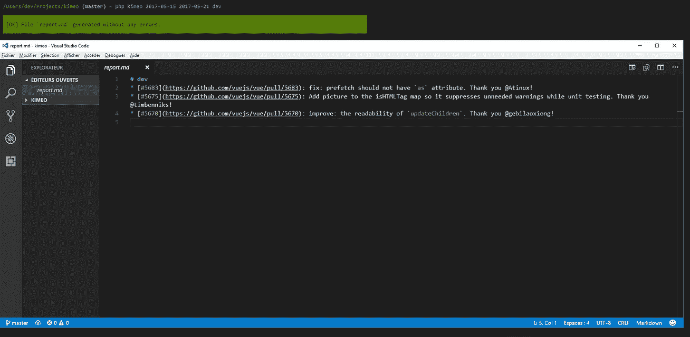
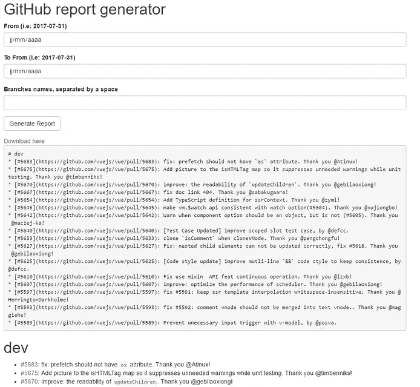

# 失踪的 Github 发布记者 Kimeo！

> 原文：<https://medium.com/hackernoon/kimeo-the-missing-github-release-reporter-28639bc78521>

每个 GitHub 维护人员都知道推出一个新版本的任务有多乏味:

*   我们可以用关于新版本的一些信息来推送新的提交；
*   我们创建并推送标签；
*   我们用一个贡献列表来完成发布描述；
*   我们试图用这个新版本向全世界传播，例如使用 [TweetHub](https://hackernoon.com/tweethub-the-github-release-notifier-on-twitter-10fdc37819a) 在 Twitter 上宣布；

如果能自动化第一步、第二步、第四步，我没有找到任何工具可以帮助 GitHub 维护人员完成他们的发布描述(也希望 GitHub 能提供点什么，有朝一日)。

来了 [Kimeo](https://github.com/loveOSS/kimeo) 免费啤酒和演讲！

# Kimeo 是什么？

Kimeo 是一个 CLI 应用程序(但也是一个极简的 web 客户端),能够生成一个报告，报告在一段时间间隔内对 GitHub 项目所做的所有贡献。这在以下情况下很有用:

*   你想做一个社区报告，比如说像 [PrestaShop](http://build.prestashop.com/news/coreweekly-week-19-2017/) 或者 [Symfony](http://symfony.com/blog/a-week-of-symfony-542-15-21-may-2017) 项目这样的周报；
*   你想要一个对你的用户有用的发布体(描述)**，突出所有的变更；**
*   **你想要关于你的贡献者的人类可读数据；**

# **它是如何工作的？**

**我希望每个人都可以使用这个工具，甚至是不懂 PHP 的人。**

**要生成报告，您需要知道 GitHub 项目名称和所有者。例如，如果你想为 vuejs 框架做一个报告，当项目的名字是“vue”时，所有者是“vuejs”。**

**然后，会有很多对 GitHub API 的请求，这就是为什么这个工具需要你向 GitHub 认证。我们需要任何 GitHub 帐户的凭证，因为在认证请求的情况下，API [速率限制](https://developer.github.com/v3/#rate-limiting)会增加。**

**最后，我们需要一个日期间隔。**

## **设置 Kimeo 实例**

**您唯一需要做的就是创建并完成一个名为`.env`的文件:您可以复制/粘贴提供的分布式`.env.dist`文件。**

## **等等，核心成员是什么？**

**你可能想要一个不同的行为来区分你的外部(和喜爱的)贡献者和团队成员。**

**例如，这是您可以通过上述配置从 [Vuejs 报告](https://github.com/vuejs/vue)中获得的信息:**

**我们感谢外部贡献者，但不感谢核心成员。事实上，这个特性是可选的，你可以让`CORE_MEMBERS`参数为空。**

# **看起来怎么样？**

**这很简单，但这里是控制台应用程序和 web 客户端的屏幕截图:**

********

**如果你想试试，也可以试试 Vuejs 框架的[演示项目](https://vuejs-reporter.herokuapp.com/index.php)。**

# **太好了，我要投稿！**

**请不要。说真的，我没有太多的时间花在这种婴儿项目上，我鼓励你像我一样叉它并从中获得乐趣:)**

****大家编码快乐！****

**PS:如果你有什么要分享的，可以在这里随意做，在 GitHub 或者 Twitter 上；)**

************

> **[黑客中午](http://bit.ly/Hackernoon)是黑客们下午的开始。我们是 [@AMI](http://bit.ly/atAMIatAMI) 家庭的一员。我们现在[接受投稿](http://bit.ly/hackernoonsubmission)并乐意[讨论广告&赞助](mailto:partners@amipublications.com)机会。**
> 
> **如果你喜欢这个故事，我们推荐你阅读我们的[最新科技故事](http://bit.ly/hackernoonlatestt)和[趋势科技故事](https://hackernoon.com/trending)。直到下一次，不要把世界的现实想当然！**

****