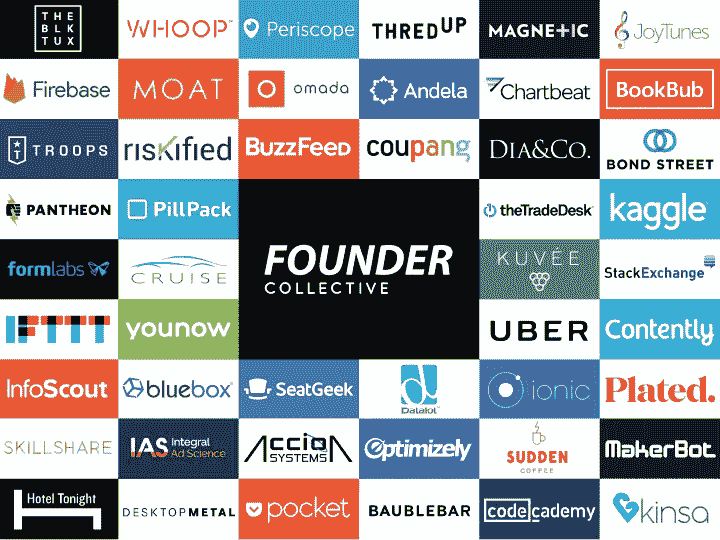

# 志趣相投——我们对方正集体的投资

> 原文：<https://medium.com/hackernoon/kindred-spirits-our-investment-in-founder-collective-ccfcc4d8ad2e>

Foundry Group 最出名的是我们对[初创公司](https://hackernoon.com/tagged/startups)的[投资](https://hackernoon.com/tagged/investments)，但我们目前投资于其他风险基金的工具 Foundry Group Next 是一个我们认为很好的开始，我想通过谈论我们对方正集体管理的基金的新投资来分享它的最新情况。

我以前写过关于[为什么我们接下来](http://feld.com/archives/2015/12/foundry-group-next.html)要创建铸造集团。几十年来，我们一直以有限合伙人的身份投资于其他基金经理的基金，并发现这种活动在情感上是有益的。当我们决定扩大并正式开展这项活动时，这给了我们一个与 Lindel Eakman 更密切合作的机会，他是我们第一只基金的最大投资者，他在 UTIMCO 任职。Lindel 作为合伙人加入 Foundry Group，领导 Foundry Group 的基金投资活动。

我们已经对[基金](http://foundrygroup.com/portfolio/)进行了十几次投资，包括联合广场风险投资公司、True Ventures 和 Forerunner Ventures 提供的基金。我们最近的一项投资是由方正集团(Founder Collective)提供的，这是一家成立 8 年、在波士顿和旧金山都有办公室的基金管理公司，是我们投资其他基金管理公司提供的基金时寻找的一个很好的例子。

从人开始。我们不会投资经理人，除非我们能想象和他们一起工作几十年。这些年来，我们有机会与方正集体的合伙人——大卫·弗兰科尔、埃里克·佩利和米卡·罗森布鲁姆——在几家公司共事。我们也知道他们投资组合中的许多企业家。从这些创始人身上，我们意识到 FC 非常重视他们的使命“成为种子期创始人最一致的基金”。

我们不是一家世代相传的公司，但投资其他风险投资基金让我们受益于与挑战和增强我们思维的经理们一起工作，同时与其他投资者分享我们学到的经验。我们希望与那些为投资带来专注和互补视角的人合作，并对创始人“专注于阶段和行业不可知”的集体口号感兴趣

这意味着 FC 回避趋势，无情地询问企业家他们的产品如何实现特定的用例及市场机会。这种方法得到了回报，帮助团队在当前的炒作周期之外识别出了热点板块。如果你看一下创始人集体投资组合，你会看到他们在第一轮投资中投资的许多知名公司。一般来说，这些投资在首次融资时很少具有竞争力。

“创始人友好”是一个被过度使用的术语，但将它作为一个概念进行营销和每天都实践它是有很大区别的。FC 的团队在结构上围绕创始人来设计他们的公司。他们是一种罕见的风险基金，在投资期限内不行使按比例分配的权利，这意味着他们与公司创始人一起稀释，他们认为这更好地将他们作为种子投资者的利益与企业家联系起来。

在基金积极配置资本而不考虑创始人不利因素的时候，FC 积极宣传高效创业的价值，帮助创始人最大化他们的成果和选择。不仅过度资本化的负面影响对创始人来说是有问题的，而且 [FC 还通过研究过去五年科技公司 IPO 的数据，研究了上行场景中的过度资本化。这些发现令人惊讶，因为一家公司筹集的资金数额与其在公开市场上的成功并不呈正相关。事实上，随着时间的推移，融资较少的公司表现得比融资最多的公司更好。不用说，让投资者保持这种平衡对创始人来说非常珍贵。](https://techcrunch.com/2016/10/15/overdosing-on-vc-lessons-from-71-ipos/)

有独特的视角是一回事；用它产生回报是另一回事。作为一名有限合伙人，我有幸成为许多基金的投资者，包括一些特殊的基金。在深入研究勤奋之前，我们有一种感觉，方正集体基于他们的[投资组合](http://www.foundercollective.com/collective.html)有着强劲的表现。当我们看到他们的财务记录时，我们意识到这场演出是多么特别。

我们知道许多公司通过在后期阶段和更高的估值买入公司股票来建立具有伟大标志的投资组合。FC 的投资组合完全由种子估值的种子阶段投资组成。

这些不仅仅是账面收益——它们已经向投资者返还了大量现金。方正集体的第一只基金有潜力载入风投史册。他们的第二只基金在同一发展阶段领先于第一只基金。

不用说，我们有很多理由希望成为他们第三支基金的一部分。唯一的问题是他们没有任何空间。我们发现，他们只是从现有的基金 II 投资者那里获得了超额认购——这还不包括任何新的有限合伙人。但他们没有利用这一需求。相反，他们坚持自己的原则，将自己的基金规模与之前的基金保持一致。

我们喜欢看到这种策略纪律，因为我们相信这是优秀基金经理的标志。当 Union Square Ventures 的 2004 年基金火起来的时候，弗雷德和布拉德以同样的规模筹集了他们的下一只基金。这也是我们在铸造集团的做法。

在 Founder Collective 的案例中，合伙人通过增加他们对基金的个人财务承诺，有效地减少了他们对外部资本的投资。这项投资产生了额外的证据，表明他们对自己的战略充满信心，同时与有限合伙人更加一致。

作为一名全科医生，我赞成这种做法，并接受了作为一名 LP，我们必须乞求和恳求才能进入基金。尽管如此，由于我们长期以来相互信任的关系，我们很荣幸 Foundry Group Next 是 Founder Collective III 的唯一新投资者。

凭借时间和专注，我们只能帮助这么多创业公司，但我们很自豪能够成为像方正集体这样的基金投资者，方正集体深深致力于帮助丰富创业生态系统。我们很高兴能和他们一起工作，并找到其他有能力的经理。

*原载于***。**

******

> *[黑客中午](http://bit.ly/Hackernoon)是黑客如何开始他们的下午。我们是 [@AMI](http://bit.ly/atAMIatAMI) 家庭的一员。我们现在[接受投稿](http://bit.ly/hackernoonsubmission)并乐意[讨论广告&赞助](mailto:partners@amipublications.com)机会。*
> 
> *如果你喜欢这个故事，我们推荐你阅读我们的[最新科技故事](http://bit.ly/hackernoonlatestt)和[趋势科技故事](https://hackernoon.com/trending)。直到下一次，不要把世界的现实想当然！*

**