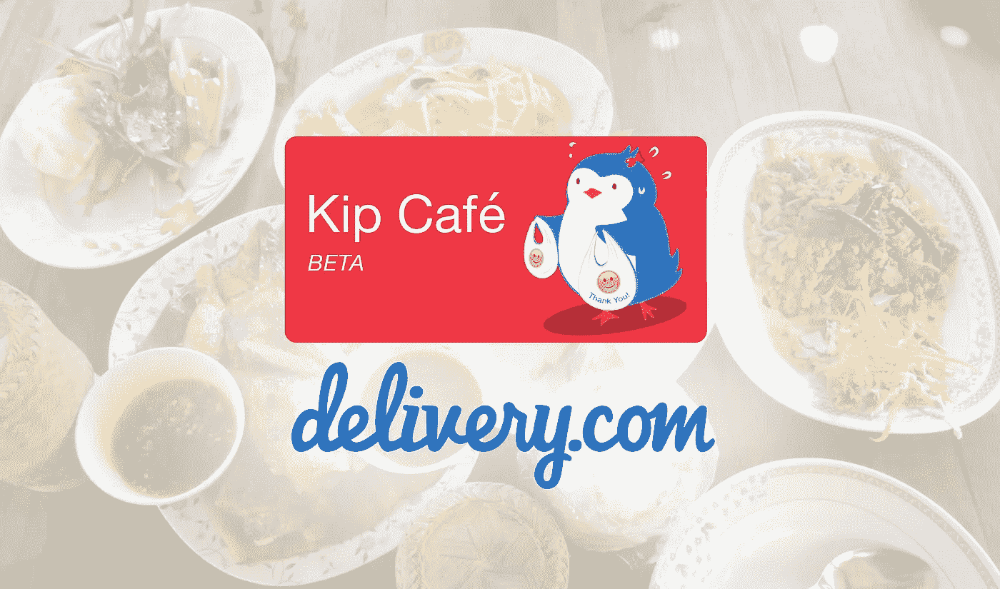
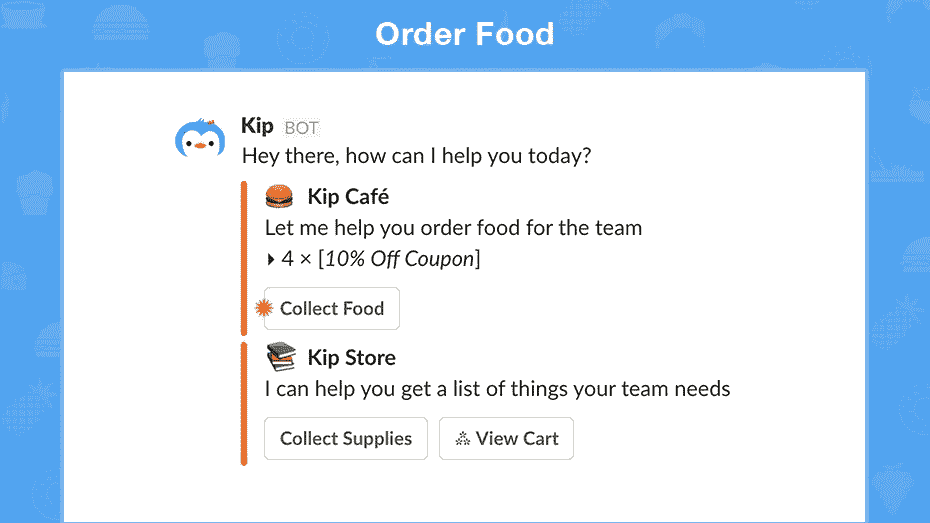
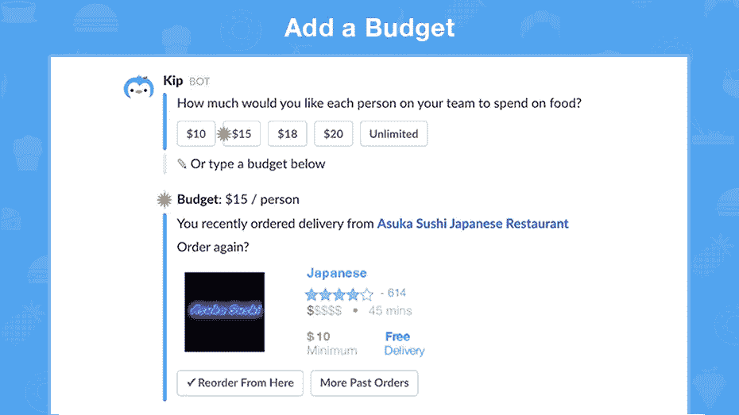
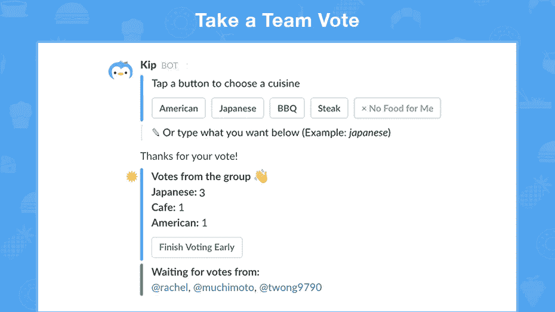
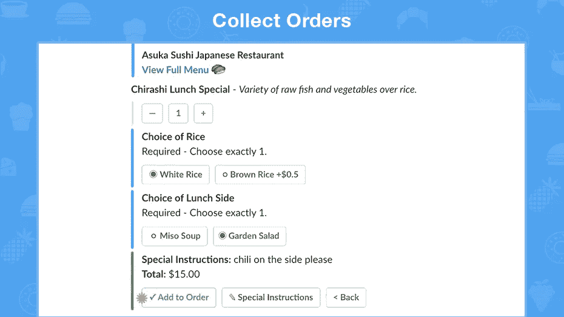
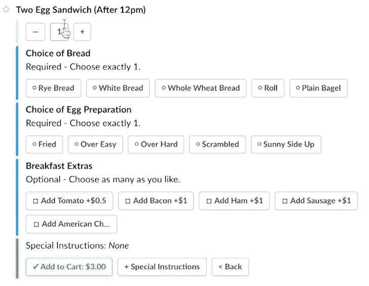
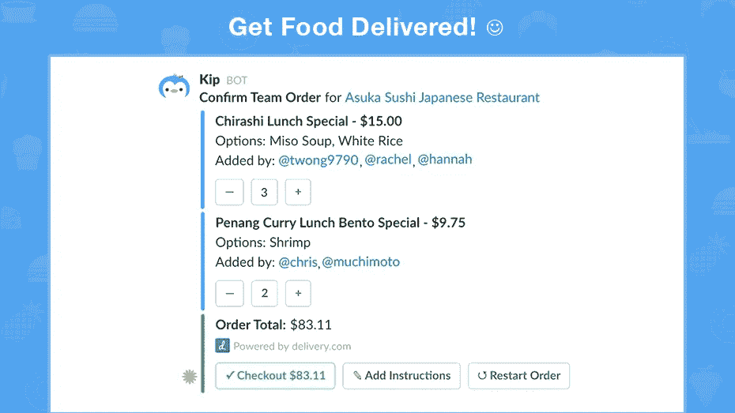
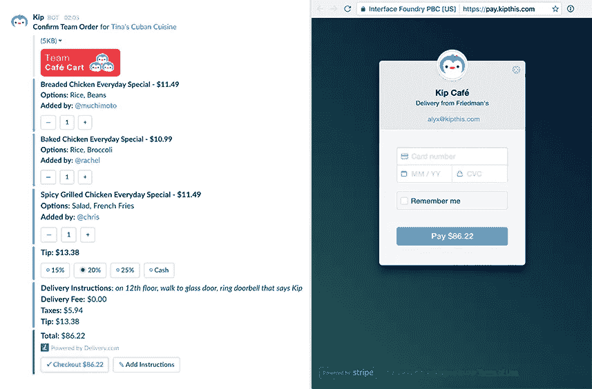

# 基普咖啡馆:为团队送货

> 原文：<https://medium.com/hackernoon/kip-caf%C3%A9-delivery-for-teams-f1aa61622e49>

*电子商务中送货服务的新方式*

> 感觉饿吗？试试松弛时间的[基普咖啡馆](https://slack.com/oauth/authorize?scope=commands+bot+users%3Aread&client_id=2804113073.14708197459)！

所有团队面临的主要问题之一是为团队订购午餐外卖。关于饮食和食物偏好的多通道来回对话非常耗时，菜单中有多个选项。对话通常是这样的:

> 素食？三明治怎么样？
> 三明治要汤还是沙拉？或许来杯咖啡？
> 全脂牛奶，2%，脱脂，杏仁，大豆或其他？

而这只是个别的订单。在一个 8 人或更多人的团队中，光是准备一份午餐订单就要花一个多小时。这令人沮丧，令人讨厌，并使人感到饥饿(饥饿+愤怒！)团队。

credit: [30 Rock](http://www.nbc.com/30-rock)

# 基普让 delivery.com 帮助亨利队

基普咖啡馆的在线订购功能由 delivery.com 提供支持，该公司是当地餐馆和商店按需订购的领导者。基普和 delivery.com 一起通过聊天机器人实现了简单、超快的食品配送。我们很高兴与他们合作，他们也很高兴与我们合作。以下是 delivery.com 公司首席执行官杰德·克勒克纳对基普和 delivery.com 合伙公司的评价:

> “我们总是很高兴看到 delivery.com 的新应用，我们喜欢基普在群体订购方面所做的工作。
> 
> 这正是我们最初创建开放 API 的原因，我们很高兴这种集成让我们置身于 Slack 和 Facebook Messenger 这样人们花费大量时间的地方。"

# 超级快速订购变得简单

你可能想知道，“这是如何工作的？”很简单！一旦 Kip 安装到您的 Slack 上，只需通过向 Kip 键入单词*“food”*或点击 Café按钮来开始新的订单。Kip 通过 DM on Slack 向每个团队成员发送 pings 命令，询问他们想吃什么。

用 Kip 管理办公开支！只需在每人的订单上添加一个预算，Kip 就会显示其中的餐馆和食物建议。

没有人会在团队投票中掉队。Kip 从您的团队中收集您的美食选择，并展示包含每个人最爱的不同餐厅。

Kip 自动代表您为所有团队成员快速收集订单。每位团队成员都会收到一份个人菜单，他们可以轻松浏览不同的菜肴并挑选自己喜欢的食物。

Kip 收集带有子选项的单个订单:

# 聊天中简化的安全结账

Kip 让结账变得简单。无需再下载、安装或登录网站，您现在可以在 chat 中直接付款。只需在您的第一个订单中添加一张信用卡，Kip 会保存您的卡以供将来的订单使用。

Confirm orders directly inside chat

由于 Kip 的支付集成是同类产品中的第一个，并且是自下而上构建的，因此它消除了必须让每个人都在同一个聊天平台上安排支付的问题。

管理员可以为不同地点的多个团队添加多张卡，并点击同一张卡来结算重复订单。

它安全可靠，通过 EV-SSL 认证，并由 Stripe 供电。最重要的是——它会让你的团队更快地不生气，这样每个人都可以回去工作，而不是连续几个小时争论是吃塔可钟还是墨西哥卷饼😋

credit: [Spirited Away](http://www.spiritedaway15.com/)

[Kip](http://kipthis.com) 是一只 AI 企鹅，帮助你收集和协调团队的购物订单。通过点击下面的按钮来尝试 Kip 松弛:

Push this button

如果你喜欢阅读，请推荐💚