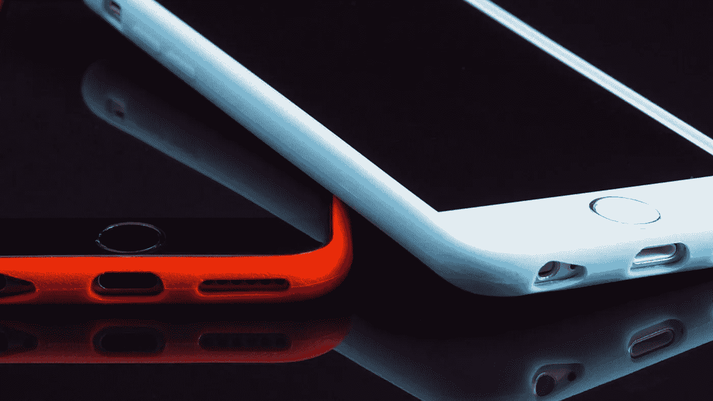
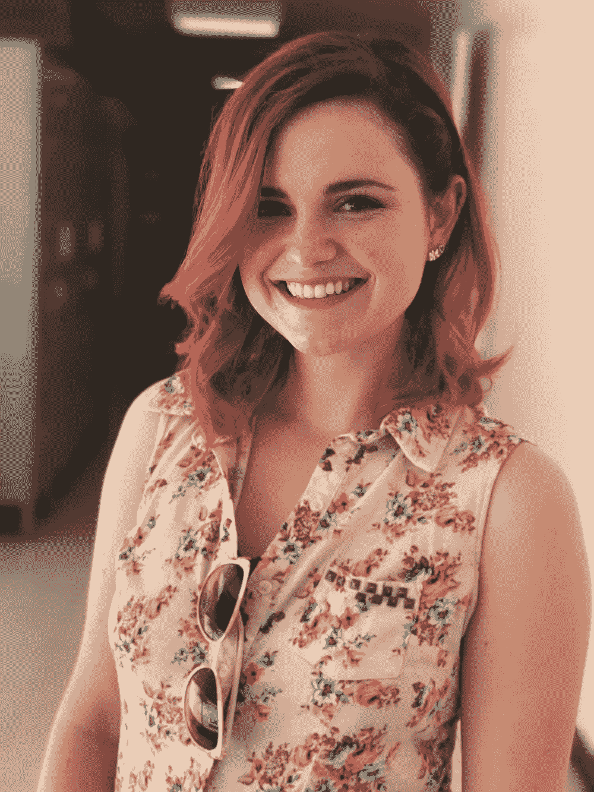
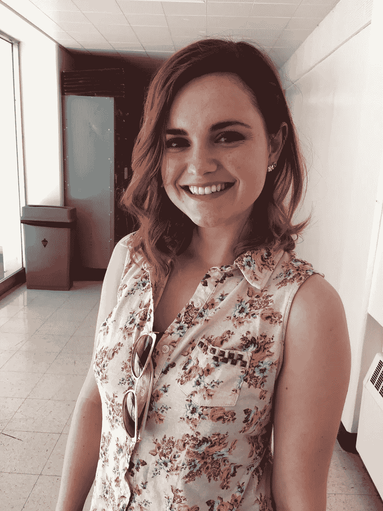
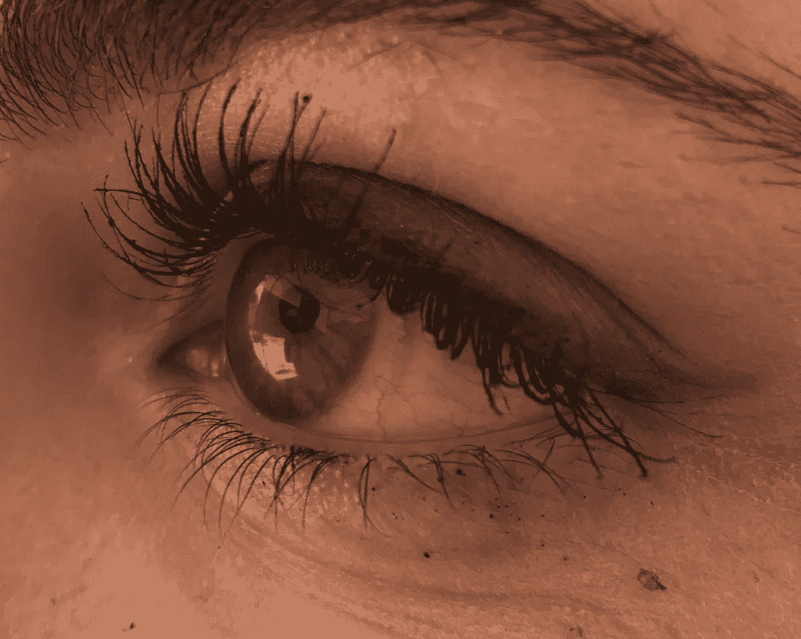
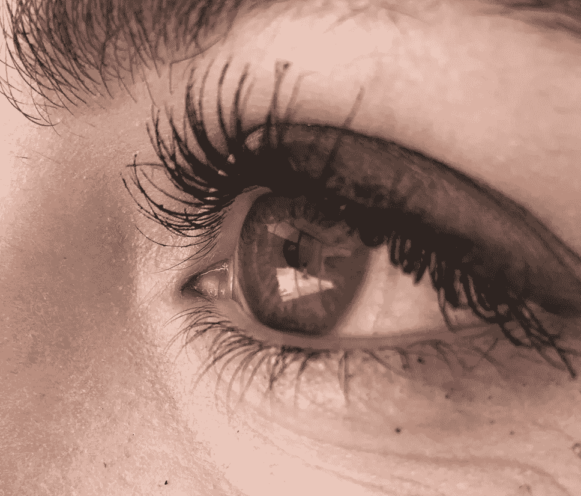
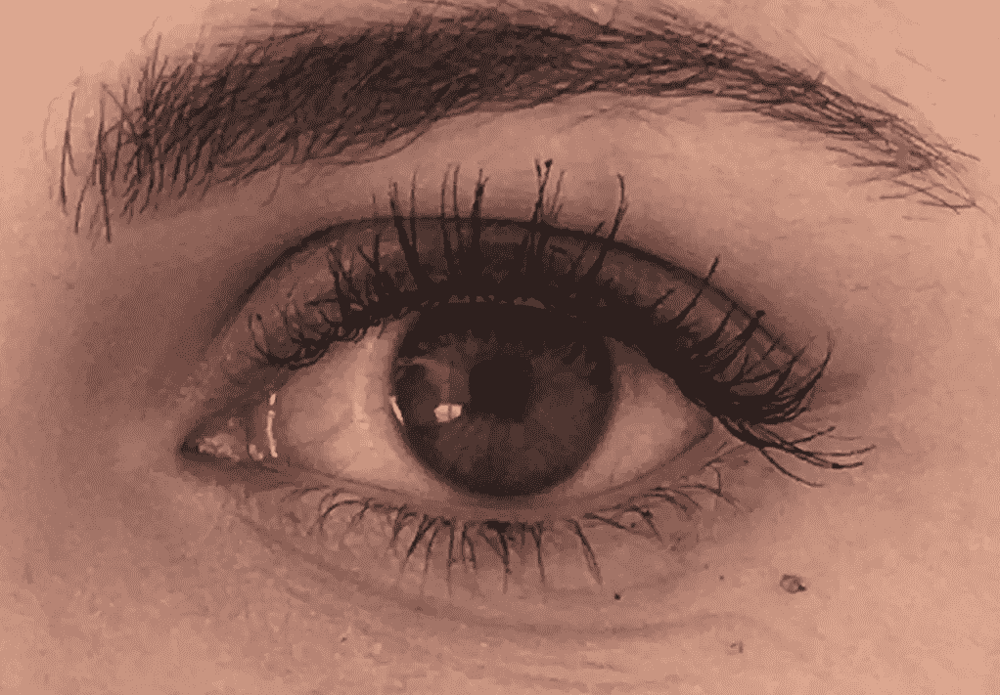
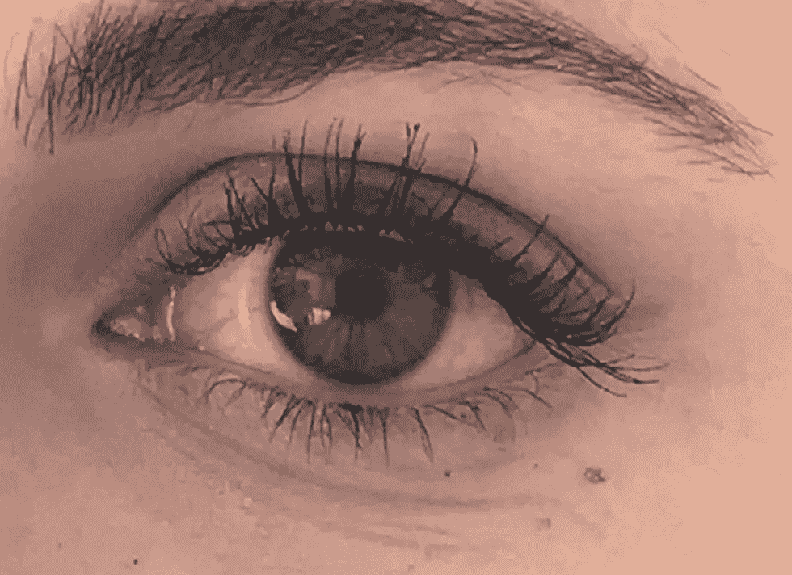

# iPhone 7 的摄像头真的值你的钱吗？

> 原文：<https://medium.com/hackernoon/kis-the-iphone-7s-camera-really-worth-your-money-849af0d3de31>

iPhone Image courtesy of Adobe Spark

拿着尼康相机的小妞，我在想，你们中有多少人有 iPhones？别担心，我现在不在你的房子里想知道你是否回答了我的问题或者至少举了手。那是周二的事情。但我之所以问这个问题，是因为我知道，并不是所有的读者都买得起专业相机，更有可能购买一部配有像样相机的智能手机。众所周知，自问世以来， [iPhone](https://hackernoon.com/tagged/iphone) 就统治了移动世界。我发誓我看到 7 岁的孩子拿着 iPhones。我不知道你怎么想，但是当我 7 岁的时候，我在学习如何给一本物理涂色书上的线条涂色。我下载的应用程序上没有。现在进入自拍时代，iPhones 变得更加必不可少。人们不断升级他们的 iPhones 以获得最新的型号。据报道，iPhone 7 拥有迄今为止最好的摄像头。但如果你像我一样，不喜欢每年升级 iPhone，你可能会对你的 iPhone 6 感到满意。如果你正在决定是否将你的 iPhone 6 升级到 iPhone 7，或者只是想看看 iPhone 7 是否会提升你的自拍游戏，这里有一些比较和对比 iPhone 7 和 iPhone 6 相机质量的照片。

(注:所有这些照片都是用 iPhone 7 Plus 或 iPhone 6 拍摄的。所有照片均未经修饰。)

**人像摄影**

Left image taken with the iPhone 7 Plus. Right image taken with the iPhone 6\. Both photos taken by Stephanie Lamas

在我开始之前，我想感谢我的好朋友兼摄影师同事 [Jarrette Werk](/@werkinprogresss) ，他让我借他的 iPhone 6 来写这篇博文。现在谈谈手机摄影。你马上就能注意到不同之处。iPhone 7 的照片看起来像是由专业人士拍摄的(我不是说自吹自擂而是嘟嘟)，而 iPhone 6 的照片看起来像是在任何手机上拍摄的普通照片。是的，两者都很清晰，但是 iPhone 7 的照片[在背景](https://www.cnet.com/pictures/iphone-7-plus-portrait-mode-in-pictures/)中模糊不清，使得颜色变得流行。我打赌你在想为什么。好吧，别嚷嚷了，因为我要告诉你为什么。iPhone 7 Plus 带有一个专门用于人像的新相机功能。我知道没错，我很惊讶。它可以让你拍出专业的照片，而不必花钱买一台真正的相机。尽管有一些失败。这一特殊功能仅在 iPhone 7 Plus 中提供，而在普通 iPhone 7 中不提供。所以你可能要多花几百块。此外，这种效果要求你比平时后退得更远，而且在强光下也不起作用。所以你不能在黑暗中拍你的卡戴珊自拍(我知道，我也哭了)。但除此之外，说到人像摄影，我肯定更喜欢 iPhone 7 Plus 而不是 iPhone 6。

**特写**

Left image taken with the iPhone 6\. Right image taken with the iPhone 7 Plus. Both photos taken by Stephanie Lamas

现在，我不想遇到偏见，因为我有一部 iPhone 7 Plus。有时候我更喜欢 iPhone 6 而不是 iPhone 7 Plus。但这不是其中之一(#SorryNotSorry)。这里我们有一个人眼睛的特写镜头。叫我明显博士。就像前面的例子一样，差异是显而易见的。与 iPhone 7 的照片相比，iPhone 6 的照片更温暖、更清晰。但 iPhone 7 的照片有更好的照明，并试图隐藏令人不快的痕迹。因此，我也更喜欢用 iPhone 7 拍特写。尽管我承认用 iPhone 7 拍特写比用 iPhone 6 更难，因为它不想对焦。当我需要爱莉安娜·格兰德的时候，她在哪里？(懂了吗？没有吗？好吧…)

**全景图**

Left image taken with the iPhone 6\. Right image taken with the iPhone 7 Plus. Both photos taken by Stephanie Lamas

自 iPhone 发布以来，全景一直是粉丝最喜欢的效果。它可以让你在一张照片中捕捉整个区域。这是一个无论你拥有哪一代 iPhone 都不会改变的特性。说真的，看看这两张照片。除了天空的颜色之外，你注意到任何主要的不同吗？这里我要说的是，你不需要最新的 iPhone 来获得高质量的全景照片。看我没有偏见。我要感谢苹果公司一直保持这一功能，没有让我们每年都买新手机。所以如果你主要关注的是全景照片，不要花几百买最新款的。

**缩放**

Left image taken with the iPhone 7 Plus. Right image taken with the iPhone 6\. Both photos taken by Stephanie Lamas

我只想生活在这样一个世界里，如果我不能靠近我的拍摄对象，我可以有一个看起来不像素化的漂亮变焦。这要求过分吗？在圣诞老人看到我的愿望清单之前，我会一直向苹果抱怨。iPhone 7 还有一个 iPhone 6 没有的特殊功能，那就是放大照片。iPhone 7 有[自动变焦](https://petapixel.com/2016/09/07/iphone-7-7-plus-announced-dual-cameras-zoom-bokeh/)，所以你可以选择你想要的图像有多近，如果你喜欢这种方法，它也有经典的手动变焦。iPhone 7 提供了比 iPhone 6 更清晰的变焦，但我仍然不满意。可能只是因为我更喜欢用我的尼康(它的名字叫威利斯)来拍我的照片，也可能是因为我总是想要完美的图像。圣诞老人，请过来！

**环境**

Left image taken with the iPhone 6\. Right image taken with the iPhone 7 Plus. Both photos taken by Stephanie Lamas

最后，环境照片。这张照片有点棘手，因为学生不喜欢你在期末考试周给他们拍照。因此，尽管这可能不是环境肖像的最佳例子，但请记住，我尽力了。在这里，我们有学生在他们的自然栖息地，大学。现在就行动起来，在获得 15 磅体重的同时还能免费释放压力！就像全景照片一样，这种类型的拍摄不需要最新的 iPhone。只是一个不错的区域和不在乎你是否在拍摄他们的主题(抱歉，图书馆的学生)。

特别感谢 Jarrette Werk 让我用他的 iPhone 6，感谢 Charis Nixon 成为我美丽的模特。最重要的是，对你大声喊出来，因为你读了我的作品，还没有被我惹恼。说真的，这是一个巨大的成就。关注我的其他社交媒体平台，了解我的最新帖子:

[中等](/@chickwithanikon)

[脸书](https://www.facebook.com/chickwithanikon/)

[推特](http://twitter.com/chickwithanikon)

[Tumblr](http://chickwithanikon.tumblr.com)

> [黑客中午](http://bit.ly/Hackernoon)是黑客如何开始他们的下午。我们是阿妹家庭的一员。我们现在[接受投稿](http://bit.ly/hackernoonsubmission)并乐意[讨论广告&赞助](mailto:partners@amipublications.com)的机会。
> 
> 如果你喜欢这个故事，我们推荐你阅读我们的[最新科技故事](http://bit.ly/hackernoonlatestt)和[趋势科技故事](https://hackernoon.com/trending)。直到下一次，不要把世界的现实想当然！

