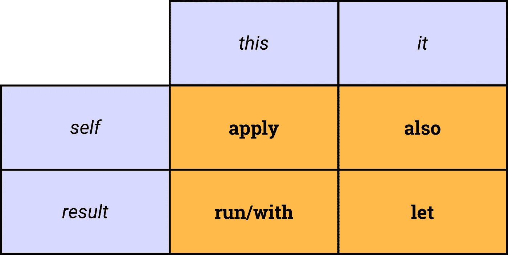

# 科特林——更深入的观察

> 原文：<https://medium.com/hackernoon/kotlin-a-deeper-look-8569d4da36f>

## 这感觉像是魔法…但这是真的吗？


[https://trends.google.com/trends/explore?q=%2Fm%2F0_lcrx4](https://trends.google.com/trends/explore?q=%2Fm%2F0_lcrx4)

你现在看到的是谷歌趋势，我在那里查了“[科特林](https://hackernoon.com/tagged/kotlin)”。你能看到那个突然的尖峰吗？几周前，在谷歌 I/O 大会上，谷歌宣布 Kotlin 编程语言现在是 Android 的一等公民。到目前为止，要么你在过去就已经在使用它，要么你一直埋头于这种语言，因为每个人都突然在谈论它。

该语言最突出的特点之一是**与 [Java](https://hackernoon.com/tagged/java) 的互操作性**:这意味着你可以从 Java 中调用 Kotlin 代码，就像你可以从 Kotlin 中调用 Java 代码一样。这可能是(也一直是)推动采用的最重要的特性。您不需要一次迁移所有内容:您可以简单地从现有的代码库中取出一部分，开始添加 Kotlin 代码，就这样，它就可以工作了。你可以**用科特林做实验**，如果你不喜欢你看到的，你随时可以回去(尽管我谅你也不敢这么做)。

当我从 5 年的 Java 生涯中第一次开始使用 Kotlin 时，有些东西感觉就像魔术一样。

> “等等，什么？我可以简单地写`[data class](https://kotlinlang.org/docs/reference/data-classes.html)`来避免样板文件？”
> 
> "等等，所以如果我写了`apply`，那么我就不再需要在每次调用对象上的方法时都指定对象了？"

在最初为终于有了一门不觉得陈旧笨重的语言而松了一口气之后，我开始感到有点不舒服。如果与 Java 的互操作性是一个需求，那么 Kotlin 是如何实现这些优秀的语言特性的呢？有什么条件？

这就是这篇文章的内容。我非常好奇 Kotlin 编译器如何翻译某些结构，以便它们可以与 Java 互操作，我选择看一看 [Kotlin 标准库](https://kotlinlang.org/api/latest/jvm/stdlib/index.html)的四个最常用的方法:

1.  `apply`
2.  `with`
3.  `let`
4.  `run`

看完这篇文章，你应该不会再感到害怕了。我现在感觉自信多了，因为我知道事情是如何工作的，我知道我可以信任语言和编译器。

# 应用

`apply`非常简单:它是一个扩展函数，在扩展类型的实例(称为“receiver”)上执行*块*参数，并返回接收者本身。
在许多用例中，该功能都会派上用场。您可以将对象的创建绑定到其初始配置，如下所示:

```
val layout = LayoutStyle().apply { orientation = VERTICAL }
```

如你所见，我们正在创建站点为我们的新`LayoutStyle`提供配置，这有助于**更清晰的代码**和**更少的** **易错实现**。你有没有因为一个相似的名字而在错误的实例上调用方法的经历？或者更糟，重构出了可怕的错误？用这种方法，肯定很难掉进这些坑里。
另外，注意我们不需要指定`this`参数:因为我们**和类本身**在同一个范围内，就好像我们正在扩展那个类，因此`this`是隐式的。

但是这是怎么做到的呢？让我们看一个简单的例子。考虑这个简单的片段:

感谢 IntelliJ IDEA 的“显示 Kotlin 字节码”工具(`Tools > Kotlin > Show Kotlin Bytecode`)，我们可以检查编译器如何将我们的代码翻译成 JVM 字节码:

如果你不太熟悉字节码，我建议你阅读[这些](http://www.javaworld.com/article/2077233/core-java/bytecode-basics.html) [伟大的](https://arhipov.blogspot.de/2011/01/java-bytecode-fundamentals.html) [文章](https://www.wikiwand.com/en/Java_bytecode_instruction_listings)，这会让你有一个更清晰的想法(在这种情况下，需要记住的一件重要事情是，每次方法调用都会弹出堆栈，所以编译器每次都需要加载对象)。

让我们来分解一下:

1.  创建一个新的`LayoutStyle`实例，并将其复制到堆栈中
2.  用零参数调用构造函数
3.  执行一系列存储/加载操作(稍后将详细介绍)
4.  将`Orientation.VERTICAL`值压入堆栈
5.  调用`setOrientation`，从堆栈中弹出对象和值

我们注意到这里有几件事。首先，场景背后没有魔法，一切如你所料:在我们创建的`LayoutStyle`实例上调用`setOrientation`方法。此外，`apply`函数也不见踪影，因为编译器被指示将 [**内联**它](https://kotlinlang.org/docs/reference/inline-functions.html)。

最重要的是，字节码几乎与用 Java 做同样的事情所生成的字节码相同！你自己看吧:

*亲提示:你可能注意到了很多* `ASTORE/ALOAD` *的操作。这些是由 Kotlin 编译器插入的，因此调试器也适用于 lambdas！我们将在文章的最后一节详细阐述这一点。*

# 随着

`with`可能看起来与`apply`相似，但表示一些显著的差异。首先，`with`不是类型上的扩展函数:接收者必须作为参数显式传递。此外，`with`返回*块*函数的结果，而`apply`返回接收器本身。

既然我们有自由去归还我们想要的任何东西，像这样的事情是完全合理的:

```
val layout = with(contextWrapper) { 
  // `this` is the contextWrapper
  LayoutStyle(context, attrs).apply { orientation = VERTICAL }
}
```

在这个例子中，我们可以省略`context`和`attrs`的`contextWrapper.`前缀，因为`contextWrapper`是`with`函数的接收器。尽管用例远没有你所能想到的`apply`那么明显，但是这个函数在特定的环境下会变得非常有用。

记住这一点，让我们回到我们的例子，看看如果我们使用`with`会发生什么:

`with`的接收器是一个名为`SharedState`的单例，它包含一个我们希望我们的布局拥有的方向参数。在*块*函数中，我们创建了`LayoutStyle`实例，由于`apply`，我们可以简单地用从`SharedState`中读取的那个来设置方向。

现在让我们再次看看生成的字节码:

还是那句话，这里真的没什么特别的。检索在`SharedState`类上作为静态字段实现的 singleton 像前面一样创建了`LayoutStyle`实例，调用了构造函数，另一个调用获取了`SharedState`中`previousOrientation`的值，最后一个调用将它分配给了我们的`LayoutStyle`实例。

*Pro 提示:使用“显示 Kotlin 字节码”时，也可以按“反编译”来查看 Kotlin 编译器生成的字节码的 Java 表示。剧透:这正是你所期待的！*

# 让

`let`在处理可空对象时非常有用。您可以简单地将`?`操作符(称为“安全调用操作符”)与`let`结合起来，而不是将无尽的 if-else 语句链接起来:您最终得到的是一个 lambda，其中参数`it`是原始对象的不可空版本。

```
val layout = LayoutStyle()
SharedState.previousOrientation?.*let* **{** layout.orientation = **it }**
```

让我们看看整个例子:

既然`previousOrientation`是可空的，如果我们试图将它直接赋给我们的布局，编译器会抱怨，因为可空类型不能赋给不可空类型。当然，我们可以写一个 if 语句，但是这意味着引用`SharedState.previousOrientation`值两次:通过使用`let`来代替，我们得到一个对同一个参数的不可空的引用，它可以安全地分配给我们的布局。

从字节码的角度来看，这非常简单:

这一切都求助于一个简单的条件跳转`IFNULL`，这基本上是你手工完成的，除了这一次编译器为你有效地完成了，并且语言为你提供了一个编写代码的好方法。我觉得这太棒了！

# **运行**

*run 有两个版本，一个是简单函数，一个是泛型类型上的扩展函数。因为前者只不过是调用作为参数传递的块函数，所以我们将重点分析后者。*

`run`可能是我们目前遇到的函数中最简单的一个。它被定义为一个类型的扩展函数，其实例被作为接收者传递，并返回执行`block`函数的结果。你可能认为`run`是`let`和`apply`的混合体，你可能是对的，唯一的区别是返回值:在`apply`的情况下，我们返回接收者本身，在`run`的情况下，我们返回*块*函数的结果(就像我们在`let`上做的一样)。

因此，下面的例子强调了这样一个事实，即`run`返回*块*函数的结果，因此在这个例子中是一个赋值(`Unit`):

对应的字节码是:

我们可以看到`run`已经被内联，就像其他函数一样，一切都解析为简单的方法调用。这里也没什么奇怪的！

我们已经注意到标准库函数之间有很多相似之处:这是故意的，以便尽可能多地涵盖用例。另一方面，考虑到每种功能之间的细微差异，找出哪种功能最适合您的特定任务并不容易。
为了帮助你浏览标准库，这里有一个方便的表格，总结了我们已经讨论过的主要函数之间的差异(除了`[also](https://kotlinlang.org/api/latest/jvm/stdlib/kotlin/also.html)`):



Huge thanks to [Eugenio](/@workingkills) for sharing this with me!

# 附录:额外的`store/load`操作

在我们结束这一分析之前，当比较“Java 字节码”和“Kotlin 字节码”时，还有一些我不能真正理解的地方。更具体地说，正如我之前提到的，有一些额外的来自 Kotlin 的`astore/aload`操作是 Java 所缺少的。我知道这和兰姆达斯有关，但我不知道他们有什么用。

原来，这些额外的操作对于调试器来说是必要的，以便**将 lambdas 视为** [**堆栈帧**](https://docs.oracle.com/javase/specs/jvms/se7/html/jvms-2.html#jvms-2.6) ，进而允许我们进入它们。这样我们可以看到什么是局部变量，谁是 lambda 的调用者，谁将从 lambda 中被调用，等等。

然而，当我们将 APK 交付生产时，我们并不真正关心调试器的特性，不是吗？因此，我们可以把这些指令，即使很小，可以忽略不计，看作是应该而且能够消除的开销。

[**ProGuard**](https://www.guardsquare.com/en/proguard) ，这个我们都知道的工具和“爱”，可能是这项工作的合适工具。它在字节码级别上运行，除了模糊和收缩之外，它还进行优化，尝试精简字节码。所以我尝试用 Java 和 Kotlin 编写相同的代码，用相同的规则集对它们应用 ProGuard，并比较结果。这是我的发现。

## ProGuard 配置

ProGuard configuration

## 源代码

*Java*

Kotlin

## 字节码

Java

Kotlin

在比较了两个字节码清单之后，我们可以观察到以下情况:

1.  “Kotlin 字节码”中额外的`astore/aload`操作不见了，因为 ProGuard 认为它们是多余的，并立即删除了它们(有趣的是，一次优化并没有成功，需要两次)
2.  “Java 字节码”和“Kotlin 字节码”几乎相同；前者在处理枚举值时有些有趣/怪异，而在 Kotlin 中没有这样的事情

# 结论

有一种新的语言为开发人员提供了如此多的可能性，这很好，但是知道我们可以依赖我们使用的工具并且我们有信心使用它们也很重要。

我很高兴我可以说“我可以信任 Kotlin”，从某种意义上说，我知道编译器没有做任何过分或冒险的事情:它只是简单地做了我们在 Java 中必须手工做的事情，节省了我们的时间和资源(并恢复了 JVM 编码活动中一些久违的乐趣)。这在某种程度上也有利于最终用户，因为由于更强的类型安全，希望我们可以在应用程序中减少错误。

此外，Kotlin 编译器也在不断改进，因此它输出的代码会越来越好，越来越高效。也就是说，我们不应该试图基于编译器来优化我们的 Kotlin 代码，而是应该坚持我们能够编写的最好的(如高效和惯用的)Kotlin 代码，并将所有其他的工作留给编译器本身。

[](http://bit.ly/HackernoonFB)[](https://goo.gl/k7XYbx)[](https://goo.gl/4ofytp)

> [黑客中午](http://bit.ly/Hackernoon)是黑客们下午的开始。我们是 [@AMI](http://bit.ly/atAMIatAMI) 家庭的一员。我们现在[接受投稿](http://bit.ly/hackernoonsubmission)并乐意[讨论广告&赞助](mailto:partners@amipublications.com)机会。
> 
> 如果你喜欢这个故事，我们推荐你阅读我们的[最新科技故事](http://bit.ly/hackernoonlatestt)和[趋势科技故事](https://hackernoon.com/trending)。直到下一次，不要把世界的现实想当然！

