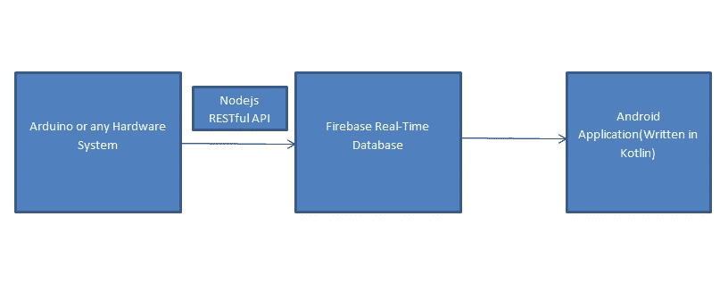

# 使用 Kotlin、Firebase 和 Nodejs 将硬件连接到软件

> 原文：<https://medium.com/hackernoon/kotlin-firebase-nodejs-interesting-or-weird-e9a76d6cf638>

在我大二的时候，我的一个学长向我提出了一个通过使用简单的、现有的库和[框架](https://hackernoon.com/tagged/framework)将硬件(即 Arduino)连接到软件的问题。这将从硬件接收数据，存储在[数据库](https://hackernoon.com/tagged/database)中，以便移动应用程序或网站可以获取并显示数据，所有这些都是实时的，这意味着更少的延迟和更高的效率。所以，这篇文章基本上是上述问题的解决方案，通过使用

1.  Kotlin for Android **应用开发**。
2.  Firebase 作为我们的实时数据库
3.  Node-js 用于创建 **RESTful API 开发。**

因此，让我们首先勾画出我们的体系结构，我们的系统将建立在这个基础上。

*注意:——我将不涉及硬件部分，因为这不是我们的主要关注点*

Architecture for our System

根据我们的架构，如果我们以一个简单的传感器为例，其输出需要在移动应用中进行实时处理，则步骤如下

1.  首先，通过托管的 Node-js RESTful API，Arduino(或任何其他带有 Wi-Fi 模块的硬件)将所需的数据发送到 Firebase 实时数据库，然后存储这些数据。
2.  现在我们知道将 android 连接到 Firebase 是多么容易！！，我们可以利用它来显示或处理移动应用程序中的数据。

现在，让我们按照上述架构规范创建一个简单的心跳显示移动应用程序，并添加一些功能，如显示心跳(每分钟心跳数)、动画和实时图形绘制。

手机应用程序的 Java 版本已经制作完成(下面是代表)

 [## s 2606/心跳

### 心跳-💚一个 Android 应用程序，在给定每分钟心跳数(BPM)的值时，会显示心跳动画

github.com](https://github.com/S2606/HeartBeat) 

让我们向前迈进一步，在 *KOTLIN 中制作相同的 android 应用程序！！*

首先，我们将讨论 API 部分。我假设你知道如何在 Firebase 中创建新项目并找到配置。网络的钥匙。如果你不知道，我要求你首先有一个如何 Firebase 工程清晰的外观。我相信你会在媒体上找到合适的文章。

在找到以下用于 RESTful API 的 Nodejs 代码(server.js)后，继续

**记得将它托管到任何云或网络托管服务，如 heroku 或 digital ocean 等(*我会推荐 Heroku* )，这样它就可以被访问。**

现在是时候用科特林弄脏我们的手了！！

我不会解释为什么 kotlin 是好的等等等等…我们已经有很多关于它的文章，在获得一些基本的见解后，让我们来编码它。

1.  首先是观点:—

2.我个人最喜欢的(作为一个懒惰的程序员)**数据类**(使 getter-setter 变得如此之小)

3. **MainActivity.kt** 最后但并非最不重要(应用的关键)

We did it!!

# **结论**

我们已经成功地实施了模型的重点部分，方法是创建

1.  与云数据库集成的 RESTful API
2.  使用 Kotlin 显示数据的 Android 应用程序。

我希望这篇文章是有用的。请喜欢，分享，留下关于这个项目的任何反应。

页（page 的缩写）这是我的第一篇媒体文章。希望我没有让你失望。我是一个自学成才、充满激情的程序员，想创造一些从未听说过、见过或想过的东西。你可以在[https://github.com/S2606,](https://github.com/S2606)LinkedIn:-[https://www.linkedin.com/in/shagun-khemka-b55843118/](https://www.linkedin.com/in/shagun-khemka-b55843118/)看到我的其他项目