# 图中的科特林函子、应用和单子。第 1/3 部分

> 原文：<https://medium.com/hackernoon/kotlin-functors-applicatives-and-monads-in-pictures-part-1-3-c47a1b1ce251>

> *这是图片中的* [*函子、适用子、单子*](http://adit.io/posts/2013-04-17-functors,_applicatives,_and_monads_in_pictures.html) *从* [*哈斯克尔*](https://www.haskell.org/) *翻译成* [*科特林*](https://hackernoon.com/tagged/kotlin) *。*
> 
> *其实这是一个* [*的翻译，另一个是从 Haskell 到 Swift*](http://www.mokacoding.com/blog/functor-applicative-monads-in-pictures/) *的翻译。*
> 
> 我通读了最初的帖子，我发现学习 FP 的新概念真的很有趣，所以我决定做一个额外的翻译(也有一些乐趣)。
> 
> *我也想看看科特林和斯威夫特相比能走多远:)*
> 
> *如果你喜欢这篇文章，一定要在 Twitter 上感谢原版本的作者:*[*Aditya Bhargava*](http://adit.io/index.html)*[*@ _ egonschiele*](https://twitter.com/_egonschiele)*。**

*这里有一个简单的值:*

**

*我们知道如何对这个值应用一个函数:*

**

*很简单。让我们扩展一下，任何值都可以在上下文中。现在，您可以将上下文视为一个可以放入值的盒子:*

*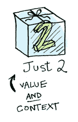*

*现在，当你对这个值应用一个函数时，你会得到不同的结果**，这取决于上下文**。这是函子、应用、单子、箭头等都基于的思想。`Option`数据类型定义了两个相关的上下文:*

> ****注:*** *图片使用的是 Haskell 的 Maybe (Just | None)，对应的是一个自定义的 Kotlin 的*选项 *(Some | None)实现。**

*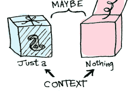*

```
*sealed class Option<out A> {
  object None : Option<Nothing>()
  data class Some<out A>(val value: A) : Option<A>()
}*
```

*接下来我们将看到当某个东西是一个`Some(T)`和一个`None`时，函数应用是如何不同的。首先来说说[函子](https://hackernoon.com/tagged/functors)！*

# *函子*

*当值被包装在上下文中时，您不能对其应用普通函数:*

*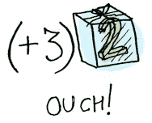*

*这就是`map`的用武之地(Haskell 中的`fmap`)。`map`是来自街头，`map`是 hip to contexts。`map`知道如何将函数应用于包含在上下文中的值。例如，假设您要应用一个将 3 加到`Some(2)`的函数。使用`map`:*

```
*fun sumThree(n: Int) = n + 3

Option.Some(2).map(::sumThree)
// => Some(5)*
```

*或者通过使用匿名 lambda 的简单语法:*

```
*Option.Some(2).map { it + 3 }
// => Some(5)*
```

*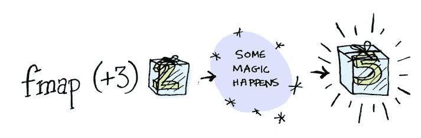*

***嘭！** `map`向我们展示了它是如何做到的！但是`map`怎么知道如何应用函数呢？*

# *究竟什么是函子？*

*函子是定义如何应用`map`(Haskell 中的`fmap`)的任何类型。下面是`map`的工作原理:*

*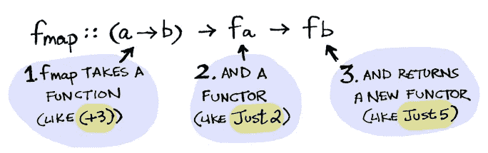*

*所以我们可以这样做:*

```
*Option.Some(2).map { it + 3 }
// => Some(5)*
```

*而`map`神奇地应用了这个函数，因为`Option`是一个函子。它规定了`map`如何应用于`Some`和`None`s；*

```
*inline fun <B> map(f: (A) -> B): Option<B> = when (this) {
    is None -> this
    is Some -> Some(f(value))
}*
```

*下面是我们写`Option.Some(2).map { it + 3 }`时幕后发生的事情:*

*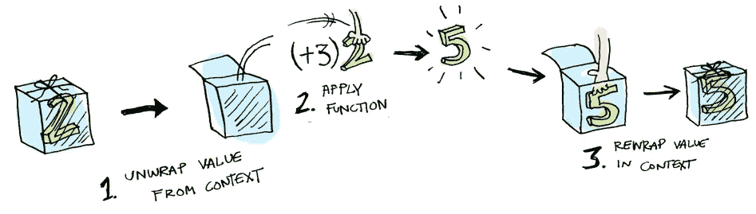*

*然后你会想，好吧`map`，请将`{ it + 3 }`应用于`None`？*

*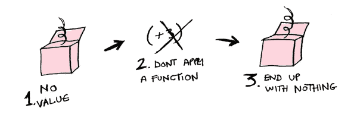*

```
*Option.None.map { it + 3 }
// => None*
```

*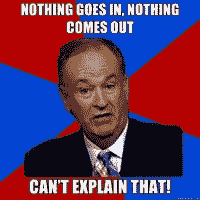*

*这里有一个问题，因为上面的代码无法编译。为什么？因为在这种情况下，没有一个有合适的类型，所以你不能用类型`Nothing`做加法。但这应该没问题，因为您通常不会编写这样的代码，但类似于:*

```
*val option: Option<Int> = someCallThatMightReturnNone()
option.map { it + 3 }
// => None*
```

*就像《黑客帝国》中的墨菲斯一样，`map`知道该做什么；你以`None`开头，你以`None`结尾！`map`是禅。现在明白了`Option`型为什么存在了。例如，下面是如何在没有`Option`的语言中处理数据库记录:*

```
*val post = Post.findByID(1)
return post?.title*
```

*但是在 Kotlin 中使用了`Option`仿函数:*

```
*findPost(1).map(::getPostTitle)*
```

*如果`findPost(1)`回一个帖子，我们就用`getPostTitle`得到标题。如果它返回`None`，我们就返回`None`！*

*我们甚至可以将`map`定义为(Haskell 中的`<$>`)的中缀函数，这样做:*

```
*inline infix fun <B> map(f: (A) -> B): Option<B> { ... }

*findPost*(1) map ::getPostTitle*
```

> ****注意:*** *我们只能用* `*map*` *因为* `*<$>*` *不会编译。另一个选择是覆盖一个普通的操作符，如* `*/*` *或* `***`*

*这里还有一个例子:当你对一个数组应用一个函数时会发生什么？*

*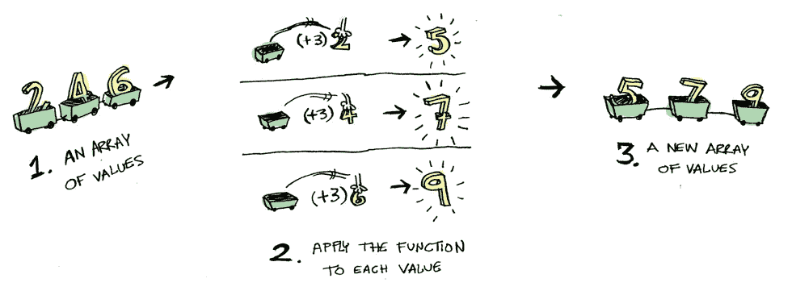*

*数组也是函子。*

**基本上，Kotlin 为以下形式的所有 iterables 提供了一个扩展函数:*

```
*inline fun <T, R> Iterable<T>.map(transform: (T) -> R): List<R> {..}*
```

*好吧，好吧，最后一个例子:当你把一个函数应用到另一个函数时会发生什么？*

```
*{ a: Int -> a + 2 } map { a: Int -> a + 3 }
// => ???*
```

*这里有一个函数:*

*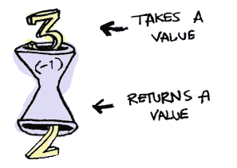*

*下面是一个应用于另一个函数的函数:*

*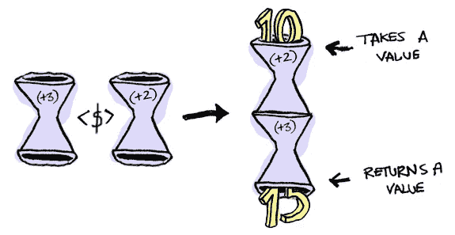*

*结果只是另一个函数！*

```
*typealias IntFunction = (Int) -> Int

infix fun IntFunction.map(g: IntFunction): IntFunction {
    return { x -> this(g(x)) }
}

val foo = { a: Int -> a + 2 } *map* { a: Int -> a + 3 }foo(10)
// => 15*
```

*所以函数也可以是函子！当你在一个函数上使用`map`时，你只是在做函数合成！*

## *好了，今天就到这里，我希望你已经知道什么是函子了。由于最初的帖子相当长，我将在下一个系列中继续讨论应用程序。现在试着用 Kotlin 写一些函子！*

## *想玩玩代码吗？看一看[https://github.com/aballano/FAM-Playground](https://github.com/aballano/FAM-Playground)*

*想要更多吗？去试试第二部分中的应用程序吧！*

*[](/@aballano/kotlin-functors-applicatives-and-monads-in-pictures-part-2-3-f99a09efd1ec) [## 图中的科特林函子、应用和单子。第 2/3 部分

### 这是从 Haskell 到 Kotlin 的图片中的函子、应用程序和单子的翻译。

medium.com](/@aballano/kotlin-functors-applicatives-and-monads-in-pictures-part-2-3-f99a09efd1ec) [](http://bit.ly/HackernoonFB)[](https://goo.gl/k7XYbx)[](https://goo.gl/4ofytp)

> [黑客中午](http://bit.ly/Hackernoon)是黑客如何开始他们的下午。我们是 [@AMI](http://bit.ly/atAMIatAMI) 家庭的一员。我们现在[接受投稿](http://bit.ly/hackernoonsubmission)并乐意[讨论广告&赞助](mailto:partners@amipublications.com)机会。
> 
> 如果你喜欢这个故事，我们推荐你阅读我们的[最新科技故事](http://bit.ly/hackernoonlatestt)和[趋势科技故事](https://hackernoon.com/trending)。直到下一次，不要把世界的现实想当然！

*