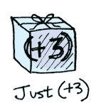
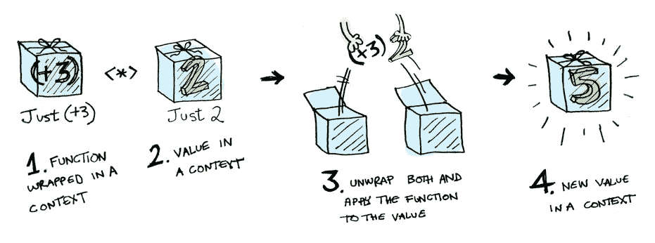
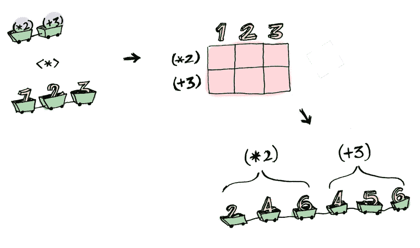

# 图中的科特林函子、应用和单子。第 2/3 部分

> 原文：<https://medium.com/hackernoon/kotlin-functors-applicatives-and-monads-in-pictures-part-2-3-f99a09efd1ec>

首先，如果你没有阅读前一篇文章，去读吧，否则你可能会错过一些重要的概念！

[](/@aballano/kotlin-functors-applicatives-and-monads-in-pictures-part-1-3-c47a1b1ce251) [## 图中的科特林函子、应用和单子。第 1/3 部分(草案)

### 很简单。让我们扩展一下，任何值都可以在上下文中。现在，您可以将上下文视为一个…

medium.com](/@aballano/kotlin-functors-applicatives-and-monads-in-pictures-part-1-3-c47a1b1ce251) 

# 应用程序

应用程序把它带到了下一个层次。对于应用程序，我们的值被包装在上下文中，就像[函子](https://hackernoon.com/tagged/functors):


但是我们的函数也包含在上下文中！



是啊。让它深入人心。申请人不会开玩笑。与 Haskell 不同， [Kotlin](https://hackernoon.com/tagged/kotlin) 还没有*和*一种处理应用程序的内置方式。但是加一个是非常容易的！我们可以为每个支持 Applicative 的类型定义一个`apply`函数，它知道如何将包装在类型上下文中的函数应用到包装在相同上下文中的值:

```
infix fun <A, B> Option<(A) -> B>.apply(f: Option<A>): Option<B> =
        when (this) {
            is Option.None -> Option.None
            is Option.Some -> f.map(this.value)
        }infix inline fun <A, reified B> Array<(A) -> B>.apply(a: Array<A>) =
        Array(this.size * a.size) {
            this[it / a.size](a[it % a.size])
        }
```

如果`this`和函数都是`Some`，那么函数被应用到展开的选项，否则返回`None`。

对于`Array`,我使用它的构造函数参数来生成数组，尽管注意这对于更大的数组来说不是最好的选择。

> **注意:**这将是 Haskell 中的`<*>`，所以如果需要的话，我们可以使用一个`*`操作符。



即:

```
Some({ a: Int -> a + 3 }) apply Some(2)
// => Some(5)
```

如果你仔细观察，你会发现我们的操作符只按照这个特定的顺序工作:`Option(function) apply Option(value)`为什么？因为我们的扩展函数就是按这个顺序定义的。那么，难道我不能创建另一个扩展函数来反过来工作吗，比如:

```
fun <A, B> Option<A>.apply(o: Option<(A) -> B>) = {...}
fun <A, B> Option<(A) -> B>.apply(o: Option<A>) = {...}
```

严格来说不是。因为 Kotlin 产生的代码和 Java 一样，它必须处理我们的朋友[类型的删除](https://docs.oracle.com/javase/tutorial/java/generics/erasure.html)。所以基本上这两个函数会在编译时释放泛型类型(变成仅仅是`Option`)，使它们相等，因此无效。但是这里有一个技巧，我们可以使用一个所谓的`dummyImplicit`(你可以在这里阅读为什么)看起来像这样:

```
fun <A, B> Option<A>.apply(f: Option<(A) -> B>, 
                           dummyImplicit: Any? = null): Option<B> = 
when (this) {
    is Option.None -> Option.None
    is Option.Some -> f.map { it(value) }}
```

这使我们能够:

```
Some(2).*apply*(Some(**{** a: Int **->** a + 3 **}**))
// => Some(5)
```

但不幸的是，这使得中缀不可能，因为中缀函数只有一个参数:(

所以，按照我们之前的解释，使用*应用*会导致一些有趣的情况。例如:

```
arrayOf<(Int) -> Int>({ it + 3 }, { it * 2 }) *apply* arrayOf(1, 2, 3)
// => [ 4, 5, 6, 2, 4, 6 ]
```



> ***注:*** *原来的文章现在展示了应用程序如何比函子更强大，因为它们允许函数应用多个参数。同样，这在 vanilla Kotlin 中是不可行的，但是我们可以通过在一个* [*curried 方式*](https://en.wikipedia.org/wiki/Currying) *中定义我们想要处理的函数来解决这个问题。*

这里有一些你可以用应用程序做，但不能用函子做的事情。如何应用一个将两个参数传递给两个包装值的函数？

```
fun curriedAddition(a: Int) = { b: Int ->
    a + b
}Some(3) map ::curriedAddition map Some(2)
// => COMPILER ERROR
```

适用范围:

```
Some(3) map ::curriedAddition apply Some(2)
// => Some(5)
```

等等，什么？？让我一步一步地分解它:

```
Some(3) map ::curriedAddition
// => Some({ 3 + b })Some({ 3 + b }) apply Some(2)
// => Some(5)
```

`Applicative`将`Functor`推到一边。“大男孩可以使用带有任意数量参数的函数，”它说。“有了 map 和 apply，我就可以使用任何期望任意数量的展开值的函数。然后我传递给它所有包装好的值，我得到一个包装好的值！啊哈哈哈哈！”

```
fun curriedTimes(a: Int) = **{** b: Int **->** a * b
**}**Some(3) map ::curriedTimes apply Some(5)
// => Some(15)
```

但是等等，如果我们想更深入呢？


假设我们有一个三重乘积函数:

```
fun tripleProduct(a: Int, b: Int, c: Int) = a * b * c
```

我们想做和以前一样的事情，但是我们不想手动搜索它，所以我们有一个搜索函数，在这个例子中有 3 个参数:

```
fun <A, B, C, D> curry(f: (A, B, C) -> D): (A) -> (B) -> (C) -> D = **{** a **-> {** b **-> {** c **->** f(a, b, c) **} } }**
```

> 感谢[ľuboš·穆德拉克](https://medium.com/u/e856388adc0e?source=post_page-----f99a09efd1ec--------------------------------)的建议！

嗯，那很简单:

```
Some(3) map *curry*(::tripleProduct) apply Some(5) apply Some(4)
// => Some(60)
```

## 就是这样！希望你和我一样喜欢这第二部分，记住你可以在我创建的[游乐场回购](https://github.com/aballano/FAM-Playground)中找到所有代码，希望在下一个也是最后一个系列中见到你！

第三也是最后一部分已经有了”

[](/@aballano/kotlin-functors-applicatives-and-monads-in-pictures-part-3-3-832d58d92445) [## 图中的科特林函子、应用和单子。第三部分

### 这是从 Haskell 到 Kotlin 的图片中的函子、应用程序和单子的翻译。

medium.com](/@aballano/kotlin-functors-applicatives-and-monads-in-pictures-part-3-3-832d58d92445) [](http://bit.ly/HackernoonFB)[](https://goo.gl/k7XYbx)[](https://goo.gl/4ofytp)

> 黑客中午是黑客如何开始他们的下午。我们是这个家庭的一员。我们现在[接受投稿](http://bit.ly/hackernoonsubmission)并乐意[讨论广告&赞助](mailto:partners@amipublications.com)机会。
> 
> 如果你喜欢这个故事，我们推荐你阅读我们的[最新科技故事](http://bit.ly/hackernoonlatestt)和[趋势科技故事](https://hackernoon.com/trending)。直到下一次，不要把世界的现实想当然！

