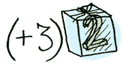
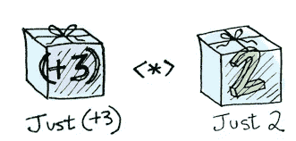
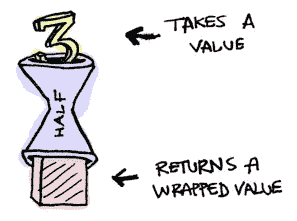
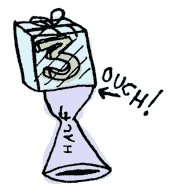
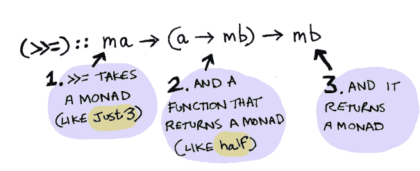
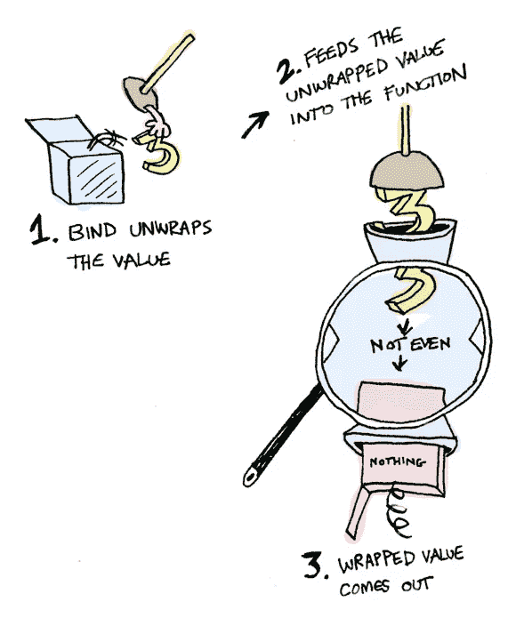
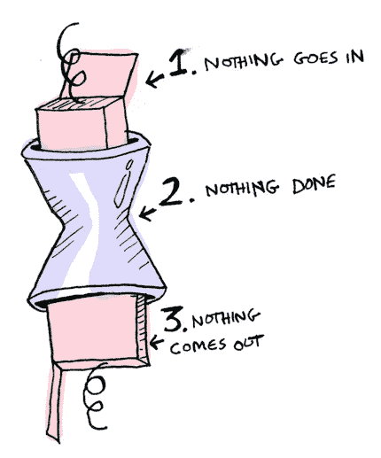
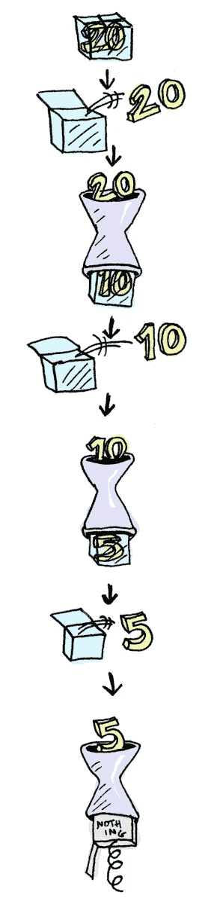

# 图中的科特林函子、应用和单子。第三部分

> 原文：<https://medium.com/hackernoon/kotlin-functors-applicatives-and-monads-in-pictures-part-3-3-832d58d92445>

首先，如果你没有阅读之前的帖子，去读吧，否则你可能会错过一些重要的概念！

[](https://hackernoon.com/kotlin-functors-applicatives-and-monads-in-pictures-part-1-3-c47a1b1ce251) [## 图中的科特林函子、应用和单子。第 1/3 部分

### 这是从 Haskell 到 Kotlin 的图片中的函子、应用程序和单子的翻译。

hackernoon.com](https://hackernoon.com/kotlin-functors-applicatives-and-monads-in-pictures-part-1-3-c47a1b1ce251) [](https://hackernoon.com/kotlin-functors-applicatives-and-monads-in-pictures-part-2-3-f99a09efd1ec) [## 图中的科特林函子、应用和单子。第 2/3 部分

### 这是从 Haskell 到 Kotlin 的图片中的函子、应用程序和单子的翻译。

hackernoon.com](https://hackernoon.com/kotlin-functors-applicatives-and-monads-in-pictures-part-2-3-f99a09efd1ec) 

# 单子

如何了解单子:

1.  获得计算机科学博士学位。
2.  扔了吧，因为这一节不需要！

单子增加了一个新的转折。

[函子](https://hackernoon.com/tagged/functors)将函数应用于包装值:



应用程序将包装函数应用于包装值:



单子应用一个将包装值返回到包装值的函数。单子有一个函数`flatMap`(Haskell 中的`liftM`或`>>=`)来做这件事。

```
inline fun <B> flatMap(f: (A) -> Option<B>): Option<B> = 
when (this) {
    is None -> this
    is Some -> f(value)
}
```

让我们看一个例子。好的 ol 选项是一个单子:


只是一个单身贵族。

假设`half`是一个只作用于偶数的函数:

```
fun half(a: Int) = when {
    a % 2 == 0 -> Some(a / 2)
    else -> None
}
```



如果我们给它一个包装值呢？



我们需要使用`flatMap`(Haskell 中的`>>=`)将我们包装的值放入函数中。这里有一张`flatMap`的照片:


它是这样工作的:

```
Some(3).flatMap(::half)
// None
Some(4).flatMap(::half)
// Some(2)
None.flatMap(::half)
// None
```

里面发生了什么？让我们再来看看`flatMap`的(`>>=`在 Haskell 中)签名:

```
// For Option
inline fun <B> flatMap(f: (A) -> Option<B>): Option<B>
```



所以`Option`是单子。在这里，它是在行动与一个`Some(3)`！



如果你传入一个`None`就更简单了:



您还可以链接这些调用(通过使用一个中缀版本的`flatMap`):

```
Some(20) flatMap ::half flatMap ::half flatMap ::half
// => None
```



> *注:原文现在描述的是哈斯克尔的* `*IO*` *单子。* [*科特林*](https://hackernoon.com/tagged/kotlin) *没有那样的东西，所以这个翻译跳过了。*

# 结论

1.  函子是实现`map`的类型。
2.  应用程序是实现`apply`的类型。
3.  单子是实现`flatMap`的类型。
4.  `Option`实现了`map`和`flatMap`，再加上我们可以扩展它实现`apply`，所以它是一个函子，一个应用子，一个单子。

三者有什么区别？


*   **函子**:使用`map`将函数应用于包装后的值。
*   **应用程序**:使用`apply`将包装函数应用于包装值。
*   **单子**:使用`flatMap`将返回包装值的函数应用于包装值。

所以，亲爱的朋友(我认为我们在这一点上是朋友)，我想我们都同意单子很容易并且是一个聪明的想法(tm)。既然你已经错过了这本指南，为什么不去喝一杯梅尔·吉布森鸡尾酒，把整瓶酒都抢过来呢？查看 LYAH 关于单子的[部分。我掩盖了很多东西，因为 Miran 在这方面做得非常好。](http://learnyouahaskell.com/a-fistful-of-monads)

> *感谢您通读本系列文章，如果您有任何反馈、建议或错误要报告，请发微博给我*[*@ aballano*](http://twitter.com/aballano)*，或在下方留下评论。*
> 
> *如果你想玩代码头转到 GitHub 和* [*克隆操场*](https://github.com/aballano/FAM-Playground)
> 
> *再次感谢*[*Adit*](https://twitter.com/_egonschiele)*的精彩帖子，以及* [*博客*](http://adit.io/index.html) *上所有其他伟大的人。*

快乐的柯丁！

[](http://bit.ly/HackernoonFB)[](https://goo.gl/k7XYbx)[](https://goo.gl/4ofytp)

> [黑客中午](http://bit.ly/Hackernoon)是黑客如何开始他们的下午。我们是 [@AMI](http://bit.ly/atAMIatAMI) 家庭的一员。我们现在[接受投稿](http://bit.ly/hackernoonsubmission)并乐意[讨论广告&赞助](mailto:partners@amipublications.com)机会。
> 
> 如果你喜欢这个故事，我们推荐你阅读我们的[最新科技故事](http://bit.ly/hackernoonlatestt)和[趋势科技故事](https://hackernoon.com/trending)。直到下一次，不要把世界的现实想当然！

