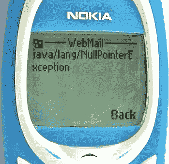

# 科特林对我不忠…

> 原文：<https://medium.com/hackernoon/kotlin-is-cheating-on-me-e048cde4f66>

## …但我没意见。

本月早些时候，我发表了一篇我第一次体验 Android 开发的文章。不太好。

 [## 安卓很难

### TL；博士，我推出了我的第一个安卓应用！

hackernoon.com](https://hackernoon.com/android-is-hard-b7a5a5549655) 

诚实是有回报的，在这种情况下，它的回报如此之大，以至于 Hackernoon 的一位编辑选择了我的故事，然后更多。数字直线上升，我非常高兴。然后发生了一些事情。

你知道，当你在网上漫无目的地抱怨 X 时，某个家伙出现了，说“你为什么不用 Y？”问号，就这样。我讨厌这种评论。没有证据表明为什么 Y 比 X 好，或者为什么 Y——哦，为什么——会让我的生活不那么痛苦。公平地说，几乎任何东西都能保证让你的生活没有 Java 那么痛苦，所以我说管它呢，用 Kotlin 试试我的运气。

我听说过 Kotlin 的优点，比如它是空安全的，而 Java 不是，这是大约 99.9%使用过任何可以运行 Java 的东西的人感到困惑的主要原因。

When you see it…

Kotlin 还有许多其他不错的功能，但我被卖给了零安全。Kotlin 也是由 JetBrains 的优秀人员开发的，他们恰好是开发 IntelliJ IDEA 的人，IntelliJ IDEA 是 Android Studio 的基础。Android Studio 有一个自动的插件，可以把你的 Java 代码转换成 Kotlin。我还没有广泛地测试过，但是它对我来说非常有效。诚然，它留下了一些 Javaisms，但是它们很容易修复。

长话短说，我点击“make it so”在手机上运行我的应用程序。我从事编程的时间已经够长了，以至于我没有预料到这种情况会发生，但它确实发生了。几秒钟内，我不得不在网上询问如何检查我的 Kotlin 应用程序是否真的在运行，或者我的手机是否在运行应用程序的幽灵。经过一番挖掘，我突然想到:Kotlin 不仅编译成了 JVM 字节码，而且还有效地使用了 Java 和 Android 的许多常规库。这很有道理。这几乎就像是 Kotlin 代码被编译成 Java——是的，这是一个单词——然后使用了一个常规的老式 Java 编译器，除了它不是，它比那要聪明得多，这才是最重要的。

另一方面，科特林实际上是在骗我。每当我声明一个 Map，并用一个`mapOf()`初始化它，发生的事情是我被赋予一个巧妙伪装的`LinkedHashMap`，这就是你最终在你的代码中使用的:一个常规的，旧的`LinkedHashMap`，有它所有的怪癖和方法。不要误解我的意思，Kotlin 是一种很好的语言，但是我越是努力确保我新转换的代码仍然有意义，我就越觉得自己被欺骗了。最后，我仍然在编写一个 Android 应用程序，所有的东西都是用 Java 写的，这意味着有很多东西在运行时可以是空的。当然，科特林有办法解决这个问题，而且是非常好的办法，但是我发现自己不得不比我预期的更频繁地使用它们。更糟糕的是，实际上没有办法预先知道哪些值在运行时可能为空，因为 Java 代码库的注释太差了，所以我得到的最好建议是总是假设所有涉及 Java 的东西在任何时候都可能为空。

我转投科特林的唯一原因就是蒸发了。我让那件事持续了一会儿…

…然后我仍然继续使用 Kotlin，因为总的来说，它是一种更好看的语言。

对于那些想知道的人来说，“*非结论*”是“*非结论*”的正确复数。把你的拉丁语学好，你们这些英语国家的人。

嘿，我在 Medium 上还有其他一些帖子，包括

*   [我如何搞砸了我的 artsy 应用程序的发布](/@morpheu5/how-i-messed-up-my-artsy-apps-launch-e684111de532)
*   [我如何制作一个基于科学的艺术应用](/@morpheu5/how-i-made-an-artsy-app-based-in-science-a3690164a9ce)
*   [启动场景需要长时间认真审视自身](/@morpheu5/the-startup-scene-has-to-take-a-long-hard-look-at-itself-6d77a9531814)
*   [最近欧洲的迁徙自由被撤销了吗？](/@morpheu5/has-the-freedom-of-movement-in-europe-been-revoked-recently-24cf11613139)

如果你敢读，就按那个绿色心形按钮！💚

> [黑客中午](http://bit.ly/Hackernoon)是黑客如何开始他们的下午。我们是阿妹家庭的一员。我们现在[接受投稿](http://bit.ly/hackernoonsubmission)并乐意[讨论广告&赞助](mailto:partners@amipublications.com)机会。
> 
> 如果你喜欢这个故事，我们推荐你阅读我们的[最新科技故事](http://bit.ly/hackernoonlatestt)和[趋势科技故事](https://hackernoon.com/trending)。直到下一次，不要把世界的现实想当然！

