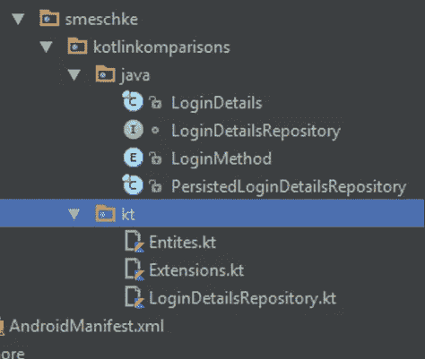

# Kotlin Komparisons:登录设置

> 原文：<https://medium.com/hackernoon/kotlin-komparisons-loginsettingsrepo-b774f1530708>

Kotlin Island — from [brambeus @ flickr](https://www.flickr.com/photos/brambeus/)

> Kotlin Komparisons 系列采用 Java 实现的特性，并用 Kotlin 重写它，以展示改进、语言特性、迁移路径和有趣的重构。
> 
> 完整代码可从[https://github.com/scottmeschke/KotlinKomparisons](https://github.com/scottmeschke/KotlinKomparisons)获得

# 科特林是官方的

2017 年 5 月 17 日上周三是个很棒的生日。

谷歌和 Android 团队宣布官方支持 Kotlin。

Nice birthday present!

为了帮助社区成长并接受 Kotlin，我开始了这个系列。

# 我们正在构建的内容:

我们需要为登录设置构建一个数据存储库。

我们必须为用户提供观察和更新登录细节以及登录方法。

我们还需要在会话中持久化数据。

Patton is ready for some code!

# Java 实现:

我们将从登录详细信息(用户名和电子邮件)的简单值类开始。

59 lines for a super simple value type.. We can do better.

这里有一大堆必要的样板文件。可空性注释、值类型方法、toString()和一个带赋值的简单构造函数。

让我们继续讨论存储库本身的实现。

这个 API 非常简单，但是由于一些原因，实现起来并不太好。

*   guava-前置条件空检查样板文件和可空性注释
*   超详细的匿名类
*   持久性键与存储库位于相同的名称空间/级别
*   从持久性初始化继电器的类似逻辑。
*   写入持久性然后更新中继的逻辑也非常相似。

# 科特林比较:

以上是我们的 LoginDetails java 类的完整等价物。

数据修饰符为我们提供了所有的值类型需求(hashCode()、equals()、toString())。

我们的字段现在是用 val 定义为只读的[属性](https://kotlinlang.org/docs/reference/properties.html)。

注意，我们得到了内置于类型系统、编译器和类定义中的值的可空性。不需要注释或运行时检查。

我们还有默认参数、命名参数和只读属性。

让我们继续讨论存储库逻辑。

哇，多么可笑的差别。括号外的 [lambda 作为最后一个参数语法](https://kotlinlang.org/docs/reference/lambdas.html)使得代码易于阅读。

我们的声明性 withInitIfEmpty()和 writeThenForward()方法只是 BehaviorRelay 和 RxPaperBook 上的[扩展函数](https://kotlinlang.org/docs/reference/extensions.html)。

请注意，第一个函数被标记为“inline ”,这实际上是在编译时在源代码中使用函数体的地方插入函数体。

这意味着我们获得了 lambda 函数式风格的优点，以及执行条件操作和正常调用方法的性能。

不需要分配匿名类。

We definitely want a happy garbage collector.

# 好处:文件更少

Kotlin 实现可读性更强，样板文件更少，更不容易出错，并且更具声明性。

kotlin 的另一个奇妙特性是顶级声明。我们可以将多个类/接口/函数放在一个文件中。

Simple. Less files, grouped functionality.

我特别喜欢为界面这样做。不同于一些数据仓库的三个单独的文件，只有一个包含接口、应用程序实现的文件和一个用于测试的假文件。

完整代码请查看 Github 上的 Kotlin Komparisons 知识库。

[https://github.com/scottmeschke/KotlinKomparisons](https://github.com/scottmeschke/KotlinKomparisons)

## Kotlin Komparisons 系列的下一个主题是:

TBD — I’ll update this with a link to the next post once it’s done.

享受美食？

打算把一些 Java 转换成 Kotlin？

对上面的某句话有火热的看法吗？

我很乐意收到你的来信，请在下面留下你的评论！

> [黑客中午](http://bit.ly/Hackernoon)是黑客如何开始他们的下午。我们是 [@AMI](http://bit.ly/atAMIatAMI) 家庭的一员。我们现在[接受投稿](http://bit.ly/hackernoonsubmission)并乐意[讨论广告&赞助](mailto:partners@amipublications.com)机会。
> 
> 如果你喜欢这个故事，我们推荐你阅读我们的[最新科技故事](http://bit.ly/hackernoonlatestt)和[趋势科技故事](https://hackernoon.com/trending)。直到下一次，不要把世界的现实想当然！

