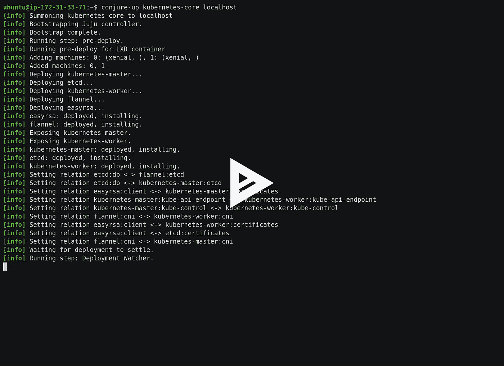

# Ubuntu 上的 Kubernetes 1.7，简单的方法

> 原文：<https://medium.com/hackernoon/kubernetes-1-7-on-ubuntu-the-easy-way-bcd851d4ed35>

我昨天看到了[这篇文章](http://www.techrepublic.com/article/how-to-install-the-necessary-components-for-a-kubernetes-cluster-on-ubuntu-linux/)，演示了如何在 [Ubuntu](https://hackernoon.com/tagged/ubuntu) 上建立一个 [Kubernetes](https://hackernoon.com/tagged/kubernetes) 集群。虽然文章是善意的，但我觉得有义务举手大喊:“等等，其实比那简单多了！”

无论您是 Kubernetes 新手，只是想开始运行，或者您是 Kubernetes 管理员，正在寻找一种更简单的方法来部署和管理集群，我将向您展示在 Ubuntu 上实现这一点的最快方法。

# 剧透警报

在全新安装的 Ubuntu Xenial 上，只需要两个(！)启动并运行完整 Kubernetes 集群的命令:

```
sudo snap install conjure-up --classic
conjure-up kubernetes
```

`conjure-up`命令将启动一个安装程序，引导您在自己选择的云上安装 Kubernetes。你可以选择 AWS，Azure，Google，Joyent，Oracle，Rackspace，还有…localhost！

部署到本地主机将会创建一个完全包含在主机上的 Kubernetes 集群，但是所有的集群组件都被整齐地分离到单独的 [LXD](https://www.ubuntu.com/containers/lxd) 容器中。

# 演示

这里有一个演示，我在一台新的 Ubuntu Xenial 机器上演示了这些步骤。在演示中，我在 headless 模式下运行了 magre-up，没有基于终端的 GUI。整个安装过程只有两个命令！

安装完成后，我运行了几个额外的命令来显示我们确实有了一个功能完整的 Kubernetes 集群。

[](https://asciinema.org/a/tQrIV2xAUwJ3RM56a7zuAa340?speed=4)

Deploying a Kubernetes 1.7 cluster with two commands!

尽情享受吧！