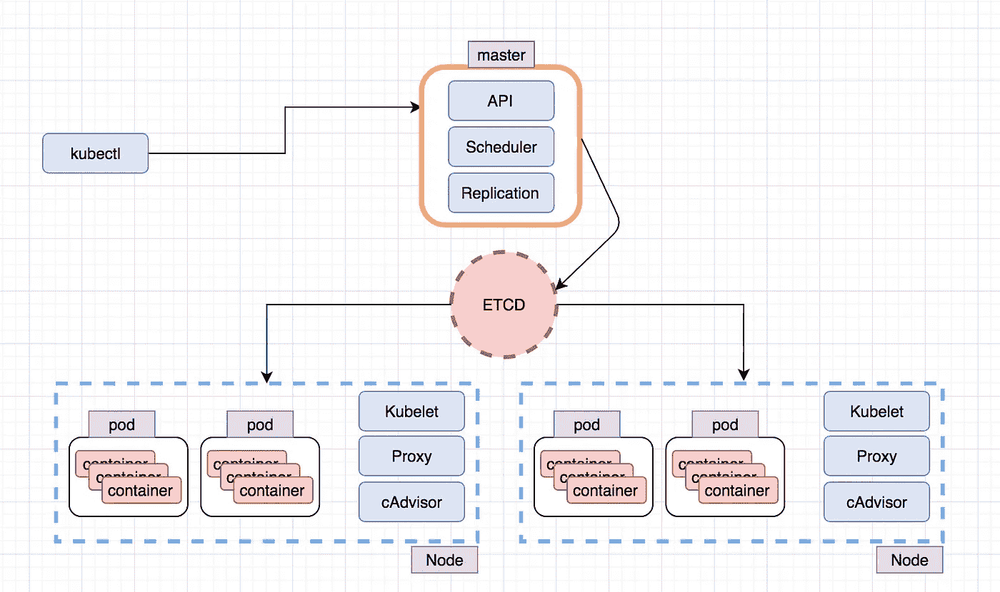
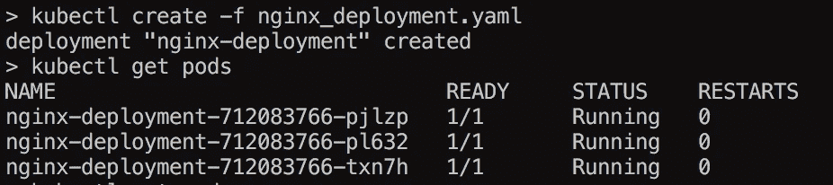

# Kubernetes 101 基础知识#1

> 原文：<https://medium.com/hackernoon/kubernetes-101-1-653f92efffe7>

大家好，我开始玩 kubernetes 已经有一段时间了，我想写一系列关于它的文章，可能从基础和语法开始，到内部结束(如果我自己有时间学习的话)

首先，我们将在这些系列中使用**迷你库**，当我们到达**迷你库**不够的部分时，我们将计划其他的。

你可以得到 minikube @[https://github.com/kubernetes/minikube](https://github.com/kubernetes/minikube)，但正如你所料是在 brew，apt 等。

**minikube** 将创建一个 vm(在我的例子中是 **virtualbox** )并在其中安装 **kubernetes** ，创建**集群**，设置 **etcd** 等等。

**概述**:

这大概是它看起来的样子:



Kubectl :它是一个控制台行工具，连接到 api 来执行动作(比如创建部署、服务等)

**Master** :调度器，不仅保存 api，还负责将更改写入 etcd，管理复制，监听需要重新生成的失效容器

**Etcd** :是用于存储来自 kubernetes 的配置项和标签的键/值存储，是分布式的和容错的。外国应用程序也可以利用和使用这个组件。

**节点**:一个“物理”机器或一个虚拟机

**Pod** : Pod 是一个更高级别的"**容器**，它可以包含一个或多个"容器"，简单来说，一个 **Pod** 运行一个或多个 **Docker** 容器(例如)，Pod 在共享上下文中运行，因此某些内容将在运行于 **pod** 中的容器之间共享。

**行动中:**

在结束之前，我想展示一下这是什么样子，我们将创建一个包含 3 个 nginx 副本的 pod

(副本是在任何给定时间必须运行的容器数量，可以是任何数量)

因此，我将创建一个部署:

```
apiVersion: apps/v1beta1
kind: Deployment
metadata:
  name: nginx-deployment
spec:
  replicas: 3
  template:
    metadata:
      labels:
        app: nginx
        env: prod
        role: web
    spec:
      containers:
      - name: nginx
        image: nginx:1.7.9
        ports:
        - containerPort: 80
        resources:
          requests:
            cpu: 250m
          limits:
            cpu: 500m
```



就是这样，就这么简单。

这些容器实际上是不可访问的，我们将需要运行某种代理或"**服务**，这正是 **kubernetes** 所提供的。

所以下次我们将讨论:

**服务、地址和缩放。**

谢谢大家！

[](http://bit.ly/HackernoonFB)[](https://goo.gl/k7XYbx)[](https://goo.gl/4ofytp)

> [黑客中午](http://bit.ly/Hackernoon)是黑客如何开始他们的下午。我们是 [@AMI](http://bit.ly/atAMIatAMI) 家庭的一员。我们现在[接受投稿](http://bit.ly/hackernoonsubmission)，并乐意[讨论广告&赞助](mailto:partners@amipublications.com)机会。
> 
> 如果你喜欢这个故事，我们推荐你阅读我们的[最新科技故事](http://bit.ly/hackernoonlatestt)和[趋势科技故事](https://hackernoon.com/trending)。直到下一次，不要把世界的现实想当然！

