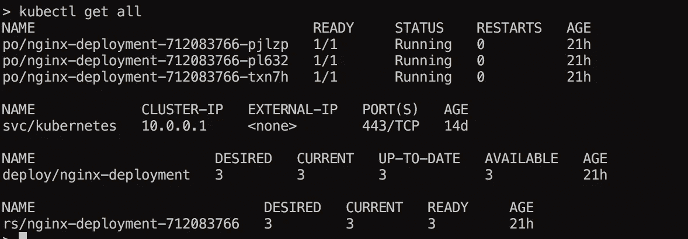
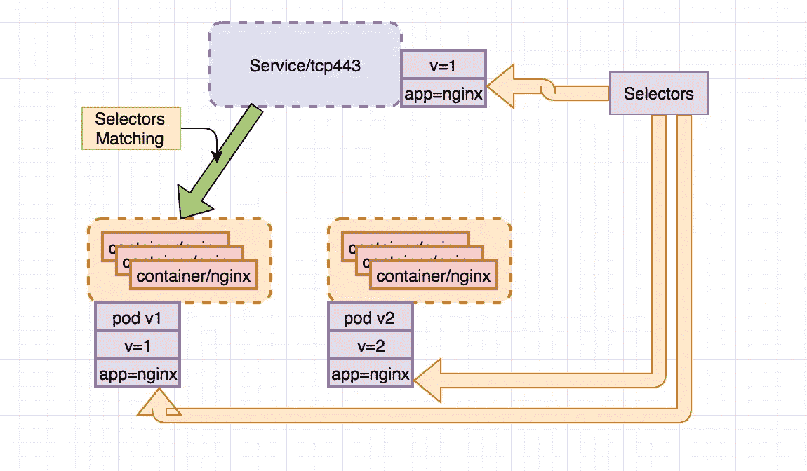
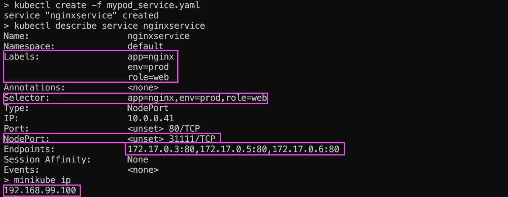
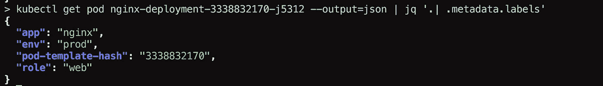
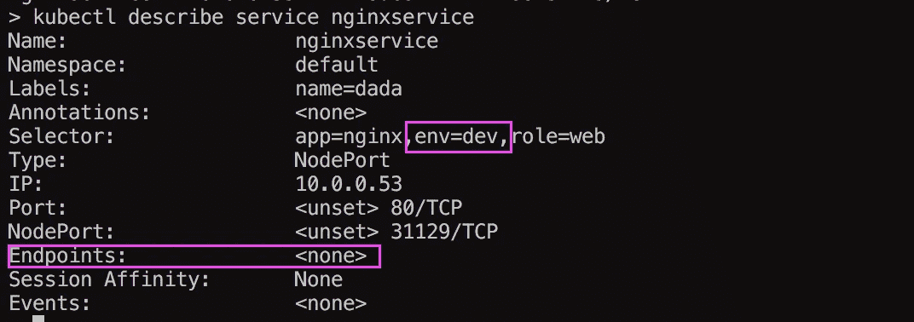
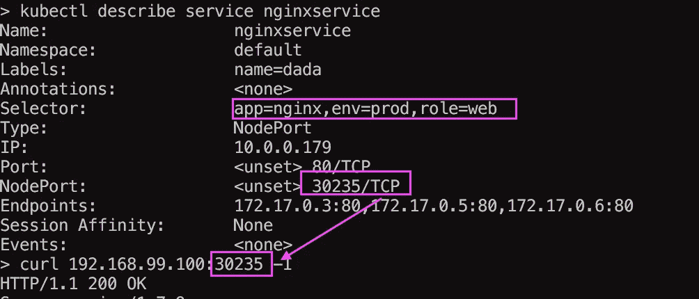

# Kubernetes 101 服务#2

> 原文：<https://medium.com/hackernoon/kubernetes-101-2-3fdd96c7fe86>

因此，我想谈一谈今天的服务和寻址，当您创建部署时，“对 pod 和复制集的声明性更新”，就像我们在上一篇文章中创建的那样，您会看到:

*   pod(带有 x 个副本)
*   复制集



因此，我们将需要**服务**，服务是一种抽象，它在逻辑上**位于 pod 之上，其理念是，pod 是一种非静态的实体，就像 pod 死亡(旧版本)和新版本被创建一样。**

**在 pod 上有一个服务会让你总是指向同一个地址，你会以某种方式登陆到一个“选定的”pod 上，就像一个**负载平衡器**或者反向代理。**

****

**服务看起来应该是这样的:**

```
apiVersion: v1
kind: Service
metadata:
  labels:
    app: nginx
    role: web
    env: prod
  name: nginxservice
spec:
  ports:
    - port: 80
  selector:
    app: nginx
    role: web
    env: prod
  type: NodePort
```

**当您运行该程序时，您将获得:**

****

**关于服务最重要的事情是绑定 pods，这是通过选择器完成的。**

**如您所见，我们在服务中声明的选择器是**

```
app=nginx,env=prod,role=web
```

**这些和我们在豆荚上的标签相符:**

****

**这就是装订的过程。**

**所以选择器可以匹配部分标签，或者全部标签，但是不能有负匹配，例如:**

****

**任何 pod 中都没有 **"env=dev"** ，所以我们没有**端点。****

**选择器和标签是最重要的 kubernetes 原语之一，所以了解它们是很重要的。**

**现在，修复选择器后，我们可以通过服务点击 pod:**

****

**目前就这些了。**

**下次我想谈谈**缩放**和**推出**新版本**透明**哈。**

**谢谢你**

**[](http://bit.ly/HackernoonFB)****[](https://goo.gl/k7XYbx)****[](https://goo.gl/4ofytp)**

> **[黑客中午](http://bit.ly/Hackernoon)是黑客如何开始他们的下午。我们是 AMI 家庭的一员。我们现在[接受投稿](http://bit.ly/hackernoonsubmission)并乐意[讨论广告&赞助](mailto:partners@amipublications.com)机会。**
> 
> **如果你喜欢这个故事，我们推荐你阅读我们的[最新科技故事](http://bit.ly/hackernoonlatestt)和[趋势科技故事](https://hackernoon.com/trending)。直到下一次，不要把世界的现实想当然！**

****