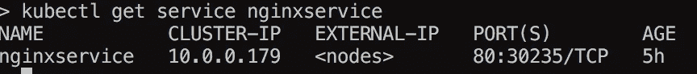
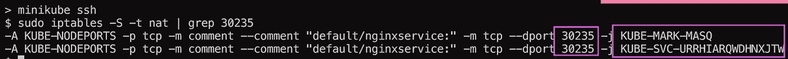
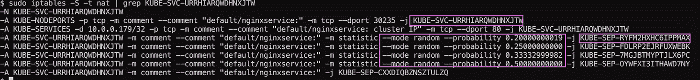
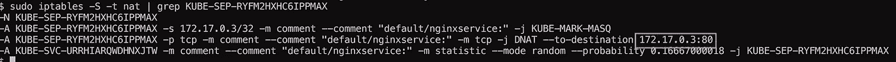
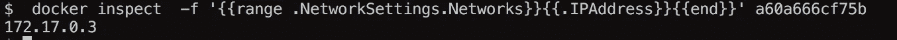

# Kubernetes 101 iptables？#3

> 原文：<https://medium.com/hackernoon/kubernetes-101-3-c3ab81f36319>

我想做一些关于服务如何在节点内工作的挖掘，也就是数据包如何通过桥等从外部、邪恶和无情的世界转发到容器。

所以第一步，找到服务绑定到哪个端口:

端口是 **30235** ，显然，现在让我们看看节点内部的 **iptables** 。

请注意，正在做一个 **-j(跳转)**到另一个**链/扩展**，在本例中是**KUBE-SVC-URRHIARQWDHNXJTW**

现在让我们来研究一下:

很酷，所以让我们来看看这个链条，然后“KUBE-SEP-RYFM2HXHC6IPPMAX”:

我们看到它正在向 **172.17.0.3** 转发流量，因此剩下的唯一一位是检查我们是否真的有一个 **docker** 容器，其地址为:

神奇！

> [黑客中午](http://bit.ly/Hackernoon)是黑客如何开始他们的下午。我们是阿妹家庭的一员。我们现在[接受投稿](http://bit.ly/hackernoonsubmission)并乐意[讨论广告&赞助](mailto:partners@amipublications.com)的机会。
> 
> 如果你喜欢这个故事，我们推荐你阅读我们的[最新科技故事](http://bit.ly/hackernoonlatestt)和[趋势科技故事](https://hackernoon.com/trending)。直到下一次，不要把世界的现实想当然！

