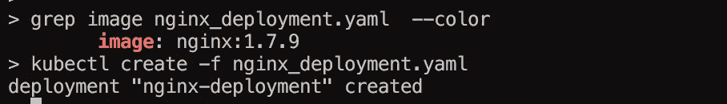
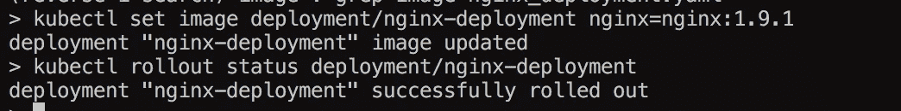
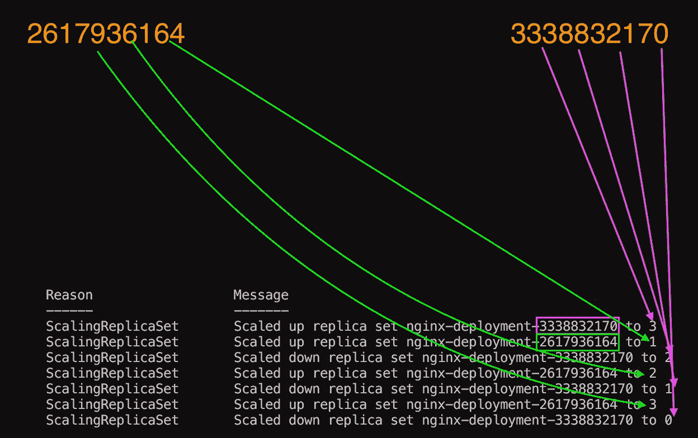

# Kubernetes 101 #4 推出

> 原文：<https://medium.com/hackernoon/kubernetes-101-4-rollouts-6d209c463582>

简单介绍一下推广，想法是“**更新**“docker 镜像到新版本”**而不**“中断服务……这是相对的，我稍后会对此进行调查。

但总的想法是，您有一个使用给定版本的部署:



所以这个部署将创建一个**复制集**，其中有 3 个容器运行 **nginx:1.7.9。**

因此，我们的想法是更改映像并更新部署，这可以通过几种不同的方式来完成，但其中一种方式是:



```
kubectl set image deployment/nginx-deployment nginx=nginx:1.9.1
```

之后发生的事情很有趣，如果你跑的话:

```
kubectl describe deployments
```



你可以看到的是一个新的**副本集**是如何被创建的 **2617936164** ，然后它增加了 1 个容器，同时 **3338832170** 减少了 1 个，非常顺利。

有几种不同的方法可以做到这一点，但我想我们稍后会谈到这一点。

谢谢你。

[](http://bit.ly/HackernoonFB)[](https://goo.gl/k7XYbx)[](https://goo.gl/4ofytp)

> [黑客中午](http://bit.ly/Hackernoon)是黑客如何开始他们的下午。我们是阿妹家庭的一员。我们现在[接受投稿](http://bit.ly/hackernoonsubmission)并乐意[讨论广告&赞助](mailto:partners@amipublications.com)的机会。
> 
> 如果你喜欢这个故事，我们推荐你阅读我们的[最新科技故事](http://bit.ly/hackernoonlatestt)和[趋势科技故事](https://hackernoon.com/trending)。直到下一次，不要把世界的现实想当然！

