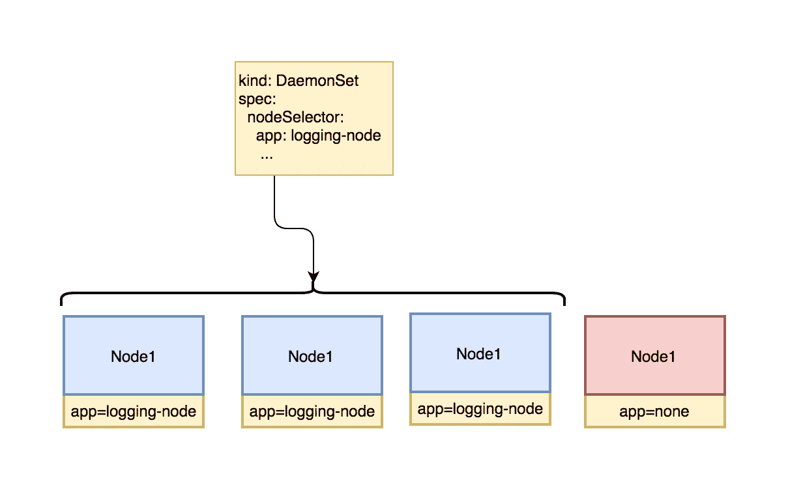
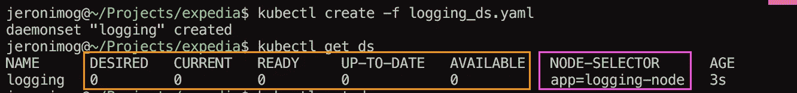
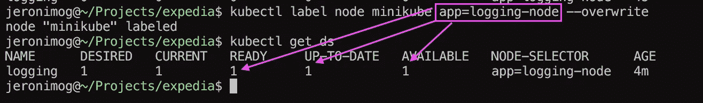

# Kubernetes 101 DaemonSets #5

> 原文：<https://medium.com/hackernoon/kubernetes-101-daemonsets-5-c5bbfcbb1579>

大家好，今天我们将稍微了解一下 Kubernetes 中的 daemonsets(**DS**),**DS**背后的想法是确保所有节点(或者一些，取决于选择器)都在运行给定 pod 的副本。



一个很好的问题是何时使用它们，文档中提到了您可能希望强制运行的内容和所有节点:

*   日志聚合和收集
*   存储集群
*   监视

它们在 yaml 文件中描述如下:

我使用 nginx 作为图像只是为了保持简单，所以让我们创建它:)



一切看起来都很好，问题是为什么我们没有准备好**电流**或**？**

**Daemonsets** 在选择器 **"app=logging-node"** 上操作，这意味着对于这个 pod(通过一个 **DS** )在节点中登陆 pod 副本，在节点中必须有一个标签与 **DS 的选择器匹配。**

所以让我们添加或替换标签

```
kubectl label node minikube app=logging-node --overwrite
```



这就是了，pod 的一个副本已经到达其标签与节点选择器匹配的节点，很简单，对吗？

例如，您可以使用以下命令更新正在运行的 DS 上的映像:

```
kubectl set image ds/logging webserver=nginx-1.2.3.4
```

很酷的东西。

下一次，让我们看看如何根据各种指标自动缩放窗格？希望我能让它在 minikube 中工作！

感谢各位的阅读和关注！

[](http://bit.ly/HackernoonFB)[](https://goo.gl/k7XYbx)[](https://goo.gl/4ofytp)

> [黑客中午](http://bit.ly/Hackernoon)是黑客如何开始他们的下午。我们是 AMI 家庭的一员。我们现在[接受投稿](http://bit.ly/hackernoonsubmission)并乐意[讨论广告&赞助](mailto:partners@amipublications.com)机会。
> 
> 如果你喜欢这个故事，我们推荐你阅读我们的[最新科技故事](http://bit.ly/hackernoonlatestt)和[趋势科技故事](https://hackernoon.com/trending)。直到下一次，不要把世界的现实想当然！

