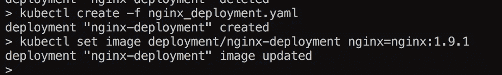
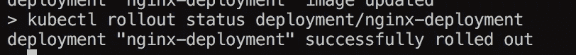
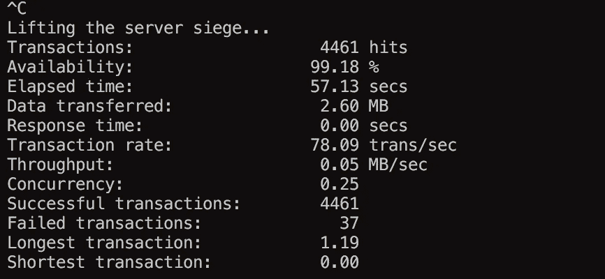

# Kubernetes 101 推出 2 #5

> 原文：<https://medium.com/hackernoon/kubernetes-101-rollouts2-5-2928ecce7af5>

那么，当你推出时会发生什么，一些容器将被销毁，可能一些容器的实时流量去，sitcky 会话等。

我想快速查看过渡有多顺利，让我们创建一个部署，更新图像并运行围攻来查看我们损失了多少:

**围攻**:

%可能不是一个准确的衡量标准，因为我在推出之前运行了围攻，但 **37** 事务失败的比率为**78/秒**，这并不太糟糕，但我肯定有办法做得更好。

> [黑客中午](http://bit.ly/Hackernoon)是黑客如何开始他们的下午。我们是 [@AMI](http://bit.ly/atAMIatAMI) 家庭的一员。我们现在[接受投稿](http://bit.ly/hackernoonsubmission)并乐意[讨论广告&赞助](mailto:partners@amipublications.com)机会。
> 
> 如果你喜欢这个故事，我们推荐你阅读我们的[最新科技故事](http://bit.ly/hackernoonlatestt)和[趋势科技故事](https://hackernoon.com/trending)。直到下一次，不要把世界的现实想当然！

