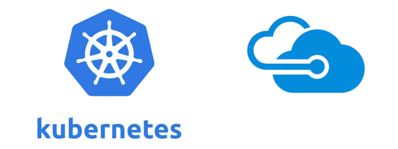
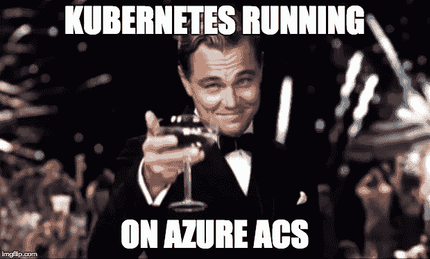
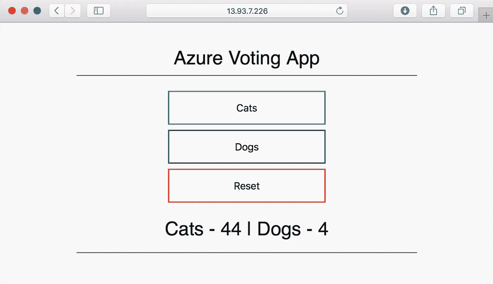
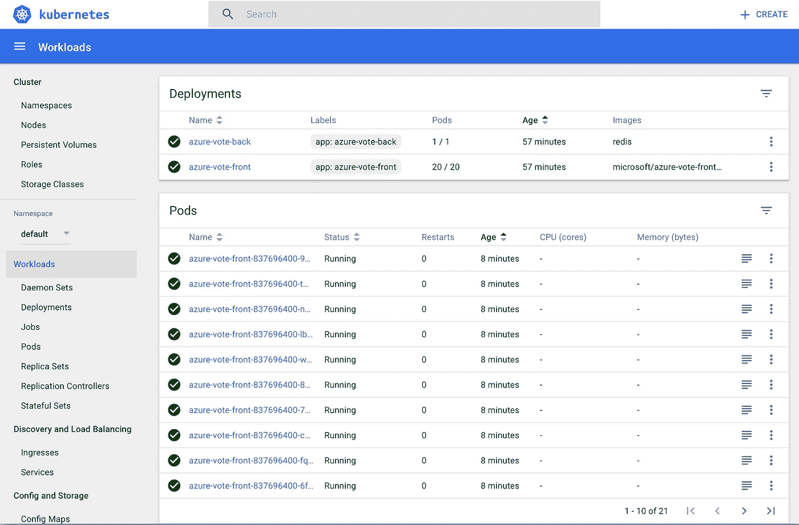

# kubernetes Azure 上的冒险—第 1 部分(Linux 集群)

> 原文：<https://medium.com/hackernoon/kubernetes-adventures-on-azure-part-1-e0f68b486679>



Kubernetes on Microsoft Azure

这是 3:

*   [Kubernetes Azure 历险记—第二部分(Windows 集群和扩展 pod 的技巧)](https://hackernoon.com/kubernetes-adventures-on-azure-part-2-windows-cluster-and-trick-for-scaling-pods-27e769edde15)
*   [Kubernetes Azure 历险记——第三部(ACS 引擎&混合集群)](https://hackernoon.com/kubernetes-adventures-on-azure-part-3-acs-engine-hybrid-cluster-bc453c13b451)

上个月，我读了三本关于 Kubernetes 的好书:

*   [吉吉·萨夫扬的《掌握库伯内特》](https://www.amazon.com/Mastering-Kubernetes-Gigi-Sayfan/dp/1786461005/ref=sr_1_1?ie=UTF8&qid=1503584087&sr=8-1&keywords=mastering+kubernetes)在[亚马逊](https://hackernoon.com/tagged/amazon)有售。
*   [Kubernetes: Up and Running](https://www.safaribooksonline.com/library/view/kubernetes-up-and/9781491935668/) 作者 [Kelsey Hightower](https://medium.com/u/9e783a6f12f6?source=post_page-----e0f68b486679--------------------------------) ，Brendan Burns 和 [Joe Beda](https://medium.com/u/e756671124dc?source=post_page-----e0f68b486679--------------------------------) 可在亚马逊或网上的《伟大的狩猎之旅》书籍中找到。
*   [Kubernetes in Action](https://www.manning.com/books/kubernetes-in-action) 作者[Marko luka](https://medium.com/u/4b041708df04?source=post_page-----e0f68b486679--------------------------------)在曼宁网站上以 MEAP 的身份提供

现在是时候真正开始在 Kubernetes 的神奇世界中冒险了！我会用微软的 Azure 来做这件事。

## 让我们试试 Azure 容器服务(又名 ACS)及其优缺点(第一次尝试)

微软 Azure 提供了一个现成的 Kubernetes 解决方案:Azure 容器服务(ACS)。如果我们不考虑新的 Azure 容器实例，这似乎是在 Azure 上测试 Kubernetes 集群最简单的方法。它将 Kubernetes 隐藏在幕后，让您可以简单地部署容器，这些容器将由 cou、内存以及秒来充电！

我们试试 ACS 吧！但首先我想立即强调一下它目前的限制，这样你们就知道了:

*   没有混合 Linux 和 Windows 节点的混合集群。
*   使用的版本不是最新的(Kubernetes ACS 1.6.6 对最新的 1.7.4)。
*   我在使用 cli 命令时遇到了一些问题，似乎(对我来说)还没有准备好。

开始我们的 ACS 之旅最简单的方法是跟随“[部署 Kubernetes cluster for Linux containers](https://docs.microsoft.com/en-us/azure/container-service/kubernetes/container-service-kubernetes-walkthrough)”，它在页面顶部显示了一个美丽的 4 分钟阅读时间。

**注意**:它将指导您使用 Azure Cloud Shell 创建一个只包含 **Linux 节点的 Kubernetes 集群。在这篇来自微软的[文章之后，我个人安装并使用了一个本地 Azure CLI。另一篇文章:"](https://docs.microsoft.com/en-us/cli/azure/install-azure-cli)[为 Windows 容器部署 Kubernetes 集群](https://docs.microsoft.com/en-us/azure/container-service/kubernetes/container-service-kubernetes-windows-walkthrough)"将展示如何用 **Windows only 节点**创建 Kubernetes 集群。**这个缺失的混合部署对我来说是一个限制，因为我想在 Linux 和 Windows 上使用带有 worker 角色的混合集群**。但是我很确定这个限制可以通过直接使用 ACS 引擎在 Azure 上手动部署 Kubernetes 集群来克服(我的冒险中的另一章)。**

安装 Linux ACS Kubernets 集群的主要步骤是:

1.  创建资源组
    `az group create --name myAcsTest --location westeurope`
2.  创建一个 Kubernetes 集群
    `az acs create --orchestrator-type kubernetes \
    --resource-group myAcsTest --name myK8sCluster \
    --generate-ssh-keys --agent-count 2`
3.  连接到集群
    `az acs kubernetes get-credentials --resource-group myAcsTest --name myK8sCluster`

几分钟后，您的集群应该启动并运行，有 1 个主节点和 2 个节点，但我第一次尝试时运气不好。

**第 2 步失败(通过第二次尝试解决)**:第一次尝试第 2 步时，我收到一个错误，该错误在第二次运行命令时消失，可能是由于 AAD 中新创建的应用程序凭证尚未准备好使用。以下是详细的错误:

```
Deployment failed. {
 “error”: {
 “code”: “BadRequest”,
 “message”: “The credentials in ServicePrincipalProfile were invalid. Please see [https://aka.ms/acs-sp-help](https://aka.ms/acs-sp-help) for more details. (Details: AADSTS70001: Application with identifier …..
```

**步骤 3 注意事项(已解决删除并以另一种方式重新创建集群)**:此步骤失败，出现“认证失败”错误。可能是因为我的用户下已经有一个 id_rsa 文件。ssh 文件夹？

快速解决方案是使用以下命令删除群集:

```
az group delete --name myAcsTest --yes --no-wait
```

并再次创建它，但这次我们将首先自己创建一个 SSH 密钥对。

## 让我们再次尝试 Azure 容器服务(第二次尝试)

从 Linux/MacOS，您可以遵循:[如何在 Azure 中为 Linux 虚拟机创建和使用 SSH 公共和私有密钥对](https://docs.microsoft.com/en-us/azure/virtual-machines/linux/mac-create-ssh-keys)创建一个 SSH 密钥对，并存储在您的机器上。这非常重要，需要连接到您的 Kubernetes 集群。

要创建 SSH 密钥对，请运行以下命令，并确保指定存储密钥的路径，我的路径是~/acs/sshkeys/acsivan:

```
ssh-keygen -t rsa -b 2048
```

**注意**:我更改了组和集群名称，以避免与之前组的待定删除冲突，该操作已经使用 no-wait 参数异步执行。

让我们使用以下命令再次尝试创建我们的 Kubernetes 集群(用您的命令替换 ssh 密钥对路径):

```
az group create --name myAcsTest2 --location westeuropeaz acs create --orchestrator-type kubernetes \
--resource-group myAcsTest2 --name myK8sCluster2 \
--agent-count 2 --ssh-key-value ~/acs/sshkeys/acsivan.pubaz acs kubernetes get-credentials --resource-group myAcsTest2 --name myK8sCluster2 --ssh-key-file ~/acs/sshkeys/acsivan
```

如果控制台中没有错误，您就可以连接到 Azure 上的第一个 Kubernetes 集群了！！！万岁！



KUBERNETES CLUSTER UP AND RUNNING!

让我们运行第一个 kubectl 命令来检查集群的节点:

```
> kubectl get nodesNAME STATUS AGE VERSION
k8s-agent-96ca25a6–0 Ready 12m                     v1.6.6
k8s-agent-96ca25a6–1 Ready 12m                     v1.6.6
k8s-master-96ca25a6–0 Ready,SchedulingDisabled 13m v1.6.6
```


WAIT! 1.6.6?

等等… v1.6.6？2017 年 8 月 24 日最新的 Kubernets 版本是 1.7.4。**这是 Azure ACS 的另一个限制:它不会动态更新到最新版本。**

## 是时候玩我们新的超级超级棒的 Kubernetes 集群了

首先，我们将部署 Azure Vote 应用程序，如我们正在关注的微软文章中所述，然后我们将在我们的集群上运行一些命令，在迁移到 Windows 集群之前对它进行一些测试。

*   按照*运行应用程序*一节所述创建`azure-vote.yaml`一个文件。它定义了 2 个部署:
    -基于 Redis 服务的 azure-vote-back end
    -web 应用程序的 azure-vote-front

```
apiVersion: apps/v1beta1
kind: Deployment
metadata:
  name: azure-vote-back
spec:
  replicas: 1
  template:
    metadata:
      labels:
        app: azure-vote-back
    spec:
      containers:
      - name: azure-vote-back
        image: redis
        ports:
        — containerPort: 6379
          name: redis
---
apiVersion: v1
kind: Service
metadata:
  name: azure-vote-back
spec:
  ports:
  — port: 6379
  selector:
    app: azure-vote-back
---
apiVersion: apps/v1beta1
kind: Deployment
metadata:
  name: azure-vote-front
spec:
  replicas: 1
  template:
    metadata:
      labels:
        app: azure-vote-front
    spec:
      containers:
      — name: azure-vote-front
        image: microsoft/azure-vote-front:redis-v1
        ports:
        — containerPort: 80
        env:
        — name: REDIS
          value: “azure-vote-back”
---
apiVersion: v1
kind: Service
metadata:
  name: azure-vote-front
spec:
  type: LoadBalancer
  ports:
  — port: 80
  selector:
    app: azure-vote-front
```

*   使用以下命令部署它们:`kubectl create -f azure-vote.yaml` 您将获得以下输出:

```
deployment “azure-vote-back” created 
service “azure-vote-back” created 
deployment “azure-vote-front” created 
service “azure-vote-front” created
```

*   测试您的应用程序运行:`kubectl get service azure-vote-front --watch` 等待 Azure 负载平衡器在您的服务前面为您创建，并为控制台获取其 IP。
    打开该 IP 的浏览器，瞧:应用程序正在运行！



Azure Voting App running on an Azure ACS Kubernetes cluster

现在让我们用它来测试一些 kubectl 命令:

*   获取正在运行的服务列表`kubectl get services`

```
NAME CLUSTER-IP EXTERNAL-IP PORT(S) AGE
azure-vote-back  10.0.136.59 <none>      6379/TCP 39m
azure-vote-front 10.0.96.34  13.93.7.226 80:30163/TCP 39m
kubernetes       10.0.0.1    <none>      443/TCP 1h
```

*   获取您的部署列表`kubectl get deployments`

```
NAME DESIRED CURRENT UP-TO-DATE AVAILABLE AGE
azure-vote-back  1 1 1 1 40m
azure-vote-front 2 2 2 2 40m
```

*   使用`kubectl describe deployment azure-vote-front`获得您前端部署的详细描述
*   将您的前端部署扩展到 20 个副本(我喜欢这个！快速、简单、立即)
    `kubectl scale deployments/azure-vote-front --replicas 20`
    和
    `kubectl get deployment azure-vote-front`检查新值

## 等等！Kubernetes 仪表板在哪里？

再一次，一个超级简单的命令将把你带到一个仪表板，从你的浏览器显示你的集群(我喜欢 Kubernetes！)

达到这个目标的最好方法是`kubectl proxy`，它应该会给你一个类似于`Starting to serve on 127.0.0.1:8001`的输出

打开浏览器到 [http://127.0.0.1:8001/ui](http://127.0.0.1:8001/ui) ，你会看到 dashboard 在运行。



Kubernetes Dashboard running on Azure ACS

现在我们可以用这个简单的命令轻松删除(并停止支付)一切:`az group delete --name myAcsTest2 --yes --no-wait`

在转移到完全混合集群之前，我用 Windows 集群测试了 Azure 容器服务。详情可以在[第二部](/@ivanfioravanti/kubernetes-adventures-on-azure-part-2-windows-cluster-and-trick-for-scaling-pods-27e769edde15)中找到。

然后，我将尝试将集群分散到多个云提供商和一个优先位置(做梦……)