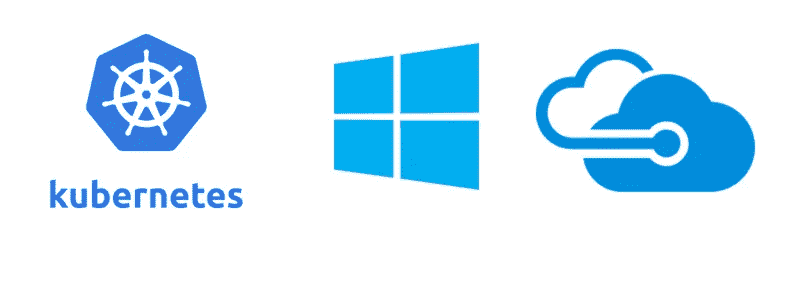
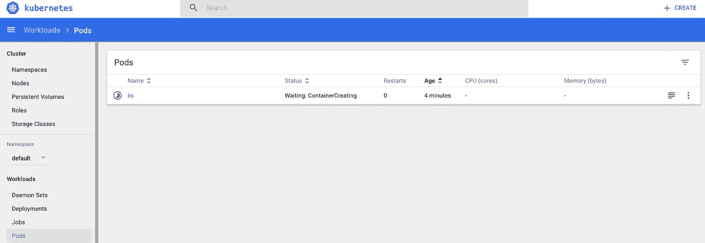
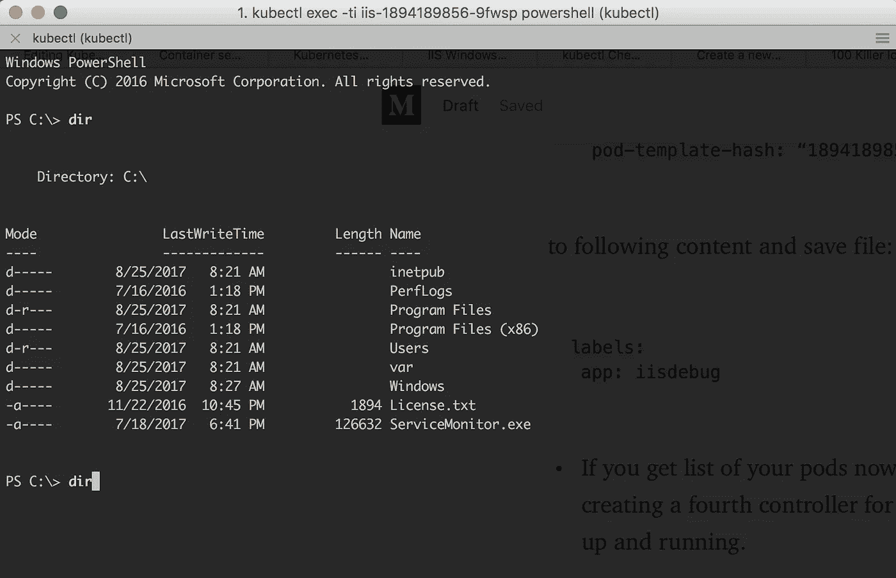
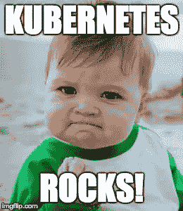

# Azure 上的 Kubernetes 冒险—第 2 部分(Windows 集群和扩展 pod 的技巧)

> 原文：<https://medium.com/hackernoon/kubernetes-adventures-on-azure-part-2-windows-cluster-and-trick-for-scaling-pods-27e769edde15>



Kubernetes Windows cluster on Azure

# Windows Kubernetes 群集安装

第三部分可在这里获得:[Kubernetes Azure 上的冒险——第三部分(ACS 引擎&混合集群)](https://hackernoon.com/kubernetes-adventures-on-azure-part-3-acs-engine-hybrid-cluster-bc453c13b451)

在本系列的第 1 部分中，我们已经看到了如何在 Azure 容器服务上创建一个 Linux Kubernetes 集群。

今天，我将尝试创建一个 Kubernetes 集群，但是使用 Windows 而不是 Linux 作为节点。显然 Master 永远是 Linux。

这次我将一步一步地按照[部署 Kubernetes cluster for Windows containers](https://docs.microsoft.com/en-us/azure/container-service/kubernetes/container-service-kubernetes-windows-walkthrough)，然后使用新创建的集群。

## 创建 Kubernetes Windows 集群

让我们从为这个测试创建一个资源组开始，这样我们可以轻松地将所有的云工件分组，并在最后删除所有的内容。ARM 是微软 Azure 的重要补充。

*   创建专用资源组:`az group create --name myAcsWinTest --location westeurope`
*   创建 Kubernetes 集群(这里我将使用在第 1 部分中创建的 ssh 密钥对):

```
az acs create --orchestrator-type=kubernetes \
--resource-group myAcsWinTest \
--name=myK8sCluster \
--agent-count=2 \
--ssh-key-value ~/acs/sshkeys/acsivan.pub \
--windows --admin-username azureuser \
--admin-password myTestPassword1
```

*   连接到 Kubernetes cluser: `az acs kubernetes get-credentials --resource-group=myAcsWinTest --name=myK8sCluster --ssh-key-file ~/acs/sshkeys/acsivan`
*   检查连接检索节点列表:`kubectl get nodes`

```
NAME                  STATUS AGE  VERSION
fb7c1acs9000          Ready  19m  v1.6.6–9+8a67b481dfc2c6
fb7c1acs9001          Ready  19m  v1.6.6–9+8a67b481dfc2c6
k8s-master-fb7c1c12–0 Ready  19m  v1.6.6
```

集群启动并运行！厉害！

在继续之前，打开 [Kubernetes](https://hackernoon.com/tagged/kubernetes) 仪表板，使用浏览器检查集群中的情况。

*   连接到 Kubernetes 仪表板:
*   打开一个指向[http://127 . 0 . 0 . 1:8001/ui](http://127.0.0.1:8001/ui)的浏览器，让它保持打开，以便您可以在那里检查，稍后应用更改。

## 玩 Kubernetes Windows 集群

让我们从使用 windowsservercore 而不是 nanocore 的 IIS 的简单示例开始，如[微软](https://hackernoon.com/tagged/microsoft)文章所述。我将按照同样的步骤来介绍像 pod 这样的概念，以及一旦手动部署就暴露它的方法。
**注意**:我认为这样不好，因为你最终得到了一个 pod，一个服务，但是在它们之间没有控制器作为一个副本集或者一个管理它的部署。稍后我们将看到如何在不停机的情况下“修复”这个问题。

*   部署 IIS windowsservercore 容器

使用以下内容创建 iis.json:

```
{
 "apiVersion": "v1",
 "kind": "Pod",
 "metadata": {
   "name": "iis",
   "labels": {
     "app": "iis"
   }
 },
 "spec": {
   "containers": [
     {
       "name": "iis",
       "image": "microsoft/iis",
       "ports": [
         {
         "containerPort": 8000
         }
       ]
     }
   ],
   "nodeSelector": {
    "beta.kubernetes.io/os": "windows"
    }
  }
}
```

我们现在可以将配置应用到名为 iis: `kubectl apply -f iis.json`的新 Pod

*   检查运行 Pod: `kubectl get pods --watch`创建它大约需要 10 分钟，因为 windowsservercore 映像相当大~5GB。为了赢得时间，您可以现在就暴露这个 pod，不需要在这个测试中等待 pod 的创建。负载平衡器创建将立即开始。
*   打开 Pods 部分的 [Kubernetes 仪表板](http://127.0.0.1:8001/api/v1/namespaces/kube-system/services/kubernetes-dashboard/proxy/#!/pod?namespace=default)，您将看到如下内容:



*   使用服务暴露 Pod:`kubectl expose pods iis --port=80 --type=LoadBalancer`(在以后的帖子中，我将在混合集群中尝试 Ingress，让我们将 Kubernetes 推向极限！).
*   使用`kubectl get svc --watch`等待负载平衡器激活，或使用 Kubernetes 仪表板手动检查。

当您拥有 IP 时，您可以尝试在那里浏览，您应该会看到:


# 如果我有一个要扩展的 pod，我会 _________？

现在，让我们尝试横向扩展我们的 iis pod。等等…我们不能直接扩展一个舱。我们需要一个副本集或者一个部署。你会怎么处理这件事？

在这里，我使用了我在研究中发现的一个技巧，让你在没有任何最终用户停机时间的情况下扩展你的 pod**。或许有更好的方法，如果有，请添加到评论中。**


> 如果我们知道我们在做什么，那就不叫研究了，对吗？
> **爱因斯坦**

**需要简要说明**

*   运行`kubectl describe service iis`,你可以看到服务有一个等于“app=iis”的选择器。这意味着任何带有此标签的 pod 都将使用此负载平衡器公开

```
Name: iis
Namespace: default
Labels: app=iis
Annotations: <none>
**Selector: app=iis**
Type: LoadBalancer
IP: 10.0.201.106
LoadBalancer Ingress: 40.118.109.119
...
...
```

这里的想法是创建一个新的部署，它将使用相同的标签创建我们的 iis pod 的两个新副本。

*   创建一个名为 iisdeployment.yaml 的文件，包含以下内容:

```
apiVersion: apps/v1beta1
kind: Deployment
metadata:
 name: iis
spec:
 replicas: 2
 template:
   metadata:
     labels:
       **app: iis**
   spec:
     containers:
     — name: iis
       image: microsoft/iis
       ports:
       — containerPort: 80
         name: iis
     nodeSelector:
       beta.kubernetes.io/os: windows
```

*   使用`kubectl create -f iisdeployment.yaml`创建部署
*   现在运行`kubectl get pods`,你可以看到一个正在运行的 pod 和另外两个正在创建的 pod:

```
NAME                 READY STATUS            RESTARTS AGE
iis                  1/1   Running           0        32m
iis-1894189856-bxjf5 0/1   ContainerCreating 0        6s
iis-1894189856-zjw98 0/1   ContainerCreating 0        6s
```

**注意**:在这些步骤中，您可以使用浏览器检查您的服务，查看它是否正常运行。

*   您现在可以删除原始 pod，而不会给运行`kubectl delete pods iis`的最终用户带来任何停机时间

```
NAME                 READY STATUS            RESTARTS AGE
**iis                  1/1   Terminating       0        49m**
iis-1894189856-bxjf5 1/1   Running           1        17m
iis-1894189856-zjw98 1/1   Running           0        17m
```

## 最多可扩展到 4 个副本！

*   这下好办了:`kubectl scale deployments/iis replicas 4`

```
NAME                 READY STATUS            RESTARTS AGE
**iis-1894189856–9fwsp 0/1   ContainerCreating 0        52s**
iis-1894189856-bxjf5 1/1   Running           1        17m
**iis-1894189856-t3m26 0/1   ContainerCreating 0        52s**
iis-1894189856-zjw98 1/1   Running           0        17m
```

**如果我们有一个 pod IIS-1894189856–9 fwsp 的问题，我们希望将其与其他部分隔离，同时保持其运行以进行调试，该怎么办？**

*   我这样跑:`kubectl edit pods iis-1894189856-9fwsp`
*   文件在预定义的编辑器中打开
*   将标签部分从:

```
labels:
  app: iis
  pod-template-hash: “1894189856”
```

到以下内容并保存文件:

```
labels:
 app: iisdebug
```

*   如果您现在获得了您的 pod 列表，您将会看到 Kubernetes 已经为 iis 部署创建了第四个控制器，并且您的 pod 仍然在那里运行。

## 如何连接到正在运行的 Windows Server 核心容器？

*   **您现在可以调试这个容器，确保它没有对外公开，因为我们的 iis 服务使用 app:iis 作为选择器。**
*   使用`kubectl exec -ti iis-1894189856-9fwsp powershell`连接到它



*   从您的计算机上，您现在可以在云中的运行映像中轻松运行任何 PowerShell 命令！
*   请记住，当您使用以下工具玩完群集后，请删除所有内容:

```
az group delete — name myAcsWinTest — yes — no-wait
```



在第 3 部分中，我将尝试用 Windows ad Linux 节点创建一个混合集群！