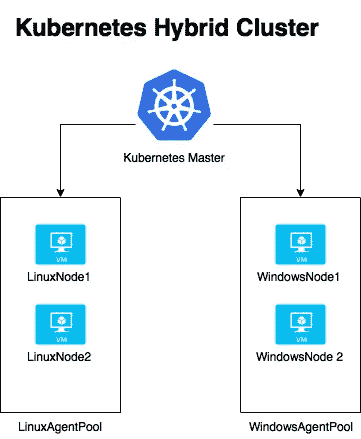
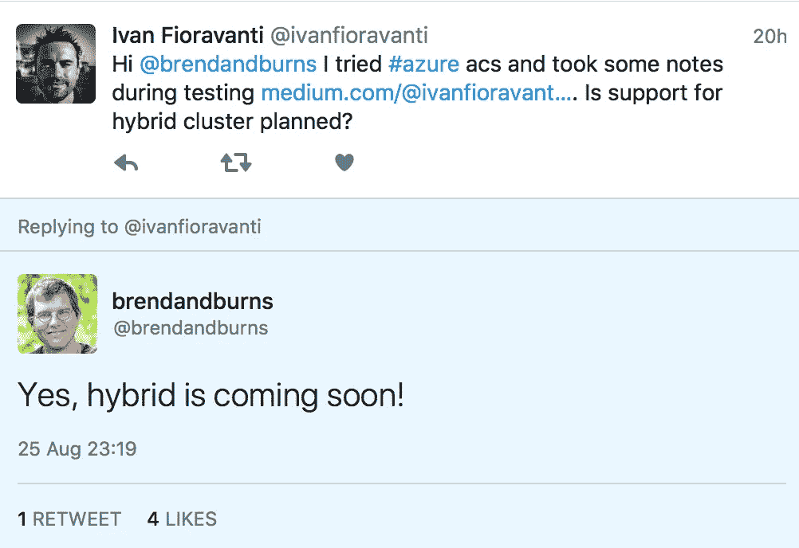
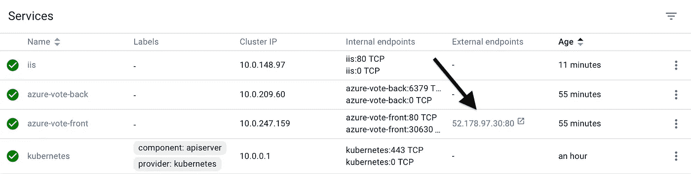
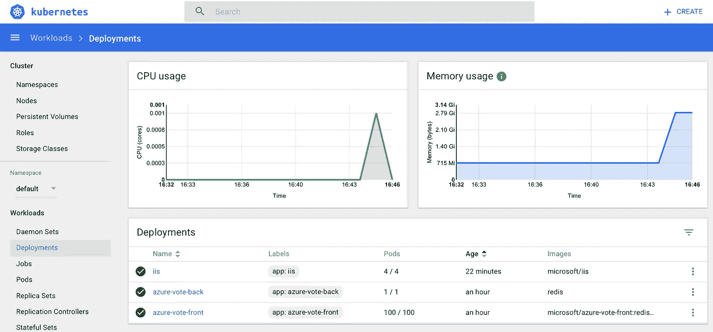

# Azure 上的 Kubernetes 冒险—第 3 部分(ACS 引擎和混合集群)

> 原文：<https://medium.com/hackernoon/kubernetes-adventures-on-azure-part-3-acs-engine-hybrid-cluster-bc453c13b451>



我今天的目标是在微软 Azure 上安装一个简单的混合 Kubernetes 集群:

*   1 个 Linux 主机
*   一个 Linux 代理池中有 2 个 Linux 节点
*   WindowsAgentPool 中的 2 个 Windows 节点

这是当前版本的 Azure Container Services 无法实现的，但昨天 [Brendan Burns](https://medium.com/u/2f3dfd00c443?source=post_page-----bc453c13b451--------------------------------) 证实他们正在努力！



那么，我们现在如何安装这个集群呢？答案是 [ACS-Engine](https://github.com/Azure/acs-engine) 这是微软的一个开源项目，它接受“集群定义”作为输入，并返回一个带有附加工件(即 kubectl 导出文件)的 ARM 模板作为输出。

## 开始吧！

为了使事情更简单，我将重用在第 1 部分和第 2 部分中创建的一些工件。

*   创建一个名为`acs`的文件夹来存储您所有的工作工件
*   克隆 ACS 引擎库:`git clone [https://github.com/Azure/acs-engine](https://github.com/Azure/acs-engine)`
*   进入示例文件夹:`cd acs-engine/examples`，在那里你可以找到许多集群定义的例子。这里你可以看到一个`windows`文件夹，它包含了需要的定义:`kubernetes-hybrid.json`

**重要提示**:当前[版本 0.5.0](https://github.com/Azure/acs-engine/releases/tag/v0.5.0) 存在一个[问题](https://github.com/Azure/acs-engine/issues/1359)，导致源代码中的示例与其不兼容(它们更新更多)。这里我们有两个解决方案:

*   复杂:在本地编译一个新版本
*   **简单**:更改示例，使其与旧版本兼容

我们就选复杂的！开玩笑……我跟踪了这个复杂的东西，但是目前在 macOS 上它并不简单，因为你需要在＄GOPATH/src 中克隆 acs-engine 源代码，并且需要一个单独的文章。所以让我们来看看简单的解决方案。

*   在您最喜欢的编辑器中打开`kubernets-hybrid.json`文件，并更改下面的行

出发地:

```
"servicePrincipalProfile": {
  "clientId": "",
  "secret": ""
}
```

收件人:

```
"servicePrincipalProfile": {
  "**servicePrincipalClientID**": "",
  "**servicePrincipalClientSecret**": ""
}
```

等等，不要关闭文件！我们想在集群中使用最新的 Kubernetes 版本，对吗？所以加粗一行:

```
"orchestratorProfile": {
  "orchestratorType": "Kubernetes",
  **"orchestratorVersion": "1.7.2"**
},
```

现在我们可以按照[部署一个 Kubernetes 集群](https://github.com/Azure/acs-engine/blob/master/docs/kubernetes/deploy.md)中的步骤，它描述了一种**短**和**长**的方式来部署您的集群。

## 短程缺点

在这里，我们将按照简短的方式，但在开始之前，我想强调这里的一些缺点:

*   DNS 前缀:一个随机数将被添加到作为参数传递的前缀中，以使其唯一
*   每次运行 deploy 命令时，将在您的订阅上创建一个新的应用程序(ServicePrincipal ),当您删除 ResourceGroup 时，该应用程序将保留在订阅上，因为它不是 resource group 的一部分
*   将为部署创建一个新的 SSH 密钥对

**解决方案 1** :我们可以避免所有这些缺点，只需创建一次工件(应用程序、SSH 密钥对、DNS)并将它们的值添加到用于部署的模板 json 文件中。我会为了宋承宪这样做。

**解决方案 2** :在第一次部署结束时，acs-engine 用生成的工件生成一个 _output 文件夹。这里有一个名为**azure deploy . parameters . JSON**的文件，它包含可以在所使用的集群定义文件中复制的所有参数值。仅此而已。

## 部署

在本文的前几部分，我创建了一个 SSH 密钥对，我想使用它而不是生成一个新的。这可以通过复制。json 文件下面部分的 pub 文件。下一步将跳过 ssh 密钥对的生成，因为已经在模板中找到了。

```
"linuxProfile": {
  "adminUsername": "azureuser",
  "ssh": {
    "publicKeys": [
      {
        "keyData": "YOURKEY starts with ssh-rsa"
      }
    ]
  }
},
```

对于部署，您需要您正在使用的订阅 id，该 id 可以通过`az account show`轻松检索

。/ACS-engine deploy-subscription-id your subscription id where-DNS-prefix ivank8 stest-location westeurope-auto-suffix-API-model ~/ACS/ACS-engine/examples/windows/kubernetes-hybrid . JSON

**注意**:如果你想避免传递 dns 前缀作为参数，你可以把它添加到 template.json 文件中，就像我们对`keyData`所做的一样，同样的技巧可以用于文件中的任何元素。acs-engine 足够智能，如果有数据，可以跳过这些步骤。即 ServicePrincipalProfile 创建。

如果一切顺利，您应该会看到如下内容:

```
WARN[0002] apimodel: missing masterProfile.dnsPrefix will use “ivank8stest-59a13555”
WARN[0002] apimodel: ServicePrincipalProfile was missing or empty, creating application…
WARN[0004] created application with applicationID (11111111-048e-420f-afad-1fe450036077) and servicePrincipalObjectID (22222222-b0fb-4395–9576–6bb18481f88f).
WARN[0004] apimodel: ServicePrincipalProfile was empty, assigning role to application…
INFO[0030] Starting ARM Deployment (myAcsTest-1222046555). This will take some time…
```


Coffee break is needed!

**INFO[0526]已完成 ARM 部署(myacstest 2–676730522)。**

我们做到了！我们的混合 Kubernetes 集群似乎已经开始运行了！让我们现在测试它。

## 连接到您的 Kubernetes 集群

部署完成后，您应该有一个`_output`文件夹，其中有一个名为超级集群的 dns 前缀的子文件夹。进去吧。

它包含由 acs-engine 生成的工件，并且如步骤 9 中的[所述`kubeconfig`对我们非常有用。我会尽量让它超级简单。](https://github.com/Azure/acs-engine/blob/master/docs/kubernetes/walkthrough.md)

从您的终端运行以下命令指向您的 _output 文件夹

```
export KUBECONFIG=~/acs/acs-engine/_output/ivank8stest-59a13ac6/kubeconfig/kubeconfig.westeurope.json
kubectl get nodesNAME                        STATUS                        AGE       VERSION
23586acs9010                Ready                         1s        v1.7.2-4+b0c9ea2463aba4
23586acs9011                Ready                         3s        v1.7.2-4+b0c9ea2463aba4
k8s-linuxpool1-23586643-0   NotReady                      2s        v1.7.2
k8s-linuxpool1-23586643-1   NotReady                      5s        v1.7.2
k8s-master-23586643-0       NotReady,SchedulingDisabled   7s        v1.7.2
```

它已经启动并运行了，我们可以在本地的 kubectl 上使用它！


一切都准备好了，让我们试着部署一些 Linux 和 Windows 容器吧！

## **Linux 容器**

我们将部署与第 1 部分中部署的相同的 azure vote 应用程序，但是对部署在 os:linux 节点上所需的 yaml 文件做了一些小的修改。

下面是 azure-vote.yaml 文件的内容，其中突出显示了更改:

```
apiVersion: apps/v1beta1
kind: Deployment
metadata:
  name: azure-vote-back
spec:
  replicas: 1
  template:
    metadata:
      labels:
        app: azure-vote-back
    spec:
      containers:
      - name: azure-vote-back
        image: redis
        ports:
        — containerPort: 6379
          name: redis
 **nodeSelector:
        beta.kubernetes.io/os: linux**
---
apiVersion: v1
kind: Service
metadata:
  name: azure-vote-back
spec:
  ports:
  — port: 6379
  selector:
    app: azure-vote-back
---
apiVersion: apps/v1beta1
kind: Deployment
metadata:
  name: azure-vote-front
spec:
  replicas: 1
  template:
    metadata:
      labels:
        app: azure-vote-front
    spec:
      containers:
      — name: azure-vote-front
        image: microsoft/azure-vote-front:redis-v1
        ports:
        — containerPort: 80
        env:
        — name: REDIS
          value: "azure-vote-back"
 **nodeSelector:
        beta.kubernetes.io/os: linux** ---
apiVersion: v1
kind: Service
metadata:
  name: azure-vote-front
spec:
  type: LoadBalancer
  ports:
  — port: 80
  selector:
    app: azure-vote-front
```

您现在可以使用`kubectl create -f azure-vote.yaml`来部署它

让 Kubernetes 继续工作，让我们转移到…

## **Windows 容器**

这里我们将使用来自第 2 部分的工件，但是压缩在一个描述整个部署的 iisdeploymentfull.yaml 文件中。

```
apiVersion: apps/v1beta1
kind: Deployment
metadata:
  name: iis
spec
  replicas: 2
  template:
    metadata:
      labels:
        app: iis
    spec:
      containers:
      - name: iis
        image: microsoft/iis
        ports:
        - containerPort: 80
          name: iis
      nodeSelector:
        beta.kubernetes.io/os: windows  
---
apiVersion: v1
kind: Service
metadata:
  name: iis
spec:
  ports:
  - port: 80
  selector:
    app: iis
```

同样，我们可以使用`kubectl create -f iisdeploymentfull.yaml`来部署它

现在，我们需要等待几分钟，让一切正常运行。

## 从 Kubernetes 仪表板检查状态

通过常用的代理渠道:`kubectl proxy`连接到您的 Kubernetes 仪表盘，打开浏览器:`http://127.0.0.1:8001/ui`

在这里，您可以随意浏览各个部分，以检查您的集群、pod、部署和服务的状态。

从服务中，您将能够检索可用于测试 iis 和 azure-vote 部署的外部端点。



让我们以快速扩展两种部署来推动我们的群集来结束本文:

`kubectl scale deployments/azure-vote-front --replicas 100`

`kubectl scale deployments/iis --replicas 4`

最终结果:



Kubernetes Hybrid Cluster running on Microsoft Azure

像往常一样，你可以用一个简单的 Azure CLI 2 命令删除一切:`az group delete --name myAcsTest --yes --no-wait`

我们又做到了！现在我们是 Azure Kubernetes 的主人，我们可以轻松地部署我们想要的任何东西！

我的冒险将继续，在 Linux 和 Windows 节点上分发 ingress，监控，Azure 上的 Autoscale 等等。