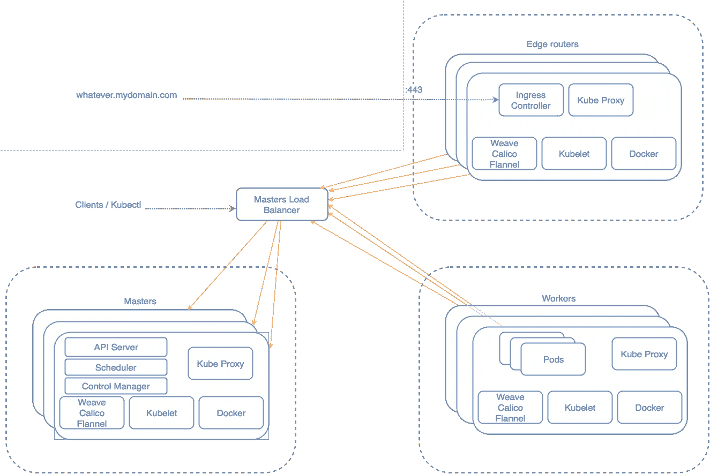

# Kubernetes、入口控制器和 Traefik

> 原文：<https://medium.com/hackernoon/kubernetes-ingress-controllers-and-traefik-a32648a4ae95>

当在一个编排工具(如 Kubernetes 或 Mesos with Marathon)上运行您的应用程序服务时，您需要满足一些常见的需求。您的应用程序通常包含两种类型的服务，一种是应该只能从集群内部看到的服务，另一种是您希望向外部世界公开的服务，在您的集群之外，可能会向 [internet](https://hackernoon.com/tagged/internet) (例如前端)公开。

本文将关注如何在 Kubernetes 上实现这一点。在创建新的[服务](https://hackernoon.com/tagged/service)时，您可以利用 Kubernetes 为您提供的不同服务类型来实现您想要的。

*   ClusterIP:这是默认值。选择此值意味着您希望此服务只能从群集内部访问。
*   ExternalName:这是一种将别名返回到位于集群外部的外部服务的方法。
*   NodePort:在集群的每个节点上的一个端口上公开服务。
*   负载平衡器:除了拥有一个集群内部 IP 和在一个节点端口上公开服务之外，还要向云提供商请求一个负载平衡器，它将请求转发给每个节点的公开为:NodePort 的服务。如果云提供商不支持该功能，该字段将被忽略。

因此，如果您的云不支持“负载平衡器”(例如，您运行本地私有云)，并且您需要比在集群的每个节点上公开端口更复杂的东西，那么过去您需要构建自己的定制解决方案。幸运的是，这不再是真的。

自从 [Kubernetes v1.2.0](https://github.com/kubernetes/kubernetes/blob/master/CHANGELOG.md#v120) 以来，您可以使用 [Kubernetes ingress](http://kubernetes.io/docs/user-guide/ingress/) ，它支持 TLS 和 L7 基于 http 的流量路由。

*你也可以问*[*Kuwit*](http://kuwit.io/)*“我如何向外部世界公开服务？”无论何时你需要记住这一点；-)*

入口是允许入站连接到达群集服务的规则集合。它可以被配置为向服务提供外部可达的 URL、负载平衡流量、终止 SSL、提供基于名称的虚拟主机等。用户通过向 API 服务器发布入口资源来请求入口。

为了让入口资源工作，群集必须运行入口控制器。入口控制器负责通过监视 ApiServer 的/ingresses 端点来动态实现入口。

这是得心应手！现在，您可以更进一步，在运行入口控制器的基础架构级别进行隔离，并将其视为“边缘路由器”,为您的集群实施防火墙策略。HA Kubernetes 集群的情况如下所示:



我们将展示如何使用 [Traefik](https://traefik.io/) 来达到这个目的。Traefik 是一个现代的 HTTP 反向代理和负载平衡器，用于轻松部署微服务。它支持 Mesos/Marathon 和 Kubernetes 之间的几个后端，以自动和动态地管理其配置。

我们将部署一个类似于上图的 Kubernetes 集群，并将 Traefik 作为 [DaemonSet](http://kubernetes.io/docs/admin/daemons/) 运行。

```
**apiVersion: extensions/v1beta1
kind: DaemonSet
metadata:
  name: traefik-ingress-controller-v1
  namespace: kube-system
  labels:
    k8s-app: traefik-ingress-lb
    kubernetes.io/cluster-service: "true"
spec:
  template:
    metadata:
      labels:
        k8s-app: traefik-ingress-lb
        name: traefik-ingress-lb
    spec:
      terminationGracePeriodSeconds: 60
      containers:
      - image: containous/traefik
        name: traefik-ingress-lb
        imagePullPolicy: Always
        ports:
          - containerPort: 80
            hostPort: 80
          - containerPort: 443
            hostPort: 443
          - containerPort: 8080
            hostPort: 8080
        volumeMounts:
          - mountPath: /etc/traefik
            name: traefik-volume
            readOnly: false
        args:
        - --web
        - --kubernetes
        - --configFile=/etc/traefik/traefik.toml
        - --logLevel=DEBUG
      volumes:
        - hostPath:
            path: /etc/traefik
          name: traefik-volume
      nodeSelector:
        role: edge-router**
```

这里的源代码是[这里是](https://github.com/Capgemini/kubeform/blob/master/roles/addons/files/traefik-ingress-controller.yaml)

[您可以配置 Traefik 使用自动 TLS 配置来按需提供服务](https://docs.traefik.io/toml/#acme-lets-encrypt-configuration)。

我们的边缘路由器将只是另一个有一些限制的 Kubernetes 节点。

我们不希望任何其他 pod 被调度到这个节点，所以我们在运行 [kubelet](http://kubernetes.io/docs/admin/kubelet/) 时设置`**--register-schedulable=false**`，并给它一个方便的标签:`**--node-labels=edge-router**`。

Kubernetes 将在集群的每个节点上运行 DaemonSets，即使它们是不可调度的。我们只希望这个 DaemonSet 在边缘路由器节点上运行，所以我们使用“nodeSelector”来匹配我们之前添加的标签。

```
**nodeSelector:
  role: edge-router**
```

请注意，使用这种方法，如果您想要向集群添加一个新的边缘路由器，您只需启动一个带有该标签的新节点，一个新的 DaemonSet 就会自动调度到该机器。不错！

下面是一个视频演示，展示了使用两种不同的云(DigitalOcean 和 AWS)部署两个 Kubernetes 集群的情况:

最近我在 [Kubernetes slack](http://slack.k8s.io/) 上看到很多用户在与入口控制器通信时遇到问题。这通常是由于一个已知的问题。

入口控制器可能想要使用[主机端口](http://kubernetes.io/docs/api-reference/v1/definitions/#_v1_pod)来暴露自己。

```
**ports:
  - containerPort: 80
	hostPort: 80
  - containerPort: 443
	hostPort: 443**
```

如果您使用 [CNI](https://github.com/containernetworking/cni) [网络插件](http://kubernetes.io/docs/admin/network-plugins/)进行集群联网，主机端口尚不支持。

您可以在此处跟踪此问题的当前状态:

[](https://github.com/kubernetes/kubernetes/issues/23920) [## 主机端口似乎不工作问题#23920 kubernetes/kubernetes

### 我不确定我正在做的事情是否会奏效。但是我已经创建了以下 pod: apiVersion: v1 kind: Pod…

github.com](https://github.com/kubernetes/kubernetes/issues/23920) 

【https://github.com/kubernetes/kubernetes/issues/31307 

[https://github.com/containernetworking/cni/issues/46](https://github.com/kubernetes/kubernetes/issues/23920)

目前，潜在的解决方法是使用“主机网络”或使用前面提到的“节点端口”运行服务，以匹配作为 DaemonSet 运行的入口控制器。

希望这篇文章能让你对如何在 Kubernetes 上公开服务以及入口控制器的好处有所了解。

这篇文章也发表在[凯捷工程博客](https://capgemini.github.io/kubernetes/kube-traefik/)上

[](http://bit.ly/HackernoonFB)[](https://goo.gl/k7XYbx)[](https://goo.gl/4ofytp)

> [黑客中午](http://bit.ly/Hackernoon)是黑客如何开始他们的下午。我们是阿妹家庭的一员。我们现在[接受投稿](http://bit.ly/hackernoonsubmission)并乐意[讨论广告&赞助](mailto:partners@amipublications.com)机会。
> 
> 如果你喜欢这个故事，我们推荐你阅读我们的[最新科技故事](http://bit.ly/hackernoonlatestt)和[趋势科技故事](https://hackernoon.com/trending)。直到下一次，不要把世界的现实想当然！

[](https://goo.gl/Ahtev1)