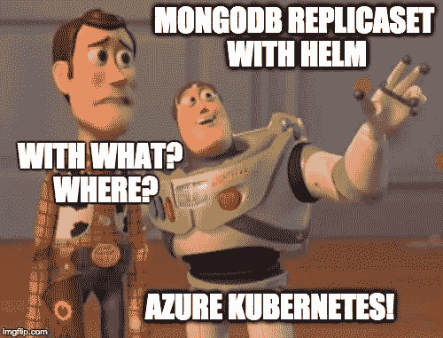

# Kubernetes:使用 Helm 在 Azure 上安装 MongoDB ReplicaSet

> 原文：<https://medium.com/hackernoon/kubernetes-installing-mongodb-replicaset-on-azure-using-helm-20f6bfcf92b3>



是时候在 Azure 上的一个 Kubernetes 集群上安装一个 MongoDB ReplicaSet，并尝试用所有可能的方法杀死它了！
主演:

*   [掌舵](https://github.com/kubernetes/helm)
*   [statefullset](https://kubernetes.io/docs/concepts/workloads/controllers/statefulset/)
*   [持久卷](https://kubernetes.io/docs/concepts/storage/persistent-volumes/)
*   [持续体积索赔](https://kubernetes.io/docs/concepts/storage/persistent-volumes/#persistentvolumeclaims)


# Azure Kubernetes 群集配置

让我们使用 ACS 引擎和下面的命令安装一个包含 1 个主节点和 3 个节点的集群，这些节点都运行 Linux。

我在我的[Kubernetes Adventures on Azure—第 3 部分(ACS 引擎&混合集群)](https://hackernoon.com/kubernetes-adventures-on-azure-part-3-acs-engine-hybrid-cluster-bc453c13b451)文章中描述了使用 ACS 引擎安装集群的详细步骤。详情请参考。在这里，我快速列出了要使用的命令。

## **创建资源组**

这是将本教程的所有资源分组到一个逻辑组中所需要的，以便能够在最后用一个命令删除所有内容。

```
az group create --name k8sMongoTestGroup --location westeurope
```

## **集群配置**

我通常为我在 acs 上的测试创建一个 ssh 对。请查看我的文章[在这里](https://hackernoon.com/kubernetes-adventures-on-azure-part-1-e0f68b486679#cf20)如何做到这一点。我将更改 examples/kubernetes.json 文件，以使用之前创建的 ssh 对、dnsPrefix 和 servicePrincipalProfile ( *跟随* [*部署一个 kubernetes 集群*](https://github.com/Azure/acs-engine/blob/master/docs/kubernetes/deploy.md#step-3-edit-your-cluster-definition) *来自微软*的建议)。

我的 kubernetes.json 文件中用**粗体**表示的变化是:

```
{
  "apiVersion": "vlabs",
  "properties": {
    "orchestratorProfile": {
      "orchestratorType": "Kubernetes",
      "orchestratorRelease": "1.7"
    },
    "masterProfile": {
      "count": 1,
      "dnsPrefix": "**ivank8stest**",
      "vmSize": "Standard_D2_v2"
    },
    "agentPoolProfiles": [
      {
        "name": "agentpool1",
        "count": 3,
        "vmSize": "Standard_D2_v2",
        "availabilityProfile": "AvailabilitySet"
      }
    ],
    "linuxProfile": {
      "adminUsername": "azureuser",
      "ssh": {
        "publicKeys": [
          {
            "keyData": "**ssh-rsa yourpubkeyhere**"
          }
        ]
      }
    },
    "servicePrincipalProfile": {
      "clientId": "**yourappclientid**",
      "secret": "**yourappsecrete**"
    }
  }
}
```

使用以下内容创建您的集群:

```
acs-engine deploy --subscription-id c8399910-5ac0-4dc4-98ec-c7774baf9a02 \
  --resource-group k8sMongoTestGroup \
  --location westeurope \
  --api-model examples/kubernetes.json
```

等待群集启动运行:

```
INFO[0010] Starting ARM Deployment (k8sMongoGroup-2051810234). This will take some time…
INFO[0651] Finished ARM Deployment (k8sMongoGroup-2051810234).
```

使用在 _output 文件夹中部署期间生成的 kubeconfig 文件连接到它。

```
export KUBECONFIG=~/acs/acs-engine/_output/**ivank8stest**/kubeconfig/kubeconfig.westeurope.json
```

以下命令可用于确定集群何时就绪:

```
kubectl cluster-info
kubectl get nodesNAME                        STATUS    AGE       VERSION
k8s-agentpool1-33584487-0   Ready     46m       v1.7.4
k8s-agentpool1-33584487-1   Ready     46m       v1.7.4
k8s-agentpool1-33584487-2   Ready     46m       v1.7.4
k8s-master-33584487-0       Ready     46m       v1.7.4
```

现在，如果您想使用 UI 来检查集群状态，您可以打开 Kubernetes Dashboard:`kubectl proxy`，然后在[http://127 . 0 . 0 . 1:8001/UI](http://127.0.0.1:8001/ui)上打开浏览器

# Helm MongoDB 图表

Helm 是 Kubernetes 的包装经理。它简化了产品和服务的安装和维护，例如:

*   MongoDB
*   雷迪斯
*   兔子 q
*   和许多其他问题

我们将使用它来安装和配置 MongoDB 副本集。

## **舵安装**

先决条件、安装步骤和细节可以在微软的文章[使用 Helm 在 Kubernetes 集群上部署容器](https://docs.microsoft.com/en-us/azure/container-service/kubernetes/container-service-kubernetes-helm)中找到。

具备所有先决条件后，Helm 的安装就像运行命令一样简单:

```
helm init --upgrade
```

## 克隆图表存储库

让我们克隆图表存储库，以便能够在我们的集群上部署所有东西之前检查和更改 MongoDB 图表文件:

```
git clone [https://github.com/kubernetes/charts.git](https://github.com/kubernetes/charts.git)
```

现在进入`/charts/stable/mongodb-replicaset`文件夹。在这里你可以找到组成舵图的所有神器。如果需要，您可以更改`values.yaml`文件，根据您的需要定制安装。现在，让我们尝试一个标准安装。

运行以下命令:`helm install .`并等待以下输出:

```
NAME:   foppish-angelfish
LAST DEPLOYED: Sun Sep 10 20:42:42 2017
NAMESPACE: default
STATUS: DEPLOYEDRESOURCES:
==> v1/Service
NAME                                  CLUSTER-IP  EXTERNAL-IP  PORT(S)    AGE
foppish-angelfish-mongodb-replicaset  None        <none>       27017/TCP  5s==> v1beta1/StatefulSet
NAME                                  DESIRED  CURRENT  AGE
foppish-angelfish-mongodb-replicaset  3        1        5s==> v1/ConfigMap
NAME                                        DATA  AGE
foppish-angelfish-mongodb-replicaset        1     5s
foppish-angelfish-mongodb-replicaset-tests  1     5sNOTES:
...
```

## 搞定了。

MongoDB Replicaset 已经启动并运行了！ **Helm 超轻松，功能强大！**


**Helm is ultra easy and powerful!**

## MongoDB 安装测试

从 helm install 的输出中选择您的版本名称，并在以下命令中使用它:

```
export RELEASE_NAME=**foppish-angelfish**
```

在这里，我们遵循一条与舵图不同的路径。让我们打开一个与远程 Mongo 服务器的交互式 shell 会话！

```
kubectl exec $RELEASE_NAME-mongodb-replicaset-0 --mongo --shellOUTPUTMongoDB shell version v3.4.8
connecting to: mongodb://127.0.0.1:27017
MongoDB server version: 3.4.8
type "help" for help
...
...
A LOT OF WARNING (I will check these in a future post to clean them up, if possible)
...
...
rs0:PRIMARY>
```

## 谁是主要的？

从理论上讲，Pod 0 应该是主设备，正如您在 rom rs: **PRIMARY** >提示符中看到的那样。如果不是这种情况，请执行以下命令来查找主机:

```
rs0:SECONDARY> db.isMaster().primary
```

请注意主 Pod，因为我们将很快杀死它，并使用上面使用的最后一个 kubectl exec 连接到它。

## 故障转移测试

我们需要创建一些数据来检查跨故障的持久性。我们已经连接到 mongo shell，创建一个文档并离开会话非常简单:

```
rs0:PRIMARY> db.test.insert({key1: 'value1'})
rs0:PRIMARY> exit
```

使用以下命令监控副本集中的更改:

```
kubectl run --attach bbox --image=mongo:3.4 --restart=Never --env="RELEASE_NAME=$RELEASE_NAME" -- sh -c 'while true; do for i in 0 1 2; do echo $RELEASE_NAME-mongodb-replicaset-$i $(mongo --host=$RELEASE_NAME-mongodb-replicaset-$i.$RELEASE_NAME-mongodb-replicaset --eval="printjson(rs.isMaster())" | grep primary); sleep 1; done; done';OUTPUT
foppish-angelfish-mongodb-replicaset-0 "primary" : "foppish-angelfish-mongodb-replicaset-0.foppish-angelfish-mongodb-replicaset.default.svc.cluster.local:27017",
foppish-angelfish-mongodb-replicaset-1 "primary" : "foppish-angelfish-mongodb-replicaset-0.foppish-angelfish-mongodb-replicaset.default.svc.cluster.local:27017",
foppish-angelfish-mongodb-replicaset-2 "primary" : "foppish-angelfish-mongodb-replicaset-0.foppish-angelfish-mongodb-replicaset.default.svc.cluster.local:27017",
...
...
...
```

## 干掉初级！

就是这里:`kubectl delete pod $RELEASE_NAME-mongob-replicaset-0`

MongoDB 将开始选举，另一个 Pod 将成为主设备:

```
foppish-angelfish-mongodb-replicaset-1 “primary” : “foppish-angelfish-mongodb-replicaset-1.foppish-angelfish-mongodb-
```

与此同时，Kubernetes 将立即采取纠正措施，实例化新的 Pod 0。

## 杀光他们

现在我们必须模拟一场真正的灾难:让我们杀死所有的豆荚，看 StatefulSet 用所有可用的数据神奇地重建一切。

```
kubectl delete po -l "app=mongodb-replicaset,release=$RELEASE_NAME"
kubectl get po --watch-only
```

几分钟后，我们的 MongoDB 副本集将重新联机，我们可以再次测试它，看看我们的数据是否还在那里。

## 最终检查和清理

运行以下命令以验证创建的密钥仍然存在:

```
kubectl exec $RELEASE_NAME-mongodb-replicaset-1 --mongo --eval=”rs.slaveOk(); db.test.find({key1:{\$exists:true}}).forEach(printjson)”
```

像往常一样，你可以用一个简单的 Azure CLI 2 命令删除一切:`az group delete --name k8sMongoTestGroup --yes --no-wait`

# 如何对外公开这个副本集？

这是[future](https://hackernoon.com/tagged/future)e 帖子的主题。这看起来微不足道，但并不容易。
如果您公开现有服务，它将在其后面的 3 个节点上进行负载平衡，这是错误的。我们需要 3 个负载平衡器，公开 3 个服务，StatefulSet 中的每个 Pod 一个。此外，我们必须激活身份验证和 SSL，以确保从[安全性](https://hackernoon.com/tagged/security)角度来看的最佳实践。

我会找到最好的方法去做，同时玩 Heml，Kubernetes，MongoDB 和 Azure！