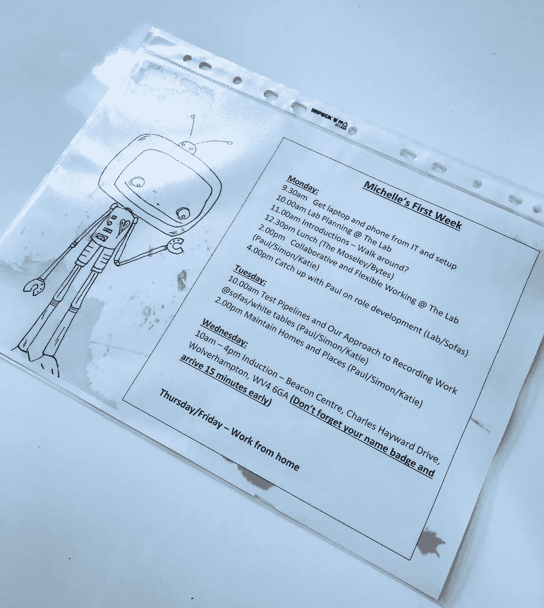
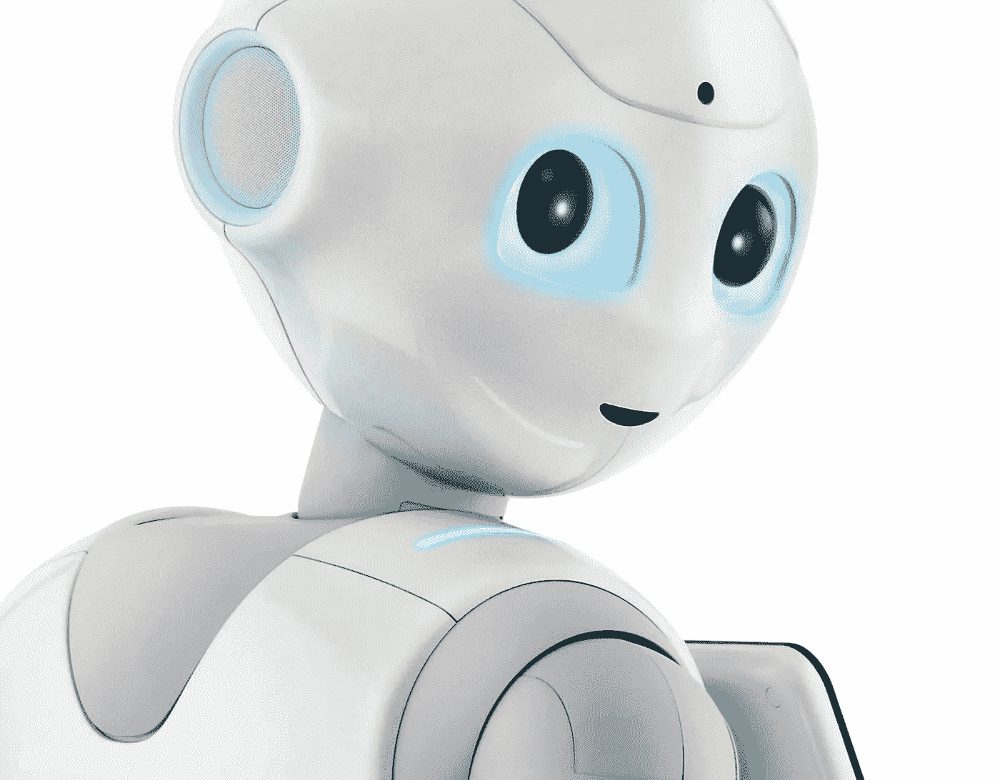

# 实验计划:我们本周的工作#4

> 原文：<https://medium.com/hackernoon/lab-planning-what-we-are-working-on-this-week-4-211bcbae7629>

本周主要是:

**新团队，新开始**

我们在[聘请了一位全新的实验室设计师 Michelle](https://twitter.com/ChelleKButler) ，她将为我们计划的新测试提供必要的带宽。米歇尔在她的面试中让我们大吃一惊，她的热情和她愿意勇敢地放弃一份为期 12 个月的长期工作。这对米歇尔和我们来说都是一个实验，我们真的很期待接下来会发生什么。她将在本周晚些时候为我们做一篇介绍文章。

**如果你可以在任何地方工作，你会在哪里工作？**

随着一个新的完整的团队，我们抓住机会重申我们的价值观。这意味着要工作到*结果而不是时间*，只使用*协作工作工具*，不被*会议*和[所束缚，工作是我们获得最多灵感的](https://www.fastcompany.com/3057608/why-your-company-should-do-a-work-from-anywhere-week)。在一项新的实验中，我们每个月都将至少在不“在家”也不“工作”的地方工作几天，以观察对我们工作效率的影响。我们将在本周晚些时候公布团队承诺。

**新管道**

我们在以前的报道中提到过，但现在是正式的。我们有一个新的工作流程，而且有很多。我们周二大部分时间都在看这在实践中意味着什么，最重要的是，我们从哪里开始。

**机器人会梦到电羊吗？**

(Maybe) coming to a reception area near you. Pepper the robot

过去一周，我们对机器人和人工智能及其在布罗姆福德未来的潜在作用进行了大量讨论:

*   我们把人工智能的模糊机器人工具放到了我们的客户脸书小组，并收到了一些有趣的反馈。
*   我们还整理了前 12 个月智能家居传感器测试的结果
*   我们正在进行一项新的区块链实验
*   并为同事安排 PropTech 演示
*   探索我们的办公室是否应该有像佩珀这样的机器人助手

有趣的是，当实验室开始时，这些事情几乎是幻想——现在它们正在成为现实。

下周见

*原载于【www.bromfordlab.com】**。***