# 在扫描了 100 多万个应用程序之后——移动应用程序开发人员需要知道的关于应用程序安全性的 3 件事

> 原文：<https://medium.com/hackernoon/lack-of-mobile-app-security-2017-how-to-succeed-as-a-red-shirt-without-even-dying-b87d78627efa>

黑客可能不会攻击你。机器人会的。

[不喜欢看书？这个博客也在 YouTube 上。引用:“内容是热门话题，传递迅速(而不是单调乏味)，引人入胜”。我还对一名观众恶作剧。这是相当史诗。](https://www.youtube.com/watch?v=0uJgiY6UlYQ)

当我与开发人员谈论安全性时，我听到的常见主题是:

> 我的应用程序太小了，没人会攻击我。

这是因为开发人员(和非开发人员)认为他们的攻击者看起来像这样:

Hoodie. Matrix background. Unbranded laptop. Maybe, they’re a gardener?

这在一定程度上是正确的，有一些优秀的安全专业人员和网络罪犯穿着连帽衫看起来很棒，他们正在攻击应用程序及其相关的服务器，但对于其他不太引人注目的应用程序，他们的威胁更有可能是:

> 搜索栏，或者
> 
> 一个机器人

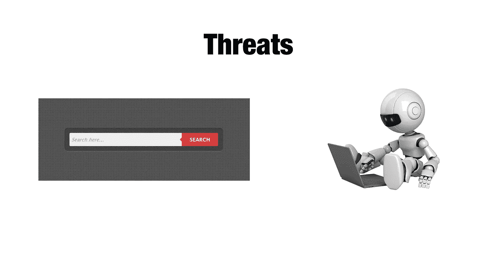

Bots are coming for your insecurities!

攻击者将攻击的重点放在三个主要的攻击媒介上。应用程序二进制文件(您的应用程序)、应用程序所在的网络以及保存应用程序数据的服务器。

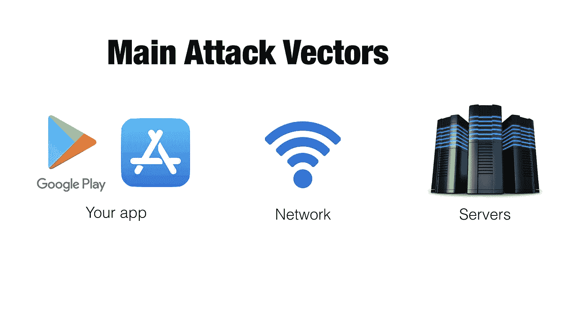

You can tell these slides are up to date. That’s the brand new* iOS app store icon

# 1.应用程序

先说逆向工程。如果你不熟悉这个概念，让我从这个开始:

开发者放弃他们的应用程序。每个用户都有 app 和它的逻辑。在应用程序中是代码和相关的值。把它们转换成人类可读的形式是很容易的。在 Android 上，它几乎可以恢复到开发人员编写的代码。

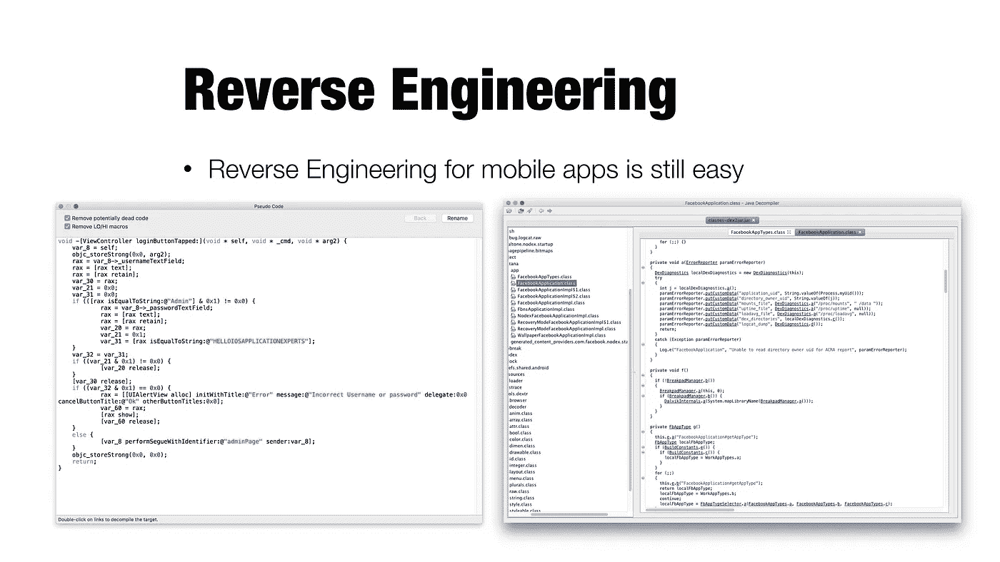

Hopper on the left (iOS). JD-GUI on the right (Android)

有许多开发人员存储秘密，将密钥存储到应用程序中，并假设它们是秘密的，因为应用程序是“编译”的。但是正如你在上面看到的(和许多在线教程)，它们很容易恢复。

逆向工程并不是新的威胁，但大数据已经取得了一些相当惊人的进步。

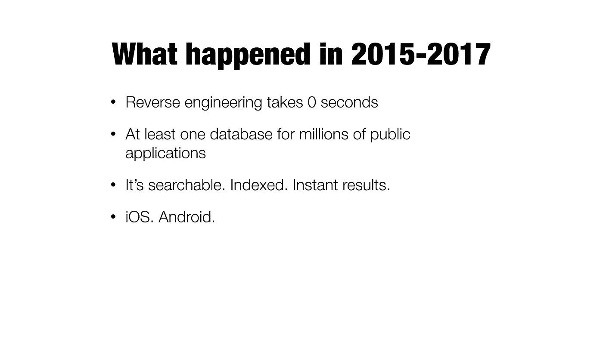

There are databases of code. Millions of apps of code.

因此，我的一个客户([https://keyoptions.com](http://keyoptions.com))在澳大利亚，我有幸与一家名为 Mi3Security 的公司合作。

特别感谢 Mi3Security 的团队让我公开发表他们的一些数据。

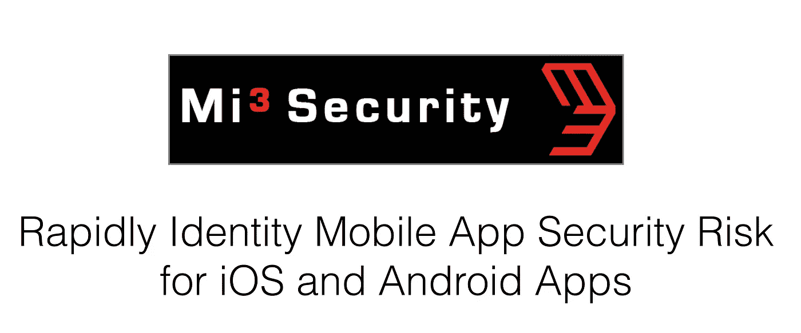

They have such an amazing database. The threat analysis they are capable of is incredible!

我非常友好地询问了我的联系人，他能否告诉我他们的数据库中有多少应用程序(大约 65–70%的公共应用程序)目前没有通过实现 NSAllowsArbitaryLoads 来正确实现应用程序传输安全

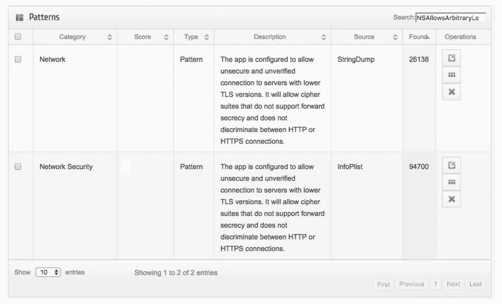

> 100,000 apps are potentially susceptible to downgrade attacks.

结果立竿见影。我很震惊。

(解释或更正刚说过的话)我是说..我知道数据库查找是如何工作的，但是天哪，在我面前的是一个数百万应用程序源代码的入口。

那么，我该问什么？当时，优步试图对用户信息进行指纹识别的记忆还历历在目。如果你不熟悉，可以在这里查看故事[。](https://www.theverge.com/2017/4/23/15399438/apple-uber-app-store-fingerprint-program-tim-cook-travis-kalanick)

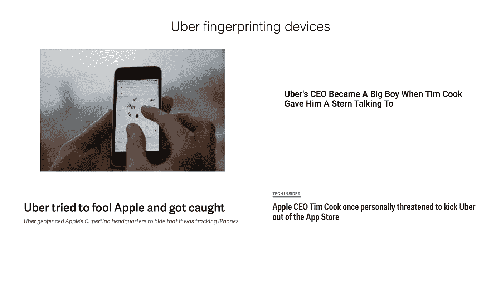

Timewarp back to April 2017, back when fidget spinners were in full.. spin

因此，我们检查了有多少其他应用程序也使用了让优步陷入困境的那行代码:

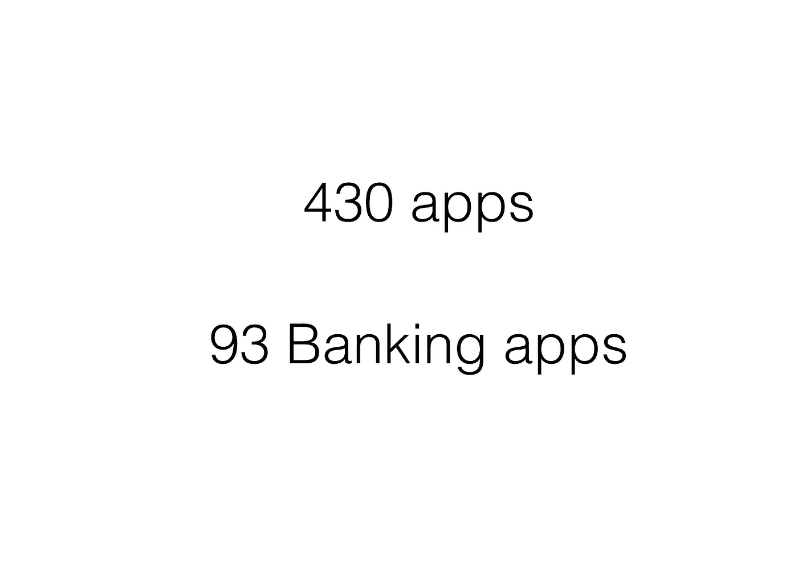

Banks track more information than I realise…

看起来优步受到了批评，但我们知道还有许多其他应用程序在做类似的事情。

这一信息收集得相当快。有多少机构有这样的数据库？我能想到的只有少数公司/国家可能有类似的东西…

Wait a second… I can probably do regex matching…

## 使用正则表达式搜索

所以，我认为尝试一个基本的*“仅 http，发送密码”* regex 是个好主意。

I’m not even checking TLS security. Zero encryption. Http only. Login/signup/signin URLs within apps

我之前在 Zscaler 看到过一个高调的例子(研究发现[在这里](https://www.zscaler.com/blogs/research/mobile-app-wall-shame-quikr))，他们在印度的一个顶级购物应用中发现了这个漏洞。但是我想这不会再发生了…

> 我对开发社区有信心。

我向 mi3 安全团队发布了 regex 查询，甚至在该团队的声明后面加上了这样的后缀:

> “如果该查询找不到任何应用，也没关系”

说这种话多愚蠢啊…

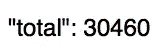

有超过 30，000 个应用程序没有为看起来涉及密码的查询实现 HTTPS。最糟糕的是:

> 你永远不会知道这个应用程序是否在使用 HTTPS

没有绿锁，没有证书错误，或者两者都没有——在应用程序中只有一个登录页面。从应用程序 GUI 不可能知道他们是否使用安全 TLS 连接进行通信，TLS 配置很差或根本没有 TLS 配置。**由于军情三处的安全性，我们现在知道至少有 3 万个应用程序的登录安全性为零。**

现在很明显——可能有假阳性，我的 regex 语句并不完美(如果你有更精确的语句，请告诉我，我会让他们运行它并信任你)

我们还能检查什么？我向 InfoSec twitter 寻求反馈:

Thanks to those who suggested options. 140 characters meant my question lacked detail. 280 characters here we come!

我最喜欢的三个建议来自唐·洛尔、丹·莱维和《神奇的埃及》。

The classic. Static private keys within an app.

开始 RSA SECRET == 193，329 个应用程序。🤦🏻‍♂️🤦🏻‍♀️

现在这个数字对我来说似乎很高，所以我可能会写一篇后续文章来理解为什么这么多开发者在他们的应用程序中存储私钥

Don Lor 有一个很好的建议，在移动应用程序中寻找 AWS 键。这是人们将它存储在 github 中的常见错误，但我想知道有多少应用程序认为这是“他们代码中的秘密”

AWS 私钥的 Regex 是:
*【^a-za-z0–9/+=][a-za-z0–9/+=]{40}[^a-za-z0–9/+=】*
这个查询产生了 130 万个 Android 应用中的 694 个应用。这并不是一个很高的数字，但是仍然有将近 ***700 个应用程序暴露了它们的 AWS 私钥*** 这些应用程序不应该被暴露。

丹给了我一个建议，扩展了我的关键字集。我欣赏那些明显比我有更多现场经验的人😅，但结果需要更多的过滤，所以我会写一个后续当这一切完成。

## 我如何防范逆向工程？

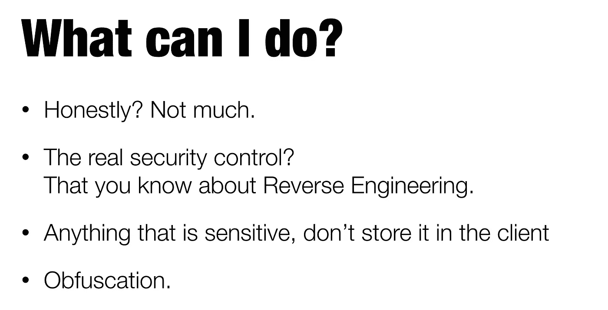

对于逆向工程，你能做的并不多。你要放弃你的应用。然而，避免在应用程序中存储秘密。在你的服务器上保存所有的秘密。

如果你“必须”存储一个秘密，你可以通过混淆你的秘密来增加攻击者的难度。这肯定不是不可能，只是对攻击者来说更烦人。

如果你在 iOS 上，你可以用这样的东西:[https://github.com/pjebs/Obfuscator-iOS](https://github.com/pjebs/Obfuscator-iOS)

在 Android 上，应该最低限度使用 ProGuard。如果你有一点钱，DexGuard 或其他商业混淆器可能会非常有用。

# 2.网络

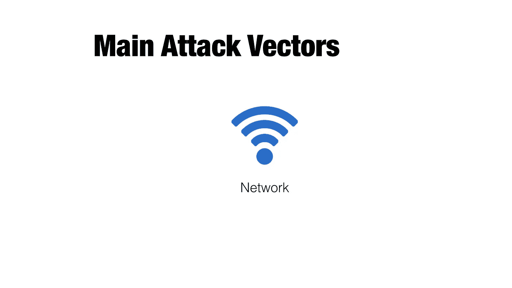

对移动应用程序的攻击主要有两种。
开发者错误配置了 HTTPS /没有 HTTPS。
用户正在使用免费 wifi

移动应用程序中最大的网络安全问题之一是，您无法在使用应用程序时验证 HTTPS 证书的安全性。

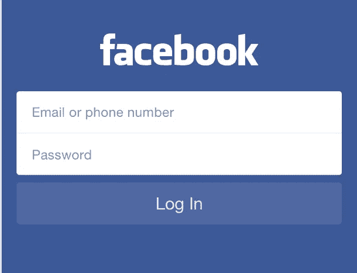

Where’s the green lock? Where’s the cert button? Is it even using HTTPS? No one knows from this interface.

开发人员需要对他们的 web 服务器做正确的事情。以下是一些确保您的 web 服务器配置正确的有用资源:

1.  Qualys SSL 服务器测试是测试您的服务器和检查您的 TLS 证书健康状况的绝佳资源

 [## SSL 服务器测试(由 Qualys SSL 实验室提供支持)

### 一个全面的免费 SSL 测试为您的公共网络服务器。

www.ssllabs.com](https://www.ssllabs.com/ssltest/) 

2.我最近偶然发现了这个网站，它帮助人们检查标题中暴露了哪些安全功能。严格的运输安全是我们对 HTTPS 安全最关心的，但其他的也不错。(根据他们的安全标题，我的银行得了 D 级。让我看看下周的后果)

 [## 分析你的 HTTP 响应头

### 快速方便地评估 HTTP 响应头的安全性

securityheaders.io](https://securityheaders.io) 

3.要设置 HTTPS，惊人的特洛伊亨特有一个极好的资源，*每个网络开发人员都应该阅读*。

 [## 通往 HTTPS 的六步“快乐之路”

### 终于是时候了:是时候让钟摆朝着“默认安全”的一端摆动了，而不是它…

www.troyhunt.com](https://www.troyhunt.com/the-6-step-happy-path-to-https/) 

一旦开发人员设置了适当的 TLS，他们需要假设用户使用的是恶意的 Wi-Fi。用户可能会被诱骗使用恶意网络，我们用来保护用户免受网络上恶意行为者攻击的方法之一是 HTTPS。

现在，为了让 HTTPS 被认为是一个安全的应用程序，有两件事需要纠正。服务器需要正确配置(参见以上资源)
2。需要正确配置客户端/应用程序。

为了实现第 2 点，我们可以利用 iOS 上的应用传输安全(ATS)和 Android 上的网络安全配置(NSC)文件。这些将证书验证的负担从应用程序(开发者和库在过去曾犯过错误)转移到操作系统，在操作系统中，我们有一定程度的信任，苹果和谷歌会做正确的事情。

如果你想采取额外的安全措施，你也可以实现证书锁定，这是一个很好的方法来确保你的应用程序几乎肯定是在与正确的服务器对话。有关证书锁定的更多信息，请查看我的演讲，我将通过一个独特的示例进行介绍。

“Unique example”. I am such a bad person…

# 3.您的服务器

有很多针对网络服务器和网络应用的攻击。有书籍、博客、视频和无数的在线资源在讨论这个问题。这篇博文更侧重于自动化和攻击，我们在开发领域看到的最大的一个是使用两个来源找到简单的漏洞:

1.  Google Hacking Database——用于非常快速地进行 Google 搜索，找到隐藏得很差的信息。作为一个例子，这里有一个潜在泄露数据库的网站的例子，其中有表 orders:
    [intext:" Dumping data for table ` orders "](https://www.google.com/search?q=intext:%22Dumping%20data%20for%20table%20%60orders%60%22)

 [## 谷歌黑客数据库(GHDB)

### 谷歌黑客数据库(GHDB)的攻击性安全

www.exploit-db.com](https://www.exploit-db.com/google-hacking-database/) 

2.Shodan 搜索引擎的任何开放的互联网端口。

 [## 肖丹

### Shodan 的服务器遍布世界各地，24/7 全天候抓取互联网，提供最新的互联网情报…

www.shodan.io](https://www.shodan.io) 

安全研究人员和恶意行为者使用 Shodan 来查找未经认证的网络摄像头、工业控制系统页面和数据库。许多数据库的身份验证很弱，或者没有身份验证来阻止它们。Shodan 的研究人员发表了大量数据从 MongoDB 和 HDFS 数据库中泄露。

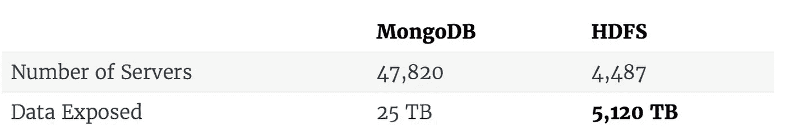

MongoDB used to be leaking >600TB a few years ago.

如需完整的文章，请访问下面的链接。

 [## HDFS 巨轮

### MongoDB、Elastic 和 Redis 在互联网上的数据公开方面备受关注，因为它们的一般…

blog.shodan.io](https://blog.shodan.io/the-hdfs-juggernaut/)  [## 是数据，笨蛋！

### 我想花点时间讨论一下数据库。大多数人使用 Shodan 来查找有网络服务器的设备，但是…

blog.shodan.io](https://blog.shodan.io/its-the-data-stupid/)  [## 还是数据，笨蛋！

### 鉴于最近 MacKeeper 通过一个公开的、未经认证的 MongoDB 暴露了 1300 万个帐户的事件…

blog.shodan.io](https://blog.shodan.io/its-still-the-data-stupid/) 

这些未经认证的服务器在今年早些时候受到攻击。它们被加密并被勒索赎金。不是因为某些高级 apex 攻击者，而是因为默认情况下未启用安全性。

 [## MongoDB 数据库被神秘攻击者勒索赎金

### 一个名为 Harak1r1 的攻击者正在劫持未受保护的 MongoDB 数据库，窃取并替换它们的…

www.bleepingcomputer.com](https://www.bleepingcomputer.com/news/security/mongodb-databases-held-for-ransom-by-mysterious-attacker/) 

如何解决这个问题？有针对您的 web 堆栈的强化指南。

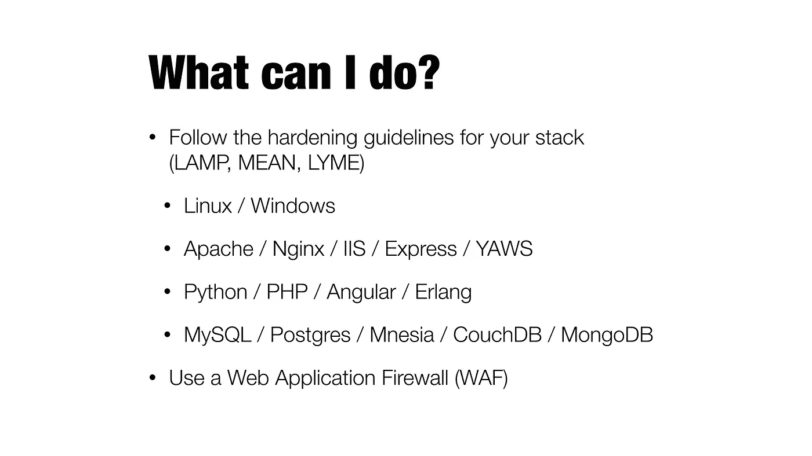

# 摘要

让我们回到我最初的观点:

> 我的应用程序太小了，没人会攻击我。

一个机器人不会在意你的应用程序太小。一个搜索引擎不在乎。如果你是低垂的果实，你会受到攻击。网络服务器、电子邮件服务器经历这种情况已经很多年了。移动应用将很快加入他们的行列(他们已经加入了)。

外卖是什么？手机 App 开发者需要明白这三点:
*1。移动应用程序是可逆的，可以访问应用程序中的任何字符串/ url/秘密
2。网络安全需要在服务器和客户端正确配置才能有效
3。对服务器的自动攻击从未如此简单，它需要定期加固和修补。*

许多👏🏻❤️在推特上@sammy_lee12，他参加了我的演讲，并在一页纸上给我概述了我的演讲。你在很多方面都很好！

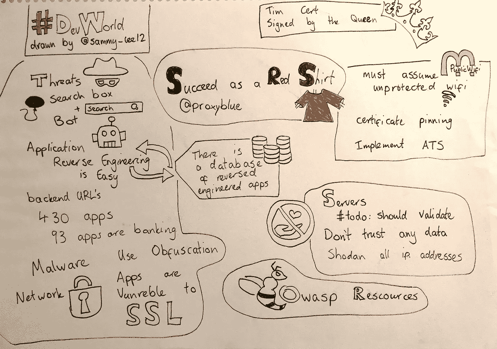

Seriously, Sam, you’re the best. First thing I did was get this laminated.

你坚持到了最后！好样的。你想按多少次拍手就按多少次，它给我温暖快乐的感觉☺️.你觉得我酷到可以在推特上关注吗？@proxyblue 是你能找到我的地方。我发布和转发信息安全的东西。

 [## 路易·克雷曼👨🏻‍💻(@proxyblue) |推特

### 路易斯·克雷曼的最新推文👨🏻‍💻(@proxyblue)。移动开发与安全@数字创新中心。前…

twitter.com](https://twitter.com/proxyblue) 

还想听更多吗？

这是我在同一个会议上的三分钟简短发言。“如何像开发者一样说话”。

Yak Shaving, Bikeshedding and more!

以下是“如何成为一名成功的红衫球员而不死”演讲的链接:

感谢阅读！想从我这里读到更多吗？

 [## 信息安全专业人士需要了解的 10 件网络知识

### 因此，这个故事源于这样一个事实，即我已经从应用程序开发和我的 Sec……

hackernoon.com](https://hackernoon.com/10-things-infosec-professionals-need-to-know-about-networking-d159946efc93)  [## 你“做”信息安全，对吗？你读什么？你听谁的？

### 作为一个超级热心的安全人士，我得到这个问题…很多。😅

路易·兰德](https://louis.land/you-do-infosec-right-what-do-you-read-who-do-you-listen-to-e8d00b7d8ace)