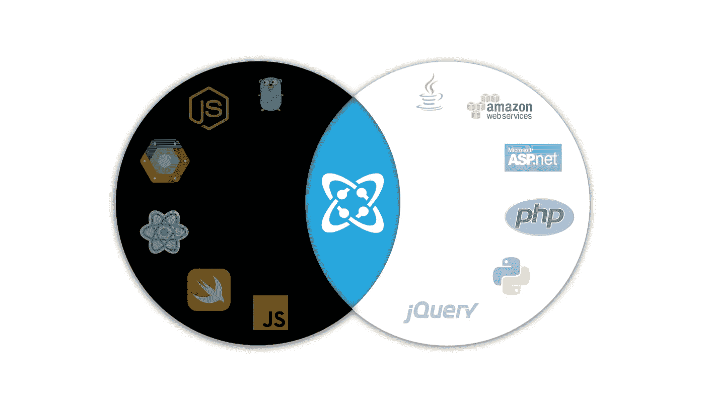
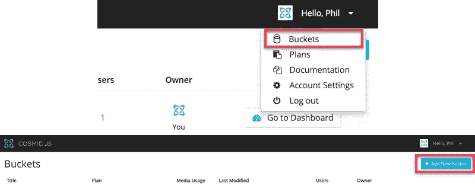
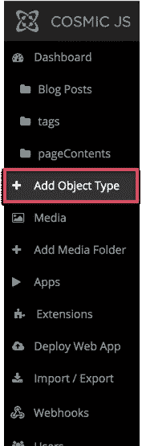
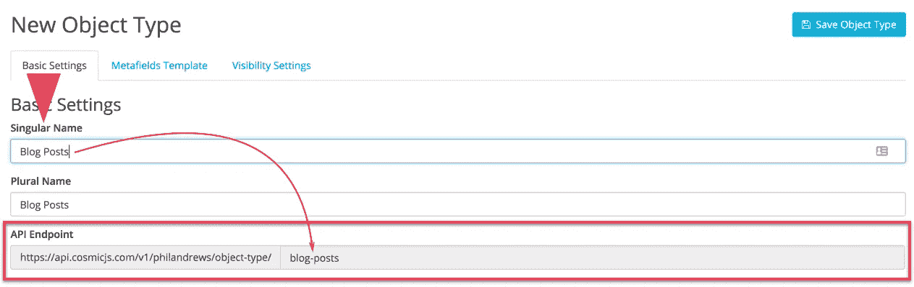
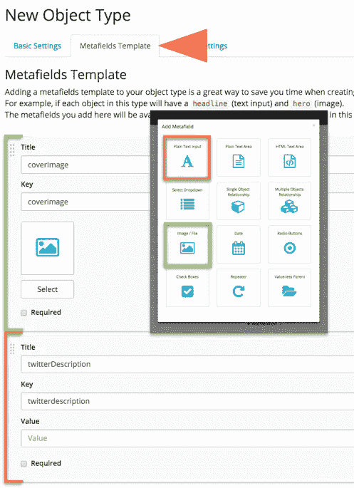
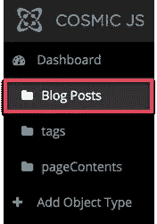
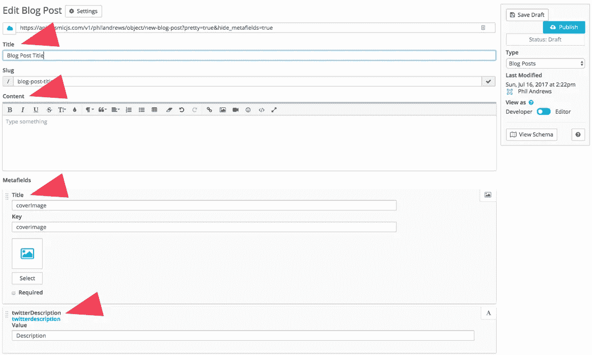
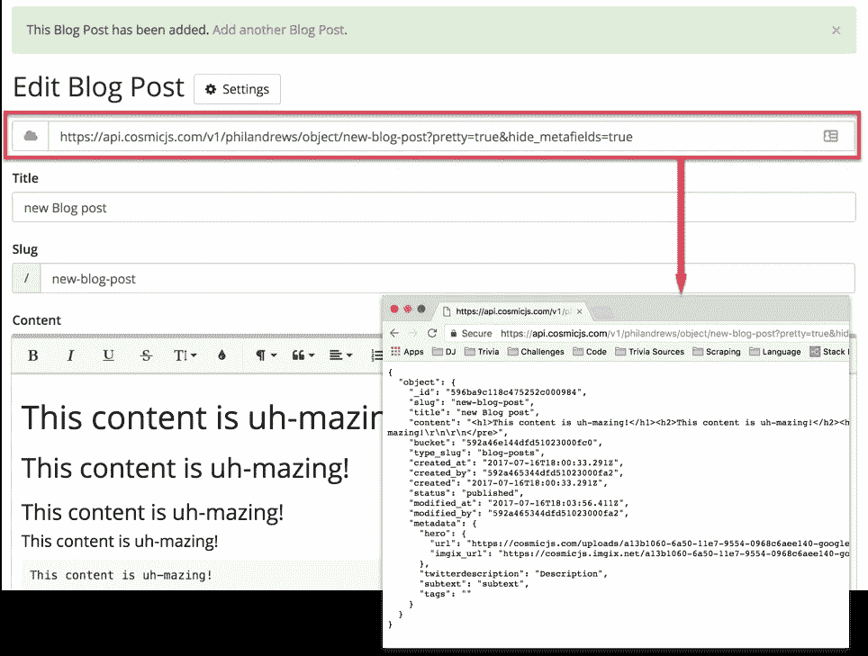
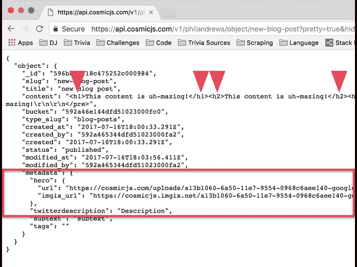

# 使用 Cosmic JS 进行与语言无关的内容管理

> 原文：<https://medium.com/hackernoon/language-agnostic-content-management-with-cosmic-js-42b5dbe1880f>

Phil Andrews is a Cosmic JS Contributor.

## 如果你是一名开发者，需要为自己或客户开一个新博客，使用 WordPress 的想法可能会让你畏缩。

在 StackOverflow 上接受调查的 64.5%的开发者称 WordPress 是他们最害怕使用的平台之一。

恐惧是有道理的。如果你使用 WordPress 作为你的内容管理系统(CMS ),你不能手工编写整个博客。你必须在 WordPress 栈中工作，然后为你需要的额外部分使用插件。这与大多数编写简单代码的人相反。

你可能想要的是一个系统，让你输入你的内容，存储你的内容，并以一种简单明了的方式获取它。如果你能在所见即所得的仪表盘中输入你的内容就更好了。

在寻找能做到这一点的东西时，我偶然发现了 [CosmicJS](https://cosmicjs.com/) 。事实证明，Cosmic 正是一个与编程语言无关的 CMS。你可以在任何平台上用任何语言写博客。

你把你的内容放进去，它给你简单的 API 端点来检索它。一个 get 请求，您的工作就会在一个 JSON 对象中返回给您。

这里告诉你如何在短时间内为你的博客设置一个 CMS

创建并登录帐户后，继续创建新的存储桶。水桶就像它们听起来的那样。盛放物品的容器。这些对象可以是相同的类型，也可以是不同的类型。

一旦你创建了你的桶，点击它，你会注意到边栏上有一个新的菜单。其中一个选项将是*添加对象类型*。

这就是我们如何将新类型的对象添加到我们的桶中。我们将创建一个 **Blog Post** 类型的对象，它将保存与我们的每篇博文相关的所有内容和元数据。

单击*添加对象类型*并在名称字段中输入名称后，请注意该名称已经被映射到一个 API 端点。这些端点，你会在 Cosmic 的每个对象页面上找到，是这个系统的美。这个端点将返回你所有的**博客文章**类型的对象。

向它发出一个简单的 get 请求，您将收到一个 JSON 对象，其中包含您的每篇文章以及与每篇文章相关的元数据。如果你有 5 篇文章，它将返回 5。100，它会返回 100。

在它的基础上，bucket 中的每个对象都自动包含一个标题字段和一个 HTML 输入字段。因此，在不添加任何元字段的情况下，您就拥有了一篇博客文章的基本组成部分。

为了展示 Cosmic 拥有的更多功能，让我们为我们的**博客对象**添加一个封面图片和描述字段。当您创建新对象时，单击顶部的 Metafields Template 选项卡将打开添加这些对象的 UI。

现在我们已经创建了对象类型，我们可以创建该类型的实际对象。

一旦你点击了*博客文章*，你就可以*+添加博客文章。*在里面你会看到我们指定的**博客文章**类型对象的结构。我们现在需要做的就是在每个字段中填入我们想要的内容。

一旦你输入了你的内容，点击发布或保存草稿，你会得到一个 API 端点。要检索这篇文章，您可以向该端点发送一个 get 请求，并以 JSON 形式获得整个预先格式化的文章。

注意我们添加的元字段，最重要的是，我们的内容仍然是 HTML 格式。

这就是全部了。你所要做的就是按照你喜欢的任何规格来构建你的博客的前端，写一些内容，检索你的内容，然后在你需要的地方注入这些内容。

尽管您可以选择构建或实现自己的编辑器。Cosmic 的 API 确实包含这方面的工具。

如果保存为草稿，API 端点将不会处于活动状态。

开发者、企业家和作家。你可以在 [philandrews.io](https://philandrews.io/blog) 找到我，我在那里写关于当前的项目、技术、代码，有时还有生活本身。

*文章原载于*[*https://philandrews.io/blog*](https://philandrews.io/blog)