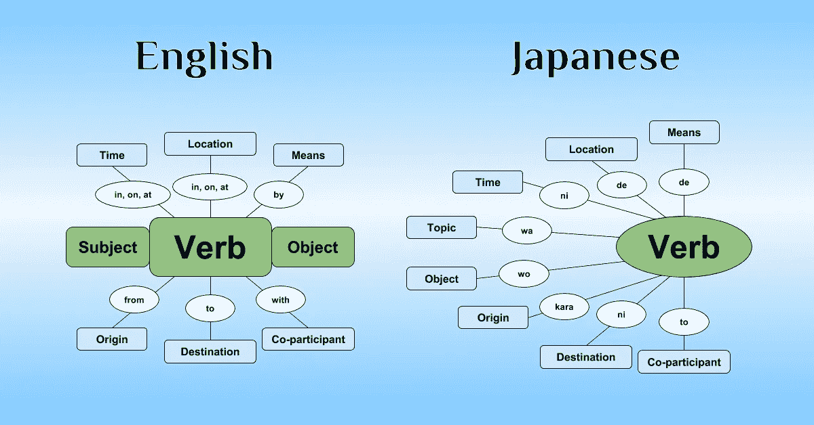

# 人工智能很快就会说自己的语言

> 原文：<https://medium.com/hackernoon/language-for-ai-74e349e64a74>

The scene from Arrival 2016.

## 接地气的语言是 OpenAI 透露的迈向人工智能的新一步

这篇文章是关于一个系统，它发明了一种与对世界的感知相联系的语言。总之，这篇文章揭示了通过与人工语言相关的研究打开的可能性。至少这种语言将类似于动物的典型信号语言。进一步的语言将会发展成更复杂的技术。

> 语言的进化是不存在的。使用语言的能力在进化。这种能力出现在大约 75000 年前。这非常简单。我们今天所说的语言是我们的语言如何转化为口语行为的。正如乔姆斯基提到的，它是关于基本思维过程的第二语言。世界上大约有 6000 种不同的语言。我们真正想要的是理解一个潜在的原则，这个原则赋予我们获得这 6000 种语言中任何一种的能力。并创建几个新的。

语言不一定是口语，而是一种内在的过程。它更接近于一个思考过程。

# **语言**在某种意义上**类似于** **视觉**。

我们有书面语言，也有一些照片。从几个角度看待一个事物的能力和询问细节或隐藏事实的能力是一样的。内心对话和想象场景是一样的。最有趣的部分是，两种能力在最低水平上比以往任何时候都更接近。此外，它们由相同的材料和相同的原理制成。发现一个既能处理视觉又能处理语言的系统是智能的基础。

最终目标是制造一个通过视觉感知识别现实然后创造抽象的系统。此外，该系统能够使用一种语言对抽象进行操作。目标是以人类思维的方式连接它。我在这里写了更多关于这个翻译过程的内容:

 [## 是什么让翻译成为智能的本质

### 你们中有多少人认识上图中的图案？是的，是斐波那契数列:

chatbotslife.com](https://chatbotslife.com/what-makes-translation-the-essence-of-intelligence-4f67302bbc35) 

尽管语言和视觉在头脑中指的是相同的抽象，但所有抽象的来源都是现实，这就是为什么我们开始用最简单的视觉对象而不是语言来理解它。后来语言描述的物体变得和我们看到的一样真实。但是，如果没有与物理世界的互动，机器就不可能掌握人类语言。这也是为什么 OpenAI 的学习沟通策略大有可为的原因。

进行这种研究的另一个原因是，还不可能将机器人放入物理世界来学习整个环境。只是会花太多时间。通过静态数据来习得语言是不可能的。唯一的方法就是成为一个环境中的积极参与者。此外，用人脑进行回避性实验并不容易，计算机模拟最有可能成为 21 世纪的语言学工具。

目标是创造一个理解我们的智能代理。这是一个相当困难的问题。它从 1960 年开始研究。然而，我们还不能正式地描述一种语言，因为没有上下文，它就不存在。**环境就是这样的背景。**

# 竞争与合作

我们已经看到一个系统能够在强化学习实验中展示令人惊叹的结果。这是玩雅达利游戏的 [DeepMind Q-learning](https://arxiv.org/abs/1312.5602) 实现。简而言之，这个系统有一个环境和一个代理收入分数。而代理也成功学会了如何玩好。

另一个突破是 [AlphaGo](https://deepmind.com/research/alphago/) 。关键的区别在于游戏背后有一个对手。此外，环境有更多的状态。值得一提的一个绝妙的解决方案是，代理在和自己的副本玩游戏。

*下一步将是代理能够找到相互合作的方式，为双方实现附加值的系统。OpenAI 研究展示了一个智能代理在一个完全不同的环境中如何表现——像我们这样的合作世界。*

 [## 学习沟通

### 在本帖中，我们将概述新的 OpenAI 研究，其中代理开发他们自己的语言。

openai.com](https://openai.com/blog/learning-to-communicate/) 

# 黑盒问题

内部语言可能是帮助管理 ML 框架复杂性的下一个突破口。今天，我们必须付出很大努力来澄清 ML 系统在做什么，为什么。这种非常接近人类语言的语言是一种即将出现的用于 ML 引擎的接口。对于多用途代理，这种语言是定义目标函数的最佳方式。

> 事实上，随着人工智能系统变得越来越复杂，很难想象我们将如何在没有语言的情况下与它们合作——而无法问它们“为什么？”更重要的是，毫不费力地与计算机交流的能力会让它们变得更加有用，这种感觉简直不可思议。——[威尔骑士](https://www.technologyreview.com/profile/will-knight/)。

引用是文章的一部分，揭示了某种语言将提供显著优势的一些要点:

 [## 创造理解语言的机器是人工智能的下一个大挑战

### 在韩国首尔举行的一场特别紧张的围棋比赛进行到一半时，最优秀的棋手之一李·塞多…

www.technologyreview.com](https://www.technologyreview.com/s/602094/ais-language-problem/) 

# 语言本身

尽管基本结构和词汇不同，用相同的术语描述英语和汉语是可能的:名词、动词、助词、时态等。这两种语言都是由成千上万的交流头脑在周围的现实之上创造出来的。下一篇文章将展示细节:

-The Surprisingly Simple Logic Behind Japanese Sentence Structure. (image is link to article)

想象两个人，英国人和中国人。他们正在聊天。除了母语之外，没有发送任何内容的选项。在这种情况下，他们没有学习对方语言的选择。(这个论点非常接近[中文房间论点](https://en.wikipedia.org/wiki/Chinese_room#Chinese_room_thought_experiment)。)但是想象他们已经见过面了。很快学会对方语言就没那么复杂了。有什么变化？他们有一个被包围的现实。他们能够把一种新的语言和它联系起来。婴儿能够以同样的方式习得语言。

# *语言游戏*

不提到由[路德维希·维特斯坦根](https://en.wikipedia.org/wiki/Ludwig_Wittgenstein)开发的 [*语言游戏*](https://en.wikipedia.org/wiki/Language-game_(philosophy)) ，这篇文章就不完整。考虑一下维基百科的描述:

> 这种语言是为了建筑工人 A 和助手 b 之间的交流服务的。A 正在用建筑用的石头:有砖块、柱子、石板和横梁。b 必须传递石头，按照 A 需要的顺序。为了这个目的，他们使用一种由“块”、“柱”、“板”、“梁”等词组成的语言。a 把他们叫出来；— B 带来了他学会在某某人的召唤下带来的石头。把这想象成一种完整的原始语言。(圆周率 2。)[【3】](https://en.wikipedia.org/wiki/Language-game_(philosophy)#cite_note-3)
> 
> 后来加上了“this”和“there”(其功能类似于这些词在自然语言中的功能)，以及作为数词的“a，b，c，d”。其用法的一个例子是:建造者 A 说“d-slab-there”并指向，建造者 B 数出四块石板，“A、B、c、d…”并将它们移动到 A 所指的地方。建造者的语言是一种活动，其中融入了我们认为是语言的东西，但形式更简单。这种语言游戏类似于教授给儿童的简单语言形式，维特根斯坦要求我们将它视为一个建筑部落的“完整的原始语言”。

因此，OpenAI 的研究朝着创造一个能够在与人类的合作中适应和整合自己的智能体迈出了一步。每一次这样的合作都可以被定义为一场语言游戏。

另外，我推荐一篇由 Eberhard Schoeneburg 写的文章。它阐明了语言游戏在人工智能中的作用:

 [## 语言游戏——解锁 AI 的钥匙？

### 发表在人工智能(AI)上活跃在人工智能领域的研究人员和公司仍然在与…

www.linkedin.com](https://www.linkedin.com/pulse/language-games-key-unlock-ai-eberhard-schoeneburg) 

# 结论

我们在从种子发展智能系统的道路上迈出了一步。这些种子是前提条件和算法。此外，种子是清晰的和可感知的，而最终系统是强大的和难以理解的。几粒种子的结合将导致更强大的智能机器，并最终导致 AGI。“学会沟通”是深度强化学习、Q-学习、蒙特卡洛计划等列表中的另一个种子。

然而，我们不知道如何从大脑中复制有价值的工作原理，我们通过尝试和模拟的方法一点一点地重新发明类似的原理。此外，没有一个有形的意识本身，但我们正在建设一个具有交流能力的新框架。

想象一下，每一个 ML 专家系统都将能够对话并描述其思维过程。*一种接地气的语言是一种明显的趋势。*

我甚至会说，我们今天在 AI 方面有一种停滞。我们还处在技术发展的阶段。然而，只有在产品阶段才可能认识到人工智能的能力，它正在到来。

# 行动号召:

*   **Pr*ess the heart*******或*** ***分享文章*** *如果你觉得这篇文章有趣**
*   ****关注我*** *上* [*中*](/@mikecorp) *，* [*推特*](https://twitter.com/AIissimple) *或*[*LinkedIn*](https://www.linkedin.com/in/snowman647/)*这样你就能在你的 feed 里看到我即将发布的文章了。**
*   *[**回答问题:你对 AI 的兴趣是什么？**](https://snowman647.typeform.com/to/Rg6Bcj)*

******

> *[黑客中午](http://bit.ly/Hackernoon)是黑客如何开始他们的下午。我们是 [@AMI](http://bit.ly/atAMIatAMI) 家庭的一员。我们现在[接受投稿](http://bit.ly/hackernoonsubmission)，并乐意[讨论广告&赞助](mailto:partners@amipublications.com)机会。*
> 
> *如果你喜欢这个故事，我们推荐你阅读我们的[最新科技故事](http://bit.ly/hackernoonlatestt)和[趋势科技故事](https://hackernoon.com/trending)。直到下一次，不要把世界的现实想当然！*

**