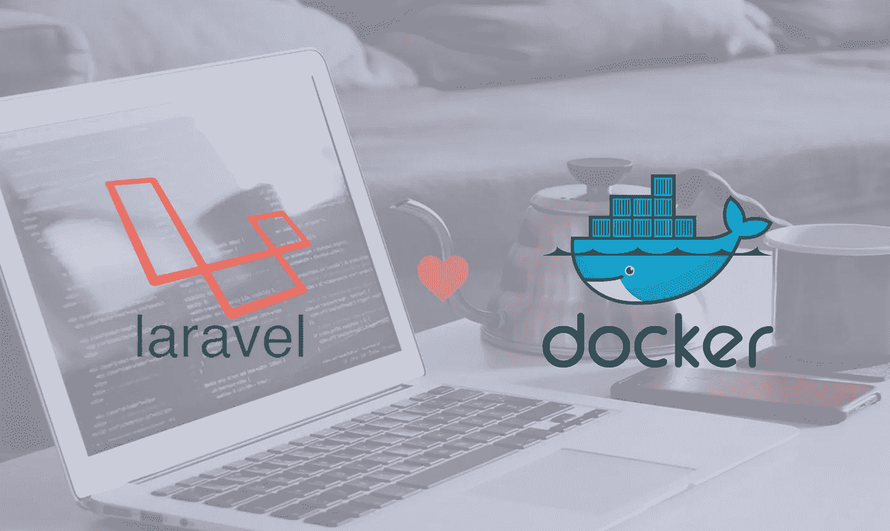
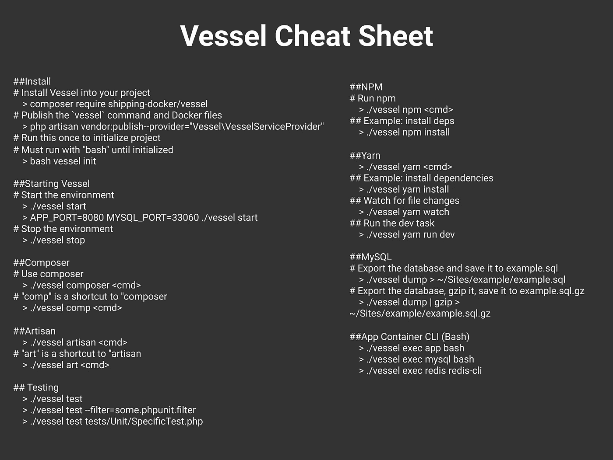

# Laravel & Docker，容器零配置

> 原文：<https://medium.com/hackernoon/laravel-docker-zero-config-with-vessel-60e1aa173ea8>



Laravel & docker

> 本文逐步介绍了 Vessel(使用 docker 设置 Laravel 设置配置的新方法)。
> 
> 如果你不熟悉 docker，你可以查看我的上一篇文章“一步一步地设置 PHP (Laravel)环境(Linux) ”。

很久以来，我一直是 chris fideo 的忠实粉丝，他是《黑客的[服务器](https://serversforhackers.com/)的作者，这是学习服务器配置、安全性、数据库、docker 和更多 DevOps 主题的最丰富的内容来源之一。

[**dockering 你的应用**](https://serversforhackers.com/dockerized-app) 是一个令人惊叹的免费课程，它是一个循序渐进的 docker 工作流程，为你的应用开发一个微风。根据克里斯的说法，Vessel 是 docker 工作流程的结果，它更像是一个每个人都可以轻松使用的官方工具。

> **让我们试一试**

Vessel 是 Laravel 的一个轻量级 docker 环境，这意味着它只是为每个项目设置一个本地 docker 开发环境的一个小文件集，除了 Docker 系统本身之外，没有任何额外的东西需要全局安装。

# 安装 Docker 和 Docker-compose

docker 是一个基于 Linux 容器的开源项目，如果您还不熟悉 Docker，那么由 Preethi Kasireddy 撰写的这篇文章“ [**对容器、VMs 和 Docker**](https://medium.freecodecamp.org/a-beginner-friendly-introduction-to-containers-vms-and-docker-79a9e3e119b) 的初学者友好介绍”是您迈出第一步的理想地方。

目前，Vessel 只能在 Mac 和 Linux 上运行，因为它使用 bash 脚本来运行 Docker 命令。

对于 Linux Ubuntu 发行版，安装 docker 最简单的方法是:

```
curl -fsSL get.docker.com | sudo sh
sudo usermod -aG docker your-user // add your user to docker group
```

要安装 docker compose，请运行以下命令下载最新版本:

```
sudo curl -L [https://github.com/docker/compose/releases/download/1.17.0/docker-compose-`uname](https://github.com/docker/compose/releases/download/1.17.0/docker-compose-`uname) -s`-`uname -m` -o /usr/local/bin/docker-compose
```

接下来，对二进制文件应用可执行权限。

```
sudo chmod +x /usr/local/bin/docker-compose
```

了解更多 docker 安装: [docker](https://docs.docker.com/engine/installation/) ， [docker-compose](https://docs.docker.com/compose/install/)

# 开始使用容器

首先，您需要创建一个 Laravel 项目，如下所示:

```
composer create-project — prefer-dist laravel/laravel vessel_test
```

正如我之前提到的，Vessel 是轻量级 docker environment，它包含一个 Laravel 服务提供商，可以让您轻松简单地开始自己的开发设置。要使用 vessel 启动您的开发设置，您只需:

```
*# Install Vessel into your project*
composer require shipping-docker/vessel*# Publish the `vessel` command and Docker files*
php artisan vendor:publish — provider=”Vessel\VesselServiceProvider”*# Run this once to initialize project*
*# Must run with “bash” until initialized*
bash vessel init
```

首次使用 init 命令启动 vessel 应用程序时，Vessel 将下载以下官方 Docker 映像:

*   PHP 7.1
*   MySQL 5.7
*   雷迪斯
*   NPM，纱线和吞咽

通过运行启动容器:

```
cd vessel_test
./vessel start
```

在你的浏览器中点击 [http://localhost](http://localhost) 查看你的 Laravel 网站！

最后，Vessel 也有很好的文档，涵盖了你开始使用时需要知道的一切:[官方文档](https://vessel.shippingdocker.com/)

# 奖励:船只备忘单



感谢阅读！如果你认为其他人应该阅读这篇文章，请为我鼓掌，发微博并分享这篇文章。记得在 Medium 上关注我，这样你就可以得到关于我未来帖子的通知。

> 【https://elazizi.com/】*阅读更多故事*[](https://elazizi.com/)

# *另外，如果你喜欢这个，至少给我十几下掌声祝我好运👌👌。*