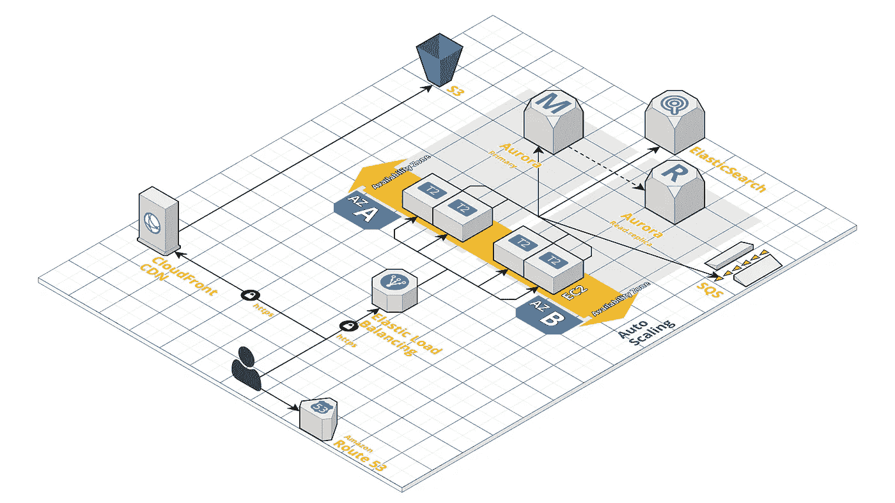
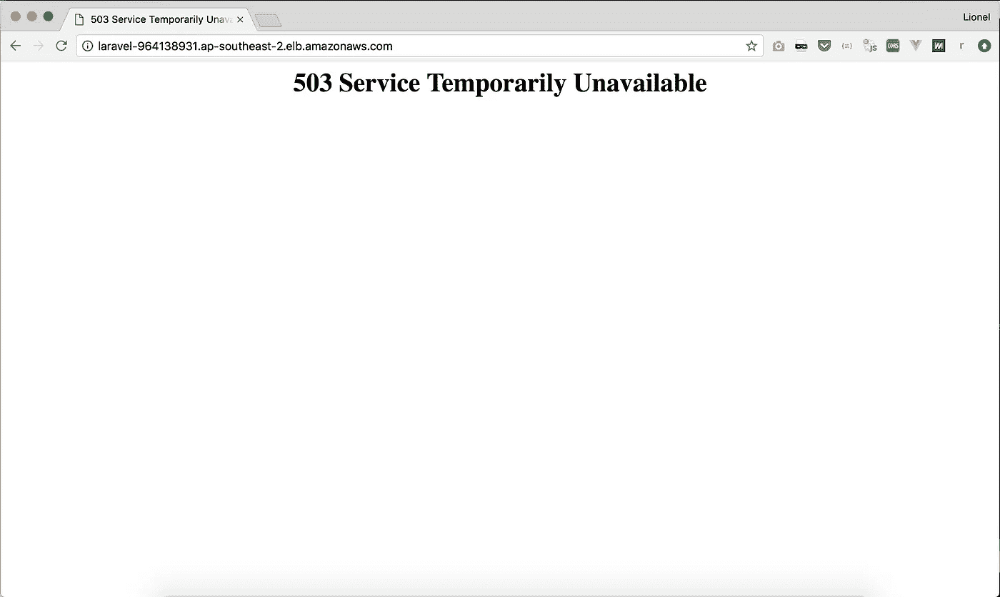
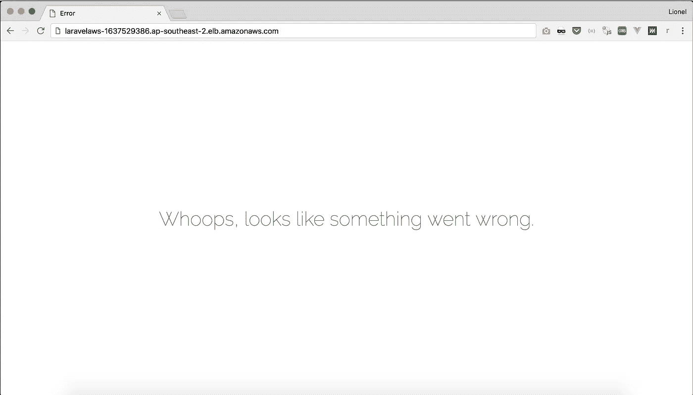
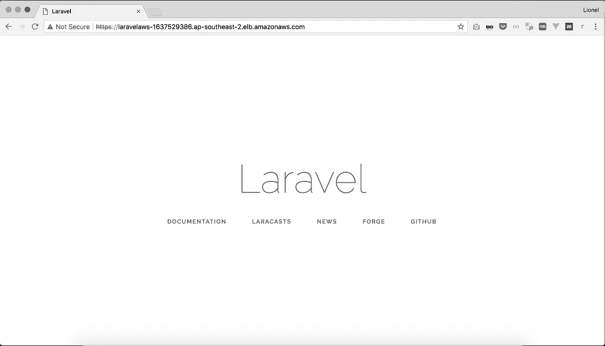
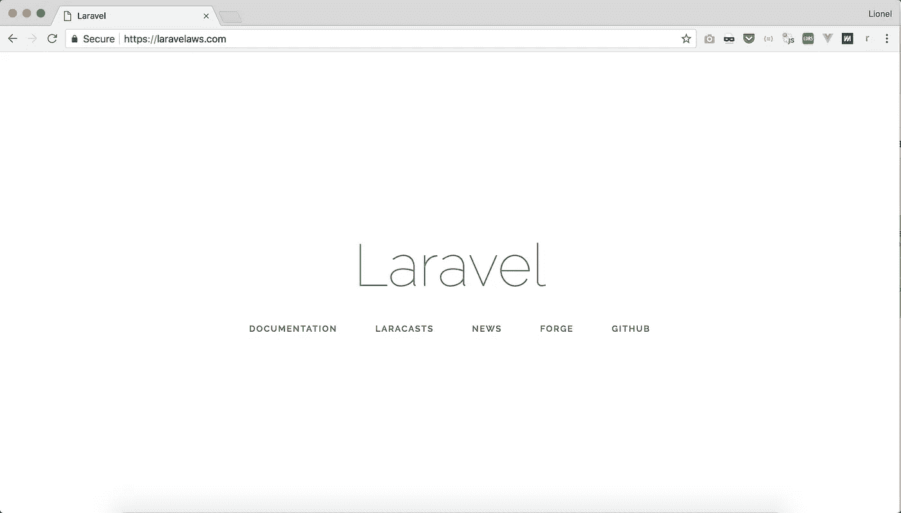

# AWS 上的 Laravel:参考架构

> 原文：<https://medium.com/hackernoon/laravel-on-aws-a-reference-architecture-a680755130d0>

**网络、安全、自动扩展和高可用性指南**

为您的 web 应用程序建立持久的[架构](https://hackernoon.com/tagged/architecture)并不是一件容易的事情。如果你尝试一边做一边构建，你很快就会厌倦点击 AWS 控制台。如果您有一个适用于所有项目的架构和可重复的流程，同时确保最大的[安全性](https://hackernoon.com/tagged/security)，性能和可用性，会怎么样？下面是您应该如何在 AWS 上部署 Laravel 应用程序。

莱昂内尔是总部位于伦敦的初创公司 Wi5 的首席技术官，也是面向未来的工程文化课程 *的作者。你可以在*[*https://getlionel.com*](https://getlionel.com)上联系他

**我们将如何实施安全性:**
—创建 *VPC 子网*来部署我们的应用程序。VPC 是 AWS 中您自己的虚拟网络，它允许您设计私有子网，在这些子网中，不能从 VPC 外部直接访问实例。这是我们将部署 web 和数据库实例的地方。
—使用临时*堡垒*(也称为跳转箱)，当我们需要连接到 web 和数据库实例时，我们将在我们的公共子网中部署这些堡垒，从而减少攻击面
—使用 *VPC 安全组(SGs)* ，通过将哪些服务器可以相互通信列入白名单来实施防火墙规则。SG 是在实例级应用的默认拒绝状态防火墙。
—尽可能避免密码，转而指定 *IAM 角色*来控制对我们资源的访问，从而简化机密管理。使用 EC2 的 IAM 角色消除了在配置文件中存储 AWS 凭证的需要。角色使用 AWS 负责轮换的临时安全令牌，因此我们不必担心更新密码。

**我们将如何实施高可用性:**
—将我们的应用程序实例跨越可用性区域(下面的 AZs)。AZ 是一个区域内的一个或多个数据中心，它们被设计为与其他 AZ 中的故障相隔离。通过将资源放置在独立的 az 中，组织可以保护其应用免受影响单个位置的服务中断
—从弹性负载平衡器为我们的应用提供服务。ELB 是一种高度可用的(分布式)服务，它在一个或多个 az 中的一组 EC2 实例之间分发流量。ELB 支持*健康检查*，以确保流量不会被路由到不健康或失败的实例
—在 ECS 上托管我们的应用，通过 *ECS 服务*描述在任何给定时间运行的健康应用容器的最小数量。如果一个容器崩溃，ECS 服务将启动新的容器。
—将我们的数据库作为一个集群分布在多个 az 上。RDS 允许您将数据库的辅助副本放在另一个 AZ 中，用于灾难恢复目的。您被分配了一个 DNS 名称形式的数据库端点，AWS 负责将其解析为特定的 IP 地址。RDS 将自动故障转移到备用实例，无需用户干预。
我们最好使用 Amazon Aurora，它将在单独的 AZ 中维护我们数据库的读取副本，如果我们的主实例(或其 AZ)失败，Amazon 将提升它为主实例。
—最后，我们依靠尽可能多的*分布式服务*将故障管理委托给 AWS:像 S3、SQS、ELB/ALB、ECR 和 CloudWatch 这样的服务旨在实现最大的弹性，而我们不必关心它们运行的实例。



Laravel, made highly available with almost a one-click deploy!

**我们将如何为自己构建一个可重复的流程:**
我们将使用 Docker、CloudFormation 和 AWS CLI 在新域名上部署一个空的 Laravel 应用程序。CloudFormation 定义了一种模板语言，可用于描述工作负载所需的所有 AWS 资源。模板被提交给 CloudFormation，服务将按照适当的顺序提供和配置这些资源。
Docker 容器映像是一个软件的独立的、可执行的包，包括运行它所需的一切。使用 AWS CLI，您可以从命令行控制所有服务，并通过脚本实现自动化。
通过将这三者结合起来，我们的基础设施和应用程序配置都可以写成代码，这样就可以进行版本化、分支和文档化。

这是我用来在 AWS 上部署客户的 Laravel 应用程序的过程。希望这能对你的部署有所帮助。如果您的用例更复杂，我会提供持续的支持包，从指导您的开发人员到亲手在 AWS 上构建应用程序。在 hi@getlionel.com 给我打电话

**一步一步来:
1。设置您的 AWS 凭证** 从认证您的命令行开始，在您的 AWS 控制台的 IAM 部分为新用户下载 API 密钥和密码。该用户需要拥有为我们将在下面使用的所有服务创建资源的权限。按照以下提示操作:

Use the profile option to save different credentials for different projects

**2。订购 SSL 证书** 我们需要两个证书:一个用于我们的 web 应用程序本身，另一个用于我们在 CloudFront 上的自定义域。web 应用程序的证书需要在您希望部署应用程序的 AWS 区域中创建，而 CloudFront 只接受在区域 *us-east-1* 中生成的证书。
AWS SSL/TLS 证书是免费的，自动提供和更新，即使您没有在 Route53 中购买域名。它们与 AWS 负载平衡器、CloudFront 发行版和 API 网关端点无缝集成，因此您只需设置它们就可以忘记它们。

**3。创建一个供 EC2 实例使用的密钥对** 建议为这个新项目的所有 EC2 实例创建一个新的 SSH 密钥对，仍然使用 CLI:

请记住，AWS 不会为您存储 SSH 密钥，您有责任安全地存储和共享它们。

**4。启动我们的云构建堆栈** 基础设施即代码来了！我们的整个部署将在一个主 YAML 模板中描述，该模板本身引用了*嵌套栈* YAML 模板，以使其更具可读性和可重用性。
这是我们模板的目录结构:

```
├── master.yaml                *# the root template*
├── infrastructure
  ├── vpc.yaml                 *# our VPC and security groups
*  ├── storage.yaml             *# our database cluster and S3 bucket* ├── web.yaml                 *# our ECS cluster* └── services.yaml            *# our ECS Tasks Definitions & Services*
```

完整的代码可以从 GitHub 这里下载:

[](https://github.com/li0nel/laravelaws) [## 里昂内尔/拉拉夫劳斯

### laravelaws——使用 CloudFormation 在高可用性 ECS 集群上部署 Laravel 的参考架构

github.com](https://github.com/li0nel/laravelaws) 

*vpc.yaml* 模板定义了我们的 *VPC 子网*和*路由表*:

这相当冗长，是设置跨越两个 az 的公共和私有子网所需要的一切。您可以明白为什么您不想在 AWS 控制台中实现它了！

我们还需要三个 SG。第一个是保护我们的 EC2 实例，只允许来自负载均衡器的入站流量和任何 SSH 入站流量(请记住，我们的实例将位于私有子网中，无论如何都不能接收来自互联网的流量):

负载平衡器的 SG 将允许来自互联网的任何流量(同时仅响应 HTTP 和 HTTPS):

最后，数据库 SG 只允许 MySQL 端口上来自 EC2 实例的入站流量，不允许来自互联网的流量。我们的数据库也将托管在我们的私有子网内，因此它不能接收来自 VPC 以外的任何流量。

现在让我们启动我们的 *storage.yaml* 堆栈:

外加一个公众阅读的 S3 桶:

*web.yaml* 堆栈由一个 ECS 集群和一个实例启动配置组成。LC 定义启动时在每个新实例上执行的引导代码，这称为用户数据。我们在这里使用一个第三方 Docker 凭证助手，它通过将实例的 IAM 角色转换为安全令牌，向 ECR 注册中心认证 Docker 客户机。

在更复杂的设置中，我们可以让我们新创建的负载均衡器向 Route53 注册，这样您的服务在同一个 DNS 地址总是可用的。这种设计模式被称为*服务发现*，在 CloudFormation 中不可能开箱即用。相反，在下面的步骤 7 中，我们将手动将域名指向 Route53 上的负载平衡器。

与此同时，我们的负载平衡器响应一个 HTTP 503 错误，因为它在集群池中找不到一个返回正确 HTTP 状态代码的健康实例。当然，一旦我们在集群中部署了应用程序，这种情况就会改变。



Our load balancer responding but with no healthy container instances behind it

**5。建立并推广您的 Laravel Docker 形象**

在前面的步骤中，我们创建了一个 ECR 注册表来存储 Laravel 应用程序的 Docker 映像和 Nginx 服务器的映像。ECR 是标准的 Docker 注册中心，您可以使用 AWS CLI 为我们生成的令牌对其进行身份验证:

下面是我们用来构建 Docker 映像的两个 Docker 文件:

We install *cron* here so we can reuse the same image for our Laravel scheduled tasks and our Laravel workers

Here we simply add our custom Nginx config and the public assets from the Laravel public directory into the Docker image. Each time you rebuild your front-end assets, you will need to re-build both the Laravel and Nginx images

以及构建它们的命令:

最后，我们用 ECS 发布了我们的 web 服务。
在核心层，任务定义描述了应该使用哪些 Docker 映像来创建容器，应该如何将容器链接在一起，以及使用哪些环境变量来运行它们。在更高的层次上，ECS 服务在 ECS 集群中同时维护指定数量的任务定义实例。集群是 EC2 实例的池，即托管任务的基础设施。

我们的实例需要几秒钟时间才能被 ELB 视为正常，因此它开始将流量定向到这些实例，然后我们会看到:



至少这是一个 Laravel 页面，虽然显示了默认的 HTTP 500 错误消息。通过检查传输到 CloudWatch 的 Laravel 日志，我们看到我们在 DB 中缺少会话表。那么，我们现在如何通过互联网连接到私有子网中的一个实例来运行我们的数据库迁移呢？

**6。启动堡垒&运行数据库迁移**

bastion(也称为 jump box)是一个临时 EC2 实例，我们将把它放在 VPC 的公共子网中。这将使我们能够从 VPC 外部通过 SSH 访问它，并且仍然能够从那里访问私有子网中的实例(包括数据库实例)。创建堡垒时，确保将允许访问数据库的 SG 与堡垒相关联。

Launch one bastion, to be deleted once we’re done.

You’re now connected to an instance inside your VPC private subnets without copying keys around

bastion 还可以作为我们的机器和公共子网之间的 SSH 隧道的主机，这样我们就可以将本地 mysql/pgsql 客户机连接到我们的远程数据库。以下是 PostgreSQL 的一个示例:

回到我们刚刚运行的数据库迁移。下面是连接到负载平衡器时的样子:



Laravel served through our load balancer URL

耶！我们的应用程序现在通过我们的负载平衡器提供服务，我们的 EC2 和数据库实例从安全的私有子网运行。下一步是将我们的域名指向我们的负载平衡器。

7 .**。将 DNS 服务迁移到 AWS Route53** 如果您在 AWS 之外购买了域名，通常不需要将注册或 DNS 服务迁移到您的 AWS 帐户。
如果您希望您的根域(也称为 APEX)指向您的负载均衡器，则存在一种边缘情况。这需要一个 CNAME 记录，这对于 APEXs 是不允许的，但 AWS Route53 提供了一种特殊类型的别名记录，让您可以这样做。

首先，我们将把您的 DNS 服务迁移到 AWS:

一旦 Route53 接受了 DNS 服务，我们就可以为我们的 ELB URL 创建一个别名记录。

全部完成！



Domain name pointing to the load balancer, SSL certificate working

此时您可能已经完成了。您还可以通过以下步骤来改进您的堆栈和部署系统。

**8。使用 CloudFront** 加速您的应用程序

在您的 CloudFormation 模板中添加一个 CloudFront 发行版并更新您的堆栈:

您需要预先创建一个 CloudFront Origin 访问身份，这是一个特殊的 CloudFront 用户，他将能够查询您的 S3 存储桶中的对象:

创建一个别名记录，将*files.yourdomain.com*指向您的 CF 发行版:

添加一个 *sub_filter* Nginx 指令，将所有指向 S3 桶的 URL 重写为指向 CF 发行版的链接。

**9。(可选)发布您的 Laravel workers 和 crons** 干得好！我们的 Laravel 应用程序现在在云中高度可用。这一步将展示我们如何重用完全相同的 Laravel Docker 映像来部署我们的调度任务和工作人员。它们将在自己的容器中运行，并由另一个 ECS 服务管理，因此我们可以独立地将它们扩展到 *php-fpm* 容器。我们还确保只有一个 cron 实例在运行，即使我们有多个前端容器。

对于工人作业，我们使用 CloudFormation 创建一个 SQS 队列，以便前端在后台向我们的工人分派作业:

最后，我们从相同的 Laravel Docker 映像、相同的环境变量开始，在 CloudFormation 中创建了另外两个任务定义，但只是覆盖了 Docker CMD(即容器启动时 Docker 执行的命令):

我们用来调用 artisan 调度程序的 crontab 文件在 cron 控制台会话中加载容器的环境变量。如果不这样做，当从 cron 调用时，Laravel 将看不到容器的 env 变量。

就是这样！我们的集群中现在混合了 Laravel 前端容器( *php-fpm* 和 Nginx 作为反向代理)、Laravel workers 和一个 cron。

**10。(可选)添加一个 ElasticSearch 域** 大多数网络应用程序都需要一个像 ElasticSearch 这样的搜索引擎。这就是使用 CloudFormation 创建托管 ES 集群的方法。

Note that we only allow ingress traffic from both our NAT gateway IPs, ie only instances from our private subnets

**11。(可选)存储层的高可用性** 正如我们之前所讨论的，我们只有一个数据库实例，在单独的 AZ 中没有读取副本。您可以使用以下模板在 CloudFormation 中添加副本:

Use the DependsOn directive to avoid your replica to be instantiated before and be promoted as the primary instance by Aurora

请注意，Aurora 只支持从 db.r4.large size 开始的 PostgreSQL 实例，而 Aurora MySQL 确实从 db.t2.small 实例开始。

**12。CloudWatch 警报**

下面我们为数据库设置了 CPU、内存和复制警报:

对于 ECS 实例:

**13。(可选)手动更新堆栈—垂直缩放或手动水平缩放**

要首次创建 CloudFormation 堆栈，请使用以下命令:

如果您稍后想要修改集群中实例的数量或大小，请在命令行中更新参数 *ECSInstanceType* 和 *ECSDesiredCount* 并调用 *update-stack* 命令。CloudFormation 将取消供应您以前的实例，并启动新的实例，无需您的进一步干预。

**14。(可选)自动缩放**

这里，我们将使用 *CloudWatch* 警报、 *ScalableTargets* 和 *ScalingPolicies* 的组合来触发 ECS 集群大小和 ECS 中所需容器实例数量的扩展。扩展是双向的，所以我们的基础设施通常会在晚上尽可能的轻便，然后在高峰时间扩展！

*即将推出*

15。(可选)使用代码管道设置连续部署

这是我们从 GitHub 存储库中自动构建图像的地方。一旦构建并测试了映像(使用内置的 Laravel 单元和集成测试)，它们将被部署到生产环境中，无需进一步点击。
容器将使用名为蓝绿色部署的部署模式按顺序替换，因此我们绝对不会停机。

*我在这里* *写过如何为 Laravel* [*设置代码管道！*](/@getlionel/how-to-continuously-deploy-your-laravel-application-on-aws-7fc0f39c558e)

16。(可选)设置 SES 和邮件服务器

如果你从 Route53 而不是另一个域名注册商那里购买了你的域名，你就没有邮件服务，也就是说你不能用你的新域名接收电子邮件。除了让你在 EC2 实例上托管一个邮件服务器并让你的 MX 记录指向它，或者设置一个自定义的 Lambda 函数将你收到的电子邮件重定向到 GMail，AWS 没有其他解决方案。

*即将推出*

**17。成本控制**

如果您正在大规模运行这个架构，有几种方法可以控制您的 AWS 账单。首先，您可以将您的应用程序指向用于只读查询的 Aurora 读取副本，以卸载您的主实例并避免纵向扩展过多。

然后，您可以提交 EC2 保留的实例，并预先支付一些实例成本。这样做可以减少多达 75%的 EC2 账单。如果您的流量在一天中波动很大，您可以保留连续运行的实例，并在高峰时间按需扩展实例。

最后，一个更复杂的方法是使用 EC2 Spot 实例进行扩展，但是只推荐您的后台工作负载使用，因为 Spot 实例可以由 AWS 在短时间内终止。

**18。(可选)删除堆栈并释放资源**

一旦你完成了实验，你可以用一个简单的命令关闭你通过 CloudFormation 创建的所有资源。现在，您可以确信您没有忘记某个地方的实例或 NAT 网关悄悄添加到您的 AWS 账单中。

我希望这对您有所帮助，并让您采用基础设施即代码。如果有所帮助，请评论、鼓掌或分享！

莱昂内尔是总部位于伦敦的初创公司 Wi5 的首席技术官，也是面向未来的工程文化课程 *的作者。你可以在*[*https://getlionel.com*](https://getlionel.com)上联系他